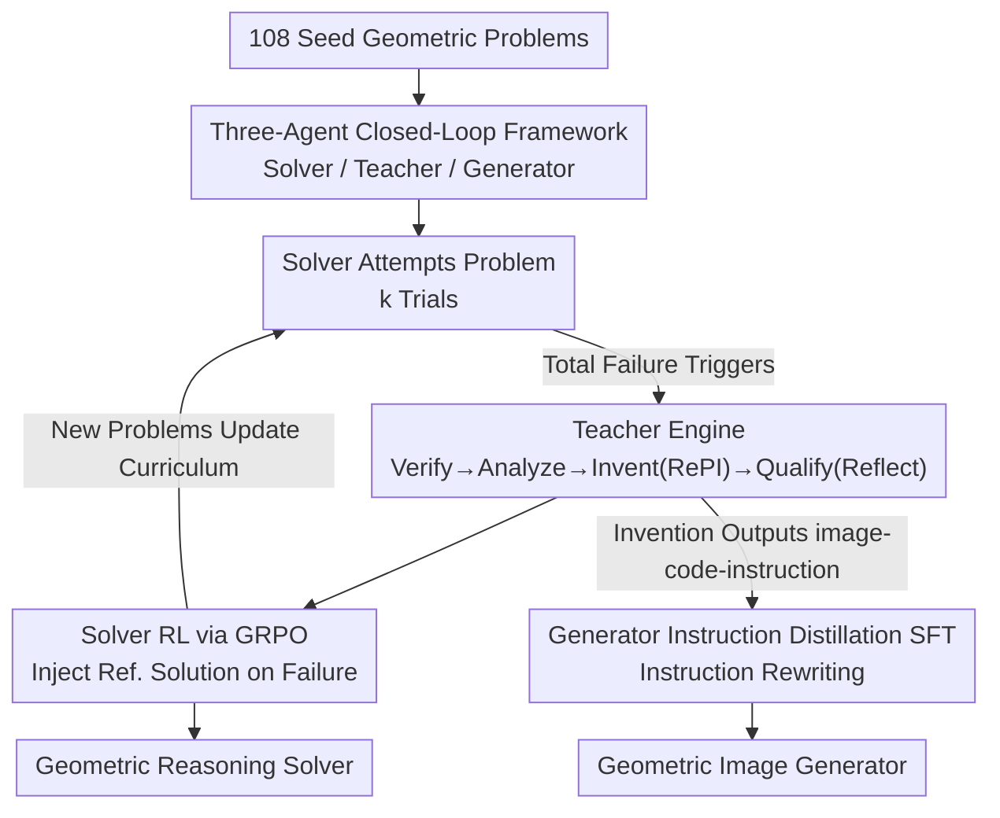

# Socratic-Geo: Synthetic Data Generation and Cross-Modal Geometric Reasoning via Multi-Agent Interaction

**Conference**: CVPR 2026  
**Paper**: [CVF Open Access](https://openaccess.thecvf.com/content/CVPR2026/html/Jiao_Socratic-Geo_Synthetic_Data_Generation_and_Cross-Modal_Geometric_Reasoning_via_Multi-Agent_CVPR_2026_paper.html)  
**Code**: None  
**Area**: Multimodal VLM  
**Keywords**: Geometric Reasoning, Multi-Agent, Synthetic Data, Procedural Generation, GRPO

## TL;DR
Socratic-Geo utilizes a "Teacher-Solver-Generator" three-agent closed-loop framework. Starting from only 108 seed problems, the Teacher diagnoses Solver failures and procedurally modifies geometric diagrams using Python code with self-verification. This creates a strictly aligned curriculum of geometric problems. The Solver achieves 49.11% across six benchmarks using only 1/4 of the training data (2.43 points higher than the strongest baseline), while the byproduct Generator reaches 42.4 on GenExam-Math, setting a new open-source SOTA.

## Background & Motivation

**Background**: Multimodal Large Language Models (MLLMs) have advanced rapidly in vision-language understanding, but geometric reasoning remains a significant challenge, requiring both precise visual perception and rigorous logical deduction. High-quality training data with strict image-text alignment is the primary bottleneck.

**Limitations of Prior Work**: Existing geometric data synthesis methods fall into three categories, each with structural flaws. First, **image-based text augmentation** (e.g., R-CoT, Geo170K) only polishes text descriptions for existing images, failing to construct new geometric structures. Second, **symbol-driven random generation** (e.g., InterGPS, TrustGeoGen) ensures correctness via formal languages but relies on inefficient brute-force generation followed by heuristic filtering. Third, **LLM-driven augmentation** acts as a "black-box amplifier," inheriting model biases and lacking fine-grained control.

**Key Challenge**: A shared fundamental problem is that these methods produce **static, unidirectional** datasets where data synthesis and model learning are **decoupled**. Generation occurs outside of training, providing no feedback on which problems the model currently struggles with. Furthermore, geometric consistency (alignment between visual auxiliary lines and textual descriptions) is hard to maintain without procedural tools, making (image, text, solution) triplets unreliable.

**Goal / Core Idea**: Construct an engine that dynamically couples "data synthesis" with "model learning." Inspired by Socratic questioning, a powerful Teacher agent **diagnoses Solver failures**, **targetedly** modifies geometric problems via code, and self-verifies image-text consistency before curriculum inclusion—replacing "blind exploration" with "learner-driven synthesis."

## Method

### Overall Architecture

Socratic-Geo is a **closed-loop synthesis engine** starting from a minimal seed set (108 problems) without relying on external data, driven by three specialized agents:

- **Solver ($S$)**: The reasoning model being trained (Qwen2.5-VL-7B), which attempts to solve problems in the current curriculum. its performance, particularly its **failures**, serves as the primary signal for synthesis.
- **Teacher ($T$)**: The cognitive core (e.g., Qwen3-VL-235B). It analyzes Solver failures and **procedurally invents** new problems to address reasoning gaps.
- **Generator ($G$)**: A diffusion-based image generation model (Qwen-Image) that learns to produce high-fidelity geometric diagrams. It is a "synergetic byproduct" trained independently of the core reasoning loop.

The pipeline operates in a reasoning-centric closed loop: Solver failure $\rightarrow$ Teacher diagnosis and invention $\rightarrow$ Teacher outputs verified new triplets $\rightarrow$ Curriculum updates $\rightarrow$ Solver continues training on harder problems. The evolution of curriculum $C$ is formalized: when the Solver fails $k$ times on problem $q$ ($\sum_i V(q, a_S^{(i)}, a^*)=0$), the Teacher's invention process is triggered to produce a verified triplet $(I_{new}, q_{new}, a_{new})$ for $C_{t+1}$. Concurrently, the Teacher translates inventions into natural language instructions to supervise the Generator.

### Key Designs

**1. Three-Agent Closed Loop: Learner-Failure-Driven Synthesis**

This design addresses the "decoupling" of synthesis and learning. Instead of static data, the Solver's **failures act as triggers and navigators**. Specifically, the Solver generates $k$ solutions via policy $\pi_S$. If all fail, the Teacher is activated. Rather than creating random problems, the Teacher diagnoses the specific step where reasoning collapsed and invents a new problem that **strengthens the key constraints**.

**2. Teacher Engine (Verify→Analyze→Invent→Qualify): Procedural Modification and Self-Verification**

This addresses the unreliability of purely linguistic agents in modifying diagrams.  
- **Verify**: Formally compares Solver answers with references to locate reasoning errors.  
- **Analyze**: Performs dual-modality diagnosis—checking structural properties in code/renders and finding semantic inconsistencies in text.  
- **Invent (RePI)**: **Procedurally modifies Python geometric code** to explicitly incorporate constraints, ensuring the generated diagram and text are strictly aligned.  
- **Qualify (Reflect)**: A self-verification step where the Teacher resolves the new problem. Only if the solution is consistent and passes geometric validity checks is the problem added to the curriculum.

**3. Solver Optimization via GRPO: Golden Signal for Failures**

The Solver evolves via Group Relative Policy Optimization (GRPO), a policy gradient algorithm using verifiable rules for scoring. For a set of $G$ candidate solutions, advantages are calculated as $A^{(i)} = \big(R_i - \mathrm{mean}(\{R_j\})\big) / \mathrm{std}(\{R_j\})$. A key innovation: **Handling complete failures**. When $k$ attempts yield zero rewards, the positive sample set is modified to use the Teacher's **verified reference solution $a_{ref}$ as the sole positive example** (Equation 4), ensuring the Solver receives a "gold standard" signal even when it fails completely.

**4. Generator Instruction Distillation SFT: Distilling Procedural Intelligence**

The Teacher translates its structured geometric representation into a natural language **drawing instruction** $p_{diagram}$. The Generator (Diffusion model) undergoes Supervised Fine-Tuning (SFT) on these $(p_{diagram}, I_{new})$ pairs. This is a form of **knowledge distillation**, where the Teacher's symbolic and precise drawing intelligence is distilled into the Generator's neural weights. This step, termed Instruction Rewriting (IR), is critical for high-fidelity generation.

## Key Experimental Results

### Main Results: Six Geometric Benchmarks (Mean@1 %)

| Method | Data Size | MathVerse | GeoQA | MathVision | MathVista | WeMath | Overall |
| :--- | :--- | :--- | :--- | :--- | :--- | :--- | :--- |
| Qwen2.5-VL-7B (Zero-shot) | — | 39.59 | 43.92 | 22.70 | 61.10 | 57.59 | 44.98 |
| + R-CoT | 7.2k | 40.86 | 46.49 | 22.72 | 62.60 | 57.59 | 46.05 |
| + Geo170K | 10k | 40.36 | 47.16 | 24.34 | 62.00 | 57.44 | 46.26 |
| + GeoReasoning | 10k | 40.99 | 46.76 | 24.34 | 63.40 | 57.90 | 46.68 |
| **Socratic-Solver (+Stage3)** | **2.5k** | **45.05** | **49.20** | **26.19** | **63.55** | **61.58** | **49.11** |

Ours achieves an overall **49.11%** using only **1/4 of the data** (2.5k vs. 7.2k–10k), outperforming the strongest baseline GeoReasoning by 2.43 points. Note: The paper text mentions 42.07% elsewhere, which conflicts with Table 1; Table 1 values are used here as they align with the abstract.

### Generator Performance: GenExam-Math (Str / Rel)

| Model | Strict | Relaxed |
| :--- | :---: | :---: |
| GPT-Image-1 (Closed) | 8.0 | 52.0 |
| Gemini-2.5-Flash-Image (Closed) | 0.7 | 43.1 |
| Qwen-Image (Open Base) | 0.0 | 18.9 |
| **Socratic-Generator** | **6.0** | **42.4** |

The Generator sets a new **open-source SOTA** with 42.4 Relaxed points, significantly surpassing the Qwen-Image base (18.9) and nearing Gemini-2.5-Flash performance.

### Ablation Study

| Ablation Item | Setting | Key Metric | Description |
| :--- | :--- | :--- | :--- |
| Qualify Module | w/ Qualify | MathVerse 40.33 (0.4k) | Filtering ensures high quality with less data. |
| Qualify Module | w/o Qualify | MathVerse 37.09 (1.3k) | Performance **drops** below zero-shot without verification. |
| Instruction Rewriting | w/o IR | Rel 20.1 | Barely improves over base model. |
| Instruction Rewriting | w/ IR | Rel 42.4 | Structured instructions are essential for quality. |

### Key Findings
- **Qualify (Self-Verification) is the lifeline**: Removing it increases data size (0.4k to 1.3k) but drops performance below zero-shot levels, proving that unverified data introduces harmful noise.
- **Instruction Rewriting is mandatory for generation**: Mapping structured blueprints to natural drawing instructions allows the model to learn geometry rather than just pixel patterns.
- **Extreme Data Efficiency**: 2.5k targeted synthetic problems outperform 10k general problems, validating the learner-driven synthesis approach.

## Highlights & Insights
- **Failure as a High-Value Signal**: Solver failures pinpoint precise capability gaps. Using failure to navigate synthesis introduces "active learning" into data production.
- **Procedural Code as Insurance**: Generating diagrams, solutions, and answers from a single Python script eliminates image-text inconsistency at the source.
- **Byproduct Synergy**: The Generator reaches SOTA status purely by recycling assets from the Teacher's invention process, maximizing the value of the pipeline.

## Limitations & Future Work
- **Teacher Dependency**: The framework's cognitive limit is capped by the Teacher model (e.g., Qwen3-VL-235B); biases or gaps in the Teacher propagate to the curriculum.
- **Domain Constraints**: The method relies on "procedural representability." While effective for geometry and charts, its applicability to open-scene visual reasoning is unverified.
- **Metrics Consistency**: Discrepancies between main text values and table values suggest some internal inconsistencies in the reported data.

## Related Work & Insights
- **Comparison with Socratic-Zero**: While Socratic-Zero focuses on text-only math, Socratic-Geo identifies that geometric reasoning requires **procedural control (RePI)** to ensure visual-logical consistency.
- **Comparison with Geometric Synthesis**: Unlike static, random, or purely linguistic augmentations, Socratic-Geo uses a dynamic "diagnosis-invention" loop that is significantly more efficient.

## Rating
- Novelty: ⭐⭐⭐⭐⭐ 
- Experimental Thoroughness: ⭐⭐⭐⭐ 
- Writing Quality: ⭐⭐⭐⭐ 
- Value: ⭐⭐⭐⭐⭐ 

<!-- RELATED:START -->

## Related Papers

- [\[CVPR 2026\] CogniVerse: Revolutionizing Multi-Modal Retrieval-Augmented Generation with Cognitive Reflection and Geometric Reasoning](cogniverse_revolutionizing_multi-modal_retrieval-augmented_generation_with_cogni.md)
- [\[CVPR 2026\] Hierarchical Attacks for Multi-Modal Multi-Agent Reasoning](hierarchical_attacks_for_multi-modal_multi-agent_reasoning.md)
- [\[CVPR 2026\] CRIT: Graph-Based Automatic Data Synthesis to Enhance Cross-Modal Multi-Hop Reasoning](crit_graph-based_automatic_data_synthesis_to_enhance_cross-modal_multi-hop_reaso.md)
- [\[CVPR 2026\] Role-SynthCLIP: A Role-Play Driven Diverse Synthetic Data Approach](role-synthclip_a_role-play_driven_diverse_synthetic_data_approach.md)
- [\[CVPR 2026\] Think with 3D: Geometric Imagination Grounded Spatial Reasoning from Limited Views](think_with_3d_geometric_imagination_grounded_spatial_reasoning_from_limited_view.md)

<!-- RELATED:END -->
