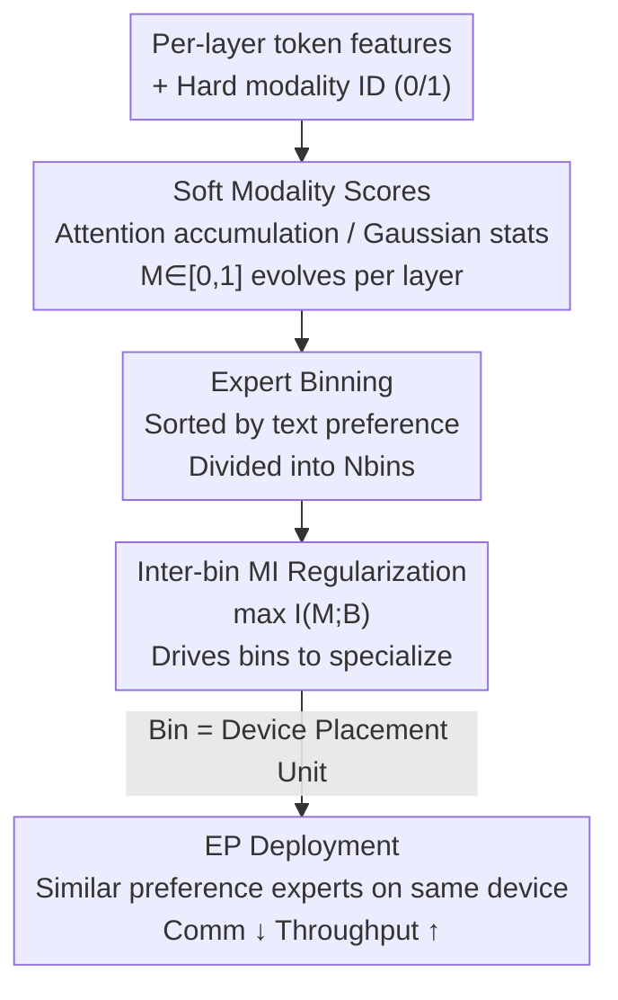

# Soft Modality-Guided Expert Specialization in MoE-VLMs

**Conference**: CVPR 2026  
**Paper**: [CVF Open Access](https://openaccess.thecvf.com/content/CVPR2026/html/Bo_Soft_Modality-Guided_Expert_Specialization_in_MoE-VLMs_CVPR_2026_paper.html)  
**Code**: None  
**Area**: Multimodal VLM  
**Keywords**: MoE, VLM, Expert Routing, Modality Specialization, Expert Parallelism

## TL;DR
Addressing the neglected issue of how vision and text tokens should guide expert routing in MoE-VLMs, this paper proposes SMoES. It replaces hard modality labels with layer-varying "soft modality scores," divides experts into bins, and uses mutual information (MI) regularization to drive bins toward modality specialization. This achieves simultaneous improvements in accuracy (+0.9% multimodal, +4.2% language) and deployment efficiency (56.1% reduction in EP communication overhead, +12.3% throughput) across four MoE backbones and 16 benchmarks.

## Background & Motivation

**Background**: Mixture-of-Experts (MoE) has become the mainstream backbone for large vision-language models (VLMs), such as DeepSeek-VL2, Kimi-VL, GLM-4.5V, and InternVL-3.5, which leverage conditional computation to scale model capacity without significantly increasing per-token computation. There are two primary paradigms for MoE-VLM routing: **hard routing** (pre-assigning experts to specific modalities) and **soft routing** (permitting any expert to process any token, which is the current mainstream).

**Limitations of Prior Work**: Hard routing achieves thorough specialization but suffers from rigid boundaries, failing to adapt to cross-modal features and the natural phenomenon where representations gradually fuse across layers. Soft routing is flexible but often relies on heuristic priors or auxiliary losses decoupled from the actual modality distribution, resulting in either "over-mixing" (experts fail to specialize) or "insufficient specialization." Hybrid routing, which manually partitions experts into modality-specific and shared groups, employs a one-size-fits-all approach across layers that contradicts the layer-wise evolution of features.

**Key Challenge**: Analysis of LLaVA-1.5 and a DeepSeekMoE-VLM reveals a fact ignored by existing routers: **modality fusion is multi-scale and heterogeneous**. Macroscopically, vision-text JS divergence trajectories differ significantly across models and layers. Microscopically, even within the same layer and modality, some tokens remain "pure" while others become "cross-modal." Consequently, both "forced hard separation" and "uniform mixing" misalign with the actual modality interactions. Furthermore, the asymmetry between high-volume, low-density vision tokens and low-volume, high-density text tokens inflates cross-device communication overhead in Expert Parallelism (EP) as tokens scatter across devices.

**Goal**: (1) Enable routing to follow the "layer-wise evolving modality structure" rather than fixed identities; (2) Align expert specialization with EP deployment granularity to minimize communication costs.

**Key Insight**: Since modality identity is continuous and transitions smoothly across layers, the study replaces binary $0/1$ labels with a **soft modality score** $\in [0,1]$ to characterize the fusion state of each token, using this score to guide specialization.

**Core Idea**: A tripartite mechanism comprising "soft modality scores + expert binning + inter-bin MI regularization." This transforms modality specialization from manual assignment to data-driven, depth-adaptive learning while naturally aligning specialization with device placement to improve both performance and efficiency.

## Method

### Overall Architecture
SMoES maintains the basic MoE structure (vision encoder → projector → MoE-LLM) and modifies only the routing mechanism through three interlocking components. Given layer-wise token features $x_{ij}\in\mathbb{R}^D$ (batch $i$, token $j$), **soft modality scores** calculate the current modality attribution $M^{(l)}_{ij,m}\in[0,1]$ ($m\in\{\text{text},\text{vision}\}$). Experts are grouped into **bins**, the basic unit for specialization and device placement. Finally, **inter-bin MI regularization** maximizes the mutual information between modality scores $M$ and selected bins $B$, forcing different bins to specialize.

The base routing follows standard MoE: $g_{ij,e}=\mathrm{softmax}(W_{\text{gate}}x_{ij})_e$, with top-$k$ selection and a load balancing loss $\mathcal{L}_{\text{bal}}=\sum_l N_e\sum_{e=1}^{N_e} f_e P_e$. SMoES layers its designs on top of this.

### Key Designs

**1. Soft Modality Scores: Softening hard labels into layer-evolving signals via two complementary estimators.**

Hard labels fail to capture gradual fusion. Thus, a soft score $M^{(l)}_{ij,m}\in[0,1]$ is computed per token, layer, and modality using two estimators:

*   *Attention accumulation score*: Focuses on local, intra-sequence interactions. Tokens absorb modality characteristics from neighbors according to attention weights. Initialized with hard labels at layer 0 ($M^{\text{attn},(0)}_{ij,m}=\mathbf{1}\{m=m(x_{ij})\}$), it updates by aggregating neighbor scores $\tilde{M}^{\text{attn},(l)}_{ij,m}=\sum_{j'}\mathrm{Attn}^{(l)}_{j,j'}\cdot M^{\text{attn},(l)}_{ij',m}$ and performing a residual-style fusion weighted by feature norms:
    $$M^{\text{attn},(l+1)}_{ij,m}=\frac{\|x^{(l)}_{\text{attn},ij}\|\cdot\tilde{M}^{\text{attn},(l)}_{ij,m}+\|x^{(l)}_{ij}\|\cdot M^{\text{attn},(l)}_{ij,m}}{\|x^{(l)}_{\text{attn},ij}\|+\|x^{(l)}_{ij}\|}$$
    This aligns with the Transformer residual structure ($x^{(l+1)}=x^{(l)}+x^{(l)}_{\text{attn}}$).

*   *Gaussian statistics score*: Offers a global, distributional perspective. Each modality's distribution in the embedding space is modeled as a diagonal covariance Gaussian $(\mu_m, \sigma^2_m)$, updated online via a Welford EMA variant (decay $\beta$). Log-likelihoods are computed as $\mathrm{LL}_{ij,m}=-\tfrac12\sum_d\big(\log\sigma^2_{m,d}+\tfrac{(x_{ij,d}-\mu_{m,d})^2}{\sigma^2_{m,d}}\big)$, with a temperature-scaled softmax yielding $M^{\text{gauss}}_{ij,m}=\frac{\exp(\mathrm{LL}_{ij,m}/\tau)}{\sum_{m'}\exp(\mathrm{LL}_{ij,m'}/\tau)}$. This provides an "instantaneous" modality judgment independent of layer 0 initialization.

**2. Expert Binning: Aligning specialization granularity with EP device placement.**

To reduce communication in EP, $N_e$ experts are divided into $N_{\text{bins}}$ bins (each with $N_B=N_e/N_{\text{bins}}$ experts), where $N_{\text{bins}}$ typically equals the number of devices. SMoES uses **momentum-adaptive binning**: it tracks token counts per modality per expert $\bar{C}_{m,e,t}=\beta\bar{C}_{m,e,t-1}+(1-\beta)C_{m,e}$, calculates a "text preference score" $f_{\text{spec}}(e)=\frac{\bar{C}_{\text{text},e}}{\bar{C}_{\text{text},e}+\bar{C}_{\text{vision},e}}$, and sorts experts to form $N_{\text{bins}}$ contiguous bins.

**3. Inter-bin MI Regularization: Driving bin-level modality specialization.**

To drive specialization, SMoES maximizes the mutual information $I(M;B)$. High MI implies that knowing a token's bin allows high-confidence inference of its modality. The average gating score per bin weighted by soft modality scores is $\bar{S}_{i,m,B_k}=\frac{\sum_{e\in B_k}\sum_j M_{ij,m}g_{ij,e}}{N_B\sum_j M_{ij,m}}$, which is normalized into a joint probability $P_i(m,B_k)$. The loss is the negative per-sample MI averaged across layers: $\mathcal{L}_{\text{MI}}=-\sum_l\frac{1}{N_{\text{batch}}}\sum_i I_i(M;B)$. Unlike prior work using KL divergence, MI drives specialization without conflicting with load balancing.

### Loss & Training
Load balancing is modified to the **bin level** for EP: $\mathcal{L}_{\text{bal}}=\sum_l\sum_{k=1}^{N_{\text{bins}}}N_B\sum_{e\in B_k}f_e P_e$. The total objective is:
$$\mathcal{L}=\mathcal{L}_{\text{task}}+\alpha_{\text{bal}}\mathcal{L}_{\text{bal}}+\alpha_{\text{MI}}\mathcal{L}_{\text{MI}}$$
Implementation details: 8×A800, $N_{\text{bins}}=8$, Gaussian temperature $\tau=0.5D$, EMA decay $\beta=0.99$, $\alpha_{\text{bal}}=0.001$, $\alpha_{\text{MI}}=0.0001$. Training follows the LLaVA two-stage protocol.

## Key Experimental Results

### Main Results
Testing across four MoE backbones (DeepSeekMoE, OLMoE, Moonlight-MoE, Qwen3-MoE) on 16 benchmarks shows an average gain of 2.2% (+0.9% multimodal, +4.2% language) over soft routing. Relative gains on DeepSeekMoE (baseline = 100%):

| Method | MSI | Multimodal | Language | Overall |
| :--- | :--- | :--- | :--- | :--- |
| No Specialization (Soft baseline) | .177 | 100% | 100% | 100% |
| Hard Routing (t48-v16) | 1.0 | -1.8% | -14.5% | -6.6% |
| MoIIE (Hybrid) | .800 | -1.9% | -9.6% | -4.8% |
| SMAR (KL) | .543 | +0.6% | -11.3% | -3.9% |
| **SMoES attention-soft** | .487 | **+1.8%** | **+6.2%** | **+3.5%** |
| **SMoES gaussian-soft** | .440 | +1.3% | +4.2% | +2.4% |

Note: Hard routing achieves high MSI (specialization) but significant performance drops, while SMoES increases specialization and performance simultaneously.

### Ablation Study

| Configuration | MSI | Multimodal | Language | Overall |
| :--- | :--- | :--- | :--- | :--- |
| No Specialization | .177 | 100% | 100% | 100% |
| hard-score + MI | .904 | -0.8% | +0.5% | -0.3% |
| w/ binning (only) | .415 | +0.9% | +3.0% | +1.7% |
| w/ inter-bin **KL** | .724 | -1.5% | -8.5% | -4.1% |
| **MI + attention-soft** | .487 | +1.8% | +6.2% | +3.5% |

### Key Findings
- **Soft Scores > Hard Scores**: Hard-score MSI is high (.904), but it fails to improve multimodal performance. Soft signals are essential for effective specialization.
- **MI Objective is Essential**: Adding MI to binning increases gains from +1.7% to +3.5%. KL regularization causes drops, validating MI as the superior objective for load-balanced MoE.
- **Adaptive > Fixed Binning**: Adaptive binning significantly improves language performance (+6.2% vs +0.2% for fixed).
- **Efficiency**: On two Orin GPUs (10Gb Ethernet), cross-GPU EP transmission ratio dropped significantly (e.g., from 98.0% to 31.1% for MMMU prefill). Overall EP communication dropped by 56.1%, with a 12.3% throughput increase.

## Highlights & Insights
- **Unified Specialization and Efficiency**: By treating bins as both specialization units and EP placement units, SMoES simplifies optimization—modality-preferred experts naturally co-locate.
- **MI vs. KL**: The study demonstrates that KL regularization conflicts with load balancing, whereas MI drives specialization while maintaining balance.
- **Complementary Estimators**: Attention accumulation (local correlation) and Gaussian statistics (global distribution) provide robust quantification of continuous modality identities.
- **MSI Metric**: The metric quantifying the deviation of expert modality attribution from a uniform distribution serves as a useful diagnostic tool for any MoE-VLM.

## Limitations & Future Work
- While results for Moonlight-MoE/Qwen3-MoE are in the appendix, primary comparisons focus on DeepSeekMoE/OLMoE.
- Soft scores currently only distinguish between vision and text; efficacy for video or audio modalities remains unverified.
- Efficiency gains are validated on edge scenarios (dual Orin); scalability on massive GPU clusters needs further exploration.
- Sensitivity to hyperparameters ($\tau, \beta, \alpha, N_{\text{bins}}$) may increase tuning costs for new backbones.

## Related Work & Insights
- **vs. Hard/Hybrid Routing (MoIIE)**: SMoES avoids the performance loss of rigid "one-size-fits-all" partitioning by using data-driven, adaptive specialization.
- **vs. SMAR (KL Regularization)**: SMoES replaces the balance-breaking KL loss with MI, proving far more stable in "many-expert" settings.
- **vs. Task-MI (ModuleFormer)**: While others maximize MI for tasks/tokens, SMoES applies it to "modality × bin" and aligns it with EP deployment, a novel application for MoE-VLMs.

## Rating
- Novelty: ⭐⭐⭐⭐ Unifying specialization with EP granularity via bin-level MI is a clever and practical contribution.
- Experimental Thoroughness: ⭐⭐⭐⭐ Covers 4 backbones and 16 benchmarks, including edge EP efficiency tests.
- Writing Quality: ⭐⭐⭐⭐ Clear motivation and methodology; well-supported by analysis of heterogeneous fusion.
- Value: ⭐⭐⭐⭐ Significant for both improving MoE-VLM accuracy and optimizing industrial EP deployment.

<!-- RELATED:START -->

## Related Papers

- [\[CVPR 2026\] SMoES: Soft Modality-Guided Expert Specialization in MoE-VLMs](smoes_soft_modality-guided_expert_specialization_in_moe-vlms.md)
- [\[CVPR 2026\] DeepAlign: Mitigating Modality Conflict through Modality-Specific Alignment](deepalign_mitigating_modality_conflict_through_modality-specific_alignment.md)
- [\[CVPR 2026\] Vision-Language Model Guided Source-Free Domain Adaptation via Optimal Transport](vision-language_model_guided_source-free_domain_adaptation_via_optimal_transport.md)
- [\[CVPR 2026\] Dual-Modality Anchor-Guided Filtering for Test-time Prompt Tuning](dual-modality_anchor-guided_filtering_for_test-time_prompt_tuning.md)
- [\[CVPR 2026\] ApET: Approximation-Error Guided Token Compression for Efficient VLMs](apet_approximation-error_guided_token_compression_for_efficient_vlms.md)

<!-- RELATED:END -->
