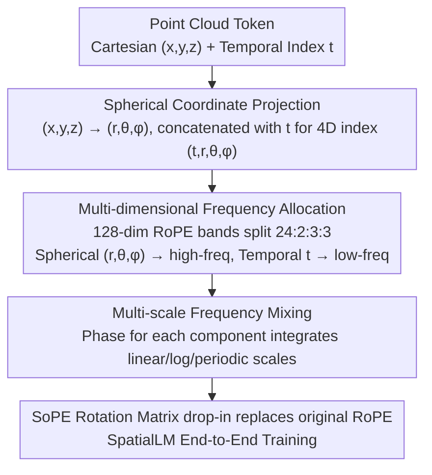

# SoPE: Spherical Coordinate-Based Positional Embedding for 3D LVLMs

**Conference**: CVPR 2026  
**arXiv**: [2602.22716](https://arxiv.org/abs/2602.22716)  
**Code**: None  
**Area**: 3D Vision / Multimodal VLM / Positional Encoding  
**Keywords**: 3D LVLM, Positional Encoding, Spherical Coordinates, RoPE, SpatialLM, Spatial Reasoning

## TL;DR

Discloses the spatial perception bias issue of RoPE in 3D LVLMs (1D indexing disrupts 3D locality and ignores orientation). Proposes SoPE, a Spherical Coordinate-Based Positional Embedding ($(t,r,\theta,\phi)$ four-dimensional indexing + multi-dimensional frequency allocation + multi-scale mixing), achieving SOTA performance in 3D layout estimation and object detection on SpatialLM.

## Background & Motivation

**Background**: 3D LVLMs joint-process encoded point clouds with LLMs for 3D scene understanding. Mainstream methods inherit RoPE from LLMs, flattening point cloud tokens into 1D sequences via raster scanning.

**Limitations of Prior Work**: Information flow visualization reveals severe spatial perception bias—cross-modal attention concentrates on a few hotspots, while a large number of 3D tokens receive nearly identical weights, systematically suppressing small objects and structural boundaries. Two root causes: (i) 1D raster indexing breaks the 3D spatial continuity of point clouds, assigning non-adjacent position indices to spatially adjacent tokens; (ii) relative distance $\Delta t = t_1 - t_2$ only captures sequence timing, failing to perceive changes in spatial position and orientation.

**Key Challenge**: RoPE was designed for 1D text. Forcing its application to 3D point clouds ignores the fundamental differences in spatial structure and orientation information. Existing 2D or video improvements (VideoRoPE, M-RoPE) are designed for image grids and are unsuitable for irregular point clouds.

**Key Insight**: Spherical coordinates $(r, \theta, \phi)$ naturally decouple distance and orientation. Mapping 3D tokens to spherical space allows for the simultaneous encoding of position and angles.

**Core Idea**: Replace 1D raster indexing with spherical coordinates $(t,r,\theta,\phi)$ and allocate RoPE frequency bands to different coordinate components based on their functional roles.

## Method

### Overall Architecture

SoPE addresses a neglected mismatch in 3D LVLMs: point clouds are inherently 3D, yet they are compressed into 1D sequences via raster scanning for RoPE inherited from text-based LLMs. This results in vastly different position indices for spatially adjacent tokens and a complete loss of orientation information. The approach modifies only the positional encoding without changing the backbone—using the SpatialLM baseline, the Cartesian coordinates $(x,y,z)$ of each point cloud token are converted to spherical coordinates $(r,\theta,\phi)$. These are combined with the original temporal index $t$ to form a four-dimensional position. The 128-dimensional RoPE frequency band is then partitioned among the four components in a ratio of $t:r:\theta:\phi=24:2:3:3$, with a multi-scale phase mixture applied within each component. Finally, it serves as a drop-in replacement for the original RoPE during end-to-end training. The cumulative modification maintains the original inference path length.

### Key Designs

**1. Spherical Coordinate Position Projection: Re-introducing 3D Geometry to Position Indices**

The fundamental flaw of 1D raster indexing is that it only identifies the sequence order of tokens, not their spatial distance or orientation—relative distance $\Delta t = t_1 - t_2$ captures temporal order rather than geometry. SoPE replaces $(x,y,z)$ for each token with spherical coordinates: $r=\sqrt{x^2+y^2+z^2}$, $\theta=\arccos(z/r)$, and $\phi=\text{atan2}(y,x)$. Consequently, the relative position expands from a single $\Delta t$ to four components $(\Delta t,\Delta r,\Delta\theta,\Delta\phi)$, explicitly encoding changes in radial distance and angular direction. Choosing spherical over Cartesian (i.e., RoPE-3D) is critical: while Cartesian $(x,y,z)$ recovers position, its three axes are coupled, making it difficult for the model to discern directional relationships such as "these tokens share a similar orientation but differ in distance." Spherical decomposition naturally orthogonalizes distance $r$ and angles $(\theta, \phi)$, elevating orientation information to a primary feature.

**2. Multi-dimensional Frequency Allocation: Bandwidth Partitioning by Value Range and Precision**

All four components share the same 128-dimensional RoPE frequency bands. Their allocation determines the encoding granularity. SoPE assigns the three spherical components $(r, \theta, \phi)$ to front-end high-frequency sub-bands and the temporal index $t$ to back-end low-frequency sub-bands. The rotation matrix is block-diagonalized, where each component rotates independently before additive combination. The trade-off is straightforward: the range of $t$ is much larger than that of the angles, requiring more low-frequency bands to maintain smoothness across long sequences. Conversely, angular changes are often subtle yet critical, requiring high-frequency bands for differentiation. The specific $24:2:3:3$ ratio was selected through extensive ablation studies across Uniform, Angular-Biased, and Temporal-Biased configurations—a uniform split ($1:1:1:1$) resulted in a 3-point performance drop, indicating that the allocation itself is a key performance driver.

**3. Multi-scale Frequency Mixing: Capturing the Spectrum from Detail to Layout**

Even with allocated frequency bands, a single-scale phase function struggle to simultaneously characterize fine-grained local geometry and large-scale global layout. SoPE integrates three transformations at the RoPE phase level for each component:

$$\varphi_k(u) = \frac{1}{3}\left(\omega_k^{lin}g^{lin}(u) + \omega_k^{log}g^{log}(u) + \omega_k^{per}g^{per}(u)\right)$$

The linear term preserves absolute position accuracy, the logarithmic term emphasizes local neighborhoods, and the periodic term captures global structures. These are summed with equal weight without introducing learnable parameters. This ensures that the same position remains discriminative across different spatial scales. Notably, multi-scale mixing and spherical coordinates are complementary—ablation shows a +1.8 improvement for SoPE, while it provides negligible gain for Cartesian RoPE-3D, suggesting that multi-scale benefits are only fully realized once orientation is properly encoded.

### Loss & Training

The training setup completely inherits from SpatialLM: Sonata point cloud encoder + LLM Qwen2.5-0.5B + 2-layer MLP projection, using 4 × NVIDIA H20 GPUs for single-stage training. SoPE serves as a drop-in replacement for RoPE, adding no parameters and maintaining the same inference overhead.

## Key Experimental Results

### Main Results

| Method | ARKitScenes F1@0.25 | F1@0.50 | SpatialLM Dataset F1@0.25 | F1@0.50 |
|---|---|---|---|---|
| SpatialLM (RoPE) | 63.9 | 60.7 | 69.7 | 62.0 |
| + CCA | 64.1 | 60.5 | 69.8 | 62.5 |
| + RoPE-3D | 64.2 | 61.4 | 69.7 | 62.4 |
| **SpatialSoPE** | **66.1** | **63.2** | **71.4** | **63.4** |

| Method | Structured3D IoU2D@0.25 | IoU2D@0.50 |
|---|---|---|
| RoomFormer | 70.4 | 67.2 |
| SceneScript | 83.1 | 80.8 |
| SpatialLM (ft.) | 86.5 | 84.6 |
| **SpatialSoPE (ft.)** | **88.7** | **86.2** |

### Ablation Study

| Configuration | ARKit F1@0.25 | F1@0.50 | Description |
|---|---|---|---|
| Ratio 24:2:3:3 (Optimal) | 66.1 | 63.2 | Proposed design |
| Ratio 8:6:9:9 (Angular-Biased) | 65.5 | 62.7 | Excessive spherical allocation |
| Ratio 1:1:1:1 (Uniform) | 63.0 | 59.0 | 3-point drop |
| Ratio 5:1:1:1 (Temporal-Biased) | 65.0 | 62.7 | Temporal dominance |
| SoPE w/o Multi-scale Mixing | 65.4 | 61.4 | Multi-scale contribution +1.8 |
| RoPE-3D + Multi-scale | 64.8 | 62.1 | Spherical > Cartesian |

### Key Findings

- Multi-scale mixing significantly improves SoPE (+0.7/+1.8) but shows limited improvement for RoPE-3D, indicating that spherical coordinates are a prerequisite for multi-scale benefits.
- Spherical > Cartesian > 2D Projection; orientation/angular encoding is the primary source of performance variance.
- Information flow visualization confirms that SoPE generates more balanced cross-modal attention, eliminating the hotspot aggregation observed in RoPE.

## Highlights & Insights

- Spherical coordinates naturally decouple distance and angle—making them geometrically superior to Cartesian coordinates for 3D positional encoding. The approach is direct and effective.
- Simple modifications (coordinate transformation + frequency reallocation) yield significant improvements (ARKitScenes +2.2/+2.5), proving that positional encoding is a critical bottleneck for 3D LVLMs.
- Information flow visualization is a valuable diagnostic tool—identifying neglected tokens first allows for targeted encoding improvements.

## Limitations & Future Work

- Validated only on 0.5B small models; effectiveness on larger models (7B+) remains to be confirmed.
- The choice of the spherical origin (scene geometric center vs. camera position) was not explored in depth and may affect encoding quality.
- Frequency allocation ratios were determined manually; adaptive or learnable schemes might be superior.
- Restricted to indoor 3D scenes; outdoor or autonomous driving scenarios have not been tested.

## Related Work & Insights

- **vs RoPE-3D**: Cartesian coordinates improve position perception but lack orientation information; SoPE's spherical decomposition encodes both.
- **vs VideoRoPE/M-RoPE**: These spatiotemporal decompositions target 2D image/video grids and are not suitable for the irregular structure of 3D point clouds.
- **vs DRoPE**: Polar coordinate extensions for orientation target specific tasks like heading periodicity; SoPE's spherical approach is more general.

## Rating

- Novelty: ⭐⭐⭐⭐ First application of spherical coordinate PE in 3D LVLMs.
- Experimental Thoroughness: ⭐⭐⭐⭐ Full ablations across multiple benchmarks + real-world deployment latency tests.
- Writing Quality: ⭐⭐⭐⭐ Thorough motivation analysis and excellent information flow visualization.
- Value: ⭐⭐⭐⭐ Drop-in replacement for RoPE with high cross-domain reference value.

<!-- RELATED:START -->

## Related Papers

- [\[ICML 2026\] Circle-RoPE: Cone-like Decoupled Rotary Positional Embedding for Vision-Language Models](../../ICML2026/multimodal_vlm/circle-rope_cone-like_decoupled_rotary_positional_embedding_for_large_vision-lan.md)
- [\[ICLR 2026\] PPE: Positional Preservation Embedding for Token Compression in Multimodal Large Language Models](../../ICLR2026/multimodal_vlm/ppe_positional_preservation_embedding_for_token_compression_in_multimodal_large_.md)
- [\[CVPR 2026\] MODIX: Training-Free Multimodal Information-Driven Positional Index Scaling for VLMs](modix_positional_index_scaling.md)
- [\[CVPR 2026\] Beyond 3D VQAs: Injecting 3D Spatial Priors into Vision-Language Models for Enhanced Geometric Reasoning](beyond_3d_vqas_injecting_3d_spatial_priors_into_vision-language_models_for_enhan.md)
- [\[CVPR 2026\] Bias Is a Subspace, Not a Coordinate: A Geometric Rethinking of Post-hoc Debiasing in Vision-Language Models](bias_is_a_subspace_not_a_coordinate_a_geometric_rethinking_of_post-hoc_debiasing.md)

<!-- RELATED:END -->
