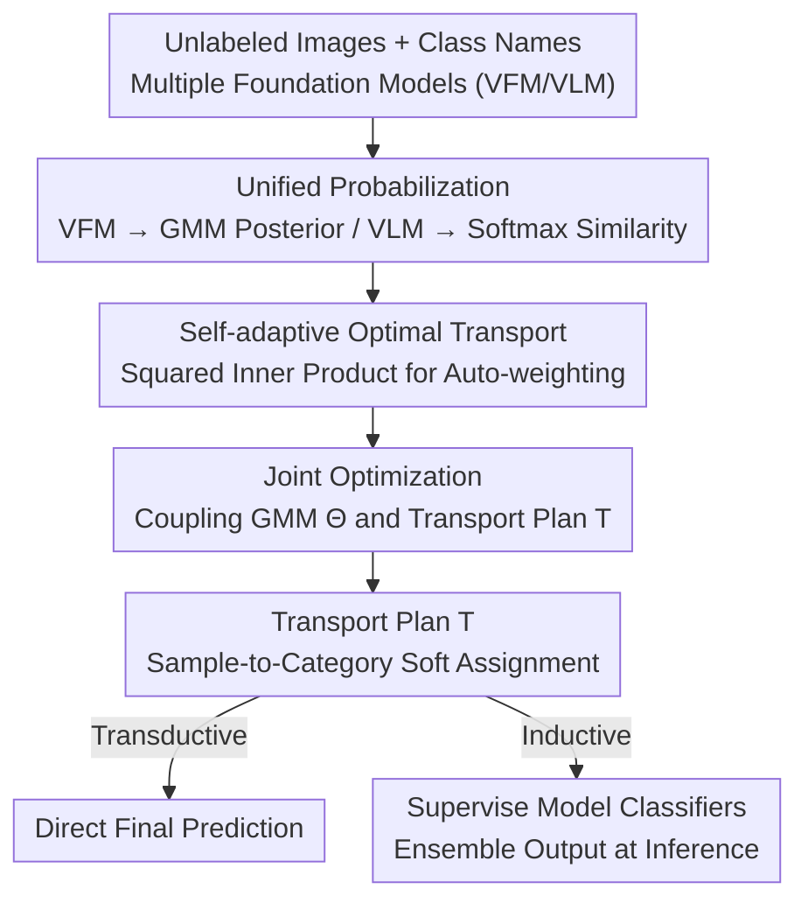

# SOTA: Self-adaptive Optimal Transport for Zero-Shot Classification with Multiple Foundation Models

**Conference**: CVPR 2026  
**Paper**: [CVF Open Access](https://openaccess.thecvf.com/content/CVPR2026/html/Hu_SOTA_Self-adaptive_Optimal_Transport_for_Zero-Shot_Classification_with_Multiple_Foundation_CVPR_2026_paper.html)  
**Code**: https://github.com/Afleve/selfadaptive-Optimal-Transport  
**Area**: Multi-modal VLM  
**Keywords**: Zero-shot classification, Optimal Transport, Foundation model ensemble, Self-adaptive weighting, CLIP

## TL;DR
SOTA converts classification outputs from various foundation models (VLMs like CLIP, VFMs like DINO) into cost matrices. It utilizes a self-adaptive Optimal Transport (OT) with a "squared inner product" objective to solve for a soft assignment transport plan. This training-free and prior-free approach automatically balances model contributions, achieving significant performance gains over the strongest single models across 26 benchmarks in natural, remote sensing, and medical domains.

## Background & Motivation

**Background**: Foundation models such as CLIP and DINO learn general representations through large-scale pre-training and can be directly applied to zero-shot classification. Mainstream research for improving zero-shot capabilities includes prompt engineering, label propagation, and distribution alignment, but most focus exclusively on a **single model**.

**Limitations of Prior Work**: The authors observe two phenomena. First, while VLMs (e.g., CLIP) possess strong cross-modal alignment, their visual encoders rely heavily on category-level text priors and fail to capture fine-grained visual cues. On datasets with visually similar categories like StanfordCars, Flower102, or Pets, pure visual models (e.g., DINOv2/v3) significantly outperform CLIP in clustering accuracy. Conversely, VFMs (e.g., DINO) have strong visual discriminative power but lack inherent semantic alignment with category labels. Second, the performance of different VLMs fluctuates significantly across datasets due to pre-training differences (e.g., CLIP performs well on natural images, while domain-specific CLIPs are needed for medical or remote sensing data).

**Key Challenge**: The "semantic alignment" of VLMs and the "visual discriminative power" of VFMs are complementary. Relying on a single model is insufficient. However, weighting and fusing multiple models faces a deadlock: in zero-shot scenarios, the absence of labels makes it impossible to use a validation set to estimate model reliability or assign optimal weights.

**Goal**: Fuse outputs from multiple heterogeneous foundation models into a more reliable prediction without fine-tuning, prior weights, or access to internal model weights (compatible with black-box APIs).

**Key Insight**: Treat each foundation model as a "perspective" for measuring sample-category relevance, with each perspective providing a cost matrix. The multi-perspective fusion problem can then be formulated as an Optimal Transport (OT) problem, seeking a soft assignment (transport plan) from samples to categories that minimizes the total transport cost.

**Core Idea**: Use a **squared inner product** objective for self-adaptive OT. This allows the "consistency" between the transport plan and each model's distribution to act as the weight, thereby automatically granting higher influence to high-quality models without labels or priors.

## Method

### Overall Architecture
SOTA (Self-adaptive Optimal TrAnsport) is a training-free ensemble framework. Inputs consist of a batch of unlabeled images $D_u=\{x_i\}_{i=1}^N$, a set of category names, and several off-the-shelf foundation models (any combination of VFMs and VLMs). The output is the category prediction for each image. The pipeline has three stages: first, converting **each** model's output into a unified probability matrix $P\in\mathbb{R}^{N\times K}$ (and then to a cost matrix $C=E-P$); second, solving for a transport plan $T$ (soft assignment) using self-adaptive OT; finally, deploying via transductive or inductive modes.

### Key Designs

**1. Unified Probabilization: Aligning Heterogeneous Outputs**

Since different models have different output formats, they cannot be fused directly. Each model is first converted into an $N\times K$ probability matrix $P$ (where rows sum to 1, and columns represent sample-to-class similarity), and then into a cost matrix $C=E-P$ ($E$ is an all-ones matrix). High-confidence predictions correspond to low transport costs. VLMs use their text encoders to calculate cosine similarity between image features $v_i$ and text embeddings $t_j$, followed by softmax: $\hat P_{ij}=\frac{\exp(\tau\cos(v_i,t_j))}{\sum_k\exp(\tau\cos(v_i,t_k))}$. VFMs lack semantic alignment, so visual features are extracted and fitted with a Gaussian Mixture Model (GMM) $\Theta=\{\pi_k,\mu_k,\Sigma_k\}$, using the posterior $p(y=k\mid v_i)=\frac{\pi_k\mathcal{N}(v_i\mid\mu_k,\Sigma_k)}{\sum_j\pi_j\mathcal{N}(v_i\mid\mu_j,\Sigma_j)}$ as the category distribution. This effectively converts the lack of labels in VFMs into an unsupervised clustering problem in visual space. The process yields $V_1$ VFM distributions $\{P_v\}$ and $V_2$ VLM distributions $\{\hat P_v\}$.

**2. Self-adaptive Optimal Transport: Consistency as Weight**

A naive fusion would assign manual weights $\lambda_v, \mu_v$ to solve a weighted OT: $\max_{T}\sum_v\lambda_v\langle T,P_v\rangle+\sum_v\mu_v\langle T,\hat P_v\rangle+\epsilon H(T)$. In zero-shot settings, these weights cannot be determined. SOTA's key innovation is **replacing the linear inner product with a squared inner product**:

$$\max_{T\in\Pi(p,q)}\ \sum_{v=1}^{V_1}\langle T,P_v\rangle^2+\sum_{v=1}^{V_2}\langle T,\hat P_v\rangle^2+\epsilon H(T)$$

This removes the need for manual weights. Intuitively, taking the gradient of $\langle T,P_v\rangle^2$ with respect to $T$ yields $2\langle T,P_v\rangle\cdot P_v$, which effectively assigns a weight to the $v$-th distribution **proportional to its current $\langle T,P_v\rangle$ (consistency with the current transport plan)**. Models that align more with the consensus $T$ automatically receive higher weights, while noisy, dissenting models are suppressed.

**3. Joint Optimization: Semantic-Guided Visual Clustering**

To prevent GMM distributions $\{P_v\}$ from being misaligned with actual classes due to purely visual clustering, SOTA jointly optimizes the GMM parameters $\Theta$ and transport plan $T$:

$$\max_{T\in\Pi(p,q),\,\Theta}\ \sum_{v=1}^{V_1}\langle T,P_v(\Theta)\rangle^2+\sum_{v=1}^{V_2}\langle T,\hat P_v\rangle^2+\epsilon H(T)$$

Here, $T$ is shaped by both GMM's visual assignments and VLM's semantic distributions, while $T$ in turn updates $\Theta$. This ensures the clusters are both visually coherent and semantically aligned. An iterative Minorization-Maximization (MM) scheme is used to handle the non-linear coupling of $T$ in the squared terms.

**4. Transductive / Inductive Deployment**

Transductive mode treats the entire test set as $D_u$ and uses $T$ directly for final predictions. Inductive mode uses $D_u$ as training data and $T$ as a supervisory signal to train independent classifiers for each model. The fitted GMM parameters $\Theta$ induce a visual classifier that works alongside text classifiers during inference on unseen samples.

## Key Experimental Results

Validation was performed across 26 benchmarks (natural, remote sensing, medical) without fine-tuning or additional supervision.

### Main Results (Transductive, 11 Natural Image Datasets, Avg Top-1)

| Method | Average | Gain vs. CLIP-1 |
|------|---------|------------|
| CLIP-1 (ViT-B/16) | 65.2 | — |
| TransCLIP-2 [37] | 70.3 | +5.1 |
| GTA-CLIP [24] (Prev. SOTA) | 74.5 | +9.3 |
| SOTA (CLIP-1+CLIP-2) | 72.5 | +7.3 |
| SOTA (CLIP-1+DINOv2) | 75.7 | +10.5 |
| SOTA (CLIP-1+DINOv3) | 77.4 | +12.2 |
| **SOTA (CLIP-1+DINO v2+v3)** | **77.8** | **+12.6** |

### Cross-domain Results (Transductive, Avg Top-1)

| Domain | Datasets | Best Single Model | Best T-Baseline | SOTA |
|----|---------|-----------|------------|------|
| Remote Sensing | 10 | GeoRSCLIP 64.5 | T-GeoRSCLIP 76.2 | **81.5 (+17.0)** |
| Med. Pathology | 5 | MUSK 66.3 | T-MUSK 76.0 | **83.9 (+14.1)** |

### Ablation Study (Fig. 4, Average Gain)

| Configuration | Description | Gains (Natural/RS/Med) |
|------|------|------------------|
| Base | Strongest single base model | — |
| Only-$\hat P_v$ | Multi-VLM only, no VFM | Minimal (+0.2/+0.3/+0.8) |
| Non Self-adaptive | Fixed $\lambda,\mu$ weights | Moderate |
| Disjoint-learning | Decoupled GMM and OT | Moderate (+1.4/+6.7/+4.9) |
| **SOTA** | Full model | **Highest (VFM gain: +11.1/+8.6/+12.9)** |

### Key Findings
- **VFM Introduction is the Primary Driver**: Fusing multiple VLMs alone yields small gains. Adding discriminative visual features from VFMs corrects VLM predictions, leading to massive gains.
- **Self-adaptivity is Critical for Capability Gaps**: When combining models with vastly different strengths (e.g., CLIP and MUSK), the self-adaptive mechanism significantly outperforms fixed weighting by suppressing weaker models.
- **Joint Learning is Essential**: Decoupling GMM and OT lead to a performance drop, showing that mutual refinement between semantics and visual clustering is vital for stability.

## Highlights & Insights
- **Squared Inner Product for Auto-weighting**: This bypasses the need for validation sets or hyperparameters by leveraging the geometric properties of the objective function. This "consistency-as-weight" trick is applicable to any unsupervised multi-source fusion task.
- **Foundation Models as "Perspectives"**: By treating models as sources of $N \times K$ cost matrices rather than feature extractors, SOTA can integrate black-box API models without accessing internal weights.
- **GMM as an Unsupervised Classifier**: SOTA cleverly turns the VFM's lack of a classification head into an advantage by using GMM clustering in feature space, which naturally supports inductive generalization once fitted.

## Limitations & Future Work
- Self-adaptive gains are more modest when model capabilities are highly homogeneous.
- GMM fitting quality depends on the clusterability of VFM features; stability in large-$K$ or long-tail scenarios needs more investigation.
- The non-convexity of the squared inner product objective requires iterative MM solvers; sensitivity to initialization is discussed in the appendix but remains a potential concern.

## Related Work & Insights
- **vs. TransCLIP [37]**: While TransCLIP uses OT for transductive enhancement of a **single CLIP**, SOTA generalizes this into a self-adaptive ensemble framework for **multiple heterogeneous models**.
- **vs. GTA-CLIP / ADAPT**: These methods perform label correction within a single model. SOTA's gains are orthogonal as they stem from cross-model complementarity (VFM visual strength + VLM semantics).
- **vs. DMN / COSMIC (TTA)**: SOTA's inductive mode is much lighter, requiring only GMM parameters and adaptive coefficients rather than maintaining memory buffers during inference.

## Rating
- Novelty: ⭐⭐⭐⭐⭐ Systematic study of foundation model complementarity with a clean squared OT mechanism.
- Experimental Thoroughness: ⭐⭐⭐⭐⭐ 26 benchmarks across three distinct domains with comprehensive ablations.
- Writing Quality: ⭐⭐⭐⭐ Clear motivation and formulation, though some optimization details are relegated to the appendix.
- Value: ⭐⭐⭐⭐⭐ High practicality due to being training-free and compatible with black-box models.

<!-- RELATED:START -->

## Related Papers

- [\[CVPR 2026\] Vision-Language Model Guided Source-Free Domain Adaptation via Optimal Transport](vision-language_model_guided_source-free_domain_adaptation_via_optimal_transport.md)
- [\[CVPR 2026\] Explaining CLIP Zero-shot Predictions Through Concepts](explaining_clip_zero-shot_predictions_through_concepts.md)
- [\[CVPR 2026\] Self-guided Semantic Inspection for Zero-Shot Composed Image Retrieval](self-guided_semantic_inspection_for_zero-shot_composed_image_retrieval.md)
- [\[CVPR 2026\] FlowComposer: Composable Flows for Compositional Zero-Shot Learning](flowcomposer_composable_flows_for_compositional_zeroshot_learning.md)
- [\[CVPR 2026\] From Attraction to Equilibrium: Physics-Inspired Semantic Gravitons for Zero-Shot Anomaly Detection](from_attraction_to_equilibrium_physics-inspired_semantic_gravitons_for_zero-shot.md)

<!-- RELATED:END -->
