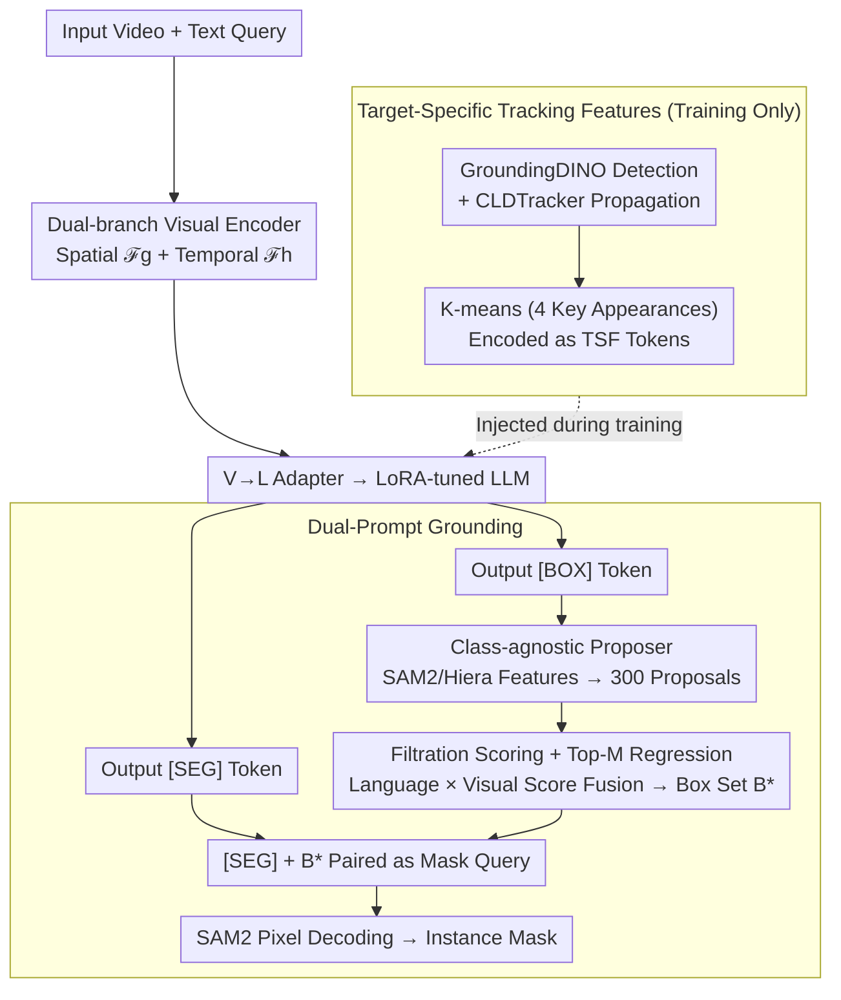

# SPARROW: Learning Spatial Precision and Temporal Referential Consistency in Pixel-Grounded Video MLLMs

**Conference**: CVPR 2026  
**arXiv**: [2603.12382](https://arxiv.org/abs/2603.12382)  
**Code**: None  
**Area**: Multimodal VLM  
**Keywords**: Video pixel-level grounding, Referring Video Object Segmentation, Temporal consistency, Dual-prompt decoding, Multimodal Large Language Models

## TL;DR

The SPARROW framework is proposed to integrate temporal consistency supervision via **Target-Specific Tracking Features (TSF)** and stabilize first-frame initialization using **dual-prompt ([BOX]+[SEG]) coarse-to-fine decoding**. Designed as a plug-and-play module for existing video MLLMs, it achieves consistent improvements across six benchmarks and three tasks.

## Background & Motivation

**Background**: Multimodal Large Language Models (MLLMs) have made significant progress in image-level visual reasoning and pixel-level grounding. Methods like LISA and PixelLM achieve language-conditioned segmentation through [SEG] tokens. However, extending these to **video** introduces additional challenges such as motion dynamics, occlusions, and temporal consistency.

**Limitations of Prior Work**: Existing video MLLMs (e.g., VideoGLaMM, UniPixel, GLUS) primarily rely on **static [SEG] tokens** for frame-by-frame inference, revealing two primary issues. First, **temporal drift and identity switching**—while video is dynamic, text prompts are static, forcing models to infer motion and appearance changes solely from visual cues, which often results in the same object being inconsistently segmented as different "identities" across frames. Second, **unreliable first-frame initialization**—[SEG] tokens provide semantic cues but lack spatial priors, making the initial masks prone to misalignment, which then propagates and amplifies errors over time.

**Key Challenge**: Static semantic tokens cannot encode the varying position and appearance of an object over time; meanwhile, initial grounding errors inevitably corrupt subsequent segmentation frames through error propagation.

**Goal**: To simultaneously address (i) temporal referential consistency (identity preservation) and (ii) first-frame spatial precision (drift reduction) without modifying the base model architecture.

**Key Insight & Core Idea**: The authors extract temporal supervision signals from tracked target-specific features—injected during training but removed during inference (TSF)—to interiorize identity persistence within the model. Furthermore, a dual-prompt decoding mechanism combining [BOX] geometric priors and [SEG] semantic priors is introduced to transition first-frame grounding from a single-step process to a "coarse-to-fine" approach.

## Method

### Overall Architecture

SPARROW aims to resolve cross-frame identity inconsistency and first-frame localization drift without altering the base video MLLM architecture. It attaches two lightweight, plug-and-play modules to the existing pipeline: **Target-Specific Tracking Features (TSF)** for temporal consistency and **Dual-Prompt Grounding** for spatial precision. A video sequence is processed by a dual-branch visual encoder—a spatial branch $\mathcal{F}_g$ for single-frame appearance and a temporal branch $\mathcal{F}_h$ for inter-frame motion—then fed into a LoRA-fine-tuned LLM via a V→L adapter. The LLM outputs two specialized tokens: [BOX] and [SEG]. These are projected back to the visual space via L→V adapters, where [BOX] drives a class-agnostic proposer for geometric bounding boxes and [SEG] drives SAM2 pixel decoding, collaborating in a coarse-to-fine manner. The TSF module injects appearance features tracked across frames into the input during training only and is removed during inference.

### Key Designs

**1. Target-Specific Tracking Features (TSF): Instilling "Identity Persistence" via Training-time Pseudo-tracking**

Video MLLMs inherit static [SEG] tokens where the prompt is fixed but the video is dynamic, leading to inconsistent identities across frames. TSF addresses this by providing "this is the same object" reference samples during training. Given a text query, GroundingDINO detects the target in a specific frame, and CLDTracker propagates it to generate a sequence of candidate boxes $B'_1 \dots B'_{K'}$. To manage redundancy, K-means clustering ($K=4$) is performed in the joint visual-spatial feature space to select samples near centroids, forming a compact subset $B_1 \dots B_K$. These capture diverse appearances (front/side/occluded) without repetition. These regions are encoded by $\mathcal{F}_g$ and projected into $Z_{\text{TSF}}$ tokens. Notably, **TSF is removed during inference by default**: the identity persistence is internalized during training, eliminating the need for external trackers during deployment.

**2. Dual-Prompt Grounding: [BOX] Geometric Priors + [SEG] Semantic Refinement**

Relying solely on [SEG] for first-frame localization often results in misalignment due to a lack of spatial priors. The dual-prompt approach introduces a [BOX] branch for geometric constraints. The LLM outputs $e_{\text{BOX}}$, which is projected via $W_b$. Simultaneously, a class-agnostic proposer (Deformable-DETR structure on frozen SAM2/Hiera features) generates $K=300$ candidate proposals. Cross-attention between $e_{\text{BOX}}$ and proposal features allows a filtration head to score them. The top-M candidates undergo text-conditioned bounding box regression. Finally, a fusion of linguistic and visual scores yields the box set $B^*$. The [SEG] branch uses $B^*$ and $e_{\text{SEG}}$ as mask queries for SAM2's prompt encoder, naturally supporting multi-instance output if $|B^*|>1$.

### A Complete Example

For the query "a dog running across the screen":  
**During Training (with TSF)**: GroundingDINO boxes the dog in one frame, CLDTracker propagates it, and K-means selects four representative appearances. These are encoded as TSF tokens, teaching the model that these four views represent the same dog.  
**During Inference (without TSF)**: On the first frame, the LLM outputs [BOX]+[SEG]. The proposer generates 300 proposals; the [BOX] token scores them, and the filtration head selects the best match (the dog) as $B^*$. The [SEG] token uses this box as a spatial prior for SAM2 to generate a pixel-level mask. If the target drifts later due to occlusion, re-issuing [BOX]+[SEG] acts as an internal drift correction.

### Loss & Training

**Two-Stage Training**:

**Stage 1 — TSF Information Injection**: Trains V→L adapters $(\mathcal{F}_g, \mathcal{F}_h)$, L→V SEG adapter $W_s$, and LLM LoRA parameters. The backbone and pixel decoder remain frozen. Loss: $L_{total} = L_{CE} + L_{BCE} + L_{DICE}$.

**Stage 2 — Box Prompt Learning**:
- Pre-train the class-agnostic proposer (D-DETR head on COCO/Objects365/etc., discarding category labels). Loss: $L_{prop} = L_{obj} + \lambda_1 \cdot L_{\ell 1} + \lambda_2 \cdot L_{GIoU}$.
- Fine-tune the filtration head and L→V BOX adapter $W_b$, freezing everything else. Loss: $L_{filter} = \lambda_{cls} \cdot L_{BCE} + \lambda_{box} \cdot (L_{\ell 1} + L_{GIoU})$, where $\lambda_{cls}=1.0, \lambda_{box}=2.0$.

## Key Experimental Results

### Main Results

SPARROW was integrated into three video MLLM baselines (UniPixel, GLUS, VideoGLaMM) across RVOS, VG, and GCG tasks.

**Table 1: MeViS Referring Video Object Segmentation (Motion Expressions)**

| Method | val J&F | val^u J&F |
|------|---------|-----------|
| UniPixel | 53.1 | 59.7 |
| + SPARROW | **54.4** (+1.3) | **60.7** (+1.0) |
| GLUS | 51.3 | 59.8 |
| + SPARROW | **53.2** (+1.9) | **61.9** (+0.3) |
| VideoGLaMM | 45.2 | 48.5 |
| + SPARROW | **47.5** (+2.3) | **57.4** (+8.9) |

**Table 2: Ref-YTVOS & Ref-DAVIS17 RVOS**

| Method | Ref-YTVOS J&F | Ref-DAVIS17 J&F |
|------|---------------|-----------------|
| UniPixel | 70.5 | 74.2 |
| + SPARROW | **70.7** (+0.2) | **76.4** (+2.2) |
| GLUS | 67.3 | 72.9 |
| + SPARROW | **69.1** (+1.8) | **75.5** (+2.6) |
| VideoGLaMM | 66.8 | 69.5 |
| + SPARROW | **68.9** (+2.1) | **76.8** (+7.3) |

Notably, VideoGLaMM's boundary quality (F-score) on Ref-DAVIS17 improved by +14.5, with all SPARROW models exceeding an F-score of 80.

### Ablation Study

Based on Ref-DAVIS17 (val) + VideoGLaMM baseline.

**Joint Ablation of TSF and BOX** (J&F):

| TSF Mode | BOX OFF | BOX ON |
|----------|---------|--------|
| No TSF | 69.5 (baseline) | 72.5 (+3.0) |
| Training Only (Default) | 72.4 (+2.9) | **76.8** (+7.3) |
| Training + Inference | 75.3 (+5.8) | **77.7** (+8.2) |

**Prompt Combination Ablation**: [SEG] only (69.5), [BOX] only (68.2), [BOX]+[SEG] (**72.5**, +3.0), highlighting the complementarity of the dual prompts.

### Key Findings

1. **TSF yields a +2.9 improvement** even when used only during training, requiring no extra overhead during inference.
2. The [BOX] prompt alone contributes +3.0, and its effect is **nearly additive** with TSF (+7.3 total).
3. Weaker baselines show larger gains (e.g., VideoGLaMM +8.9 on MeViS val^u), suggesting significant corrective potential.
4. Consistent gains of approximately +5 mIoU were observed across all baselines on the VidSTG (Visual Grounding) task.

## Highlights & Insights

- **Plug-and-play Design**: SPARROW integrates via lightweight adapters and a proposal head without altering the backbone or LLM, demonstrating strong versatility across three different video MLLM architectures.
- **Train-time Tracking, Inference-time Free**: The core insight of TSF is using pseudo-tracking to inject temporal consistency priors during training. Once internalized, the model performs consistently without being tethered to an external tracker during inference.
- **Coarse-to-fine Dual Prompting**: [BOX] provides geometric constraints while [SEG] provides semantic refinement. These dimensions are orthogonal and complementary, echoing two-stage "detect-then-segment" logic within a tokenized framework.
- **Unified Large-scale Dataset**: Consolidating seven data sources into a unified set of 30K+ videos fills a critical gap in object-centric temporal grounding data.

## Limitations & Future Work

1. **Dependence on Proposal Recall**: Small objects, extreme occlusions, or unseen categories may fail if the proposer does not generate an initial candidate.
2. **Error Accumulation in Long Videos**: While dual-prompting mitigates drift, it does not entirely eliminate error propagation if initial [BOX] predictions are incorrect.
3. **Pseudo-label Quality**: TSF relies on GroundingDINO and CLDTracker; severe noise or ID switches in these tools can degrade training quality.

## Related Work & Insights

- **Artemis**: Inspired the use of target-specific tracking features to improve temporal consistency.
- **Groma**: Inspired the dual-prompt design using box prompting for fine-grained grounding.
- **SAM2 Integration**: Utilizing frozen SAM2/Hiera features for proposals while maintaining prompt encoder interfaces offers a robust template for grounding.

## Rating

⭐⭐⭐⭐ Strong engineering orientation with elegant modular design and comprehensive experiments. While the underlying components (proposer + pseudo-tracking) are established, their integration into the Video MLLM paradigm is highly effective and well-executed.

<!-- RELATED:START -->

## Related Papers

- [\[CVPR 2026\] Linking Perception, Confidence and Accuracy in MLLMs](linking_perception_confidence_and_accuracy_in_mllms.md)
- [\[CVPR 2026\] Video-Only ToM: Enhancing Theory of Mind in Multimodal Large Language Models](video-only_tom_enhancing_theory_of_mind_in_multimodal_large_language_models.md)
- [\[CVPR 2026\] TempR1: Improving Temporal Understanding of MLLMs via Temporal-Aware Multi-Task Reinforcement Learning](tempr1_improving_temporal_understanding_of_mllms_via_temporal-aware_multi-task_r.md)
- [\[CVPR 2026\] MuCo: Multi-turn Contrastive Learning for Multimodal Embedding Model](muco_multi-turn_contrastive_learning_for_multimodal_embedding_model.md)
- [\[CVPR 2026\] Octopus: History-Free Gradient Orthogonalization for Continual Learning in Multimodal Large Language Models](octopus_history-free_gradient_orthogonalization_for_continual_learning_in_multim.md)

<!-- RELATED:END -->
