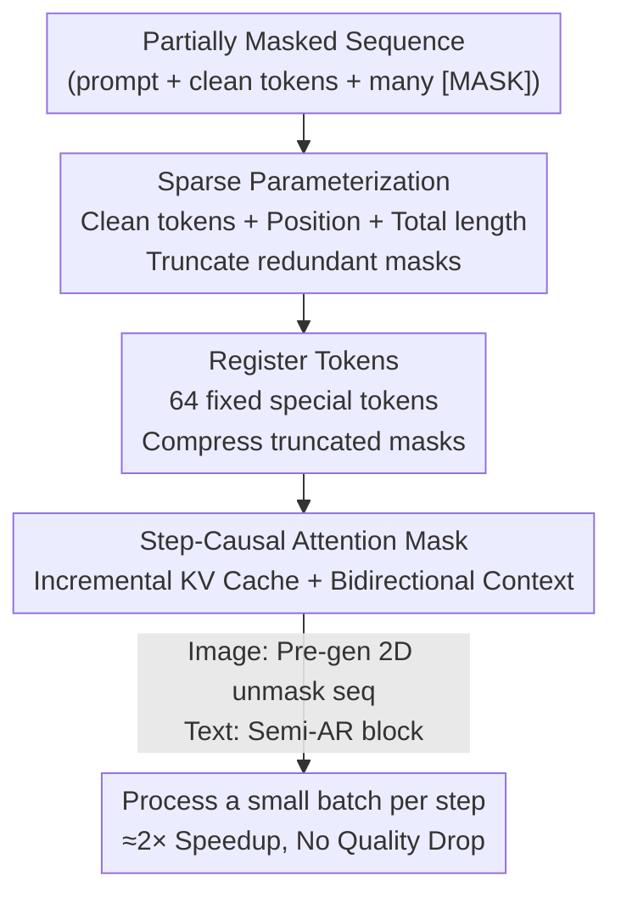

# Sparse-LaViDa: Sparse Multimodal Discrete Diffusion Language Models

**Conference**: CVPR 2026  
**Paper**: [CVF Open Access](https://openaccess.thecvf.com/content/CVPR2026/html/Li_Sparse-LaViDa_Sparse_Multimodal_Discrete_Diffusion_Language_Models_CVPR_2026_paper.html)  
**Code**: None  
**Area**: Multimodal VLM / Diffusion Models / LLM Efficiency  
**Keywords**: Masked Discrete Diffusion, Multimodal Unified Model, KV Cache, Sparse Parameterization, Inference Acceleration

## TL;DR
Addressing the two major efficiency bottlenecks of Masked Discrete Diffusion Models (MDM)—where thousands of redundant mask tokens are fed into the network every step and KV caching is incompatible—Sparse-LaViDa proposes an equivalent transformation using "sparse parameterization + register tokens + step-causal attention masks." Without breaking the bidirectional context of MDM, it allows the model to process only the "small batch of tokens to be decoded" per step, achieving up to ~2.8× acceleration in text-to-image (T2I), image editing, and visual math reasoning with minimal loss in quality and accuracy.

## Background & Motivation
**Background**: Unified multimodal models (capable of both understanding and generation) are a current research hotspot. A promising direction is the Masked Discrete Diffusion Model (MDM), which represents text and images as discrete token sequences. The forward process gradually replaces clean tokens with `[MASK]`, and the model learns the reverse process to iteratively "unmask" from a fully masked sequence. Representative works like LaViDa-O achieved SOTA in image understanding, T2I, and image editing. Compared to autoregressive (AR) models, MDM naturally possesses bidirectional context, supports parallel decoding, and handles tasks like inpainting or text-completion.

**Limitations of Prior Work**: Although MDM supports parallel decoding, inference is slow due to two reasons. First, it uses full attention instead of AR's causal attention, making it **incompatible with KV caching**—every step requires recalculating the entire sequence. Second, every step must process the **entire** sequence (including many redundant `[MASK]` tokens waiting to be decoded). For example, if an image is represented by 1024 tokens, the model processes all 1024 even if only a few dozen are unmasked in a given step.

**Key Challenge**: Existing acceleration schemes either treat symptoms rather than causes or "trade functionality for speed." Training-free KV cache methods (Fast-dLLM, dKV-Cache, etc.) rely on heuristics, leading to uncontrollable performance drops that vary by task. Training-based Block Diffusion uses block-causal attention to constrain parallel decoding to a **strict left-to-right** block order, which allows for caching and truncation but is unfriendly to image generation/editing where tokens have no natural order. Furthermore, block-causal masks **remove bidirectional context**, disabling core MDM tasks like inpainting.

**Goal**: To implement the standard MDM formula faithfully and efficiently while supporting **both KV caching and truncation of redundant tokens at any position**, without assuming a left-to-right order or sacrificing bidirectional context.

**Key Insight**: The authors leverage a mathematical property of MDM: under the standard independence assumption, the reverse process factorizes as $p_\theta(X_0|X_t)=\prod_{i=1}^{L}p_\theta(X_0^i|X_t)$. Predictions at each position are optimized and sampled **independently**. Since the model only cares about predictions on subset $C$, there is no need to compute logits for positions outside $C$. Combined with the observation that "mask tokens carry no substantial information other than being a mask," these masks can be compressed rather than materialized.

**Core Idea**: Use **sparse parameterization** to uniquely represent a "partially masked sequence" as "clean tokens + their positions + total sequence length." This ensures only the prompt, decoded tokens, and the current small batch of target tokens are fed into the network. Modeling capacity lost by truncation is recovered via a small number of register tokens, while a step-causal mask bridges the gap between training and inference.

## Method

### Overall Architecture
Sparse-LaViDa is not a new model but an **equivalent, more efficient parameterization** for standard MDM. Built on the SOTA unified MDM LaViDa-O (10.4B) using the same MDM training objective, it only modifies the implementation layer of $p_\theta(X_0^i|X_t)$. The pipeline consists of three components: ① **Sparse Representation**: Compressing sequences with many `[MASK]` tokens into "clean tokens + sequence length," stopping the materialization of all masks; ② **Register Tokens**: Attaching 64 fixed special tokens at the end of the sequence to serve as compressed representatives of truncated masks, recovering modeling capacity; ③ **Step-Causal Attention Mask**: A structured mask that enables incremental KV cache updates during inference while simulating this behavior in parallel during training.

During inference (see diagram below), the input at any sampling step $k$ consists of only four token types: historical tokens in cache, tokens just decoded in the last step, mask tokens to be decoded now, and register tokens. The model only outputs logits and samples for the "tokens to be decoded now." Consequently, the number of tokens processed per step is much smaller than the full sequence, which, combined with KV cache reuse, provides acceleration.

### Key Designs

**1. Sparse Parameterization: Compressing sequences to process only what is necessary**

This is the core contribution. Standard MDM feeds all $L$ tokens (including redundant `[MASK]`) into the network, outputting a dense $L\times V$ logit tensor, most of which is unused. While $p_\theta(X_0|X_t)=\prod_{i=1}^{L}p_\theta(X_0^i|X_t)$ means logits are only needed for subset $C$, the mask positions $X_t^j$ normally remain part of the input. The secondary observation is that **mask tokens carry no information other than their presence**, allowing them to be compressed. A sequence of seven tokens "I have [m] dog [m] [m] [m]" can be uniquely recovered using "clean tokens with position (I@1, have@2, dog@4) + a special token indicating total length (=7)." The number of tokens actually processed drops from "full sequence" to "prompt + decoded + current small batch," providing the fundamental source of speedup without introducing approximation errors.

**2. Register Token: Recovering capacity lost to truncation**

Simply using a "length token" to represent truncated masks leads to a noticeable drop in image quality. The authors attribute this to two factors: (1) Truncation itself loses model capacity—a 1024×1024 image requires 4096 tokens, but initial steps sample fewer than 100, which reduces expressive power; (2) To influence generation significantly through the attention mechanism, special tokens need **sufficient quantity**. Thus, Sparse-LaViDa uses **64 register tokens** placed at the end of the sequence. This number **stays constant** throughout inference. Ablations (see table) show registers primarily improve fine-grained alignment and low-level visual details: while GenEval (object detection based) is barely affected, DPG (VQA based) and FID/HPS improve significantly.

**3. Step-Causal Attention Mask: Aligning training with incremental inference caching**

Truncation + KV cache means that during inference, not all tokens are mutually visible. This is inconsistent with the full attention used in vanilla MDM training. To resolve this "training-inference gap," the authors design a step-causal mask to **simulate parallel incremental caching** during a single training forward pass. The sequence $X_t$ is split into $M+N$ "blocks": prompt is block 0, clean tokens are randomly assigned to blocks $\{1,\dots,M\}$, and mask tokens to blocks $\{M+1,\dots,M+N\}$. The rules are: clean block $i$ can only see blocks $j\le i$ (simulating sequential caching); mask block $i$ can only see its **own mask block** $j=i$ or all prompt/clean blocks $j\le M$, but **cannot see other mask blocks**—making masks mutually invisible while seeing context. This allows one forward pass to simulate multiple decoding paths. Unlike Block Diffusion, it **retains bidirectional context** (masks see all clean context), which is vital for image editing.

### Loss & Training
Since Sparse-LaViDa is an equivalent parameterization, it **retains the vanilla MDM objective** $L_\mathrm{MDM}=-\mathbb{E}_{t,X_0,X_t}\big[\tfrac{1}{t}\log p_\theta(X_0|X_t)\big]$. It is an **inherently efficient parameterization** that does not require a distillation phase. Initialized from LaViDa-O pretrained weights, it is SFT-ed on a mixture of image understanding, T2I (20M pairs), and image editing (1.5M pairs) data using 64 H100s for 100k steps.

## Key Experimental Results

### Main Results
Base model is LaViDa-O (10.4B). All T2I experiments are measured on a single A100 at 1024 resolution. Speedup is relative to LaViDa-O.

| Task / Dataset | Metric | LaViDa-O | Sparse-LaViDa | Gain |
|--------|------|----------|---------------|------|
| T2I GenEval | Overall ↑ | 0.77 | 0.78 (+0.01) | 1.95× |
| T2I GenEval | Latency (s) ↓ | 21.27 | 10.86 | — |
| T2I DPG-bench | Score ↑ | 81.8 | 82.4 (+0.6) | — |
| T2I MJHQ-30k | FID ↓ | 6.68 | 7.63 | — |
| Editing ImgEdit | Overall ↑ | 3.71 | 3.79 (+0.08) | 2.83× |
| Editing ImgEdit | Latency (s) ↓ | 63.98 | 22.55 | — |
| MathVista | Acc ↑ | 56.9 | 56.7 | 2.80× |

T2I quality is maintained or slightly improved (GenEval +0.01, DPG +0.6) while latency is roughly halved, outperforming strong baselines like Flux.1-Dev. When trained on the **same 20M subset**, Sparse-LaViDa's FID (7.63) is better than LaViDa-O* (8.11), suggesting the sparse parameterization is actually more efficient at utilizing data. Speedup in short-answer understanding tasks is limited because the output length is often less than one block (32 tokens).

### Ablation Study

**Speed Source Breakdown (T2I)**: Decomposing the speedup into three "switches."

| Cache Prompt | Cache Res | Truncate Res | Latency ↓ | Speedup ↑ |
|:---:|:---:|:---:|:---:|:---:|
| — | — | — | 21.27 | 1.00× |
| ✓ | — | — | 16.43 | 1.29× |
| — | ✓ | — | 18.87 | 1.13× |
| — | — | ✓ | 17.93 | 1.19× |
| ✓ | ✓ | — | 14.09 | 1.51× |
| ✓ | — | ✓ | 13.72 | 1.55× |
| ✓ | ✓ | ✓ | 10.86 | 1.96× |

**Register Quantity (T2I)**: Registers primarily recover low-level details.

| #Register | GenEval ↑ | DPG ↑ | HPS v3 ↑ | FID ↓ |
|:---:|:---:|:---:|:---:|:---:|
| 0 | 0.76 | 80.3 | 8.68 | 9.32 |
| 1 | 0.76 | 79.6 | 8.71 | 9.50 |
| 32 | 0.77 | 82.1 | 8.87 | 8.25 |
| 64 | 0.78 | 82.4 | 8.89 | 7.63 |

### Key Findings
- **Truncation + Caching are synergistic**: Truncation alone yields 1.19×, and prompt caching alone 1.29×, but only together do they reach 1.96×.
- **Step-causal mask is vital**: Removing it drops GenEval by 0.07. "No Training" (applying sparse inference to raw weights) crashes performance from 0.78 to 0.24, proving weights must adapt to this parameterization.
- **Registers recover "details," not "structure"**: GenEval (object-level) is insensitive to register count, but DPG (VQA alignment) and FID/HPS (quality) improve monotonically with more registers.

## Highlights & Insights
- **Equivalent Rewriting as Acceleration**: The core insight that "full sequences" can be losslessly compressed into "clean tokens + length." This is an **equivalent parameterization** rather than an approximation, making it cleaner than heuristic cache-dropping methods.
- **Bridging the Gap via Masks**: The step-causal mask uses "block indexing + conditional visibility" to parallelize incremental dependencies, a reusable trick for any scenario where inference is sequential but training aims for parallelism.
- **Registers as Capacity Buffers**: A lightweight design that recovers capacity lost to truncation by using a small, constant number of special tokens.
- **Bidirectional Context Preservation**: Unlike Block Diffusion, this method maintains the capability for inpainting, outpainting, and parallel grounding.

## Limitations & Future Work
- **Requires Fine-tuning**: Sparse-LaViDa is not plug-and-play and requires SFT to adapt weights.
- **Post-training Only**: While it could theoretically be used for from-scratch pretraining, it was only validated in a post-training setting due to compute costs.
- **Limited Gains for Short Outputs**: Tasks with short sequences (short Q&A) see minimal benefit as there is little to truncate.

## Related Work & Insights
- **vs. Block Diffusion / SDAR / D2F**: These rely on block-causal attention to force order, sacrificing bidirectional context. Sparse-LaViDa is the **first to support cache/truncation without assuming sequence order**.
- **vs. Fast-dLLM / dKV-Cache**: These use training-free heuristics that are unstable. Sparse-LaViDa's learning-based approach is both faster and more accurate on MathVista.
- **vs. LaViDa-O**: A "pure efficiency upgrade" for the unified MDM base, providing 1.95×–2.83× speedup at zero quality cost.

## Rating
- Novelty: ⭐⭐⭐⭐⭐ 
- Experimental Thoroughness: ⭐⭐⭐⭐ 
- Writing Quality: ⭐⭐⭐⭐⭐ 
- Value: ⭐⭐⭐⭐

<!-- RELATED:START -->

## Related Papers

- [\[CVPR 2026\] Cubic Discrete Diffusion: Discrete Visual Generation on High-Dimensional Representation Tokens](cubic_discrete_diffusion_discrete_visual_generation_on_high-dimensional_represen.md)
- [\[CVPR 2026\] Sparse Spectral LoRA: Routed Experts for Medical VLMs](sparse_spectral_lora_routed_experts_for_medical_vlms.md)
- [\[CVPR 2026\] VISion On Request: Enhanced VLLM Efficiency with Sparse, Dynamically Selected, Vision-Language Interactions](vision_on_request_enhanced_vllm_efficiency_with_sparse_dynamically_selected_visi.md)
- [\[CVPR 2026\] Bridging the Modality Gap in Compositional Zero-Shot Learning via Sparse Alignment and Unimodal Memory Bank](bridging_the_modality_gap_in_compositional_zero-shot_learning_via_sparse_alignme.md)
- [\[NeurIPS 2025\] Sparse Autoencoders Learn Monosemantic Features in Vision-Language Models](../../NeurIPS2025/multimodal_vlm/sparse_autoencoders_learn_monosemantic_features_in_visionlan.md)

<!-- RELATED:END -->
