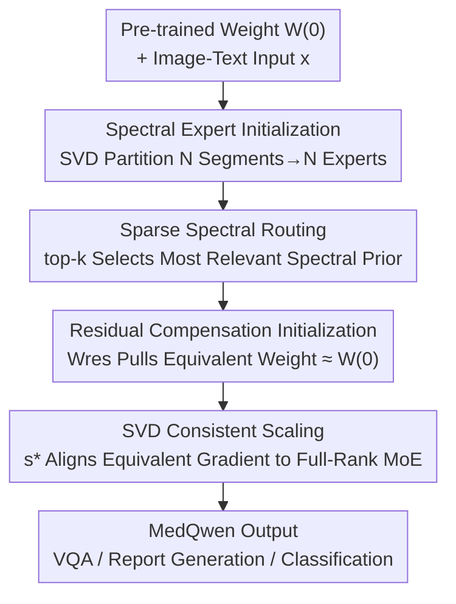

# Sparse Spectral LoRA: Routed Experts for Medical VLMs

**Conference**: CVPR 2026  
**Paper**: [CVF Open Access](https://openaccess.thecvf.com/content/CVPR2026/html/Nejatimanzari_Sparse_Spectral_LoRA_Routed_Experts_for_Medical_VLMs_CVPR_2026_paper.html)  
**Code**: None  
**Area**: Multimodal VLM  
**Keywords**: Medical VLM, LoRA-MoE, SVD Spectral Initialization, Scaling Factor, Catastrophic Forgetting

## TL;DR
Ours proposes MedQwen, which partitions SVD spectral segments of pre-trained weights into non-overlapping experts and utilizes a top-k router to select spectral priors based on inputs. Accompanied by theoretically grounded residual compensation and scaling rules, it aligns the training dynamics of low-rank MoE with full-rank full-parameter fine-tuning. MedQwen approaches the performance of full fine-tuning across 23 medical datasets (with 339× fewer parameters) and suppresses catastrophic forgetting in sequential training from $>20\text{--}50\%$ to approximately $5\%$.

## Background & Motivation

**Background**: To adapt general Vision-Language Models (VLMs) to medical tasks, the mainstream approach involves Parameter-Efficient Fine-Tuning (PEFT) like LoRA, where a set of low-rank matrices $W=W^{(0)}+sBA$ is attached to a frozen backbone. This reduces the cost of full fine-tuning and has led to specialized models such as LLaVA-Med and HealthGPT for medical VQA and report generation.

**Limitations of Prior Work**: The authors observe that standard LoRA is extremely sensitive to the "training data recipe"—a model tuned on a single medical dataset (e.g., Slake) may fail when transferred to another (e.g., PathVQA). Directly mixing multiple heterogeneous sources introduces cross-dataset interference. Furthermore, in clinical scenarios, data and tasks arrive sequentially, and naive continuous training leads to catastrophic forgetting of previously acquired knowledge.

**Key Challenge**: The root cause lies in the "task-specific" information carried by SVD spectral segments—experiments cited in the paper show that the largest singular value segment ($x=l$) performs best on Slake, while the smallest segment ($x=0$) is best for PathVQA, and intermediate segments are crucial when $r=128$. This implies that no fixed spectral segment is optimal for all medical tasks. PiSSA focuses strictly on principal components, while MiLoRA/KaSA focus on secondary components; both force a binary choice within a fixed subspace and cannot adapt to inputs.

**Goal**: (1) Enable the model to automatically select the most relevant spectral priors based on input to reduce cross-dataset interference; (2) Align the training dynamics of low-rank MoE with full-rank full-parameter fine-tuning without modifying the backbone or changing the optimizer, narrowing the performance gap between PEFT and full fine-tuning.

**Key Insight**: Since different spectral segments have distinct advantages, instead of choosing one over the other, the entire singular value spectrum is partitioned into several non-overlapping segments. Each segment is assigned to a LoRA expert, allowing the router to learn to select spectral segments based on the input.

**Core Idea**: Replace "LoRA with a fixed single subspace" with "SVD spectral segments $\rightarrow$ Experts $\rightarrow$ Sparse Routing," and use residual compensation + theoretical scaling to align the initial weights and gradients of this low-rank MoE with full-rank MoE.

## Method

### Overall Architecture
MedQwen uses Qwen2.5-VL 7B as the base model. The core pipeline replaces the single LoRA adapter in each layer with a group of "Spectral Experts + Router," followed by alignment corrections in initialization and scaling. Specifically, SVD is performed on the pre-trained weights, and the singular value spectrum is uniformly partitioned into $N$ segments, each initialized as a low-rank expert (spectral prior). During the forward pass, the router scores the input and activates only the top-$k$ experts, adding their low-rank updates to the frozen base. To prevent the SVD subspace from disrupting the benign dynamics of LoRA's "zero-initialization," a constant residual term $W_{\text{res}}$ is introduced to pull the initial equivalent weight back to $W^{(0)}$. Finally, a theoretically derived scaling factor aligns the equivalent gradient of each expert with full-parameter fine-tuning MoE. The overall output is:

$$\text{MoELoRA}(x) = W^{(0)}x + \sum_{i\in S_k(x)} R(x)_i\,(s B_i A_i x)$$

where $S_k(x)$ is the set of indices for top-$k$ experts, $R(x)_i$ represents normalized routing weights, and $s$ is the scaling factor.

### Key Designs

**1. Sparse Spectral LoRA: Partitioning SVD Spectrum into Non-overlapping Experts**

This design directly addresses the pain point that a single fixed subspace cannot accommodate all medical tasks. After performing SVD on the pre-trained weight $W^{(0)}=USV^\top$, the spectrum is divided uniformly by rank into $N$ segments. The $j$-th expert is assigned the segment $[k:k+t]$ (where $t=\min(m,n)/N$ and $k=(j-1)t$). Each expert has a rank $d=r/N$, and its low-rank factors are constructed from its assigned spectral segment:

$$B_i=\sqrt{\tfrac{1}{s}}\,U'S'^{1/2}\in\mathbb{R}^{m\times d},\qquad A_i=\sqrt{\tfrac{1}{s}}\,S'^{1/2}V'^\top\in\mathbb{R}^{d\times n}$$

A Mixtral-style top-$k$ router is used: routing logits $z(x)=W_z x$, normalized via softmax $R(x)_i$ for top-$k$ experts, with others set to 0. Only the selected experts and their gating paths receive gradients during backpropagation ($k\ll N$). Consequently, the router learns to select spectral segments based on input: Slake-like inputs route to experts with larger singular values, while PathVQA-like inputs route to smaller ones. This preserves the pre-trained structure while isolating task adaptation into different experts, mechanistically suppressing cross-dataset interference. Compared to PiSSA/MiLoRA, it transitions "spectral segment selection" from manual prior to data-driven learnable routing.

**2. Residual Compensation Initialization: Equalizing Equivalent Weights to $W^{(0)}$ at $t=0$**

Inserting SVD subspaces into MoE introduces an issue absent in standard zero-initialized LoRA—initially, $\sum_i R(x)_i sB_i^{(0)}A_i^{(0)}$ is non-zero, causing the equivalent weight $\tilde W^{(0)}$ to deviate from the true pre-trained weight $W^{(0)}$. Following the "upcycled MoE" logic, a constant residual term is introduced as subtractive compensation:

$$\tilde W^{(0)} = W^{(0)} - W_{\text{res}} + \sum_{i=1}^{N} R(x)_i\, s B_i^{(0)}A_i^{(0)} \approx W^{(0)}$$

$W_{\text{res}}$ is taken as the expectation of initial contributions from all experts. By minimizing the expected MSE $\arg\min_{W_{\text{res}}}\mathbb{E}_x\|W_{\text{res}}-s\sum_i R(x)_iB_i^{(0)}A_i^{(0)}\|^2$, a closed-form solution is derived. Using moment identities for top-$k$ routing $\mathbb{E}[R(x)_i]=\tfrac{1}{N}$ and $\mathrm{Var}(R(x)_i)=\tfrac{N-k}{kN^2}$, we obtain:

$$W_{\text{res}}^{+}=\frac{s}{N}\sum_{i=1}^{N} B_i^{(0)}A_i^{(0)}$$

Essentially, by averaging the initial updates of all experts and subtracting them from the base, the initial equivalent weight is guaranteed to be unbiased and equal to $W^{(0)}$. Standard LoRA-MoE zero-initialization is a special case where $W_{\text{res}}^{+}=0$.

**3. SVD-Consistent Scaling: Aligning Gradients with Full-Rank MoE via Theoretical Scaling**

Aligning initial weights is insufficient, as low-rank adaptation alters gradient geometry, causing a convergence gap compared to full fine-tuning. The authors decompose alignment into per-expert conditions (Theorem 2): if each expert satisfies $\tilde W_i^{(0)}\approx W_i^{(0)}$ and $\tilde g_i^t\approx g_i^t$, the training dynamics of the entire LoRA-MoE are equivalent to an upcycled MoE with full-rank full fine-tuning. Analyzing the equivalent gradient under zero-initialization $\tilde g_i^t=s^2(B_i^t B_i^{t\top}g_i^t+g_i^t A_i^{t\top}A_i^t)$ and minimizing $\|\tilde g_i^t-g_i^t\|$ (with learning rate ratio $\eta$) yields the optimal scaling factor:

$$s^{*}=\sqrt{\frac{3n\,\eta}{r}}$$

Since $n\gg r$ in practice, $s^*$ is significantly larger than the commonly used $s=2$. This theoretically explains why small scaling factors lead to slow convergence and why cutting rank in MoE requires larger scaling to recover gradient norms. To maintain numerical stability when inserting SVD spectral subspaces, a damping coefficient $\rho>0$ is used to suppress initial factor magnitudes $B_i^{(0)}=\sqrt{\tfrac{1}{s\rho}}U_iS_i^{1/2}$ and $A_i^{(0)}=\sqrt{\tfrac{1}{s\rho}}S_i^{1/2}V_i^\top$, pushing the system toward the zero-initialization neighborhood where the $s^*$ formula holds. Empirically, $s\in[4,16]$ balances convergence speed and stability.

### Loss & Training
Three-stage training: Stages 1 and 2 utilize alignment and instruction-tuning data from LLaVA-Med. Stage 3 performs MoE fine-tuning on medical datasets like SLAKE, VQA-RAD, and PathVQA. MoE training includes a load-balancing loss (disabled when comparing fairly against single LoRA). The default configuration is 2-of-8 (8 experts, 2 active), with a total rank of 32.

## Key Experimental Results

### Main Results
Comprehensive Comparison for Medical VQA (Avg. is the mean across datasets):

| Model | Parameters | VQA-RAD close/open | SLAKE close/open | PathVQA close/open | OMVQA | Avg. |
|------|------|------|------|------|------|------|
| Qwen-2.5-VL | 7B | 61.8 / 27.2 | 64.7 / 36.7 | 60.5 / 33.4 | 60.8 | 49.3 |
| HealthGPT-L14 | 14B | 74.5 / 54.5 | 71.9 / 56.2 | 75.2 / 42.1 | 67.2 | 63.1 |
| **MedQwen** | 7B | **78.8 / 59.6** | **75.3 / 59.9** | **84.2 / 49.1** | **70.6** | **68.2** |

MedQwen outperforms the Qwen-2.5-VL base by 18.9% on average, and exceeds Med-LLaVA and Med-Flamingo by 23.2% and 29.6%, respectively.

Zero-shot Classification (BiomedCLIP ViT-B/16, mean of 9 radiology datasets):

| Method | Parameters (%) | Avg. | Description |
|------|---------|------|------|
| Full FT | 100 | 56.76 | Full-parameter Fine-tuning |
| Full FT MoE | 760 | 61.72 | Full-rank MoE Upper Bound |
| LoRA (rank32) | 5.98 | 55.45 | Strongest single LoRA baseline |
| MoELoRA | 2.24 | 55.52 | LoRA-MoE baseline |
| **Ours** | **2.24** | **58.83** | 95.31% of Full-rank MoE, 339× fewer parameters |

MedQwen achieves 58.83% with 2.24% parameters, outperforming rank-32 single LoRA by +3.38, PiSSA by 8.75%, and HydraLoRA by 4.84%. It leads across all 9 datasets and surpasses full fine-tuning (56.76%).

### Ablation Study
Ablation of SVD Initialization and MoE Scaling (MS) (O=spectral segments, P=principal components, M=minor components, R=random segments):

| Configuration | Avg. | Avg.(w/o MS) | Description |
|------|------|------|------|
| MoE + P | 67.3 | 66.8 | Principal components only |
| MoE + M | 67.4 | 66.6 | Minor components only |
| MoE + R | 67.6 | 66.9 | Random segments |
| MoE + O (Full)| **68.2** | 67.3 | Spectral segments (Ours), optimal |
| O without MoE | 60.1 | — | Spectral segments on single LoRA, drops to 60.1 |
| No SVD Init (Zero-init) | 67.3 | 66.8 | — |

### Key Findings
- **Expertization is the primary driver**: Using spectral segments but removing MoE (reverting to single LoRA) causes a drop from 68.2 to 60.1 (−8.1). This indicates that "spectral partitioning + routed expertization" is the core source of performance, rather than spectral initialization alone.
- **Consistent Scaling provides positive stability**: Enabling MoE Scaling (MS) generally yields a 0.5–1.0 point improvement, and Ours spectral segments (O) consistently outperform principal, minor, or random segments.
- **Resilience to Catastrophic Forgetting**: After sequential training for 15 epochs (Harvard-FairVLMed → PathVQA), standard LoRA performance drops by $>50\%$, MoELoRA by $>20\%$, while Ours drops only ~5%.
- **Sparse Activation is superior**: With total rank fixed at 32, 2-of-8 is the best trade-off for performance/storage. Activating more experts can degrade performance, complicate training, and increase VRAM/runtime overhead.
- **Diminishing returns of rank**: Performance improves from rank 8 to 128, but the gain from rank 64 to 128 is only +0.3%, suggesting limited marginal utility for high ranks.

## Highlights & Insights
- **Turning "Segment Selection" into Learnable Routing**: While PiSSA/MiLoRA debate whether to tune principal or minor components, Ours partitions the entire spectrum and lets the router choose based on input. This mechanism absorbs the benefits of both schools while isolating cross-dataset interference.
- **Elegant Closed-form Residual Compensation**: Using moment identities of top-$k$ routing, the requirement for an "unbiased initial equivalent weight" is reduced to a closed-form solution $W_{\text{res}}^{+}=\tfrac{s}{N}\sum_i B_i^{(0)}A_i^{(0)}$. This theoretically unifies spectral initialization with existing zero-init LoRA-MoE schemes.
- **Transferable Theoretical Foundation for Scaling**: $s^*=\sqrt{3n\eta/r}$ quantifies the empirical observation that small scaling slows convergence and low-rank setups require larger scaling. This conclusion serves as a reference for any LoRA-MoE hyperparameter tuning.
- **Plug-and-Play without Backbone Modification**: The entire method leaves the Qwen2.5-VL architecture and optimizer untouched, making it highly compatible with existing medical VLM pipelines.

## Limitations & Future Work
- **Theoretical alignment is an approximation in spectral subspaces**: The authors note that precise gradient dynamics in SVD subspaces are difficult to analyze. The $s^*$ formula strictly holds at zero-initialization; they "push" the system toward the zero-init neighborhood using large $s$ and $\rho$. Strict rigor depends on Theorem 5 and the Appendix of the original paper.
- **Sensitivity to Expert/Activation Hyperparameters**: 2-of-8 is empirically optimal, but changes in expert count and activation ratio simultaneously affect performance, VRAM, and routing trainability. A mechanism for automatic selection of $N, k$ is missing.
- **Validation limited to Qwen2.5-VL 7B**: Stability when transferred to smaller/larger bases or non-medical domains has not been fully examined.
- **Future Directions**: Making spectral partitioning adaptive (non-uniform slicing, dynamic merging) or upgrading residual compensation from a constant to a learnable term could further close the gap with full-rank MoE.

## Related Work & Insights
- **vs. PiSSA / MiLoRA / KaSA**: These tune in a single fixed spectral subspace (principal/minor). Ours partitions the spectrum into non-overlapping segments for multiple experts and uses routing for adaptive selection. The advantage is "input-based selection" over "global binary choice," yielding 8.75% higher accuracy than PiSSA in zero-shot classification.
- **vs. MoELoRA / HydraLoRA / AdaMoLE**: While these are also LoRA-MoEs, they rely on zero-initialization and empirical scaling. Ours incorporates SVD spectral prior initialization, closed-form residual compensation, and theoretical scaling factors, consistently outperforming them under identical parameter (2.24%), VRAM, and time constraints, with 5% vs. $>20\%$ forgetting rates.
- **vs. Full FT / Full-rank MoE**: Ours approaches full-rank MoE (reaching 95.31% of its performance) with 339× fewer parameters and exceeds full fine-tuning on most medical VQA datasets, proving the performance gap between PEFT and full FT can be significantly narrowed via proper alignment.

## Rating
- Novelty: ⭐⭐⭐⭐ Partitioning the SVD spectrum into MoE experts combined with closed-form residual compensation and theoretical scaling is a clean, novel combination for PEFT.
- Experimental Thoroughness: ⭐⭐⭐⭐⭐ 23 medical datasets covering VQA, report generation, classification, forgetting, and hallucinations. Includes main results, multiple ablations, and convergence/scalability analysis.
- Writing Quality: ⭐⭐⭐⭐ Theoretical derivations (5 theorems) and methodological descriptions are clear, though some formulas are dense and spectral initialization details require careful reading of the original text.
- Value: ⭐⭐⭐⭐ Parameter efficiency and resistance to forgetting are highly practical for clinical sequential learning. The method is transferable to general LoRA-MoE tuning.

<!-- RELATED:START -->

## Related Papers

- [\[CVPR 2026\] RNED: Rotary Number Encoding and Decoding for Medical VLMs](rned_rotary_number_encoding_and_decoding_for_medical_vlms.md)
- [\[CVPR 2026\] Sparse-LaViDa: Sparse Multimodal Discrete Diffusion Language Models](sparse-lavida_sparse_multimodal_discrete_diffusion_language_models.md)
- [\[CVPR 2026\] Medic-AD: Towards Medical Vision-Language Model's Clinical Intelligence](medic-ad_towards_medical_vision-language_models_clinical_intelligence.md)
- [\[ICML 2025\] Dynamic Mixture of Curriculum LoRA Experts for Continual Multimodal Instruction Tuning](../../ICML2025/multimodal_vlm/dynamic_mixture_of_curriculum_lora_experts_for_continual_multimodal_instruction_.md)
- [\[CVPR 2026\] Multi-Hierarchical Contrastive Spectral Fusion for Multi-View Clustering](multi-hierarchical_contrastive_spectral_fusion_for_multi-view_clustering.md)

<!-- RELATED:END -->
