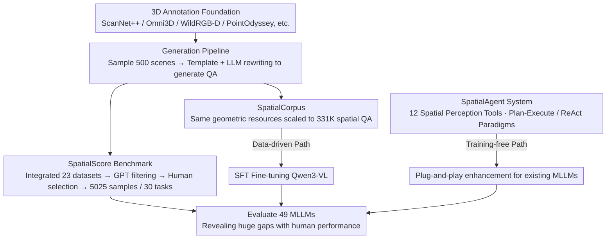

# SpatialScore: Towards Comprehensive Evaluation for Spatial Intelligence

**Conference**: CVPR 2026 Highlight  
**arXiv**: [2505.17012](https://arxiv.org/abs/2505.17012)  
**Code**: [https://github.com/haoningwu3639/SpatialScore/](https://github.com/haoningwu3639/SpatialScore/)  
**Area**: Multimodal VLM  
**Keywords**: Spatial Intelligence, Multimodal Evaluation, Spatial Reasoning, Agent Systems, Spatial Corpus

## TL;DR
This paper proposes SpatialScore, the most comprehensive multimodal spatial intelligence benchmark to date (5K samples / 30 tasks), and enhances the spatial understanding capabilities of MLLMs through two complementary paths: a data-driven SpatialCorpus (331K QA) fine-tuning scheme and a training-free SpatialAgent (12 tools).

## Background & Motivation
1. **Background**: Multimodal Large Language Models (MLLMs) perform excellently in tasks such as semantic Q&A and mathematical reasoning, but evaluations of spatial intelligence remain fragmented and limited in scope.
2. **Limitations of Prior Work**: Existing spatial benchmarks face two major issues: (i) tasks are overly simplistic, primarily focusing on coarse-grained spatial relations (e.g., object existence/location) while neglecting rigorous visual geometric perception (e.g., camera pose, dynamic perception); (ii) the evaluation scope is narrow, relying only on simple true/false questions, single-modality inputs, or individual skills, failing to comprehensively measure spatial intelligence.
3. **Key Challenge**: Traditional computer vision has mature geometric optimization tools and mathematical foundations, but these advances remain within the pure vision paradigm and lack tight integration with language and a unified evaluation protocol.
4. **Goal**: (i) To construct the most comprehensive spatial intelligence benchmark; (ii) to extensively evaluate 49 representative MLLMs; and (iii) to enhance spatial reasoning capabilities via both data-driven and Agent-based paths.
5. **Key Insight**: Integrating semantic understanding with spatial perception is viewed as the next frontier, requiring a systematic investigation into the extent to which existing MLLMs possess spatial intelligence.
6. **Core Idea**: Propose a comprehensive benchmark covering 30 tasks, coupled with a large-scale training corpus and a multi-tool Agent system, to drive the development of spatial intelligence from both evaluation and enhancement dimensions.

## Method

### Overall Architecture
This paper addresses a fundamental question: how well do current MLLMs understand space? To this end, it introduces three interlocking components. First is SpatialScore, the "ruler"—comprising 5,025 human-verified samples across real, simulated, and AIGC data sources, image and video modalities, and three Q&A formats (judgment, selection, and open-ended), decomposing spatial intelligence into 10 major categories and 30 specific tasks. Recognizing that a ruler alone is insufficient, the paper provides two paths to "elevate" model performance: a data-driven SpatialCorpus consisting of 331K spatial QA pairs for fine-tuning, and a training-free SpatialAgent that provides "scaffolding" for existing models using 12 spatial perception tools. Notably, the SpatialScore benchmark and SpatialCorpus share a common 3D annotation data foundation and question-generation pipeline, ensuring that training distributions and evaluation criteria are naturally aligned. Both enhancement paths (corpus fine-tuning and training-free Agent) are ultimately re-evaluated on SpatialScore, forming a closed "evaluation-enhancement" loop.

### Key Designs

**1. SpatialScore Benchmark: Comprehensive measurement using ground-truth 3D annotations**

Previous benchmarks suffered from shallow tasks and narrow scopes, mostly asking "is the object there?" or "is it on the left or right?" which avoids the "hard" geometric problems like camera pose or dynamic perception. SpatialScore leverages 3D data dividends: it randomly samples 500 scenes from datasets with precise 3D annotations like ScanNet++ and Omni3D, automatically generates open-ended QA based on real geometric ground truth, and uses an LLM to rewrite the questions for linguistic diversity. Simultaneously, it integrates spatial-related samples from 23 existing datasets. Finally, 5,025 high-quality samples were retained after GPT filtering and human screening by 5 volunteers. This approach preserves the geometric rigor of self-generated questions while expanding task coverage through existing datasets.

**2. SpatialCorpus Training Data: A path to real capability improvement**

Measuring without training leaves the performance gap unaddressed. SpatialCorpus scales the question-generation geometric resources to a training scale: 2D simulators are used alongside existing 3D annotations from ScanNet++, WildRGB-D, Omni3D, and PointOdyssey to batch-generate 331K multimodal spatial QA pairs. These are used for Supervised Fine-Tuning (SFT) of models like Qwen3-VL. Since it shares the same 3D data foundation as the benchmark, the training distribution is aligned with the evaluation criteria, resulting in substantial gains in spatial reasoning tasks rather than simple overfitting.

**3. SpatialAgent Multi-Agent System: Patching geometric weaknesses via tools without retraining**

While fine-tuning is effective, it is computationally expensive. SpatialAgent offers a plug-and-play alternative: it does not train any weights but equips existing MLLMs with 12 specialized spatial perception tools—such as depth estimators, camera pose estimators, and motion estimators—allowing the model to "outsource" geometric calculations it cannot perform accurately. Tool invocation is managed by two reasoning paradigms: Plan-Execute decomposes tasks into hierarchical sub-tasks to call tools sequentially (suitable for clear workflows), while ReAct interleaves reasoning and action to call tools iteratively (suitable for tasks requiring active perception). Dynamically switching between these paradigms enhances spatial understanding without weight updates, complementing the "thorough but heavy" SpatialCorpus approach.

### Loss & Training
SpatialCorpus fine-tuning follows the standard Supervised Fine-Tuning (SFT) paradigm. SpatialAgent is a training-free solution and does not involve additional loss function design.

## Key Experimental Results

### Main Results

| Model | Overall | Mental Anim. | Counting | Depth Est. | Obj-Dist | Camera |
|------|---------|-------------|----------|------------|----------|--------|
| Human | 86.60 | 96.87 | 89.72 | 82.33 | 78.96 | 86.89 |
| GPT-5 (Text-only) | 30.62 | 18.79 | 20.34 | 29.36 | 24.20 | 32.01 |
| Qwen3-VL-2B | 41.41 | 35.35 | 52.74 | 34.64 | 35.42 | 30.59 |
| InternVL3-1B | 33.03 | 26.85 | 47.69 | 24.74 | 24.02 | 25.71 |

### Ablation Study

| Configuration | Key Metric | Description |
|------|---------|------|
| Qwen3-VL + SpatialCorpus | Significant Overall Increase | Data-driven fine-tuning is effective |
| SpatialAgent (Plan-Execute) | Significantly outperforms base model | Training-free paradigm is feasible |
| SpatialAgent (ReAct) | Complementary to Plan-Execute | Suitable for iterative reasoning scenarios |

### Key Findings
- Even the strongest existing models fall far short of human performance on SpatialScore (86.60 vs. ~50+ max), indicating that spatial intelligence remains a major challenge.
- Text-only GPT-5 performs near random levels (30.62 vs. 28.29), confirming the necessity of visual information for spatial reasoning.
- Both SpatialCorpus fine-tuning and the SpatialAgent system significantly improve performance and are complementary.
- Camera pose and motion-related tasks are the most challenging, showing the largest gap between models and humans.

## Highlights & Insights
- **Unprecedented Evaluation Scale**: Systematic evaluation across 30 tasks, 5,025 samples, and 49 models provides a solid foundation for spatial intelligence research.
- **Dual-path Enhancement Strategy**: The data-driven and training-free Agent schemes complement each other and can be chosen flexibly based on the scenario.
- **3D Data Reuse Pipeline**: The workflow for converting 3D annotations into QA formats is transferable to other domains.

## Limitations & Future Work
- The benchmark primarily focuses on static evaluation and lacks assessment of interactive spatial reasoning.
- The Agent system depends on the accuracy of external tools; tool failures can cause cascading errors.
- Future work could extend to real-world scenario evaluation for embodied AI and autonomous navigation.

## Related Work & Insights
- **vs. VSI-Bench/STI-Bench**: These benchmarks cover only a small number of tasks and formats; SpatialScore comprehensively surpasses them in scale and diversity.
- **vs. OmniSpatial**: While OmniSpatial has many tasks (50), its sample size is small (1,533). SpatialScore is superior in terms of quality and balance.

## Rating
- Novelty: ⭐⭐⭐⭐ Significant contribution through systematic integration and a newly constructed benchmark, though core technical innovation is incremental.
- Experimental Thoroughness: ⭐⭐⭐⭐⭐ Evaluation of 49 models plus human baselines and multi-path verification.
- Writing Quality: ⭐⭐⭐⭐⭐ Clear structure and detailed data.
- Value: ⭐⭐⭐⭐⭐ Important infrastructural work for the field of spatial intelligence.

<!-- RELATED:START -->

## Related Papers

- [\[CVPR 2026\] Is your VLM Sky-Ready? A Comprehensive Spatial Intelligence Benchmark for UAV Navigation](is_your_vlm_sky-ready_a_comprehensive_spatial_intelligence_benchmark_for_uav_nav.md)
- [\[CVPR 2026\] Scaling Spatial Intelligence with Multimodal Foundation Models](scaling_spatial_intelligence_with_multimodal_foundation_models.md)
- [\[ICLR 2026\] SpaCE-10: A Comprehensive Benchmark for Multimodal Large Language Models in Compositional Spatial Intelligence](../../ICLR2026/multimodal_vlm/space-10_a_comprehensive_benchmark_for_multimodal_large_language_models_in_compo.md)
- [\[CVPR 2026\] SpatialTree: How Spatial Intelligence Branches Out in MLLMs](spatialtree_how_spatial_intelligence_branches_out_in_mllms.md)
- [\[CVPR 2026\] Abstract 3D Perception for Spatial Intelligence in Vision-Language Models](abstract_3d_perception_for_spatial_intelligence_in_vision-language_models.md)

<!-- RELATED:END -->
