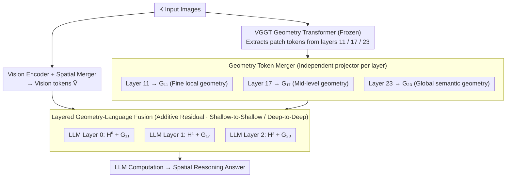

# SpatialStack: Layered Geometry-Language Fusion for 3D VLM Spatial Reasoning

**Conference**: CVPR2026  
**arXiv**: [2603.27437](https://arxiv.org/abs/2603.27437)  
**Code**: [https://spatial-stack.github.io/](https://spatial-stack.github.io/)  
**Area**: Multimodal VLM  
**Keywords**: 3D Spatial Reasoning, Geometry-Language Fusion, Hierarchical Feature Fusion, VLM, VGGT

## TL;DR
The SpatialStack framework is proposed to inject multi-layer geometric features from a multi-view geometry encoder (VGGT) layer-by-layer into different layers of an LLM decoder (rather than fusing only the last layer). Through hierarchical alignment—shallow layers for fine-grained spatial perception and deep layers for high-level semantic reasoning—it achieves open-source SOTA on multiple 3D spatial reasoning benchmarks.

## Background & Motivation
Large Vision-Language Models (VLMs) still exhibit significant weaknesses in 3D spatial reasoning, failing to reliably encode 3D geometric structures and spatial relationships. Existing methods such as Spatial-MLLM, VG-LLM, and VLM-3R integrate end-to-end geometry encoders (e.g., DUST3R, VGGT) into VLMs but **only fuse features from the last layer** of the geometry encoder with vision encoder features.

**Key Challenge**: Geometry encoders like VGGT employ a DPT architecture that explicitly extracts multi-level representations from different Transformer layers to recover detailed geometric information. Relying solely on the last layer discards rich hierarchical geometric cues from intermediate layers: shallow layers retain sharp local structures and geometric boundaries, while deep layers produce over-homogenized activations. Experiments validate this finding: injecting shallow geometric features benefits low-level perception tasks (depth estimation, distance comparison), while deep features benefit high-level reasoning (cross-view relationship reasoning).

**Key Finding**: Simply concatenating multi-layer geometric features into the vision path (naive multi-layer fusion) leads to **feature interference rather than synergy**, resulting in performance inferior to single-layer fusion. This reveals that the true challenge lies in the **fusion strategy** rather than merely extracting multi-level features.

**Key Insight**: Fusion of geometric features is shifted from the vision encoder side to the LLM decoder side. Progressive fusion is achieved through hierarchical alignment: shallow geometry to shallow LLM layers, and deep geometry to deep LLM layers.

## Method

### Overall Architecture

SpatialStack aims to address the limitation where VLMs struggle with 3D geometry because current practices discard hierarchical cues by only using the last layer of geometry encoders. The core idea is to align outputs from different depths of the geometry encoder (VGGT, fully frozen) and inject them into different depths of the LLM decoder via additive residuals—pairing shallow geometry with shallow LLM layers and deep geometry with deep LLM layers.

The forward pass operates as follows: $K$ input images pass through a vision encoder and are compressed into vision tokens $\tilde{\mathbf{V}}$ via a spatial merger. Simultaneously, the same images pass through the VGGT geometry Transformer, where patch tokens are extracted from layers 11, 17, and 23. These three sets of geometric features are aligned to the language space via independent projectors (Geometry Token Mergers) and added to the hidden states of LLM decoder layers 0, 1, and 2. Finally, the LLM processes this fused multimodal sequence to generate answers. The modification resides exclusively in the location and method of geometric feature injection, leaving the backbone models intact.

### Key Designs

**1. Layered Geometry-Language Fusion: Shallow-to-Shallow, Deep-to-Deep**

The DPT architecture of VGGT recovers different granularities of geometry across its layers: shallow layers preserve sharp local structures, while deep layers provide homogenized global semantics. SpatialStack extracts patch tokens $\mathbf{Z}_{l_i} \in \mathbb{R}^{(KN) \times D_{\text{geo}}}$ from layers $l_i \in \{11, 17, 23\}$, projects them to the language dimension using layer-specific mergers, and injects them additively into corresponding LLM layers:

$$\mathbf{G}_{l_i} = \mathcal{M}_{\text{geo}}^{(l_i)}(\mathbf{Z}_{l_i}), \qquad \mathbf{H}^{(j)'} = \mathbf{H}^{(j)} + \mathbf{G}_{l_j}, \quad j \in \{0, 1, 2\}$$

This alignment is motivated by the fact that LLM decoders also handle low-level perception in shallow layers and high-level reasoning in deep layers. Feeding fine-grained geometry to shallow LLM layers for depth estimation and global geometry to deep layers for relationship reasoning creates a functional synergy. This is the core insight: performance is determined by "where to fuse" rather than "how many layers to fuse."

**2. Geometry Token Merger: Independent Projectors to Avoid Feature Interference**

Geometric features and LLM hidden states differ in spatial resolution and embedding dimensions. Each injection layer is equipped with an independent projector $\mathcal{M}_{\text{geo}}^{(l_i)}$ that groups and projects $2 \times 2$ patches to output $\mathbf{G}_{l_i} \in \mathbb{R}^{N' \times D_{\text{lang}}}$. Layer independence is crucial; because the abstraction levels of layer 11 and layer 23 differ significantly, sharing a projector would force them into a unified representation, causing the interference seen in naive fusion.

**3. Frozen Encoders and Instruction Tuning: Emergent Spatial Priors**

During training, both the vision encoder and the VGGT geometry encoder are frozen. Only the geometry token mergers and the LLM decoder are trained using standard next-token cross-entropy loss without auxiliary losses. This demonstrates that specialized spatial self-supervised objectives are unnecessary; proper hierarchical alignment coupled with standard instruction tuning is sufficient for spatial reasoning capabilities to emerge.

### Loss & Training
- Loss: Standard cross-entropy $\mathcal{L}_{\text{ce}} = -\sum_{i=1}^{|o|} \log P_\theta(o^{(i)} | o^{(<i)}, q, \mathcal{C})$
- Base Models: Qwen2.5-VL / Qwen3.5, Geometry Encoder: VGGT
- Training Hyperparameters: Batch size 64, Learning rate $1 \times 10^{-5}$, AdamW, warmup ratio 0.03, cosine schedule
- Training Data: Subsets of SPAR, LLaVA-Hound, ScanNet, and VSI-590K

## Key Experimental Results

### Main Results (VSI-Bench)

| Method | Rank | Avg | Obj.Count | Abs.Dist | Rel.Dist | Rel.Dir | Route Plan | Appr.Order |
|------|------|------|-----------|----------|----------|---------|------------|------------|
| GPT-4o | - | 34.0 | 46.2 | 5.3 | 37.0 | 41.3 | 31.5 | 28.5 |
| Gemini-2.5 Pro | - | 51.5 | 43.8 | 34.9 | 61.1 | 47.8 | 45.9 | 71.3 |
| SpatialStack-4B (Qwen2.5) | 2 | 60.9 | 69.2 | 45.4 | 57.9 | 68.4 | 40.2 | 79.6 |
| **SpatialStack-5B (Qwen3.5)** | **1** | **67.5** | 71.0 | **55.6** | **67.3** | **84.1** | 41.2 | **83.5** |
| Cambrian-S-3B | 3 | 57.3 | 70.7 | 40.6 | 64.8 | 61.9 | 27.3 | 78.8 |
| VG-LLM-4B | 5 | 47.3 | 66.0 | 37.8 | 44.6 | 45.6 | 33.5 | 36.4 |

### Comparison Across Benchmarks

| Method | VSI-Bench | SPAR-Bench | BLINK-Spatial | CV-Bench | Overall |
|------|-----------|------------|---------------|----------|---------|
| Qwen3.5 (fine-tuned) | 64.76 | 68.75 | **56.10** | 84.49 | 68.52 |
| GVF-L23 (VG-LLM) | 66.36 | 70.83 | 51.91 | 84.64 | 68.43 |
| GVF-L11/17/23 (naive multi) | 65.15 | 71.20 | 51.28 | 84.33 | 67.99 |
| **SpatialStack** | **67.52** | **71.39** | 52.12 | **85.53** | **69.14** |

### Ablation Study

| Configuration | Low-level Task Avg | High-level Task Avg | Description |
|------|-------------|-------------|------|
| Single Layer (L11) | **66.11** | 64.48 | Shallow best for perception |
| Single Layer (L23) | 64.33 | **66.36** | Deep best for reasoning |
| Naive Multi-layer (Vision side) | 64.69 | 65.15 | Feature interference |
| SpatialStack (LLM side) | 65.89 | 67.52 | Best of both worlds |

### Key Findings
- **Hierarchical Correspondence**: VGGT shallow layers map to fine local geometry while deep layers map to global semantic structure; this naturally corresponds to the hierarchical function of LLM decoder layers.
- **Naive Fusion Failure**: Mixing multi-layer geometric features in the vision path causes interference, performing worse than single-layer fusion.
- **Superiority over Baselines**: Using the Qwen2.5 base, SpatialStack-4B (60.9) significantly outperforms VG-LLM-4B (47.3) and Cambrian-S-3B (57.3).
- **Fusion Order Matters**: Forward alignment (shallow-to-shallow) outperforms reverse alignment, validating the hierarchy hypothesis.
- **Zero-shot Route Planning**: Despite no route planning data in the training set, SpatialStack-5B achieves 84.1 on this task, showing strong generalization.

## Highlights & Insights
- **Location Over Content**: The paper systematically argues that the location of fusion (LLM decoder vs. vision path) is more critical than the amount of geometric content injected.
- **Empirical Hierarchy Analysis**: Hierarchical correspondence is established through both qualitative (similarity maps) and quantitative (task-specific performance) analysis.
- **Simplicity of Additive Residuals**: The fusion method $H' = H + G$ is elegant and effective, avoiding complex cross-attention or gating.
- **Model-Agnostic Framework**: SpatialStack is compatible with various open-source VLMs (validated on Qwen2.5 and 3.5).

## Limitations & Future Work
- Lower performance on BLINK-Spatial compared to the base Qwen3.5 model suggests geometric injection might interfere with specific fine-grained visual perception tasks.
- Only three layers (11/17/23) were selected; more granular selection or learnable gating remains unexplored.
- Compatibility with other geometry encoders like DUST3R or CUT3R has not been tested.
- Generalization to outdoor or dynamic scenes needs further validation as training data was predominantly indoor.

## Related Work & Insights
- **vs. VG-LLM**: While VG-LLM only fuses the final layer to the vision side, SpatialStack's hierarchical LLM-side fusion improves VSI-Bench performance from 47.3 to 60.9 on the same base model.
- **vs. Cambrian-S**: SpatialStack surpasses Cambrian-S through architectural innovation without requiring additional self-supervised spatial training objectives.
- **vs. DeepStack**: SpatialStack elegantly extends the concept of stacking vision tokens in DeepStack to geometric tokens.

## Rating
- Novelty: ⭐⭐⭐⭐ The hierarchical geometry-language fusion is original, with deep insights into fusion location.
- Experimental Thoroughness: ⭐⭐⭐⭐⭐ Comprehensive testing across 4 spatial benchmarks, general benchmarks, and multidimensional ablations.
- Writing Quality: ⭐⭐⭐⭐⭐ The logical flow from qualitative analysis to quantitative validation is highly coherent.
- Value: ⭐⭐⭐⭐ Establishes a new paradigm for vision-language-geometry fusion with broad implications for multimodal design.

<!-- RELATED:START -->

## Related Papers

- [\[CVPR 2026\] G$^2$VLM: Geometry Grounded Vision Language Model with Unified 3D Reconstruction and Spatial Reasoning](g2vlm_geometry_grounded_vision_language_model_with_unified_3d_reconstruction_and.md)
- [\[CVPR 2026\] Beyond 3D VQAs: Injecting 3D Spatial Priors into Vision-Language Models for Enhanced Geometric Reasoning](beyond_3d_vqas_injecting_3d_spatial_priors_into_vision-language_models_for_enhan.md)
- [\[CVPR 2026\] Grounded 3D-Aware Spatial Vision-Language Modeling](grounded_3d-aware_spatial_vision-language_modeling.md)
- [\[CVPR 2026\] Think with 3D: Geometric Imagination Grounded Spatial Reasoning from Limited Views](think_with_3d_geometric_imagination_grounded_spatial_reasoning_from_limited_view.md)
- [\[ICML 2026\] ReVSI: Rebuilding Visual Spatial Intelligence Evaluation for Accurate Assessment of VLM 3D Reasoning](../../ICML2026/multimodal_vlm/revsi_rebuilding_visual_spatial_intelligence_evaluation_for_accurate_assessment_.md)

<!-- RELATED:END -->
