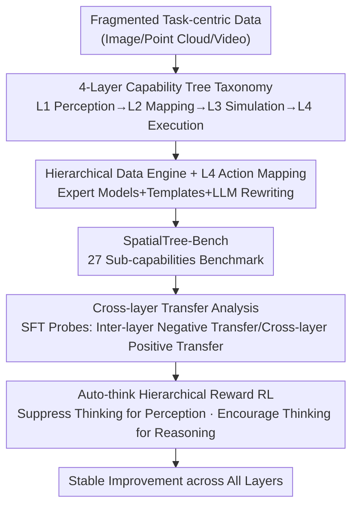

# SpatialTree: How Spatial Intelligence Branches Out in MLLMs

**Conference**: CVPR 2026  
**Paper**: [CVF Open Access](https://openaccess.thecvf.com/content/CVPR2026/html/Xiao_SpatialTree_How_Spatial_Intelligence_Branches_Out_in_MLLMs_CVPR_2026_paper.html)  
**Code**: None  
**Area**: Multi-modal VLM  
**Keywords**: Spatial intelligence, capability hierarchy, evaluation benchmark, cross-layer transfer, auto-think RL

## TL;DR
Inspired by cognitive science, this work deconstructs the spatial intelligence of Multi-modal Large Language Models (MLLMs) into 27 atomic capabilities across four layers ("Perception → Mapping → Simulation → Execution"). It introduces SpatialTree-Bench, the first "capability-centric" hierarchical benchmark. Through SFT/RL intervention experiments, the study reveals that low-layer capabilities are mutually independent but exhibit strong transfer toward high-layer ones, and excessive "thinking" can impair intuitive perception. Consequently, an "auto-think" strategy is proposed to achieve stable RL improvements across all hierarchical levels.

## Background & Motivation
**Background**: The spatial intelligence of MLLMs (perception, understanding, reasoning, and interaction with 3D space) serves as the foundation for numerous downstream capabilities. Existing evaluations have followed a "task-centric" route: starting with relative position/size estimation in single images, expanding to point cloud grounding/detection/captioning, and eventually progressing to spatio-temporal reasoning in multi-view and video settings.

**Limitations of Prior Work**: These task-centric benchmarks are **fragmented**. Spatial capabilities are treated as a collection of isolated or overlapping skills evaluated independently. This approach fails to reveal the **intrinsic structure** of these capabilities and cannot answer which capabilities are atomic, how they emerge, how they depend on each other, or how they transfer. In short, we have scores but lack an understanding of the structure of the spatial intelligence "tree."

**Key Challenge**: Diverse and overlapping task definitions make it impossible to attribute "success or failure in complex tasks" to "deficiencies in specific underlying foundation capabilities." Developing controllable and scalable spatial intelligence requires a **unified, hierarchical, and explainable** coordinate system of capabilities rather than just another task list.

**Goal**: (1) Establish a compact set of atomic capabilities and a hierarchical structure for spatial intelligence; (2) Build a benchmark covering all hierarchical levels; (3) Empirically validate dependency and transfer patterns among capabilities via training intervention (SFT/RL); (4) Identify a training paradigm that provides stable improvements across all layers.

**Key Insight**: The authors draw on classic insights from cognitive science—that intelligence is a "dynamic structure built progressively through several developmental stages" (Piaget's stages, Tolman’s cognitive maps, Kuipers' hierarchical spatial representation). They advocate for a shift from "task-centric" to "capability-centric" evaluation.

**Core Idea**: Spatial intelligence is organized into a **four-layer capability tree** (L1 Perception → L2 Mental Mapping → L3 Mental Simulation → L4 Agentic Competence), serving as a unified coordinate system to construct benchmarks, attribute capabilities, and guide the phased "growth" of spatial intelligence.

## Method

### Overall Architecture
SpatialTree is not a new model but a "taxonomy + benchmark + analysis methodology." The workflow begins by defining a **four-layer capability tree** (L1→L4, 27 sub-capabilities) rooted in basic multimodal abilities (L0). Next, a **specialized data engine** (Spatial Engine, integrating expert models, templates, and LLM rewriting) reorganizes fragmented legacy data into this tree and generates data for scarce capabilities (especially L4 agentic data) to form SpatialTree-Bench. Mainstream MLLMs are then benchmarked, using Pearson correlation to analyze dependency structures. Finally, **SFT probes** and **RL (GRPO)** are used for training intervention to verify cross-layer transfer and propose the **auto-think** reward mechanism.

### Key Designs

**1. Four-Layer Capability Tree: Reconstructing Spatial Intelligence from a "Task List" to a "Capability Coordinate System"**

To address the issue of task fragmentation and lack of structure, spatial capabilities are organized into four bottom-up layers, each emphasizing different cognitive focuses:

- **L1 Perception**: Native spatial perception independent of language, divided into 5 categories: Geometry (distance/size/shape), Motion (ego/allo motion), Orientation (gravity/object pose), Relation (topological relations like inside/outside, cross-view correspondence), and Localization (detection/grounding).
- **L2 Mental Mapping**: Aligning perception with **language**, including Understanding (spatial captioning, semantic relations, perspective taking, affordance) and Memory (synthesizing multi-frame/multi-view observations into a Cognitive Map for Memory Retrieval).
- **L3 Mental Simulation**: "Running" scenarios mentally, divided into Causal Reasoning (causal chains of geometry/dynamics/semantics) and Sequential Planning (translating causal insights into step-by-step language plans and abstract paths), naturally corresponding to CoT.
- **L4 Agentic Competence**: Grounding internal plans into real interactions with the environment (game control, robotic arm manipulation, navigation affordance), using language as the sole interface.

The significance lies in the **attributable structural hypothesis**: high-level capabilities should depend on low-level ones. All subsequent analyses test or utilize this hypothesis.

**2. Hierarchical Data Engine and L4 Action Mapping: Integrating Scarce "Agentic Capabilities"**

An engine was developed to fill the 27 capability slots (Fig. 3): L1 uses expert models (DepthAnything3, SpatialTracker, GeoCalib, OrientAnything, etc.) to extract intermediate representations for depth, correspondence, and gravity, formulated into QA via templates and LLM rewriting. L2 uses 3D reconstruction pipelines to generate BEV/cognitive maps from video. L3 applies "thought templates" to annotated reasoning QA, using LLMs to generate explicit CoT.

For **L4**, where "agentic interaction" data is scarce, the authors collected web videos across three embodiment types (game navigation, robotic grippers, human hands). The **action mapping strategy** is the key design: diverse low-level actions are **discretized into unified "high-level primitives / key-mouse action sequences"** (e.g., `[Move Down, 7cm]`, `[Gripper Close, True]`), creating an executable action space for MLLMs. Human-object interaction sequences are then manually restructured into multi-step multiple-choice questions. This results in the SpatialPlus dataset, covering L1 orientation/shape, L2 spatial captions, and L4.

**3. Cross-capability Transfer Probes: Verifying "Same-layer Conflict, Cross-layer Gain, and Synergy"**

The authors performed training interventions to validate the hierarchical hypothesis. Pearson correlation revealed that **L1 capabilities are weakly correlated (nearly orthogonal/independent)**, while **L3/L4 high-layer capabilities are strongly correlated**. Based on this, three L1 capabilities most relevant to high layers (Geom.Dist, Geom.Size, Relat.Corr) were selected for single-capability SFT (approx. 0.25M QA each, mixed 1:3 with general instruction data).

Two counter-intuitive findings emerged: **Finding 1 (Cross-layer Transfer)**—Single L1 SFT often yields zero or negative gains on the **same layer** (e.g., B+Dist. improves Geometry by +3.2 but decreases Relation by −5.8 and Local. by −4.6) but provides non-trivial gains for **higher layers** (Understanding +2.0, Goal Exec. +3.4). Distance capability even zero-shot transferred to complex in-the-wild reasoning (+36.0%) and robotic manipulation (+27.1%). **Finding 2 (Synergy)**—While any single-capability SFT provides little overall benefit, **mixed training** of the three yields an overall gain of +1.1, exceeding any single item and even the sum of their individual contributions. This confirms that low layers are stepping stones for high layers and require joint training to unlock synergy.

**4. Auto-think Hierarchical Reward: Preventing Over-thinking in "Fast" Tasks**

Using GRPO (RLVR) to boost overall spatial capability encountered a contradiction: **naive RL encouraging "extensive thinking" is unreliable**. It aids complex reasoning but **damages intuitive perception** (e.g., in numerical estimation, over-thinking reduces precision). Furthermore, single-layer RL tends to overfit its reward and fails to generalize.

The authors hypothesized that different levels require different "cognitive modes" and proposed **Hierarchy-Aware Reward (auto-think)**: for **intuitive perception** tasks (depth, counting, orientation), the **"thought process" reward is removed and a length penalty is added** to force "System 1" direct vision-to-text alignment. For **complex reasoning** tasks (navigation planning, causal reasoning), **reasoning step rewards are retained and amplified** to encourage token expenditure. Full RL@auto-think outperformed both baseline and naive GRPO on SpatialTree-Bench (e.g., Qwen2.5-VL-7B average 27.5→30.8). Since evaluations used continuous/semantic metrics while training focused on discrete MCQ rewards (with strict de-contamination), the improvement suggests internalized generalization rather than memorization. This validates the taxonomy: spatial intelligence requires direct alignment for low levels and deliberate reasoning for high levels.

## Key Experimental Results

### Main Results (SpatialTree-Bench Evaluation, Avg is Weighted Mean)

| Model | Category | Rank | Avg. | L1 Geom. | L4 Goal Exec. |
|------|------|------|------|----------|---------------|
| Gemini3-Flash | Thinking | 1 | **57.8** | 50.1 | 31.6 |
| Gemini3-Pro | Thinking | 2 | 56.5 | 54.5 | 29.9 |
| Seed1.8 | Thinking | 3 | 50.3 | 42.5 | 26.0 |
| Gemini2.5-Pro | Thinking | 4 | 50.1 | 47.8 | 28.3 |
| Qwen3VL-235B | Open-source | 8 | 40.0 | 33.9 | 28.8 |
| GPT-4o | Non-Thinking | 13 | 31.9 | 23.9 | 25.8 |
| Kimi-VL-A3B | Open-source | 20 | 24.4 | 13.8 | 15.7 |

Key Observation: Even the strongest model (Gemini3-Flash) only scores 57.8, and **L4 Goal Exec. performance is low across all models** (max 31.6), indicating that "grounding plans into real interaction" remains a common bottleneck.

### Ablation Study: Cross-capability SFT Transfer (Table 2, Relative change to Baseline in brackets)

| Configuration | Avg. | L1 Geom. | L1 Rel. | L2 Underst. | L4 Goal Exec. |
|------|------|----------|---------|-------------|----------------|
| Baseline | 25.0 | 20.9 | 28.9 | 22.6 | 22.1 |
| B+Dist. | 24.5 | 24.1 (+3.2) | 23.2 (−5.8) | 24.6 (+2.0) | 25.5 (+3.4) |
| B+Size | 23.5 | 24.3 (−3.4)⚠️ | 21.4 (−7.5) | 21.9 (−0.8) | 21.5 (−0.6) |
| B+Corr. | 25.2 | 17.6 (−3.2) | 30.2 (+1.3) | 21.9 (−0.7) | 24.7 (+2.6) |
| **B+Dist.+Size+Corr.** | **26.1** | 25.5 (+4.6) | 29.4 (+0.5) | 23.0 (+0.4) | 26.0 (+3.9) |

> ⚠️ In the B+Size row for Geom., "24.3 (−3.4)" likely contains a notation error in the original text (value increases but negative sign used); conclusions remain consistent: single-capability SFT often conflicts within the same layer, while mixed training yields the highest overall gain (+1.1).

### RL Performance Comparison (Table 3, Baseline Qwen2.5-VL-7B = 27.5)

| Configuration | Avg. | L1 Geom. | L3 Caus.Reas. | L4 Open Expl. |
|------|------|----------|----------------|----------------|
| Qwen2.5-VL-7B | 27.5 | 17.8 | 28.4 | 31.1 |
| Full RL@think | 30.1 (+2.9) | 29.7 | 33.6 | 41.7 |
| **Full RL@auto-think** | **30.8 (+3.6)** | 31.9 (+3.3) | 33.5 | 44.1 (+8.3) |

### Key Findings
- **Hierarchical Dependencies Confirmed**: L1 sub-capabilities are nearly orthogonal, while L3/L4 high layers are strongly correlated. "Capability trees" are measurable structures, not metaphors.
- **Cross-layer > Same-layer**: Single L1 SFT often causes negative transfer within its own layer but strong transfer to higher layers (e.g., Distance transfers to robotic arms at +27.1%).
- **Synergy Effect**: Mixed training of foundation capabilities exceeds the sum of individual gains.
- **Thinking is not always better**: Naive RL encouraging thought processes harms intuitive perception; auto-think stabilizes gains by switching "Fast/Slow systems" based on task layers.

## Highlights & Insights
- **Paradigm shift from "task-centric" to "capability-centric"**: Using cognitive developmental stages allows "complex task failure" to be attributed to specific underlying atomic deficiencies.
- **Practical L4 action mapping**: Discretizing heterogeneous actions into keyboard-mouse primitives allows MLLMs to be evaluated as agents via a pure language interface.
- **Auto-think as a transferable trick**: Dynamically deciding whether to reward reasoning steps based on cognitive level is applicable to any mixed training involving both intuitive and reasoning tasks.
- **Counter-intuitive insight**: Training a low-level capability often yields gains **not in its own layer but in higher layers**, suggesting that "to improve X, train X" is not always the optimal intuition.

## Limitations & Future Work
- This work is a **proof-of-concept**: RL experiments were primarily conducted on Qwen2.5-VL-7B, and L4 utilized limited embodied data.
- L4 Goal Exec. performance is extremely low (max 31.6), raising questions about the determinability of "real interaction" and whether discrete primitives lose critical control information.
- The data engine relies on expert models; potential biases or noise in these models may propagate into the benchmark.
- Transfer conclusions are based on specific SFT scales and mixing ratios; sensitivity to these factors remains to be explored in larger models.

## Related Work & Insights
- **vs. Task-centric Benchmarks (BLINK / SpatialEval / 3DSR-Bench / VSI-Bench)**: While others split by task format (image/multi-view), this work organizes 27 atomic capabilities into **cognitive layers**, enabling attribution and guided expansion.
- **vs. Spatial Fine-tuning (e.g., VST)**: While utilizing similar data mixtures, this work uses SFT/RL as **probes** to measure the structure of capability transfer rather than just for leaderboard ranking.
- **vs. VLA (Robotic Low-level Control)**: Instead of direct control signal decoding, L4 maintains a language interface, focusing more on cognitive evaluation of agentic behavior than end-to-end control.

## Rating
- Novelty: ⭐⭐⭐⭐⭐ Reconstructing spatial intelligence into a hierarchical tree is a paradigm-level innovation.
- Experimental Thoroughness: ⭐⭐⭐⭐ Evaluation of 20 MLLMs with dual SFT/RL intervention, though RL was limited to a single base model.
- Writing Quality: ⭐⭐⭐⭐ Clear motivation and findings, though minor notation errors exist in tables.
- Value: ⭐⭐⭐⭐⭐ Provides an attributable coordinate system and the auto-think paradigm for systematic multi-modal growth.

<!-- RELATED:START -->

## Related Papers

- [\[CVPR 2026\] Scaling Spatial Intelligence with Multimodal Foundation Models](scaling_spatial_intelligence_with_multimodal_foundation_models.md)
- [\[ICLR 2026\] On the Generalization Capacities of MLLMs for Spatial Intelligence](../../ICLR2026/multimodal_vlm/on_the_generalization_capacities_of_mllms_for_spatial_intelligence.md)
- [\[CVPR 2026\] SpatialScore: Towards Comprehensive Evaluation for Spatial Intelligence](spatialscore_towards_comprehensive_evaluation_for_spatial_intelligence.md)
- [\[CVPR 2026\] Is your VLM Sky-Ready? A Comprehensive Spatial Intelligence Benchmark for UAV Navigation](is_your_vlm_sky-ready_a_comprehensive_spatial_intelligence_benchmark_for_uav_nav.md)
- [\[CVPR 2026\] Abstract 3D Perception for Spatial Intelligence in Vision-Language Models](abstract_3d_perception_for_spatial_intelligence_in_vision-language_models.md)

<!-- RELATED:END -->
