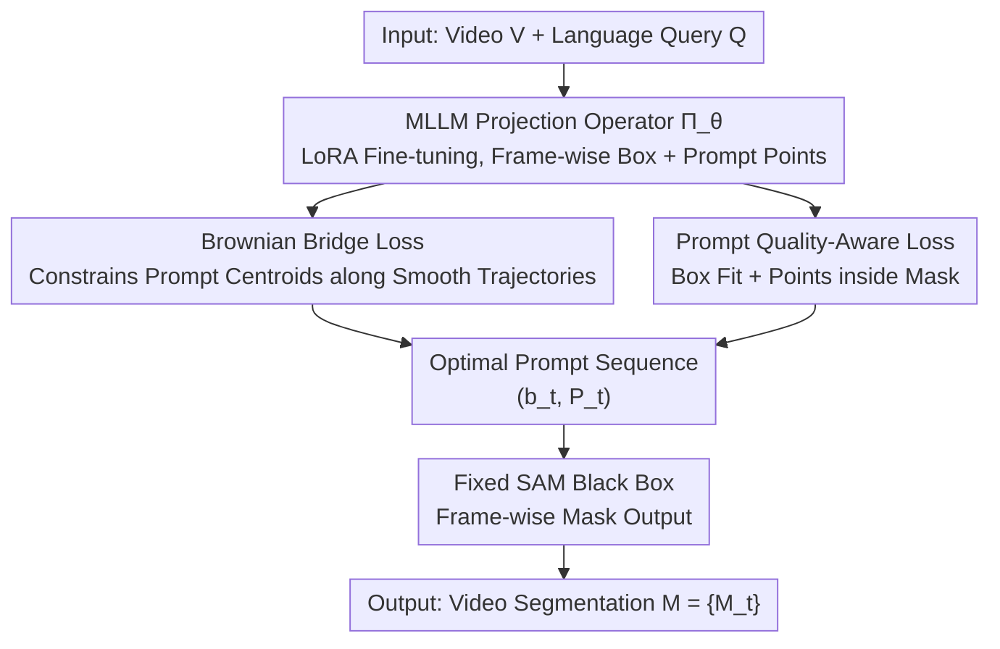

# SPOT: Spatiotemporal Prompt Optimization for Motion-Stabilized MLLM-Guided Video Segmentation

**Conference**: CVPR 2026  
**Paper**: [CVF Open Access](https://openaccess.thecvf.com/content/CVPR2026/html/Fan_SPOT_Spatiotemporal_Prompt_Optimization_for_Motion-Stabilized_MLLM-Guided_Video_Segmentation_CVPR_2026_paper.html)  
**Code**: None  
**Area**: Multimodal VLM / Video Segmentation  
**Keywords**: Referring Video Segmentation, Reasoning Video Segmentation, Prompt Optimization, Brownian Bridge, SAM

## TL;DR
SPOT does not require video pre-training for MLLMs or modifications to the SAM architecture. It constrains the "prompt point" trajectories output by image-pre-trained MLLMs through two loss functions—Brownian Bridge loss for temporal smoothness and prompt quality loss for spatial alignment. This approach allows the "MLLM-generated prompt + SAM-generated mask" cascade to surpass SOTA on six benchmarks.

## Background & Motivation
**Background**: Mainstream approaches for Referring Video Segmentation (RVOS) and Reasoning Video Segmentation (ReasonVOS) cascade MLLMs with vision foundation models like SAM. MLLMs parse language and visual semantics to output spatial prompts (foreground/background points + bounding boxes) per frame, while SAM performs pixel-level segmentation using these prompts. This pipeline performs exceptionally well on static images.

**Limitations of Prior Work**: However, these MLLMs are almost exclusively pre-trained on "static image-text pairs." Generating prompts independently frame-by-frame fails to model the motion trajectories of target objects. Consequently, prompt points jump abruptly between adjacent frames, causing severe "temporal jittering" and a loss of temporal consistency in SAM's output masks.

**Key Challenge**: To address this, existing research follows two paths: either fine-tuning/pre-training MLLMs on large-scale video-text data (computational and annotation intensive, hard to reuse foundation models) or adding complex external temporal fusion modules/memory banks (increasing system complexity and reducing generalization). Both paths attempt to force "explicit spatiotemporal understanding" into the MLLM while ignoring the physical prior of the video itself: object trajectories naturally follow motion continuity, forming a smooth spatiotemporal flow.

**Goal**: Achieve both "temporal smoothness" and "spatial accuracy" without modifying the model architecture or performing video pre-training.

**Key Insight**: The authors propose a critical judgment: static pre-trained MLLMs actually possess latent spatiotemporal reasoning capabilities. These can be activated by "regulating their output behavior" with physical motion constraints, rather than modifying the models themselves. In other words, the performance bottleneck lies in the lack of constraints during the prompt generation stage, not the foundation model architecture.

**Core Idea**: By treating SAM as a fixed black box, the problem is equivalent to "finding the optimal prompt sequence for each frame." Thus, the MLLM is reformulated as a learnable "prompt projection operator," using temporal and spatial losses to push its output toward the neighborhood of the optimal prompt set $P^*$.

## Method

### Overall Architecture
SPOT coordinates an MLLM (Qwen-VL-7B-Chat) and a fixed vision foundation model SAM (EfficientViT-XL1-SAM) for video segmentation. Given a video sequence $V=\{I_t\}_{t=1}^T$ and a language query $Q$, the system follows two stages: **Prompt Generation Stage**—the MLLM predicts a bounding box $b_t\in\mathbb{R}^4$ and a set of foreground/background prompt points $P_t=\{(x_{t,i},y_{t,i},l_{t,i})\}_{i=1}^K$ for each frame $I_t$ ($l_{t,i}\in\{0,1\}$ labels foreground/background, all points are constrained within $b_t$); **Mask Generation Stage**—SAM consumes $(I_t,b_t,P_t)$ to output $M_t=\mathrm{SAM}(I_t,b_t,P_t)$ frame-by-frame.

The key reformulation is: SAM is a fixed, non-differentiable black box, and the output depends solely on the input prompt. Therefore, the learning objective $F:(V,Q)\mapsto M$ is equivalent to "finding a prompt sequence $\{(b_t,P_t)\}$ such that SAM's output approximates the ground truth mask." The authors identify two geometric properties of the optimal prompt set $P^*$: ① **Temporal Continuity**—prompts of adjacent frames must satisfy motion smoothness to avoid abrupt changes; ② **Spatial Locality**—$b_t$ covers the target, with foreground points inside and background points outside the ground truth mask. The MLLM is treated as a learnable projection operator $\Pi_\theta:(I_t,Q)\mapsto(b_t,P_t)$ fine-tuned via LoRA. LoRA's low-rank parametrization provides implicit regularization against noisy prompt overfitting. Three losses push the output trajectory toward $P^*$. The MLLM and SAM interact via two rounds of dialogue: the first yields the box, and the second samples $5\times5$ grid points within the box to determine foreground/background status. During inference, points are filtered by confidence thresholds before being fed to SAM for end-to-end mask generation, without ground truth usage or test-time optimization.

### Key Designs

**1. Re-conceptualizing MLLM as a "Prompt Projection Operator": Constraint vs. Architecture Change**

To solve the limitation where existing methods require video pre-training or external modules, SPOT reframes the problem: since SAM's output depends solely on the prompt, the root of temporal inconsistency lies in prompt generation, not the foundation model. Thus, the architectures of MLLM and SAM remain unchanged. MLLM is treated as a mapping $\Pi_\theta:(I_t,Q)\mapsto(b_t,P_t)$, aiming to push its output toward $P^*$. LoRA fine-tuning preserves semantic generalization while the projection is optimized. This "foundation" transforms a complex architecture problem into an optimization problem of adding two constraints to the MLLM output space, saving video pre-training costs.

**2. Brownian Bridge Loss: Forcing Smooth Trajectories via Endpoint-Constrained Gaussian Processes**

This is the core of the temporal dimension, targeting inter-frame jitter. The target centroid trajectory is modeled as a **Brownian Bridge** stochastic process—a Gaussian process satisfying endpoint constraints $B(0)=a, B(T)=b$. Its path minimizes the expected Dirichlet energy $\int_0^T\|\dot B(t)\|^2 dt$, physically signifying that the smoothest trajectory is the one with minimal velocity change when intermediate frames are unobserved. Since intermediate true centroids $c_t^{\text{gt}}$ are unobserved, the centroids of ground truth masks for the first and last frames of a video clip are used as endpoint priors. Any intermediate trajectory at time $t$ follows a conditional Gaussian $\mathcal{N}(\mu_t,\Sigma_t)$, where $\mu_t=(1-\alpha_t)c_{t_0}^{\text{gt}}+\alpha_t c_{t_0+T_s-1}^{\text{gt}}$ and $\Sigma_t=\sigma^2\alpha_t(1-\alpha_t)I_2$, with $\alpha_t=\frac{t-t_0}{T_s-1}$ as normalized time. The loss pulls all prompt points (including positive and negative samples) toward the shared mean $\mu_t$:

$$\mathcal{L}_{\text{BBridge}}^{[t_0,t_0+T_s-1]}=\sum_{t=t_0+1}^{t_0+T_s-2}\frac{1}{K}\sum_{k=1}^{K}\frac{\|P_{t,k}-\mu_t\|_2^2}{\max(\alpha_t(1-\alpha_t),\epsilon)}$$

The clever part is the **variance-adaptive weighting** $\alpha_t(1-\alpha_t)$ in the denominator: near endpoints ($\alpha_t\to 0$ or $1$), the variance is low and weight is high, forcing precise localization; in middle frames, variance is high and weight is low, allowing reasonable motion fluctuations. This fits the uncertainty structure where endpoints have ground truth and the middle relies on smooth extrapolation. Theorem 1 in the paper provides a Bayesian interpretation: minimizing this loss is equivalent to posterior mean estimation under a Brownian Bridge prior and independent Gaussian likelihoods.

**3. Prompt Quality-Aware Loss: Bounding Box + Geometric Consistency Supervision**

This covers the spatial dimension, ensuring "spatial locality" for $P^*$. Based on SAM's sensitivity to positive point locations and tolerance to negative points, supervision focuses on whether positive points fall inside the target. The loss comprises two terms: **Bounding Box Loss** $\mathcal{L}_{\text{bbox}}^t=\mathrm{SmoothL1}(b^t,b_{\text{gt}}^t)$ for coarse localization, and **Geometric Consistency Hard Supervision** $\mathcal{L}_{\text{class}}^t$ which applies binary cross-entropy to ground truth labels of prompt points. Point coordinates are rounded and clipped to pixel positions to query the ground truth mask $y_{t,i}^{\text{gt}}=M_{\text{gt}}^t(u_{t,i},v_{t,i})$, then supervised using the MLLM's continuous logits $z_{t,i}$:

$$\mathcal{L}_{\text{class}}^t=-\sum_{i=1}^{K}\big[y_{t,i}^{\text{gt}}\log\sigma(z_{t,i})+(1-y_{t,i}^{\text{gt}})\log(1-\sigma(z_{t,i}))\big]$$

The combination is $\mathcal{L}_{\text{quality}}^t=\mathcal{L}_{\text{bbox}}^t+\mathcal{L}_{\text{class}}^t$. "Hard supervision" refers to using logits for differentiable signals during training, though SAM uses discrete labels during inference. Points inside the mask are encouraged toward high foreground logits. Minimizing $\mathcal{L}_{\text{quality}}$ aligns with maximizing SAM's performance.

### Loss & Training
The total loss is a triple-constraint optimization. In addition to the temporal and spatial terms, a standard autoregressive **Textual Alignment Loss** $\mathcal{L}_{\text{text}}^t=-\sum_j\log p_\theta(w_j\mid I_t,Q,w_{<j})$ is added to supervise the MLLM's structured text response (including `<box>` and labels), preserving language understanding. For each sampled segment $[t_0,t_0+T_s-1]$:

$$\mathcal{L}_{\text{total}}=\sum_{t=t_0}^{t_0+T_s-1}\big(\mathcal{L}_{\text{quality}}^t+\lambda_{\text{text}}\mathcal{L}_{\text{text}}^t\big)+\lambda_{bb}\mathcal{L}_{\text{BBridge}}^{[t_0,t_0+T_s-1]}$$

Semantic constraints ensure generalization, geometric constraints ensure per-frame spatial accuracy, and temporal constraints ensure cross-frame smoothness. Optimal weights are $\lambda_{\text{bb}}=0.1$ and $\lambda_{\text{text}}=0.5$.

## Key Experimental Results

### Main Results
On three major RVOS datasets, SPOT-13B leads significantly (J&F↑):

| Dataset | Metric | SPOT-13B | Prev. SOTA | Gain |
|--------|------|----------|----------|------|
| Ref-YouTube-VOS | J&F | 71.8 | 69.2 (SAMWISE) | +2.6 |
| Ref-DAVIS-2017 | J&F | 77.2 | 74.9 (DTOS-9B) | +2.3 |
| MeViS | J&F | 51.2 | 49.5 (SAMWISE) | +1.7 |
| A2D-Sentences | IoU(Overall) | 82.2 (7B) | 81.1 (DsHmp) | +1.1 |
| JHMDB-Sentences | IoU(Overall) | 75.0 (7B) | 73.9 (DsHmp) | +1.1 |

On the more challenging ReVOS (Reasoning Video Segmentation), SPOT-13B achieved an Overall J&F of 54.8 and a stability metric R of 18.0, significantly outperforming VISA-13B (50.8 / 15.1):

| Method | Referring J&F | Reasoning J&F | Overall J&F | R (Stability) |
|------|---------------|---------------|-------------|-----------|
| VISA-7B | 51.0 | 43.2 | 47.1 | 15.3 |
| VISA-13B | 57.4 | 44.2 | 50.8 | 15.1 |
| SPOT-7B | 59.3 | 46.0 | 52.7 | 16.5 |
| SPOT-13B | 61.5 | 48.0 | 54.8 | 18.0 |

### Ablation Study
On Ref-YouTube-VOS (SPOT-7B, Full J&F 70.5):

| Configuration | J&F | Description |
|------|------|------|
| Full Model | 70.5 | Complete model |
| w/o $\mathcal{L}_{\text{BBridge}}$ | 65.2 | No temporal constraint, -5.3% |
| w/o $\mathcal{L}_{\text{quality}}$ | 62.7 | No spatial constraint, -7.8% (largest drop) |
| w/o $\mathcal{L}_{\text{text}}$ | 67.8 | No text alignment, moderate drop |
| MLLM + SAM 2 (w/o Eq.10) | 66.9 | Lower than original SAM + our constraints |

Ablations for Brownian Bridge variants verify necessity of "variance-adaptive weighting" and "intermediate frame modeling":

| Variant | J&F | Description |
|------|------|------|
| Full (Adaptive) | 70.5 | Complete |
| Constant Weight ($\lambda_t=1$) | 68.7 | Uniform weight ignores frame-wise uncertainty, -1.8% |
| Endpoint Supervision Only | 67.3 | No intermediate modeling, further drop |
| w/o Brownian Bridge | 65.2 | Completely removed |

### Key Findings
- **Spatial constraints are most critical**: Removing $\mathcal{L}_{\text{quality}}$ drops performance by 7.8%, more than the 5.3% from the temporal loss, indicating that "pinning positive points to the target" is primary for SAM.
- **Jitter stems from prompts, not architecture**: Original SAM + SPOT constraints (70.5) outperforms "MLLM + SAM 2 streaming memory" (66.9), refuting the assumption that SAM 2's architecture is required for temporal consistency.
- **Variance adaptation is a key trick**: High weight for endpoints and low weight for the middle frame in the denominator aligns with physical intuition.
- Weight sensitivity: J&F peaks at $\lambda_{\text{bb}}=0.1, \lambda_{\text{text}}=0.5$; excessive $\lambda_{\text{bb}}$ damages semantic reasoning.

## Highlights & Insights
- **Reframing video temporal issues as prompt optimization**: The core insight is that since SAM is a fixed black box and consistency depends on prompt generation, the bottleneck is in the prompts. This reframe is clean and transferable to any "frozen foundation model + learnable prompt generator" system.
- **Using Brownian Bridge to transform "missing supervision" into "minimal energy smooth paths"**: Providing only two ground truth endpoints creates a trajectory prior with uncertainty for intermediate frames. 
- **The "Train with logits, Infer with discrete labels" strategy**: Using continuous logits for differentiable BCE during training while providing discrete points during inference ensures differentiability while matching the SAM interface.

## Limitations & Future Work
- **Endpoint dependence on G.T.**: Brownian Bridge priors rely on the first and last frame ground truth masks. If these are poorly localized or the target is occluded, the entire trajectory prior might be biased. ⚠️
- **Simplicity of centroid trajectory**: Brownian Bridge constrains centroids; it might over-smooth rapid deformations, splitting/merging, or sharp turns.
- **Ambiguity in stability metric R**: The exact formula for R in ReVOS was not explicitly defined in the provided text.

## Related Work & Insights
- **vs VISA / VideoLISA (Video pre-trained MLLMs)**: These micro-tune MLLMs on video-text to embed temporal capacity. SPOT uses image-pre-trained MLLMs + output constraints, surpassing them on ReVOS while maintaining zero-shot generalization.
- **vs SAMWISE / RefSAM (Foundation model cascade)**: Both use the MLLM+SAM paradigm, but lack explicit temporal trajectory constraints for prompts.
- **vs SAM 2 (Streaming memory for temporal)**: SAM 2 relies on architecture-internal memory. SPOT proves that "temporal consistency" can be redefined as a "prompt generation quality" issue rather than an "architectural capacity" issue.

## Rating
- Novelty: ⭐⭐⭐⭐⭐ 
- Experimental Thoroughness: ⭐⭐⭐⭐ 
- Writing Quality: ⭐⭐⭐⭐ 
- Value: ⭐⭐⭐⭐⭐ 

<!-- RELATED:START -->

## Related Papers

- [\[CVPR 2026\] Rethinking MLLM Itself as a Segmenter with a Single Segmentation Token](rethinking_mllm_itself_as_a_segmenter_with_a_single_segmentation_token.md)
- [\[CVPR 2025\] Efficient Motion-Aware Video MLLM](../../CVPR2025/multimodal_vlm/efficient_motion-aware_video_mllm.md)
- [\[CVPR 2026\] Better, Stronger, Faster: Tackling the Trilemma in MLLM-based Segmentation with Simultaneous Textual Mask Prediction](better_stronger_faster_tackling_the_trilemma_in_mllm-based_segmentation_with_sim.md)
- [\[CVPR 2026\] ReMoRa: Multimodal Large Language Model based on Refined Motion Representation for Long-Video Understanding](remora_multimodal_large_language_model_based_on_refined_motion_representation_fo.md)
- [\[CVPR 2026\] Spot The Ball: A Benchmark for Visual Social Inference](spot_the_ball_a_benchmark_for_visual_social_inference.md)

<!-- RELATED:END -->
