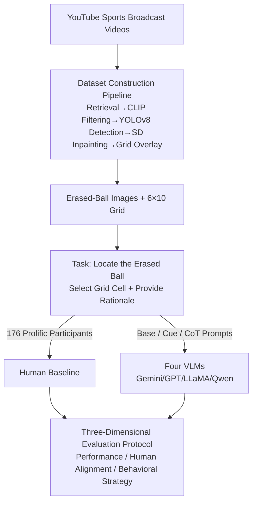

# Spot The Ball: A Benchmark for Visual Social Inference

**Conference**: CVPR 2026  
**Paper**: [CVF Open Access](https://openaccess.thecvf.com/content/CVPR2026/html/Balamurugan_Spot_The_Ball_A_Benchmark_for_Visual_Social_Inference_CVPR_2026_paper.html)  
**Code**: None (The original text mentions inference and evaluation code on GitHub, and 3,000 extended images on HuggingFace, but no specific URLs were provided; ⚠️ refer to the original paper)  
**Area**: Multimodal VLM  
**Keywords**: Visual Social Inference, VLM benchmark, Theory of Mind, Gaze/Pose Cues, Human-AI Gap

## TL;DR
This paper introduces the SPOT THE BALL benchmark: humans and VLMs are tasked with inferring the location of a ball from sports images where it has been erased. The study finds that while humans rely on social cues like player gaze and pose—achieving 2–3x the accuracy of models—four leading VLMs only utilize superficial spatial heuristics like "guessing the center" or "near players," exposing systematic deficiencies in current VLMs regarding visual social inference.

## Background & Motivation
**Background**: Humans excel at "visual social inference"—inferring unseen information from subtle behavioral cues such as gaze direction, body posture, and orientation. This ability is rooted in the Theory of Mind (ToM). Existing social inference benchmarks are predominantly text-based (ToM, empathy, moral reasoning, negotiation, etc.), while the few visual benchmarks either present fully visible scenes or focus on inferences of inanimate objects under physical occlusion.

**Limitations of Prior Work**: Text-only social inference may rely on language pattern matching without true perceptual grounding. Existing visual benchmarks lack a systematic evaluation of whether models can infer hidden information purely through visual social cues. That is, no benchmark has systematically assessed VLM performance in "partially observable + intent-reading" settings that mirror everyday human social interaction.

**Key Challenge**: It is difficult to cleanly separate "social inference" from "physical/common-sense inference." In most tasks, models can exploit object attributes or world knowledge, making it unclear whether they are truly reading human intent or simply memorizing rules.

**Goal**: Construct a task where "getting it right" necessitates interpreting the psychological states of people in the scene (gaze, pose, attention), thereby isolating pure visual social inference capabilities and quantifying the gap between humans and VLMs.

**Key Insight**: The authors adapt the classic newspaper game "Spot the Ball"—erasing the ball from sports images and asking participants to guess its location. Ball sports are ideal testbeds: player gaze, posture, and positioning are **causally coupled** with the ball's location, providing interpretable social signals. Using static images further decouples social inference from motion dynamics.

**Core Idea**: Use "locating an erased ball" as a proxy task. Since the ball's position cannot be determined from the object itself, it must be inferred from the intent and attention of the players, making visual social inference the only viable solution.

## Method
As a benchmark paper, the "Method" consists of two parts: **how the controlled test images were created (Dataset Construction)** and **the metrics and protocols used to decompose the human-model gap (Evaluation Design)**.

### Overall Architecture
The task definition is straightforward: given a sports image with the ball erased and an overlaid $6\times10$ alphanumeric grid (rows A–F, columns 1–10), both humans and models must select the grid cell most likely to contain the ball (e.g., "B6") and provide a textual rationale. Predictions are compared against the ground truth set of cells that covered the original ball; adjacent cells overlapping the ball area are also considered correct.

The authors established two parallel tracks: a **scalable data construction pipeline** (from YouTube videos to grid-overlaid erased-ball images) and a **three-dimensional evaluation protocol** (Task Performance / Human Alignment / Behavioral Strategy), incorporating three prompting strategies and a human baseline for comparison.

### Key Designs

**1. Erased Ball Localization: Making "Intent Reading" the Only Solution**

This task design directly addresses the challenge of isolating social inference. Once the ball is erased, no physical evidence remains in the image. Models cannot succeed by identifying the ball itself. Since player gaze, pose, and positioning are causally coupled with the ball in sports, **the only reliable cues are where the players are looking, facing, and directing their attention.** This distinguishes the task from occlusion or physical reasoning benchmarks, where hidden object locations can be inferred from physical properties. Static images are used to strip away motion dynamics, ensuring models cannot cheat via physical extrapolation of trajectories.

**2. Scalable Data Pipeline: Modular Creation of Artifact-Free Images**

To ensure high-quality evaluation and scalability, the authors designed a four-step modular pipeline. First, broadcast footage is retrieved from YouTube using action-related keywords. OpenCV decodes and samples frames at approximately 1 FPS. Second, CLIP calculates similarity between frames and prompts like "meaningful moments in a ball game" to filter frames. Third, YOLOv8 detects the players and the ball, filtering for frames where **exactly one ball is found in proximity to players but not overlapping**, ensuring context is preserved while removing ambiguous cases. Finally, Stable Diffusion inpainting erases the ball and fills the area with realistic textures and lighting. Each image is overlaid with a $6\times10$ grid, and ground truths are annotated based on the original ball's coordinates.

The value of this pipeline lies in it being **controlled and scalable**. While the manually refined evaluation set contains 150 images, the pipeline generated an additional 3,000 images for analysis. Its modularity allows for changing sports or adjusting difficulty (player density, occlusion). The 150 test images cover football, volleyball, and basketball, providing varying levels of visual density and social signal clarity.

**3. Three-Dimensional Evaluation Protocol: Decomposing the Gap**

The authors go beyond simple accuracy to characterize the gap through three dimensions. **Task Performance** uses overall accuracy and Euclidean error $d_i=\min_{g\in G_i}\lVert c(\hat y_i)-c(g)\rVert_2$ (pixel distance from prediction center to the nearest ground truth cell), the latter distinguishing "near misses" from "complete failures." **Human Alignment** uses the Wasserstein distance between model and human response distributions. **Behavioral Strategy** utilizes custom indicators to quantify model heuristics:

$$\text{NR}=\frac{1}{\sum_i T_i}\sum_{i,t}\mathbb{1}\!\left[\min_{b\in B_i}\text{dist}(p_{i,t},b)\le \epsilon D\right]$$

The Near-player Rate (NR) measures the proportion of predictions falling within a threshold ($\epsilon=0.08$ of image diagonal $D$) of any player. Overlap Rate (OR) measures predictions intersecting player bounding boxes. Center Ratio (CR) compares prediction mass within a central $3\times5$ window to the ground truth prior ($>1$ indicates center bias). Normalized entropy $\hat H(p)=-\sum_j p_j\log p_j/\log 60$ characterizes the dispersion of the prediction distribution.

**4. Prompt Strategies × Pre-registered Human Baseline**

Three model prompts were tested: Base (select the cell), Cue-Directed (hinting to focus on player pose/gaze), and Chain-of-Thought (asking about player positions/poses/gaze before predicting). Human data was collected from 150 Prolific participants via an IRB-approved, pre-registered study on OSF. Providing Cue/CoT prompts effectively **gives the model the "strategy" (look at gaze and pose)**; if models still fail, it indicates the bottleneck is the integration of social cues themselves, not a lack of task understanding.

## Key Experimental Results

### Main Results: Human Accuracy is 2–3x Higher than Models

| Dimension | Human | Four VLMs | Gap |
|------|------|----------|------|
| Accuracy (Across Sports) | 19–34% | ≤ 17% | Humans ~2–3x Models |
| Basketball Euclidean Error (px) | 68.5±40.8 | ~2x Human Error | Models fail by larger margins |
| Near-Player Prediction Rate | 65–75% | ~90% | Models rigidly stick to players |

Euclidean error (Table 2, lower is better) shows models drift significantly from ground truth. Enhanced prompts do not yield stable improvements—LLaMA's error spiked to 272.6±50.7 pixels in volleyball under CoT:

| Model | Prompt | Football | Volleyball | Basketball |
|------|------|------|------|------|
| Human | Base | 113.4±65.1 | 72.0±40.1 | 68.5±40.8 |
| Gemini | Base | 139.1±79.2 | 151.9±54.9 | 132.2±81.4 |
| GPT | Base | 135.6±79.4 | 142.7±58.5 | 127.7±69.8 |
| LLaMA | CoT | 140.2±87.1 | 272.6±50.7 | 211.4±82.6 |
| Qwen | CoT | 139.0±81.0 | 271.5±52.9 | 211.0±82.5 |

### Behavioral Analysis

A Center Ratio $R>1$ indicates center bias, while higher normalized entropy $\hat H$ suggests a more dispersed distribution:

| Sport | Agent | Center Ratio R | Normalized Entropy $\hat H$ |
|------|------|----------|------|
| Volleyball | Gemini | 1.697 | 0.721 |
| Volleyball | GPT | 1.487 | 0.710 |
| Volleyball | Human | 1.602 | 0.768 |
| Basketball | Human | 1.093 | 0.801 |
| Basketball | LLaMA | 0.510 | 0.515 |

Human entropy (~0.855) is consistently higher than models (0.698–0.808), suggesting that even when humans exhibit center bias, they spread probability across more plausible regions, whereas models collapse mass into narrow, incorrect areas.

### Key Findings
- **Discrepancies in Difficulty**: Humans perform best in basketball, then volleyball, and worst in football. Models perform similarly in basketball/football but worst in volleyball. Basketball has fewer players (~5.5) with higher resolution (~20k px/player), providing clear gaze/pose cues. In volleyball, the "near player" heuristic fails because the ball is often hit rather than held, sabotaging model performance.
- **Prompting Fails to Bridge the Gap**: Cue-Directed prompts offer inconsistent gains, while CoT occasionally degrades performance (e.g., GPT in football). This suggests the bottleneck is **fundamental social cue integration**, not task comprehension.
- **Emphasis on Pose over Gaze**: Similarity analysis shows model rationales align more with "pose" templates than "gaze" templates. While CoT increases model mentions of gaze, **this textual shift does not translate into higher accuracy**.
- **Not a Task Understanding Bottleneck**: Providing models with the same visual examples shown to humans actually decreased model performance across all sports.
- **Three Common Failure Modes**: Ignoring gaze (ignoring strong visual evidence), role confusion (misidentifying the player with the ball), and default center-guessing (placing predictions at the geometric center, such as on a volleyball net).

## Highlights & Insights
- **Turning Games into Measurable Tasks**: "Spot the Ball" is an ingenious setup—it ensures that correct answers require reading intent, cleanly isolating social inference from world knowledge.
- **Diagnostic Evaluation**: The use of NR/OR/CR/Entropy allows for a quantitative diagnosis of "why" models fail (e.g., superficial heuristics), rather than just reporting low accuracy.
- **Refuting Textual Mimicry**: The finding that CoT improves rationales without improving accuracy is a critical warning: "sounding human" is not equivalent to "reasoning like a human."
- **Scalable Pipeline as an Asset**: The CLIP+YOLOv8+SD pipeline enables future controlled ablation studies (e.g., synthesizing environments to isolate pose vs. gaze contributions).

## Limitations & Future Work
- **Lack of Motion Dynamics**: By design, static images exclude temporal cues ("where the ball is flying"); extending this to video is a future direction.
- **Coarse Grid Resolution**: The $6\times10$ grid limits the precision of spatial error analysis.
- **Causal Isolation of Cues**: Future work could use synthetic environments (e.g., Google Research Football) to strictly decouple the contributions of pose vs. gaze.
- **Human Expertise**: Human familiarity with specific sports was not accounted for as a covariate.

## Related Work & Insights
- **vs. Text-Only Social Inference**: Unlike text-based benchmarks, this task requires perceptual grounding to extract social signals from pixels.
- **vs. Video Social Inference**: This benchmark isolates social inference from motion dynamics by using static images.
- **vs. Physical Reasoning**: While physical benchmarks rely on object properties, the ball's location here can only be inferred from the psychological states of agents.

## Rating
- Novelty: ⭐⭐⭐⭐⭐ The "Spot the Ball" setup elegantly isolates visual social inference into a quantifiable proxy task.
- Experimental Thoroughness: ⭐⭐⭐⭐ Extensive human baselines and multi-dimensional behavioral metrics, though the model/prompt search space could be broader.
- Writing Quality: ⭐⭐⭐⭐⭐ Clear progression from motivation to failure mode analysis.
- Value: ⭐⭐⭐⭐ Exposes a systematic weakness in VLMs with implications for embodied AI and safety-critical applications.

<!-- RELATED:START -->

## Related Papers

- [\[CVPR 2026\] Interpretable Debiasing of Vision-Language Models for Social Fairness](interpretable_debiasing_of_vision-language_models_for_social_fairness.md)
- [\[CVPR 2026\] Multi-speaker Attention Alignment for Multimodal Social Interaction](multi-speaker_attention_alignment_for_multimodal_social_interaction.md)
- [\[ACL 2025\] Multimodal Coreference Resolution for Chinese Social Media Dialogues: Dataset and Benchmark Approach](../../ACL2025/multimodal_vlm/multimodal_coreference_resolution_for_chinese_social_media_dialogues_dataset_and.md)
- [\[CVPR 2026\] Small Object, Great Challenge: A Benchmark for Small Object Visual Grounding](small_object_great_challenge_a_benchmark_for_small_object_visual_grounding.md)
- [\[CVPR 2026\] FAVE: A Structured Benchmark for Fine-Grained Audio-Visual Temporal Evaluation in Multimodal LLMs](fave_a_structured_benchmark_for_fine-grained_audio-visual_temporal_evaluation_in.md)

<!-- RELATED:END -->
