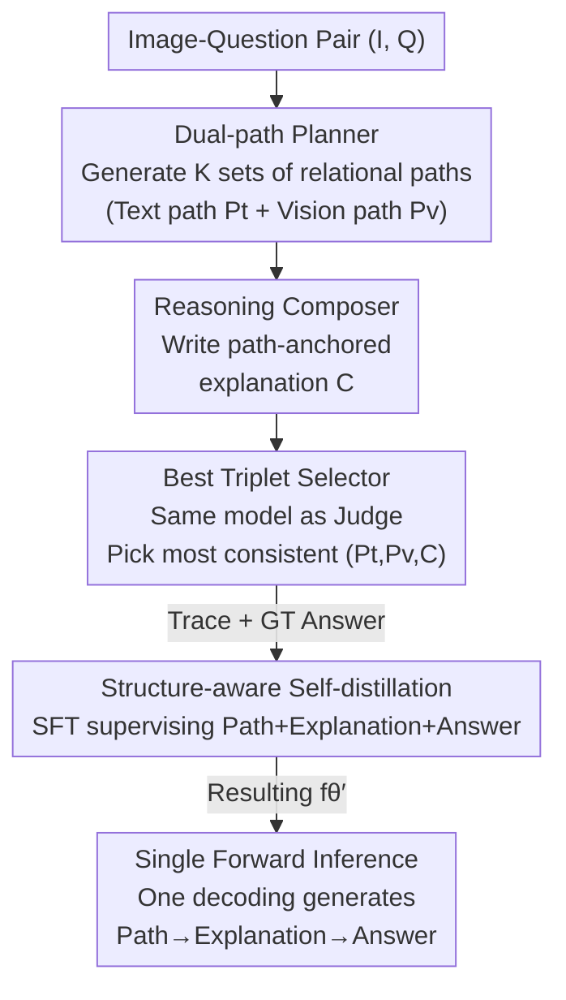

# StaR-KVQA: Structured Reasoning Traces for Implicit-Knowledge Visual Question Answering

**Conference**: CVPR 2026  
**Paper**: [CVF Open Access](https://openaccess.thecvf.com/content/CVPR2026/html/Wen_StaR-KVQA_Structured_Reasoning_Traces_for_Implicit_Knowledge_Visual_Question_Answering_CVPR_2026_paper.html)  
**Code**: None  
**Area**: Multimodal VLM  
**Keywords**: Knowledge-based Visual Question Answering, Implicit Knowledge, Structured Reasoning Traces, Relational Paths, Self-distillation

## TL;DR
StaR-KVQA utilizes a single open-source MLLM to autonomously generate "dual-path symbolic relational paths + path-anchored natural language explanations" as structured reasoning traces. It replaces answer-only supervised fine-tuning (SFT) with structure-aware self-distillation (supervising "reasoning trace + answer"). Without any external retrieval, it improves OK-VQA accuracy by +11.3% over the strongest baseline while providing auditable intermediate reasoning.

## Background & Motivation

**Background**: Knowledge-based Visual Question Answering (KVQA) requires models to both localize entities in images and invoke factual knowledge beyond the image (e.g., "What breed of dog is this?"). Traditional approaches attach external Knowledge Graphs (KG) or retrieval modules (ConceptBERT, KRISP, MAVEx, WikiLLaVA, EchoSight, etc.) to a perception backbone to supplement reasoning with retrieved facts.

**Limitations of Prior Work**: External retrieval-based pipelines involve a triple cost in real-world deployment: ① Privacy/Compliance: User images, questions, and extracted entities must be sent to third-party services or stored in external indices; ② Latency/Cost: Retrieval and evidence fusion are expensive at scale and fluctuate with index timeliness and domain shifts; ③ Poor Reliability: In multi-stage designs, errors in identification or retrieval propagate through the pipeline, making evidence fusion fragile and failures difficult to audit. This necessitates **Implicit-Knowledge KVQA (IK-KVQA)**, which disables all external knowledge sources and forces the MLLM to answer based solely on $(I, Q)$ and parameterized knowledge: $\hat{a} = f_\theta(I, Q)$.

**Key Challenge**: IK-KVQA shifts the bottleneck from "retrieving knowledge" to "eliciting, organizing, and verifying internal knowledge." However, existing IK-KVQA methods mostly rely on **answer-only SFT**: the reasoning process remains a black box, with intermediate descriptions being missing, weakly correlated, or inconsistent. Standard SFT also tends to overfit to in-domain patterns, failing under distribution shifts. In essence, the model may "guess the right answer for the wrong reasons."

**Goal**: Inject a stronger inductive bias than "answer-only" into IK-KVQA under the constraints of no external retrievers/verifiers/KBs and single-forward-pass inference, achieving both higher accuracy and transparent, auditable intermediate reasoning.

**Key Insight**: The authors observe that **relations are more stable than entities**. While specific entities vary infinitely, the semantic relations between them (e.g., `dog.color → dog.size → dog.breed`) share a compact ontology that aligns with object-level/scene-level attributes in both text and vision. Thus, "symbolic relational paths" can serve as a low-dimensional, discrete **planning scaffold** to guide the model toward relevant entities and attributes without locking reasoning into a single fixed chain.

**Core Idea**: Use a single open-source MLLM to generate "dual-path relational paths + path-anchored explanations" as **structured reasoning traces**. Augment the training set with these traces offline and perform **structure-aware self-distillation**, upgrading from "distilling answers" to "distilling structured intermediate reasoning."

## Method

### Overall Architecture

The core of StaR-KVQA is the **exclusive use of a single MLLM$_\phi$** (e.g., Qwen2.5-VL-7B) to play three roles: a "Planner" to generate relational paths, a "Composer" to write explanations based on paths, and a "Judge" to select the most consistent triplet. These self-generated reasoning traces and ground-truth answers form an augmented training set for fine-tuning $f_\theta'$. The trace construction is **offline**; at inference time, a single autoregressive decoding step produces "Path → Explanation → Answer" without calling any external modules.

Formally, for a training pair $(I_{tr}, Q_{tr})$: $K$ candidate dual-path pairs $\{(P_t^{(k)}, P_v^{(k)})\}$ are generated, each paired with an explanation $C^{(k)}$. A selector picks the optimal triplet $T_{b^*} = (P_t^{b^*}, P_v^{b^*}, C^{b^*})$, which, along with answer $a_{tr}$, forms the augmented sample for token-level cross-entropy fine-tuning.

### Key Designs

**1. Dual-path Planner: Decomposing Cross-modal Reasoning into Stable "Text-side" and "Vision-side" Paths**

The planner addresses the lack of explicit guidance on which entities/attributes to examine in IK-KVQA. A frozen MLLM$_\phi$ generates $K$ candidate path pairs $\{(P_t^{(k)}, P_v^{(k)})\} = \text{Planner}_\phi(I, Q)$ for $(I, Q)$. The **text path** $P_t$ captures semantic associations and linguistic priors from question $Q$, while the **vision path** $P_v$ encodes attributes and relations anchored in image $I$. For "What breed is this dog?", a candidate might be $P_v$: `dog.color → dog.coat_length → dog.size` and $P_t$: `dog.size → dog.breed_group → dog.breed`.

Relational paths are used instead of entities because relations are low-dimensional, discrete, and reusable, acting as "soft planning prompts" to narrow the search space without strictly constraining the reasoning chain. The authors allow for noisy or redundant hops, treating them as "imperfect but useful scaffolds" refined by the selector and distillation.

**2. Reasoning Composer: Grounding Explanations in Symbolic Paths**

To provide coherent textual reasoning, the composer generates $C^{(k)} = \text{Compose}_\phi(I, Q, P_t^{(k)}, P_v^{(k)})$. A key feature is **explicit binding**: the explanation must (i) mention at least one attribute/relation token from $P_v$ and (ii) include at least one semantic hop from $P_t$. A **coverage score** is calculated, and candidates with very low coverage are discarded.

This binding transforms explainability into a **path-aware supervisory signal**, forcing explanations to focus on entities/attributes used in the symbolic plan and preventing "hallucinated fluency" that ignores evidence.

**3. Best Triplet Selector: Filtering Noisy Supervision via LLM-as-a-judge**

To prevent injecting noise, a selector **reuses the same MLLM$_\phi$** to rank $K$ candidates based on: (i) answer-oriented path consistency; (ii) internal coherence and conciseness; and (iii) path referencing. The primary goal is answer quality. Formally, $b^* = \arg\max_b s_\phi(I, Q, P_t^b, P_v^b, C^b)$.

This step **introduces no trainable parameters**. Using a single model family ensures that the student $f_\theta$ learns traces in a style consistent with its own generation capabilities, mitigating style mismatch and catastrophic forgetting. The selected triplet reflects what the MLLM finds most helpful for answering.

**4. Structure-aware Self-distillation + Single Forward Inference**

With the augmented set $D_{aug} = \{(I_{tr}^i, Q_{tr}^i, T_{b^*}^i, a_{tr}^i)\}$, the base $f_\theta$ is fine-tuned using token-level cross-entropy:

$$\mathcal{L}_{SFT}(\theta; D_{aug}) = -\sum_{(I,Q,T,a)\in D_{aug}} \log p_\theta(T, a \mid I, Q)$$

The target sequence concatenates $P_t, P_v, C,$ and answer $a$. Unlike standard SFT, the supervisory signal is the entire structured trajectory, providing a stronger inductive bias and suppressing shortcut dependency. At test time, $f_\theta'$ performs **single autoregressive decoding** to output $(\hat{P}_t, \hat{P}_v, \hat{C}, \hat{a})$ simultaneously.

## Key Experimental Results

**Main Results** (OK-VQA and FVQA Accuracy):

| Method (Category) | Ext. Knowledge | OK-VQA Acc.(%) | FVQA Acc.(%) |
|-------------------|----------------|----------------|--------------|
| MCAN (KG/Retrieval) | No | 44.65 | — |
| MAIL (LLM-based) | MiniGPT-4 + ConceptNet | 56.69 | — |
| Qwen2.5-VL-7B (IK Baseline) | No | 75.74 | 71.61 |
| Qwen2.5-VL-72B | No | 80.75 | 75.95 |
| GPT-4o | No | 77.86 | 72.36 |
| Gemini 2.5 Pro | No | 80.53 | 73.39 |
| CoT + SFT (Strong CoT) | No | 79.58 | 75.13 |
| SDFT (Strongest Baseline) | No | 82.56 | 75.54 |
| **StaR-KVQA$_{Qwen}$** | No | **91.51** | **82.82** |

**Key Findings**: 
- Even without external knowledge, MLLMs significantly outperform older KG-based methods. 
- StaR-KVQA achieves SOTA across backbones, surpassing Gemini 2.5 Pro. 
- **Ablation Study**: Removing dual paths or explanations leads to significant drops, confirming they are complementary. Using only one modality (vision or text path) further degrades performance.
- **Cross-domain Generalization**: Standard SFT often results in negative transfer when moving from OK-VQA to FVQA (dropping ~6-8%). In contrast, StaR-KVQA maintains a **positive transfer of +9-10%**, proving that structured trace supervision improves out-of-distribution robustness.

## Highlights & Insights
- **Single-model Trinity**: Planner, Composer, and Judge all use the same MLLM, avoiding external dependencies and minimizing style mismatch during self-distillation.
- **Explainability as Supervision**: By using coverage binding, transparency is optimized during training rather than being a post-hoc hard-coded explanation.
- **Relational Scaffolding**: Using stable relations rather than volatile entities provides a low-dimensional "soft plan" that narrows the search space while retaining reasoning flexibility.
- **Generalization**: The reversal from negative to positive transfer in cross-domain tests is the strongest evidence that structured supervision cures "shortcut learning."

## Limitations & Future Work
- **Backbone Dependency**: Since traces are self-generated, the performance ceiling is bound by the backbone's intrinsic knowledge.
- **Selector Bias**: LLM-as-a-judge may introduce self-preference noise; the chosen chains might not be the most intuitive for humans.
- **Scope**: Evaluation is primarily on OK-VQA and FVQA; performance on longer-tail or more complex multi-hop scenarios requires further study.

## Related Work & Insights
- **Comparison to Retrieval-Augmented KVQA**: StaR-KVQA provides a self-contained, low-cost, and auditable alternative for privacy-sensitive deployments.
- **Comparison to Answer-only SFT**: Structured traces provide a stronger inductive bias, effectively addressing the overfitting issues of standard SFT.
- **Comparison to SDFT**: While SDFT distills styles, StaR-KVQA distills the structured reasoning process itself.

## Rating
- Novelty: ⭐⭐⭐⭐⭐ 
- Experimental Thoroughness: ⭐⭐⭐⭐ 
- Writing Quality: ⭐⭐⭐⭐ 
- Value: ⭐⭐⭐⭐⭐ 

<!-- RELATED:START -->

## Related Papers

- [\[CVPR 2026\] VQ-VA World: Towards High-Quality Visual Question-Visual Answering](vq-va_world_towards_high-quality_visual_question-visual_answering.md)
- [\[CVPR 2026\] ChartR: Evaluating Reasoning Accuracy and Robustness in Chart Question Answering](chartr_evaluating_reasoning_accuracy_and_robustness_in_chart_question_answering.md)
- [\[CVPR 2026\] DocPrune: Efficient Document Question Answering via Background, Question, and Comprehension-aware Token Pruning](docpruneefficient_document_question_answering_via_background_question_and_compre.md)
- [\[CVPR 2026\] SEA: Evaluating Sketch Abstraction Efficiency via Element-level Commonsense Visual Question Answering](sea_evaluating_sketch_abstraction_efficiency_via_element-level_commonsense_visua.md)
- [\[CVPR 2026\] VKG-QA: Visual Knowledge Graph-based Question Answer for Large Multimodal Models](vkg-qa_visual_knowledge_graph-based_question_answer_for_large_multimodal_models.md)

<!-- RELATED:END -->
