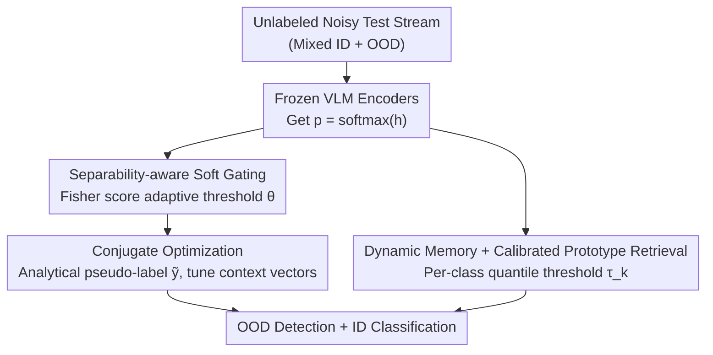

# STAR: Test-Time Adaptation Can Enhance Universal Prompt Learning for Vision-Language Models

**Conference**: CVPR 2026  
**Paper**: [CVF Open Access](https://openaccess.thecvf.com/content/CVPR2026/html/Fu_STAR_Test-Time_Adaptation_Can_Enhance_Universal_Prompt_Learning_for_Vision-Language_CVPR_2026_paper.html)  
**Code**: None  
**Area**: Multi-modal VLM  
**Keywords**: Prompt Learning, Test-Time Adaptation, OOD Detection, Conjugate Optimization, CLIP

## TL;DR
STAR enables CLIP models that have undergone few-shot prompt tuning to continue self-adapting during the inference stage using unlabeled test streams (mixing ID and OOD samples). It first uses Fisher scores for adaptive soft gating to separate ID/OOD, then generates reliable pseudo-labels via conjugate optimization for unsupervised fine-tuning, and finally utilizes a dynamic prototype library for class-calibrated OOD detection—significantly reducing FPR95 compared to LoCoOp/SCT on ImageNet-1K.

## Background & Motivation

**Background**: VLMs like CLIP align image-text pairs into the same embedding space, demonstrating strong zero-shot classification and becoming a new vehicle for OOD detection. Existing approaches follow two paths: score-based (calculating discriminative scores from logits/features, e.g., MCM, Energy, Max-Logit) without model tuning; and tuning-based, where few-shot prompt learning (LoCoOp, SCT) is most popular—fine-tuning text prompts with small labeled datasets to enhance ID vs. OOD discriminability.

**Limitations of Prior Work**: These prompt learning methods are "frozen after training," while real-world deployment involves **streaming, unlabeled, and noisy** test data with distribution shifts. Figure 1 of the paper shows that as noisy samples accumulate, prompt methods without adaptation witness a steady degradation in FPR95. Furthermore, existing test-time adaptation (TTA) methods suffer from two issues: (1) unreliable pseudo-labels due to coarse uncertainty estimation; (2) treating test samples uniformly while ignoring heterogeneity and uncertainty differences between classes, which introduces additional adaptation bias.

**Key Challenge**: In the inference stage, only unlabeled data is available. The challenge lies in using these samples for adaptation while avoiding being misled by OOD or noisy samples. Critically, there is **no reliable mechanism to separate "believable samples" from "suppressed samples"** to generate trustworthy learning signals.

**Goal**: During inference, use unlabeled mixed ID+OOD test streams to enhance prompt learning while (i) reliably distinguishing ID/OOD and (ii) performing uncertainty-aware adaptation to absorb informative samples and suppress harmful noise.

**Key Insight**: Use entropy as a coarse indicator for OOD (OOD inputs deviate from ID decision boundaries $\to$ more dispersed predictions $\to$ higher entropy). Instead of using a hardcoded threshold, use the Fisher score to adaptively find the optimal gating threshold to separate the entropy distributions; then embed this gate into a differentiable conjugate optimization to generate pseudo-labels.

**Core Idea**: Integrate "separability-aware soft gating" into "conjugate optimization" to generate reliable pseudo-labels, layered with "dynamic prototype retrieval" for class-calibrated OOD detection—ensuring prompt learning continuously self-strengthens during test-time.

## Method

### Overall Architecture

STAR is built upon a CLIP model that has already undergone few-shot prompt tuning (image/text encoders are frozen, only context vectors of prompts are tuned). During inference, unlabeled noisy test images arrive in batches. STAR follows two complementary branches that later couple: **separability-aware conjugate optimization** (responsible for "whether to learn and what pseudo-labels to learn") and **calibrated prototype retrieval** (responsible for "refining OOD boundaries per class"). These branches are coupled through the optimization process of conjugate pseudo-labels to output robust OOD detection.

Overall Data Flow: Each batch passes through frozen encoders to obtain image and text embeddings, calculating predictive probabilities $\mathbf{p}=\mathrm{softmax}(\mathbf{h})$ (where $\mathbf{h}$ is temperature-scaled cosine similarity). Entropy $H(\mathbf{p})$ and unique Fisher score adaptive thresholds are used for soft gating to partition samples into ID/OOD. Conjugate optimization then parses pseudo-labels $\tilde{\mathbf{y}}$ from $\mathbf{p}$ to update context vectors. Simultaneously, high-confidence samples are stored in a dynamic memory bank to construct class prototypes, using quantile thresholds for per-class OOD calibration.

### Key Designs

**1. Separability-aware soft gating: Adaptive entropy thresholding via Fisher score**

Applying a fixed threshold $\theta$ to predictive entropy to distinguish ID/OOD is fragile under distribution shifts. STAR first defines a hard-gating target: use cross-entropy for low-entropy (confident) samples to push them toward ID classes, and use KL divergence for high-entropy (unconfident) samples to pull them toward a uniform distribution $\mathbf{u}$ (i.e., "remain neutral"), formulated as $\mathcal{L} = -\mathbb{I}(H(\mathbf{p})<\theta)\,\mathbf{y}^\top\log\mathbf{p} + \alpha\,\mathbb{I}(H(\mathbf{p})>\theta)\,\mathrm{KL}(\mathbf{p}\|\mathbf{u})$. The threshold $\theta$ is solved adaptively as the "optimal boundary between two entropy distributions" using the Fisher score:

$$\max_{\theta} F_{\text{score}} = \max_{\theta} \frac{w_{\mathrm{ID}}\,w_{\mathrm{OOD}}\,(\mu_{\mathrm{ID}}-\mu_{\mathrm{OOD}})^2}{w_{\mathrm{ID}}\,\sigma_{\mathrm{ID}}^2 + w_{\mathrm{OOD}}\,\sigma_{\mathrm{OOD}}^2},$$

where $w_{\mathrm{ID}},w_{\mathrm{OOD}}$ are ratios of the two groups, and $\mu,\sigma^2$ are their respective mean entropy and variance. To ensure differentiability, the hard indicator $\mathbb{I}(\cdot)$ is replaced with a Sigmoid soft gate $\phi_n(\mathbf{p})=\sigma(n(\theta-H(\mathbf{p})))$, leading to the loss $\mathcal{L}_n = -\phi_n(\mathbf{p})\,\mathbf{y}^\top\log\mathbf{p} + \alpha\,(1-\phi_n(\mathbf{p}))\,\mathrm{KL}(\mathbf{p}\|\mathbf{u})$.

**2. Reliable pseudo-labels via conjugate optimization: Legendre–Fenchel reparameterization**

Soft gating only decides the "degree of trust"; the model still needs to know "what to learn" without ground truth. STAR rewrites the loss from a Legendre–Fenchel (conjugate function) perspective: let $\mathcal{L}_n = f(\mathbf{h}) - \mathbf{y}^\top g(\mathbf{h})$, where $f(\mathbf{h})=\alpha(1-\phi_n)(\log K - H(\mathbf{p}))$ and $g(\mathbf{h})=\phi_n\log\mathbf{p}$. Due to the translation invariance of softmax, $\nabla_\mathbf{h}g$ is singular in the $\mathrm{span}\{\mathbf{1}\}$ direction. The authors restrict it to the subspace $\mathcal{S}=\{\mathbf{v}\in\mathbb{R}^K\mid\mathbf{1}^\top\mathbf{v}=0\}$. Using first-order optimality conditions, the pseudo-label is analytically derived as:

$$\tilde{\mathbf{y}} = \nabla_\mathbf{z}(f\circ g^{-1})(\mathbf{z})\big|_{\mathbf{z}=g(\mathbf{h})} = \big(\nabla_\mathbf{h}g(\mathbf{h})\big|_{\mathcal{S}}\big)^{-\top}\nabla_\mathbf{h}f(\mathbf{h}),$$

which can be directly calculated from the prediction $\mathbf{p}$. This approach avoids the noise of hard pseudo-labeliing and allows for uncertainty-aware adaptation.

**3. Calibrated prototype retrieval + Dynamic memory: Per-class adaptive thresholds**

Assigning a global threshold for OOD detection ignores inter-class variance in feature distributions. STAR maintains a class-wise dynamic memory bank $\mathcal{B}=\{\mathcal{B}_k\}$ for high-confidence samples ($\bar{p}_i > \eta$, with capacity $L$). Class prototypes $\mathbf{c}_k$ are initialized with text embeddings $\mathcal{T}(\mathbf{t}_k)$ and updated via momentum: $\mathbf{c}_k^{t+1}=\beta\cdot(\text{mean of weighted image embeddings})+(1-\beta)\mathbf{c}_k^t$. During detection, the cosine similarity $s^c_{i,k}$ between a sample and its prototype is compared against a **class-specific threshold** $\tau_k$, defined as the $\gamma$ quantile (e.g., lower 5%) of similarity for that class. For classes with sparse samples, meta-clusters are used to estimate thresholds.

### Loss & Training
During inference, only context vectors of the prompt learner are optimized. The uncertainty-aware conjugate adaptation loss is used with SGD (batch size 128, learning rate 1e-4). Key hyperparameters include $\alpha=0.001$, $n=5$ (gate steepness), $\beta=0.9$ (momentum), $\gamma=0.05$ (quantile), $\rho=0.2$ (meta-cluster ratio), and a memory limit of 64 per class. The backbone is ViT-B/16 pre-tuned via LoCoOp/SCT.

## Key Experimental Results

### Main Results

ID dataset is ImageNet-1K; OOD test sets include iNaturalist, SUN, Texture, and Places. STAR has two variants: STAR$_L$ (based on LoCoOp) and STAR$_S$ (based on SCT). Below is the average result for the 1-shot setting (FPR95 lower is better, AUROC higher is better):

| Method | iNat FPR95↓ | SUN FPR95↓ | Places FPR95↓ | Avg FPR95↓ | Avg AUROC↑ |
|------|------|------|------|------|------|
| MCM (zero-shot) | 31.86 | 37.28 | 42.94 | 42.61 | 90.66 |
| CLIPN (zero-shot) | 23.94 | 26.17 | 33.45 | 31.10 | 93.10 |
| LoCoOp$_G$ (1-shot) | 19.57 | 26.26 | 36.10 | 33.08 | 91.86 |
| **STAR$_L$** | **6.28** | 22.81 | 26.77 | **27.03** | **93.64** |
| SCT$_G$ (1-shot) | 27.76 | 24.46 | 32.67 | 34.46 | 91.17 |
| **STAR$_S$** | 11.48 | **20.63** | **25.43** | **27.82** | **93.41** |

Ours (STAR$_L$) achieves a 6.05% gain in avg. FPR95 over the 1-shot LoCoOp. In the 16-shot setting, STAR$_L$ further reduces avg. FPR95 to 19.91.

### Ablation Study

Components: M1 = Separability-aware soft gating; M2 = Conjugate optimization; M3 = Test-time prompt tuning. Results are averages for iNaturalist and SUN:

| M1 | M2 | M3 | STAR$_L$ FPR95↓ | STAR$_L$ AUROC↑ | STAR$_S$ FPR95↓ | STAR$_S$ AUROC↑ |
|----|----|----|------|------|------|------|
| ✗ | ✓ | ✓ | 83.02 | 74.28 | 72.19 | 81.72 |
| ✓ | ✗ | ✓ | 87.24 | 56.26 | 81.99 | 66.54 |
| ✓ | ✓ | ✗ | 38.36 | 92.53 | 42.59 | 91.61 |
| ✓ | ✓ | ✓ | **14.55** | **97.08** | **16.06** | **96.78** |

### Key Findings
- **Conjugate optimization (M2) is most critical**: Replacing it with standard entropy minimization leads to performance collapse, as OOD samples are incorrectly learned as ID.
- **Soft gating (M1) is the second most important**: Switching to a fixed threshold degrades FPR95 significantly, proving the value of adaptive Fisher thresholds.
- **Texture dataset remains a challenge**: STAR performs slightly worse than some baselines on Texture, likely because texture-based OODs are harder to separate in CLIP's embedding space.

## Highlights & Insights
- **OOD thresholding as a Fisher Discriminant problem**: Instead of heuristic thresholds, explicitly maximizing inter-class variance of entropy is a clean and transferable strategy.
- **Analytical pseudo-labels via Conjugate perspective**: Utilizing Legendre–Fenchel transforms to derive closed-form learning signals from model predictions provides mathematical rigor and avoids the noise of hard labels.
- **Complementary Dual Learners**: The entropy-based discriminant learner and the representation-based retrieval learner address different aspects of adaptation, coupled effectively via pseudo-labels.

## Limitations & Future Work
- **Dependency on base models**: STAR serves as an enhancer; its performance ceiling is constrained by the quality of the initial prompt-tuned base like LoCoOp/SCT.
- **Numerical stability of conjugate optimization**: Matrix inversion in the analytical derivation might require careful handling during deployment, as suggested by the need for robust solvers in the paper.
- **Complexity**: Multiple hyperparameters (e.g., $\alpha, n, \beta, \gamma$) need to be balanced, though the paper claims low sensitivity for individual parameters.

## Related Work & Insights
- **vs LoCoOp / SCT**: These perform few-shot prompt tuning during training. STAR is an orthogonal enhancement that continues tuning at test-time using unlabeled data.
- **vs Traditional TTA (e.g., Tent)**: Tent-like methods minimize entropy directly, which can accidentally optimize for "confident OOD" samples; STAR's gating mechanism avoids this.
- **vs Score-based OOD (e.g., MCM)**: These use global scoring functions which are vulnerable to distribution shift, whereas STAR's per-class prototypes offer better calibration.

## Rating
- Novelty: ⭐⭐⭐⭐
- Experimental Thoroughness: ⭐⭐⭐⭐
- Writing Quality: ⭐⭐⭐⭐
- Value: ⭐⭐⭐⭐

<!-- RELATED:START -->

## Related Papers

- [\[CVPR 2026\] TTL: Test-time Textual Learning for OOD Detection with Pretrained Vision-Language Models](ttl_test-time_textual_learning_for_ood_detection_with_pretrained_vision-language.md)
- [\[CVPR 2026\] Controllable Federated Prompt Learning at Test Time](controllable_federated_prompt_learning_at_test_time.md)
- [\[CVPR 2026\] Dynamic Logits Adjustment and Exploration for Test-Time Adaptation in Vision Language Models](dynamic_logits_adjustment_and_exploration_for_test-time_adaptation_in_vision_lan.md)
- [\[CVPR 2026\] Activation Matters: Test-time Activated Negative Labels for OOD Detection with Vision-Language Models](activation_matters_test-time_activated_negative_labels_for_ood_detection_with_vi.md)
- [\[ICLR 2026\] Flatness-Guided Test-Time Adaptation for Vision-Language Models](../../ICLR2026/multimodal_vlm/flatness_guided_test-time_adaptation_for_vision-language_models.md)

<!-- RELATED:END -->
