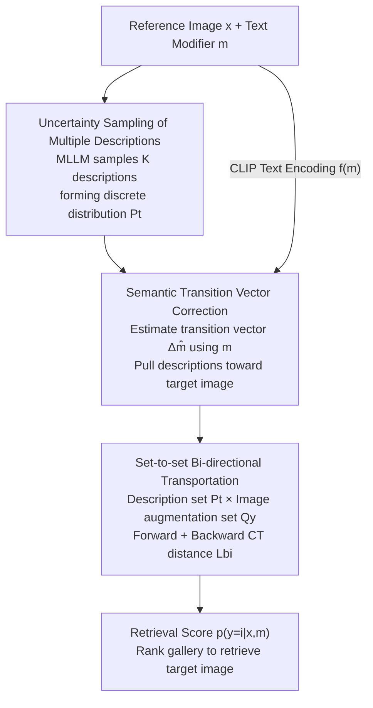

# STiTch: Semantic Transition and Transportation in Collaboration for Training-Free Zero-Shot Composed Image Retrieval

**Conference**: CVPR 2026  
**Paper**: [CVF Open Access](https://openaccess.thecvf.com/content/CVPR2026/html/Li_STiTch_Semantic_Transition_and_Transportation_in_Collaboration_for_Training-Free_Zero-Shot_CVPR_2026_paper.html)  
**Code**: https://github.com/keepgoingjkg/STiTch  
**Area**: Multimodal VLM (Composed Image Retrieval / Zero-Shot Retrieval)  
**Keywords**: Composed Image Retrieval, Zero-Shot, Training-Free, Semantic Transition Vector, Bi-directional Transportation Distance

## TL;DR
STiTch is a training-free zero-shot composed image retrieval (ZS-CIR) framework. It first leverages an MLLM to sample multiple target descriptions (treated as a discrete distribution), then constructs a "transition vector" in the embedding space using the text modifier to correct these descriptions toward the target image and filter out noise from the reference image. Finally, it models the "description set vs. target image augmentation set" as a set-to-set Bi-directional Conditional Transport (CT) distance for retrieval scoring. It achieves overall state-of-the-art performance among training-free methods on four benchmarks: CIRCO, CIRR, FashionIQ, and GeneCIS.

## Background & Motivation

**Background**: Composed Image Retrieval (CIR) addresses the triplet of "Reference Image + Text Modifier $\rightarrow$ Target Image". For example, a user provides an image and a text "change the background to snow mountains and change the number of dogs to 9," and the system retrieves matching images from a gallery. Early methods relied on millions of manually annotated triplets for supervised fusion, which suffers from poor generalization and high costs. Zero-shot routes (e.g., Pic2Word, SEARLE, LinCIR) train networks to map images into text tokens, saving triplet annotations but still requiring image-text pair training. The latest training-free routes use foundation models (captioner + LLM, or an MLLM) to fuse the reference image and modifier into a "target description," followed by calculating similarity between the description and candidate images using CLIP. This approach requires no training, is flexible during inference, and leverages the reasoning capabilities of LLMs.

**Limitations of Prior Work**: The authors identify two specific issues in the training-free "description generation $\rightarrow$ retrieval" pipeline. First is **reference image information leakage**: images have much higher information density than text. When MLLMs generate target descriptions, they often include irrelevant details from the reference image (e.g., "red jacket and sunglasses" of a person in the original image), which drowns out the core modification intent ("snow mountain"). This is termed Extraneous Cognitive Load. Second is **coarse point-to-point alignment**: existing methods either generate a single description or average multiple description features into a single point, then calculate similarity with a single image point feature. Given "an image is worth a thousand words," point-to-point matching only captures partial features and fails to grasp the complex multiple correspondences between image and text, leading to cross-modal semantic imbalance.

**Key Challenge**: The dilemma for training-free CIR lies in the fact that utilizing the strong generative power of MLLMs necessitates tolerating reference noise in descriptions, while fine-grained alignment is hindered by the limited expressiveness of single-point representations. Essentially, the **descriptions in the generation stage are not "pure" enough** and the **alignment in the retrieval stage is not "fine" enough**.

**Goal**: Under a completely training-free premise, (1) "correct" generated target descriptions toward the true target image by filtering reference noise; (2) upgrade retrieval from point-to-point to fine-grained set-to-set alignment.

**Key Insight**: The authors observe that the text modifier $m$ itself encodes incremental, high-quality, and dense relative information from the reference image to the target image. Since it shares the same text modality as the generated descriptions, it can seamlessly correct descriptions in the embedding space without introducing a modal gap or requiring extra parameters. Furthermore, MLLM decoders possess inherent uncertainty, and sampling multiple descriptions naturally transforms the "target description" into a discrete distribution.

**Core Idea**: Collaborate "Semantic Transition" and "Transportation." The former uses the modifier to construct a transition vector to pull descriptions toward the target image and denoise them. The latter models the description set and image augmentation set as two discrete distributions, using the bi-directional distance of Conditional Transport (CT) for set-to-set alignment.

## Method

### Overall Architecture
STiTch is a **one-stage, training-free** ZS-CIR framework consisting of three modules: **Querying (Multi-description Sampling) $\rightarrow$ Semantic Transition (Transition Vector Correction) $\rightarrow$ Set-to-set Alignment (Bi-directional Transportation Scoring)**. The input is a reference image $x$ and a text modifier $m$, and the output is the retrieval score $p(y=i\mid x,m)$ for each candidate image in the gallery $Y=\{y_n\}_{n=1}^N$.

Unlike previous methods that treat the target description as a "single point" $t$, STiTch treats it as a **discrete distribution** throughout the process. First, the MLLM generates $K$ descriptions through sampling, forming a text-side discrete distribution $P_t$. Then, a transition vector estimated from the modifier pulls each description toward the target image to obtain denoised $\hat{t}_k$. On the image side, $M-1$ augmentations are performed for each candidate image to form an image-side discrete distribution $Q_y$. Finally, a bi-directional transportation distance $L_{bi}(P_t, Q_y)$ replaces the original CLIP cosine similarity as the retrieval score. The entire pipeline has no trainable parameters.

### Key Designs

**1. Multi-description Uncertainty Sampling: Transforming Single-point Descriptions into Discrete Distributions**

To address the limited expressiveness of a single description, STiTch uses the inherent uncertainty of the language decoder instead of greedy decoding. Using an in-context prompt (e.g., "<in-context prompt>. <x>. Instruction:<m>. Edited Description:"), $K$ target descriptions are sampled using top-k (k=50) + top-p (p=0.8) and temperature $\tau=0.7$. This is expressed as a discrete distribution:

$$P_t = \frac{1}{K}\sum_{k=1}^K \delta_{t_k}$$

where $\delta_{t_k}$ is the point mass at the text embedding $t_k$. Intuitively, multiple valid descriptions exist for the same $(x,m)$, describing the target from different angles. Aggregating them into set $P_t$ covers the diverse visual semantics of the target image, avoiding the bias of single-point estimation.

**2. Semantic Transition Vector: Denoising and Correcting Descriptions in Embedding Space**

This is the core design addressing "reference image information leakage." The observation is that while MLLMs can describe changes, they often focus excessively on the reference image due to limited guidance from $m$, writing irrelevant visual details as noise. The ideal target description should equal "reference image embedding + incremental semantics from reference to target." This increment $\Delta m$ should be the difference $y-x$, but $y$ is unknown. The authors found that $m$ precisely encodes this high-quality relative information. Thus, the CLIP text encoder $f$ is used to encode $m$ as the estimated transition vector:

$$\Delta\hat{m} = f(m), \qquad \hat{t}_k = (1-\alpha)\,t_k + \alpha\,\Delta\hat{m}$$

where $\alpha\in[0,1]$ is a trade-off hyperparameter (default 0.45). $t_k$ comes from the MLLM and encodes multimodal understanding, while $\Delta\hat{m}$ provides a clean relative instruction. This is effective because $m$ and the generated descriptions **share the same text modality**, allowing for correction via convex combination in the embedding space without modal gaps or extra training. It pulls attention back from reference noise to the core modification intent. The corrected distribution becomes $P_t=\frac{1}{K}\sum_{k=1}^K \delta_{\hat{t}_k}$.

**3. Bi-directional Transportation Distance: Set-to-set Fine-grained Alignment**

To address "coarse point-to-point alignment," STiTch performs $M-1$ augmentations on the candidate image (using random resized crop and horizontal flip) to form an image-side discrete distribution $Q_y=\frac{1}{M}\sum_{m=1}^M \delta_{y_m}$. This upgrades retrieval to a set-to-set problem. A **bi-directional** distance is defined using the Conditional Transport (CT) framework:

$$L_{bi}(P_t, Q_y) = \sum_{m,k}\pi(y_m\mid\hat{t}_k)\,c(\hat{t}_k,y_m) + \pi(\hat{t}_k\mid y_m)\,c(y_m,\hat{t}_k)$$

The cost function $c(\hat{t},y)$ is cosine distance. The forward transport plan $\pi(y_m\mid\hat{t}_k)$ measures the probability of "transporting" the $k$-th description to the $m$-th image augmentation, normalized by softmax:

$$\pi(y_m\mid\hat{t}_k) = \frac{\exp(\hat{t}_k^{\top}y_m/\tau)}{\sum_{m'=1}^M \exp(\hat{t}_k^{\top}y_{m'}/\tau)}$$

CT is chosen over optimal transport (OT) because it avoids iterative Sinkhorn optimization, is faster, and has lower complexity while effectively mining fine-grained cross-modal correspondences.

## Key Experimental Results

Experiments were conducted on four benchmarks: CIRR, CIRCO, FashionIQ, and GeneCIS. MLLM: Qwen2-VL-7B; Backbone: CLIP-L/14 (also ViT-G/14 / bigG). Hyperparameters: $K=5, M=10, \alpha=0.45$.

### Main Results

On CIRCO + CIRR, STiTch ranks first among training-free methods on most metrics using ViT-G/14:

| Dataset/Metric | Backbone | OSrCIR | SEIZE | STiTch | Note |
|------|------|--------|-------|--------|------|
| CIRCO mAP@5 | ViT-G/14 | 30.47 | 32.46 | **34.40** | +1.94 over SEIZE |
| CIRCO mAP@10 | ViT-G/14 | 31.14 | 33.77 | **35.56** | +1.79 |
| CIRR R@5 | ViT-G/14 | 67.25 | 69.42 | **69.95** | Leader in fine-grained editing |
| CIRR Subset R@1 | ViT-L/14 | 62.12 | 62.22 | **65.22** | Significant gain in subset recall |

FashionIQ and GeneCIS (ViT-G/14 Average):

| Benchmark | Metric | SEIZE | STiTch | Note |
|------|------|-------|--------|------|
| FashionIQ | Avg R@10 | **43.05** | 39.12 | LLM methods lag behind inversion methods |
| GeneCIS | Avg R@1 | 19.8 | **20.4** | Won 19 out of 24 settings |

### Ablation Study

Breakdown of Transition and Transportation on CIRCO+CIRR (CLIP-bigG/14):

| Transition | Transportation | CIRCO mAP@5 | CIRR R@5 | CIRR Subset R@1 | Note |
|:---:|:---:|:---:|:---:|:---:|------|
| ✗ | ✗ | 31.23 | 67.36 | 69.93 | Querying baseline only |
| ✓ | ✗ | 31.89 | 68.45 | 72.81 | With Transition, Subset R@1 +2.88 |
| ✗ | ✓ | 32.14 | 68.38 | 72.15 | With Transportation |
| ✓ | ✓ | **34.40** | **69.95** | **73.56** | Full model is optimal |

### Key Findings
- **Transition gains usually exceed Transportation gains**, showing that using modifiers to correct descriptions and remove noise is the most critical step.
- **Sensitivity to $K$ and $M$**: Performance jumps significantly when $K > 1$. Larger $M$ provides continuous improvements due to multi-scale visual diversity.
- **CT vs. OT**: Bi-directional CT outperforms OT across four datasets while being faster and iteration-free.
- **Efficiency**: STiTch has a single query inference time of 3.5s, the lowest among LLM-based methods (SEIZE 10.3s, OSrCIR 6.65s). While slower than mapping models (<0.01s), it provides higher precision.

## Highlights & Insights
- **The use of text modifiers as "transition vectors"** for denoising is highly clever: it bypasses the unknown $y-x$ by realizing that the modifier is inherently the relative information.
- **Set-to-set Bi-directional Transportation**: Instead of settling for a single description or image view, it preserves them as distributions and allows the transport plan to find optimal correspondences.
- **One-stage, training-free, and interpretable**: Heatmap visualizations show attention shifting from noise to core targets after transition.

## Limitations & Future Work
- **Dependency on Modifier Quality**: If the modifier is very short or ambiguous, the correction signal weakens (e.g., lower performance on FashionIQ).
- **Inference Latency**: Though faster than other LLM methods, 3.5s/query is still high for real-time large-scale retrieval compared to mapping-based methods.
- **Future Work**: Exploring adaptive $\alpha$ per sample or multi-step transitions, and incorporating more semantic image augmentations.

## Related Work & Insights
- **vs. Zero-Shot Text Inversion (Pic2Word/LinCIR)**: These train mapping networks and use static templates. Ours is training-free, uses dynamic MLLM generation, and is more flexible, though less effective in simple domains like FashionIQ.
- **vs. Two-Stage Training-Free (CIReVL/LDRE)**: They fuse after captioning or ensemble features into a single point. Ours is one-stage and preserves distributions for set-level matching.
- **vs. OSrCIR**: OSrCIR uses MLLM + Reflective CoT which is heavy (6.65s) and still suffers from reference noise. Ours corrects explicitly and is faster.

## Rating
- Novelty: ⭐⭐⭐⭐ Innovative transition vector for denoising and bi-directional transport for set-to-set CIR.
- Experimental Thoroughness: ⭐⭐⭐⭐ Complete benchmarks and ablation studies across various backbones and parameters.
- Writing Quality: ⭐⭐⭐⭐ Clear motivation, logical flow, and effective visualizations.
- Value: ⭐⭐⭐⭐ Strong performance for a training-free method with insights applicable to other conditional generation-retrieval tasks.

<!-- RELATED:START -->

## Related Papers

- [\[CVPR 2026\] Self-guided Semantic Inspection for Zero-Shot Composed Image Retrieval](self-guided_semantic_inspection_for_zero-shot_composed_image_retrieval.md)
- [\[CVPR 2026\] G-MIXER: Geodesic Mixup-based Implicit Semantic Expansion and Explicit Semantic Re-ranking for Zero-Shot Composed Image Retrieval](g_mixer_geodesic_mixup_based_implicit_semantic_expansion_for_zero_shot_cir.md)
- [\[CVPR 2026\] ReCALL: Recalibrating Capability Degradation for MLLM-based Composed Image Retrieval](recall_recalibrating_capability_degradation_for_mllm-based_composed_image_retrie.md)
- [\[CVPR 2026\] ConeSep: Cone-based Robust Noise-Unlearning Compositional Network for Composed Image Retrieval](conesep_cone-based_robust_noise-unlearning_compositional_network_for_composed_im.md)
- [\[CVPR 2026\] Pointing at Parts: Training-Free Few-Shot Grounding in Multimodal LLMs](pointing_at_parts_training-free_few-shot_grounding_in_multimodal_llms.md)

<!-- RELATED:END -->
