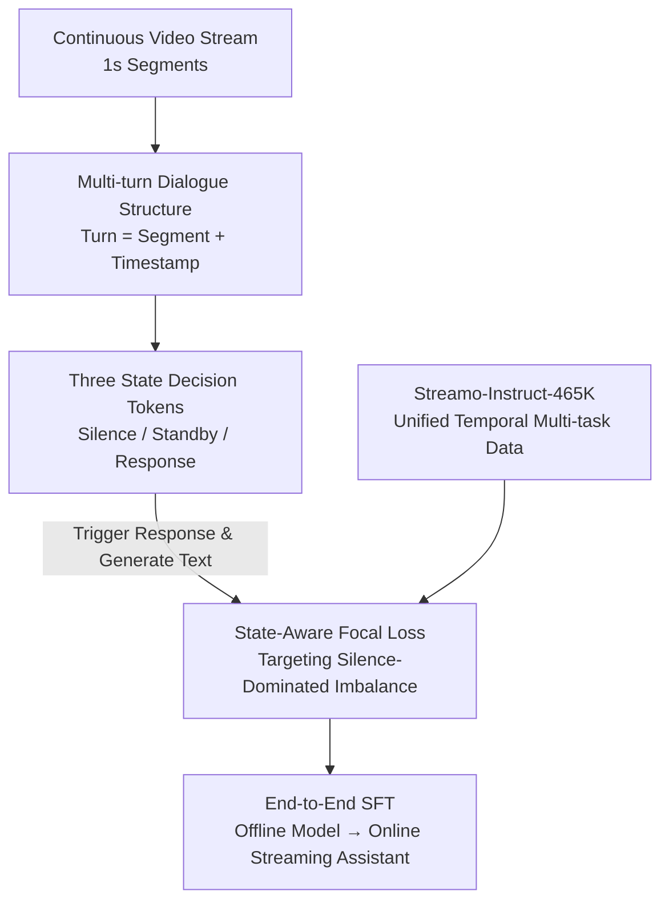

# Streaming Video Instruction Tuning (Streamo)

**Conference**: CVPR 2026  
**Paper**: [CVF Open Access](https://openaccess.thecvf.com/content/CVPR2026/html/Xia_Streaming_Video_Instruction_Tuning_CVPR_2026_paper.html)  
**Code**: None (Paper states code/model/dataset will be released)  
**Area**: Multimodal VLM / Video Understanding  
**Keywords**: Streaming Video Understanding, Video Large Language Models, Instruction Tuning, Response Timing Decision, Focal Loss

## TL;DR
Streamo integrates the decision of "when to speak" directly into the next-token prediction of video large models. By using three state tokens (Silence/Standby/Response), the model judges response timing frame-by-frame. Combined with a 465,000-sample multi-task streaming instruction dataset for end-to-end training, it transforms offline video models into online assistants capable of real-time narration, localization, and QA, outperforming the previous Prev. SOTA Dispider by 13.83% on OVO-Bench.

## Background & Motivation
**Background**: Video large models (InternVideo2.5, Keye-VL, Qwen2.5-VL, etc.) have achieved strong performance in "offline" understanding—summarizing, answering questions, or captioning pre-recorded videos. However, their paradigm relies on "outputting once after seeing the whole segment," which is essentially single-turn inference.

**Limitations of Prior Work**: Real-world AI assistants face continuous, unbounded video streams and must judge "whether to respond and what to respond" while watching. Offline models lack a mechanism to identify "which moment in the stream requires a response."

**Key Challenge**: existing streaming adaptation methods rely on "external decision modules"—Dispider and StreamBridge use an auxiliary model to segment the video or predict response states before calling a large offline model. This introduces an unavoidable trade-off: small decision modules cannot understand complex instructions and temporal dependencies, while large ones cause latency and computational costs to skyrocket. Furthermore, separating decision from generation leads to loose coupling between perception and response, making it difficult to keep up with rapidly changing streaming contexts. VideoLLM-Online and StreamingVLM use a special `[EOS]` token to predict response timing directly, but suffer from being limited to real-time narration tasks and failing to balance between "silence" and "response."

**Goal**: To develop a unified framework where a single model can frame-by-frame decide "when to speak" and immediately determine "what to say," covering multiple streaming tasks like narration, action captioning, event captioning, event localization, and time-sensitive QA.

**Key Insight**: Instead of an external module, embed "response state prediction" into the model's internal next-token prediction process using three discrete state tokens. This enables one-pass inference for decision and generation. Simultaneously, curate a multi-task instruction dataset with unified annotation standards and precise temporal boundaries.

## Method

### Overall Architecture
The core of Streamo is not a change in architecture but a modification of "data organization + loss calculation," enabling the end-to-end conversion of any offline video VLM (e.g., Qwen2.5-VL) into an online streaming assistant. The pipeline consists of three steps: First, rewrite the traditional offline format ("whole video + single-turn QA") into **multi-turn dialogues with timestamps**, where the video is segmented into 1-second snippets, and each turn provides a new segment while the model returns a response state. Second, embed **three state tokens (Silence/Standby/Response)** in each turn. The model judges whether to "remain silent / standby after perceiving input / respond now that information is sufficient." Once Response is triggered, text is generated in the same step. Finally, to address the severe class imbalance where Silence exceeds 80% in streaming data, a **State-Aware Focal Loss** is used to reweight the three tokens, forcing the model to learn rare "time to speak" moments via standard SFT parallel training.

### Key Designs

**1. Multi-turn Dialogue Streaming Structure: From "Watch then Answer" to "Watch and Judge"**

The offline paradigm assumes the entire video $V=\{v_1,...,v_T\}$ is visible before inference. In streaming, the model only sees partial observations $V_{:t}=\{v_1,...,v_t\}$ at time $t$. Streamo reconstructs single-turn offline formats into multi-turn dialogues: the video is cut into $N$ segments $V=\{V^{(1)},...,V^{(N)}\}$, each explicitly encoded with temporal markers like `<2s-3s>`. This is organized as $D=\{(V^{(1)},R^{(1)}),...,(V^{(N)},R^{(N)})\}$, where $R^{(i)}$ is the response for the $i$-th turn. Questions and answers are inserted at appropriate turns. This simulates real frame-by-frame interaction and allows questions at any point while remaining compatible with parallel SFT training by transforming "online decision-making" into "predicting the next token in a multi-turn sequence."

**2. Three-State Decision Tokens: Integrating Timing into Next-Token Prediction**

This replaces external decision modules. The model outputs one of three discrete states per turn: `<Silence>` (no relevant info, continue processing); `<Standby>` (relevant input perceived, but waiting for complete info); `<Response>` (sufficient info, followed immediately by text). For a "Notify me when the light turns green" instruction, the model outputs `<Silence>` for several seconds, `<Standby>` as the light prepares to change, and `<Response> The light just turned green.` the moment it happens. Since these tokens are integrated into the prediction flow, decision and generation occur in **one-pass inference**, ensuring tight perception-response coupling and eliminating two-stage latency.

**3. State-Aware Focal Loss: Recovering "Response" Moments from Silence**

The streaming format brings extreme class imbalance: `<Silence>` often accounts for over 80% (empirical Silence:Standby:Response ≈ 12:3:2). Standard cross-entropy leads to models that always stay silent. Streamo applies Focal Loss reweighting specifically to these three tokens. First, a token-level difficulty weight $w_{\text{focal}}(x_i)=(1-p_{c_i})^{\gamma}$ is calculated, where $p_{c_i}$ is the predicted probability of the ground truth and $\gamma=2$ to down-weight easy samples. Second, an alpha weight $\alpha_k=\frac{1}{|S|}\cdot\frac{\sum_{j\in S}n_j}{n_k}$ ($|S|=3$, $n_k$ is the frequency of state $k$ in the batch) is used to give higher weights to rarer states. These are multiplied into the cross-entropy:

$$L_i = \begin{cases}\alpha_{t_i}\,w_{\text{focal}}(i)\,L_{\text{CE}}(i,t_i), & t_i\in S\\ L_{\text{CE}}(i,t_i), & \text{otherwise}\end{cases}$$

The total loss $L_{\text{total}}=\frac{1}{|M|}\sum_{i\in M}L_i$ is averaged over all non-masked positions $M$. Unlike fixed weights (0.3/1.3/2.0), Focal Loss dynamically captures token-level difficulty and varying state distributions across tasks (e.g., narration has frequent responses, while QA may have only one).

**4. Streamo-Instruct-465K: Multi-task Data with Unified Annotations**

To ensure precise temporal alignment, the authors re-annotated 135,875 videos from sources like LLaVA-Video, ActivityNet, and YouCook2 using a **unified protocol** with clear response boundaries. This resulted in 465,000 samples after incorporating offline QA. Five tasks are covered: Real-time Narration (second-by-second changes via Qwen2.5-VL-72B), Event Captioning (segmented via ARC-Hunyuan-Video-7B), Action Captioning (action-oriented prompts), Event Localization (monitoring stream to detect pre-defined captions), and Time-Sensitive QA (detecting "change points" in attributes/locations via GLM-4.5V). This multi-task supervision reinforces both instruction following and temporal reasoning.

### Loss & Training
Configuration: Full-parameter fine-tuning with frozen visual encoders; only connector and LLM updated. Single epoch, batch size 512, learning rate 1e-5. Multi-turn segments are 1s each at 1 fps. Focal $\gamma=2$. Base models used are Qwen2.5-VL (3B/7B), though compatible with InternVL-3 and others.

## Key Experimental Results

### Main Results (OVO-Bench Online Video Benchmark)
OVO-Bench covers Real-time Perception, Backward Reasoning, and Forward Proactive Response (12 sub-tasks total). "Streamo Framework" refers to the conversion of offline models using our method.

| Model | FPS | Real-time Avg | Backward Avg | Forward Avg | Overall |
|------|------|------|------|------|------|
| Dispider-7B (Prev. SOTA) | 1fps | 54.55 | 36.06 | 48.75 | 41.78 |
| ViSpeak-7B | 1fps | 66.28 | 57.52 | 60.42 | 61.08 |
| Streamo-3B | 1fps | 61.51 | 41.76 | 53.72 | 52.33 |
| Streamo-7B | 1fps | 65.98 | 46.10 | 54.77 | 55.61 |
| Streamo-7B | 2fps* | 67.44 | 49.18 | 56.96 | **57.86** |

**Key Conclusion**: Streamo-7B improves the Prev. SOTA Dispider by **+13.83%** on Forward Proactive tasks. Models trained at 1fps generalize to 2fps testing (improving by +4.66%) without retraining. Replacing ET-Instruct-164K with Streamo-Instruct-465K yields a +11.79% overall Gain.

### Offline Video Benchmarks (Capability Retention)

| Model | OVO-RT | MVBench | TempCompass | VideoMME | LongVideoBench | Avg |
|------|------|------|------|------|------|------|
| Qwen2.5-VL-7B (Base) | 58.8 | 69.6 | 71.7 | 65.1 | 56.0 | 60.6 |
| StreamingVLM-7B (SOTA) | 62.0 | 69.2 | - | 65.1 | 59.0 | - |
| Streamo-7B | 66.0 | 72.3 | 71.8 | 67.9 | 59.2 | **63.9** |

Streamo does not degrade; it outperforms online SOTA StreamingVLM and even exceeds the offline base by 3.4% on average across offline metrics.

### Ablation Study (Focal Loss, OVO-Bench Forward Tasks)

| Base | Loss Type | REC | SSR | CRR |
|------|------|------|------|------|
| Qwen2.5-VL-3B | CrossEntropy | 6.45 | 20.99 | 41.67 |
| Qwen2.5-VL-3B | Loss Scale (Fixed) | 18.62 | 41.02 | 49.17 |
| Qwen2.5-VL-3B | **Focal Loss** | **27.94** | **50.72** | **82.5** |

### Key Findings
- **State reweighting is vital**: Pure cross-entropy is overwhelmed by the 12:3:2 imbalance (CRR 41.67). Focal Loss raises CRR to 82.5, significantly leading across backbones.
- **Offline supervision trade-off**: Adding offline LLaVA-Video data to ET-Instruct improves perception precision but harms streaming ability; however, Streamo-Instruct-465K balances both successfully.
- **Robustness**: On Streamo-Bench (300 videos, 3000 tasks), existing models failed on open-ended grounding prompts, while Streamo remained robust across all tasks.

## Highlights & Insights
- **The "Aha" Moment**: Coding "when to respond"—a decision seemingly requiring an external controller—as three ordinary tokens makes the problem solvable via standard SFT sequence modeling. No architectural changes, parallel training, and one-pass inference.
- **Three States vs. Two**: Unlike VideoLLM-Online’s binary `[EOS]`, the `<Standby>` state ("perceived but waiting") allows fine-grained timing trade-offs, which is crucial for multi-task coverage.
- **Focal Loss Application**: Using Focal Loss for "decision tokens" rather than just traditional classification is a transferable trick for any sequential decision-making where "doing nothing" is the majority class (e.g., ASR endpointing).

## Limitations & Future Work
- **Unbounded Context**: Streaming video is naturally unbounded, but the current pipeline lacks specific long-sequence optimization. Memory and latency become bottlenecks as sequences grow. Future work involves KV-cache management and adaptive frame compression.
- **Data Quality**: The core improvements rely on the 46.5K dataset, which was automatically generated by multiple LLMs (Qwen2.5-VL-72B, etc.). The potential biases and exact quality have not undergone human-level quantitative verification.
- **Latency Metrics**: While 1fps to 2fps testing shows gains, actual throughput and latency numbers in real-world low-latency deployment are not fully detailed in the main text.

## Related Work & Insights
- **vs Dispider / StreamBridge**: They use auxiliary models and fixed-length segments, resulting in high overhead and context loss. Streamo is integrated and one-pass, outperforming Dispider by 13.83% in forward tasks.
- **vs VideoLLM-Online / StreamingVLM**: They are limited to real-time narration via a single `[EOS]`. Streamo covers the full spectrum of narration, captioning, localization, and QA via three state tokens.
- **vs Existing Benchmarks**: Most streaming benchmarks rely on multiple-choice QA and cannot test open-ended grounding or captioning. Streamo-Bench addresses this by testing multi-task perception and response.

## Rating
- **Novelty**: ⭐⭐⭐⭐ Integration of timing into next-token prediction is simple and effective engineering.
- **Experimental Thoroughness**: ⭐⭐⭐⭐ Comprehensive evaluation across online/offline benchmarks, though throughput data is limited.
- **Writing Quality**: ⭐⭐⭐⭐ Clear motivation, detailed data construction, and intuitive examples.
- **Value**: ⭐⭐⭐⭐ Provides a reusable framework, 465k dataset, and new benchmark for real-time video assistants.

<!-- RELATED:START -->

## Related Papers

- [\[CVPR 2026\] Multimodal Continual Instruction Tuning with Dynamic Gradient Guidance](multimodal_continual_instruction_tuning_with_dynamic_gradient_guidance.md)
- [\[CVPR 2026\] LLaDA-V: Large Language Diffusion Models with Visual Instruction Tuning](llada-v_large_language_diffusion_models_with_visual_instruction_tuning.md)
- [\[CVPR 2026\] Harmonious Parameter Adaptation in Continual Visual Instruction Tuning for Safety-Aligned MLLMs](harmonious_parameter_adaptation_in_continual_visual_instruction_tuning_for_safet.md)
- [\[NeurIPS 2025\] Visual Instruction Bottleneck Tuning](../../NeurIPS2025/multimodal_vlm/visual_instruction_bottleneck_tuning.md)
- [\[CVPR 2026\] WeaveTime: Streaming from Earlier Frames into Emergent Memory in VideoLLMs](weavetime_streaming_from_earlier_frames_into_emergent_memory_in_videollms.md)

<!-- RELATED:END -->
