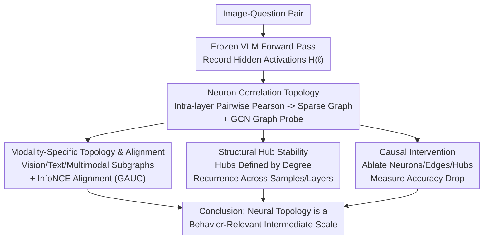

# Structural Graph Probing of Vision-Language Models

**Conference**: CVPR 2026  
**Paper**: [CVF Open Access](https://openaccess.thecvf.com/content/CVPR2026/html/He_Structural_Graph_Probing_of_Vision-Language_Models_CVPR_2026_paper.html)  
**Code**: https://github.com/he-h/vlm-graphprobing  
**Area**: Multimodal VLM / Interpretability  
**Keywords**: Neural Topology, Correlation Graphs, Graph Probing, Cross-modal Structure, Causal Intervention

## TL;DR
This paper constructs a "correlation graph" based on the pairwise neuron correlations within each layer of a Vision-Language Model (VLM). Using GCN graph probes, the authors demonstrate that this **population-level topological structure** can predict model behavior, characterize the evolution of cross-modal fusion with depth, and locate "hub neurons" that significantly alter the output upon perturbation. This introduces a novel intermediate scale for interpretability, positioned between "local attribution" and "full circuit recovery."

## Background & Motivation

**Background**: Current mainstream methods for explaining the internal mechanisms of VLMs rely on various "local attributions," such as attention maps, saliency maps, patch attribution, and single-component inspection. These methods excel at answering "which input token or image region is most important."

**Limitations of Prior Work**: However, computations in transformer-based VLMs are **distributed across populations of interactive units** rather than concentrated in a few isolated pathways. Local attribution only indicates "which units are active" but fails to explain how these units are **organized to perform multimodal reasoning** across layers and modalities. In other words, existing interpretability remains largely descriptive.

**Key Challenge**: Interpretability faces two extremes. On one end is "single-neuron/token attribution," which is simple but too fragmented to show global organization. On the other end is "full circuit recovery," which is theoretically thorough but computationally infeasible and difficult to compare across layers or models. There is a lack of an intermediate scale that is both tractable and capable of exposing behaviorally relevant organization.

**Key Insight**: Drawing from lessons in both neuroscience and mechanistic interpretability, complex computations are often most understandable at the level of **structured populations, interaction patterns, and hub-like organizations** rather than isolated units. The authors hypothesize that the **co-activation topology** of neurons within a layer carries substantial information about model behavior and deserves to be analyzed as an independent level of organization.

**Core Idea**: Each transformer layer is represented as a "neuron-neuron correlation graph." By probing these graphs with Graph Neural Networks (GNNs), the authors simultaneously address three questions: whether topology predicts behavior, how cross-modal structures evolve with depth, and whether perturbing hubs defined by the topology causally changes the output.

## Method

As an **analysis/interpretability** paper, this work does not propose a new model but rather a "research design + probing method." Given a **frozen** VLM, correlation graphs are constructed from its hidden activations, followed by graph probing and intervention experiments to test if "neural topology is behaviorally relevant."

### Overall Architecture

The pipeline is as follows: Input an image-question pair → Perform a forward pass with the frozen VLM and record hidden activations at each layer → Construct a neuron correlation graph for each layer → Use a GCN to compress the graph into a fixed-dimensional "structural signature" → Perform three types of analysis (behavioral predictability, cross-modal structure, causal intervention). A key constraint is that the downstream analysis modules **only view the graph structure and neuron identities, never the specific activation values**. Thus, the probe learns "how neurons are organized" rather than "what a single neuron encodes."

### Key Designs

**1. Neuron Correlation Topology + GCN Graph Probe: Learning Intra-layer Population Structure**

To address the lack of global organization in local attribution, each layer is represented as a weighted graph $G^{(\ell)}=(V,E,W^{(\ell)})$. Nodes represent neurons ($|V|=d$, where $d$ is the hidden dimension), and edge weights represent the Pearson correlation between the activation profiles of two neurons across all tokens in a single forward pass:

$$W^{(\ell)}_{ij} = \mathrm{corr}\!\left(H^{(\ell)}_{i,:},\, H^{(\ell)}_{j,:}\right)$$

Here $H^{(\ell)}\in\mathbb{R}^{d\times N}$, where rows are neurons and columns are tokens. The graph captures "which neurons have similar response patterns during inference," representing an intra-layer **co-activation structure**. To avoid leaking activation values or token semantics, each neuron uses only a **learnable one-hot identity embedding** as a node feature. The GCN performs convolutions on the graph $Z^{(\ell)}=\sigma(D^{-1/2}W^{(\ell)}D^{-1/2}XW_g)$, and a layer-level signature is formed via mean+max pooling: $h^{(\ell)}=\mathrm{Concat}(\mathrm{Mean}(Z^{(\ell)}),\mathrm{Max}(Z^{(\ell)}))$. To handle scale, only the top-$k$ edges are retained (sparsity $\le 0.2$).

**2. Modality-specific Topology and Alignment: Decomposing Vision/Text/Multimodal Graphs**

To study cross-modal fusion, the authors split hidden states into visual subset $H^{(\ell)}_{vis}$ and textual subset $H^{(\ell)}_{text}$ based on token indices. Following the same construction, they obtain $G^{(\ell)}_{vis}$, $G^{(\ell)}_{text}$, and the full multimodal graph $G^{(\ell)}$. Furthermore, **cross-modal graph alignment** is performed by training graph-level embeddings via Contrastive Learning with a symmetric InfoNCE loss. Graph AUC (GAUC) is used to measure the reliability of matching modality pathways in the structural space.

**3. Structural Hub Stability: Defining Hubs by Degree**

To identify stable structural roles, a neuron $i$'s degree is defined as the sum of its absolute edge weights $d^{(\ell)}_i = \sum_j |W^{(\ell)}_{ij}|$. Neurons in the top $k\%$ are labeled **hub neurons**. Recurrence rate $\pi^{(\ell)}_i$ measures how frequently a hub appears across different inputs. This allows for the distinction between hubs defined by topology, modality-specific subgraphs, or pure activation magnitude.

**4. Causal Intervention: Moving from Correlation to Causation**

Three levels of intervention are used: (a) **Neuron Ablation**: Zeroing out the top 1% of hub neurons vs. random or activation-based selection. (b) **Edge-level Intervention**: Replacing one endpoint's activation with its partner's activation (IDENTICAL), the negative of its partner (OPPOSITE), or a random vector (RANDOM) for the most significant edges. (c) **Hub Perturbation**: Scaling hub neuron activations while keeping others fixed.

## Key Experimental Results

The evaluation uses three representative VLMs: InternVL3-1B, Qwen2.5-VL-3B, and LLaVA-1.5-7B. Tasks include CLEVR (grounding), TDIUC (semantic recognition), MHaluBench (hallucination), and broader benchmarks like MMMU/BLINK/EMMA.

### Main Results: Graph Probe vs. Linear Probe

| Dataset | InternVL3-1B Linear(Acc) | InternVL3-1B GCN(Acc) | LLaVA-1.5-7B Linear(Acc) | LLaVA-1.5-7B GCN(Acc) |
|--------|------|------|------|------|
| TDIUC | 0.884 | 0.965 | 0.971 | 0.954 |
| CLEVR | 0.980 | 0.993 | 0.602 | 0.679 |
| MMMU | 0.293 | 0.321 | 0.314 | 0.279 |
| BLINK | 0.549 | 0.592 | 0.647 | 0.592 |

GCN probes generally outperform linear baselines on grounding tasks (e.g., +7.7% on CLEVR for LLaVA). On broader benchmarks like MMMU, improvements vary, suggesting that topology is most informative in tasks where internal multimodal organization aligns closely with the target output.

### Hallucination Detection and Cross-modal Alignment

| MHaluBench | InternVL3-1B | Qwen2.5-VL-3B | LLaVA-1.5-7B |
|------|------|------|------|
| word2vec Mean Emb | 0.664 | 0.654 | 0.649 |
| Text Length Baseline | 0.500 | 0.633 | 0.642 |
| GCN Graph Probe | **0.789** | **0.910** | **0.908** |

The graph probe significantly outperforms text-only baselines in hallucination detection, indicating that "grounding" information is encoded in the neuron correlation structure. Regarding cross-modal alignment (LLaVA Layer 6), text-image pathways show a GAUC of 0.819, whereas LLaVA's textual graph vs. the original LLaMA textual graph is only 0.680, suggesting multimodal fine-tuning **substantially rewrites** the inherited textual topology.

### Key Findings

- **Causal Evidence**: Ablating top hubs causes much larger performance drops than random or magnitude-based selection. In edge-level interventions, the OPPOSITE setting is most destructive, while IDENTICAL is benign, showing that edge importance depends on the **sign and alignment** of co-activation.
- **Hubs as Stable Roles**: Topologically defined hubs are more stable across samples than those defined by activation magnitude. Stability is highest in the **middle layers**, coinciding with zones of strong cross-modal coupling.
- **Depth Evolution**: Vision-text and text-text correlations increase with depth, while vision-vision correlations remain flat, aligning with the intuition that multimodal integration strengthens in later layers.
- **Sparsity Suffices**: Probing performance remains stable as sparsity varies from 0.01 to 0.20, indicating that prominent correlations capture most behavioral signals.

## Highlights & Insights

- **Introduction of a True "Intermediate Scale"**: Neural topology is richer than local attribution (global organization) and more tractable than full circuit recovery (cross-modal/cross-model comparability).
- **"Structure-only" Probing Design**: Using one-hot identity embeddings ensures the probe utilizes only topological information, preventing results from being conflated with activation values.
- **Transferable Causal Chain**: The hierarchy of neuron ablation, edge-level manipulation, and hub scaling provides a general framework for validating any "structure-defined component."
- **Symmetry Sensitivity**: Hub neurons show sensitivity to both suppression and amplification, suggesting they operate within a narrow functional range.

## Limitations & Future Work

- **Correlation is not Causation**: The correlation graph represents co-activation structure, not necessarily the actual causal wiring of the model.
- **Weak Localization**: The most sensitive layers vary significantly across models (e.g., Layer 11 in InternVL3 vs. Layer 0 in Qwen2.5-VL), providing existence evidence rather than precise localization.
- **Scale and Coverage**: While testing on 1B–7B models, stability on larger models or more complex reasoning tasks remains to be explored.
- **Probe Performance vs. Mechanism**: High accuracy in probing confirms that topology is a behaviorally relevant representation but does not explicitly uncover the underlying mechanism.

## Related Work & Insights

- **Vs. Local Attribution**: While saliency and attention maps provide token-level explanations, they lack global computational organization. This work lifts the perspective to intra-layer topology.
- **Vs. Mechanistic Interpretability**: While prior work often focuses on pure LMs, this study extends the structural perspective to VLMs via modality-specific subgraphs and causal interventions.
- **Vs. Representational Similarity**: Unlike studies focused on representation vectors, this method treats VLM layers as correlation graphs and links topology directly to multimodal behavior.

## Rating
- Novelty: ⭐⭐⭐⭐⭐ 
- Experimental Thoroughness: ⭐⭐⭐⭐ 
- Writing Quality: ⭐⭐⭐⭐⭐ 
- Value: ⭐⭐⭐⭐ 

<!-- RELATED:START -->

## Related Papers

- [\[CVPR 2026\] StructXLIP: Enhancing Vision-Language Models with Multimodal Structural Cues](structxlip_enhancing_vision-language_models_with_multimodal_structural_cues.md)
- [\[CVPR 2026\] GraphVLM: Benchmarking Vision Language Models for Multimodal Graph Learning](graphvlm_benchmark_vlm_graph_learning.md)
- [\[CVPR 2026\] CASPA: Graph-Structured Concept Anchors for Modality-Agnostic Adaptation in Vision-Language Models](caspa_graph-structured_concept_anchors_for_modality-agnostic_adaptation_in_visio.md)
- [\[CVPR 2026\] Beyond Graph Model: Reliable VLM Fine-Tuning via Random Graph Adapter](beyond_graph_model_reliable_vlm_fine-tuning_via_random_graph_adapter.md)
- [\[CVPR 2026\] VisualOverload: Probing Visual Understanding of VLMs in Really Dense Scenes](visualoverload_probing_visual_understanding_of_vlms_in_really_dense_scenes.md)

<!-- RELATED:END -->
