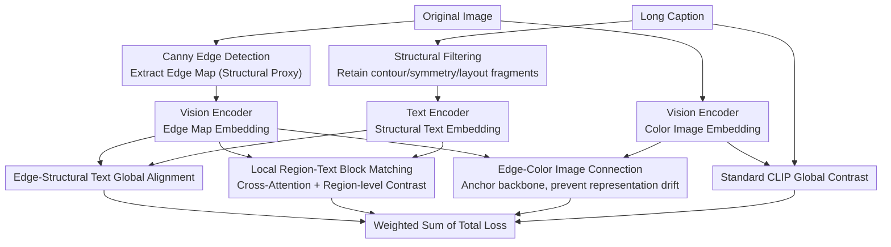

# StructXLIP: Enhancing Vision-Language Models with Multimodal Structural Cues

**Conference**: CVPR 2026  
**arXiv**: [2602.20089](https://arxiv.org/abs/2602.20089)  
**Code**: [https://github.com/intelligolabs/StructXLIP](https://github.com/intelligolabs/StructXLIP)  
**Area**: Multimodal VLM / Cross-modal Retrieval  
**Keywords**: CLIP, edge map, structural alignment, cross-modal retrieval, mutual information maximization

## TL;DR
StructXLIP utilizes edge maps as proxy representations of visual structure, introducing three structure-centric losses (edge-structural text alignment + local region-text block matching + edge-color image connection) during CLIP fine-tuning. By maximizing the mutual information of multimodal structural representations, the model is guided toward a more robust, semantically stable optimal solution, outperforming existing competitors in cross-modal retrieval tasks.

## Background & Motivation

**Background**: Edge-based representation is a fundamental cue for visual understanding—central since Marr's early visual theory and remaining core today. VLMs like CLIP learn vision-language representations via image-text alignment but typically treat the image as a holistic entity for global alignment.

**Limitations of Prior Work**: Standard CLIP alignment only maximizes mutual information between global image and text embeddings, ignoring structural information (edges, contours, spatial layouts). Furthermore, the long, detail-rich image descriptions (long captions) commonly used in fine-tuning introduce significant noise, making it difficult for models to extract structured semantics. Crucially, global alignment lacks multi-granularity structural correspondence—it fails to capture fine-grained relationships between local regions and text fragments.

**Key Challenge**: VLM fine-tuning relies on global contrastive loss optimization, yet structural information (edges, spatial relationships) is never explicitly modeled. Consequently, the model lacks structural sensitivity when encountering complex scenes.

**Core Idea**: Treat edge maps as "proxies for visual structure." Perform structural filtering on text descriptions to make them "structure-centric," and then inject structural awareness into the VLM using multi-level structural alignment losses.

## Method

### Overall Architecture
StructXLIP aims to address the deficiency of "global-only, structure-ignorant" standard CLIP fine-tuning. It introduces a dedicated structural branch in parallel with the original image-text contrastive branch. The workflow is as follows: each training image first passes through a Canny detector to extract an edge map, which serves as a "visual structure proxy" for the vision encoder. Simultaneously, the original long descriptions are filtered into "structure-centric" text, retaining only fragments discussing contours, symmetry, and spatial layouts. After encoding the edge maps, color images, and structural text, three structure-centric losses (edge-structural text global alignment, local region-text block matching, and edge-color image connection) are optimized alongside the standard CLIP loss to progressively embed structural perception into the backbone representation.

### Key Designs

**1. Edge-Structural Text Global Alignment: Aligning "visual structure" with "linguistic structure" at the global level**

Standard CLIP only maximizes mutual information between global image and sentence embeddings, leaving the model unaware of which image parts correspond to terms like "circular contour" or "bilateral symmetry." StructXLIP addresses this by conducting contrastive learning between the global edge map embedding $\mathbf{e}_i$ and the structural text embedding $\mathbf{t}_i^s$:

$$\mathcal{L}_{edge\text{-}text} = -\log \frac{\exp(\cos(\mathbf{e}_i, \mathbf{t}_i^s) / \tau)}{\sum_j \exp(\cos(\mathbf{e}_i, \mathbf{t}_j^s) / \tau)}$$

Within a pair, the edge map embedding must be closest to its own structural text and furthest from others. Since the input has been stripped of color details down to edges, only the "structural" dimension remains to minimize this distance. The model is thus forced to learn correspondences like "this specific contour shape ↔ symmetry described in text" instead of relying on color or texture.

**2. Local Region-Text Block Matching: Fine-grained alignment for specific image regions and phrases**

Global alignment solves the "whole edge map ↔ whole structural text" problem but cannot answer local questions like "which phrase corresponds to the left half of the image structure." This design partitions the edge map into local regions and the structural text into text blocks. Cross-attention is applied between edge patch embeddings and text token embeddings for mutual alignment, followed by contrastive learning on the aligned representations. This refines the supervisory signal from "one per image" to "one per block," enabling the model to learn region-level structure-language correspondences and increasing structural sensitivity in complex scenes.

**3. Edge-Color Image Connection: Anchoring the structural branch to prevent representation drift**

Training an isolated edge branch risks the edge embeddings becoming too specialized, drifting away from the primary color image representations and failing to benefit the backbone. The $\mathcal{L}_{edge\text{-}color}$ loss acts as an anchor by performing contrastive learning between edge map embeddings and their corresponding color image embeddings, ensuring they remain in proximity. Consequently, while the structural branch focuses on structure, it remains anchored within the backbone's semantic space, allowing structural information to propagate back rather than becoming an isolated byproduct.

### Loss & Training
The total loss is a weighted sum of four terms, where the three structural losses are appended to the standard CLIP loss with respective coefficients:

$$\mathcal{L} = \mathcal{L}_{CLIP} + \lambda_1 \mathcal{L}_{edge\text{-}text} + \lambda_2 \mathcal{L}_{local} + \lambda_3 \mathcal{L}_{edge\text{-}color}$$

The training follows a lightweight fine-tuning strategy: only the projection heads and adapters are trained on top of a pre-trained CLIP, while most parameters of the vision and text encoders are frozen. This makes the method plug-and-play, adaptable to any CLIP variant with minimal overhead.

## Key Experimental Results

### Main Results: Cross-modal Retrieval (Flickr30K / COCO)

| Method | Flickr30K R@1 (%) | COCO R@1 (%) | Average R@1 |
|------|-------------------|--------------|----------|
| CLIP (baseline) | 68.3 | 42.5 | 55.4 |
| LiT | 71.2 | 44.8 | 58.0 |
| FILIP | 72.0 | 45.3 | 58.7 |
| **Ours (StructXLIP)** | **74.6** | **47.8** | **61.2** |

### Ablation Study

| Configuration | Flickr30K R@1 (%) | Description |
|------|-------------------|------|
| Full StructXLIP | 74.6 | Complete Method |
| w/o Edge-Text | 72.3 | Remove edge-text alignment |
| w/o Local Matching | 73.1 | Remove local region matching |
| w/o Edge-Color | 73.8 | Remove edge-color connection |
| w/o All Structure | 68.3 | Equivalent to baseline CLIP |

### Key Findings
- Edge-text global alignment provides the highest contribution (+2.3%), with local matching and edge-color connection contributing approximately ~1% each.
- As a plug-and-play fine-tuning enhancement, StructXLIP can be stacked onto any CLIP variant.
- It proves effective in specialized domains, such as medical image retrieval.
- The choice of Canny parameters for edge maps has minimal impact on the results.

## Highlights & Insights
- **Return to Visual Primitives**: Designing VLM enhancement strategies based on Marr’s edge representation theory provides a solid theoretical foundation.
- **Mutual Information Analysis**: The paper proves that StructXLIP explicitly maximizes mutual information between multimodal structural representations. This auxiliary optimization is "harder," forcing the model toward a more robust optimum.
- **Plug-and-play**: The method does not alter model architecture, only adds auxiliary losses, ensuring high compatibility with future VLM methods.

## Limitations & Future Work
- Canny edge detection is hand-crafted; more advanced extractors (e.g., HED, SAM boundaries) might yield better results.
- Validation is limited to retrieval tasks and has not been extended to VQA or image captioning.
- The rules for structural text filtering are relatively simple and may omit or misidentify structure-related descriptions.
- Temporal structural alignment in video scenarios remains unexplored.

## Related Work & Insights
- **vs FILIP**: FILIP performs token-level fine-grained alignment but does not distinguish between structural and non-structural information. StructXLIP explicitly introduces structural priors via edge maps.
- **vs LiT**: LiT freezes the vision encoder and only trains the text side. StructXLIP introduces a visual structural branch.
- **Inspiration**: The idea of using edge/structural information as an auxiliary signal can be extended to other geometric cues like depth maps or normal maps.

## Rating
- Novelty: ⭐⭐⭐⭐ Introducing edge maps for VLM alignment is a unique perspective, complemented by deep mutual information analysis.
- Experimental Thoroughness: ⭐⭐⭐⭐ Multiple benchmarks, ablations, and domain-specific validation, though the task variety is somewhat limited.
- Writing Quality: ⭐⭐⭐⭐⭐ Excellent logic, effectively combining vision theory with theoretical and experimental evidence.
- Value: ⭐⭐⭐⭐ Provides a general framework for structural enhancement with high plug-and-play utility.

<!-- RELATED:START -->

## Related Papers

- [\[CVPR 2026\] Structural Graph Probing of Vision-Language Models](structural_graph_probing_of_vision-language_models.md)
- [\[CVPR 2026\] Enhancing Continual Learning of Vision-Language Models via Dynamic Prefix Weighting](enhancing_continual_learning_of_vision-language_models_via_dynamic_prefix_weight.md)
- [\[CVPR 2026\] Same or Not? Enhancing Visual Perception in Vision-Language Models](same_or_not_enhancing_visual_perception_in_vision-language_models.md)
- [\[CVPR 2026\] SO-Bench: A Structural Output Evaluation of Multimodal LLM](so-bench_a_structural_output_evaluation_of_multimodal_llm.md)
- [\[CVPR 2026\] Video-Only ToM: Enhancing Theory of Mind in Multimodal Large Language Models](video-only_tom_enhancing_theory_of_mind_in_multimodal_large_language_models.md)

<!-- RELATED:END -->
