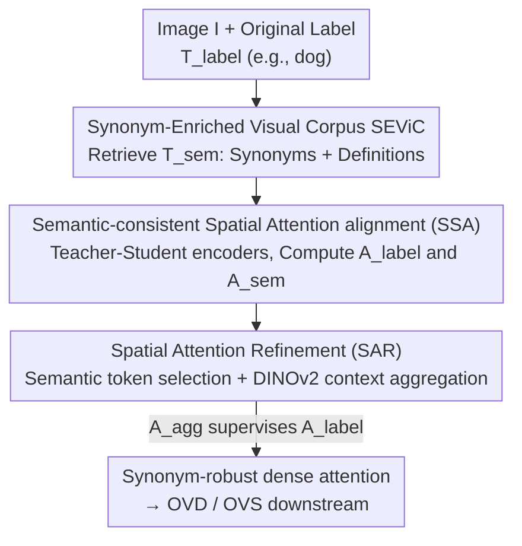

# SynCLIP: Synonym-Coherent Language-Image Pretraining for Robust Open-Vocabulary Dense Perception

**Conference**: CVPR 2026  
**Paper**: [CVF Open Access](https://openaccess.thecvf.com/content/CVPR2026/html/Xie_SynCLIP_Synonym-Coherent_Language-Image_Pretraining_for_Robust_Open-Vocabulary_Dense_Perception_CVPR_2026_paper.html)  
**Code**: https://github.com/Justlovesmile/SynCLIP  
**Area**: Multimodal VLM  
**Keywords**: Open-vocabulary perception, CLIP, Synonym robustness, Spatial attention alignment, Vision foundation models

## TL;DR
SynCLIP identifies "synonym-induced grounding inconsistency" in existing CLIP-based open-vocabulary dense perception methods—where the spatial attention shifts when the same object is described using different synonyms. It introduces a Synonym-to-label Spatial Attention alignment (SSA) loss and a Semantic-induced Attention Refinement (SAR) module that leverages DINOv2 for semantic token selection and context aggregation. On OV-COCO and OV-LVIS, SynCLIP achieves SOTA results among CLIP-based methods and reduces the performance drop caused by synonym replacement from ~9 AP to 4.4 AP.

## Background & Motivation
**Background**: Open-Vocabulary Dense Perception (OVDP, including open-vocabulary detection OVD and segmentation OVS) relies on textual expressions to represent categories, enabling the identification and localization of novel classes unseen during training. Mainstream approaches, such as CLIPSelf, CLIM, and DeCLIP, transfer the global image-text alignment of VLMs (pre-trained on large-scale pairs) to the region level to match visual regions with class labels.

**Limitations of Prior Work**: These methods focus exclusively on "region $\leftrightarrow$ text" alignment but overlook a critical issue in real-world deployment: **synonym-induced grounding inconsistency**. When the same object is described using semantically equivalent terms like "zebra," "striped horse," or "hippotigris," the generated spatial attention distributions vary significantly, often leading the model to ground different regions. Empirical tests show that replacing class names with synonyms in F-ViT on OV-COCO results in a sharp decline in novel class AP.

**Key Challenge**: While CLIP's global representations are powerful, it lacks local region-level discriminative power, causing attention to drift toward irrelevant areas. Region-level alignment methods like DeCLIP mitigate this drift but **lack any mechanism to enforce consistent attention across different linguistic expressions**. In other words, "synonym invariance" is absent from current training objectives.

**Goal**: To enable OVDP to achieve stable localization in real-world scenarios with diverse linguistic expressions (synonyms, long descriptive definitions), thereby attaining synonym-robust grounding capabilities.

**Key Insight**: The authors observed that expressions combining "synonym + definition" provide richer semantic context, resulting in **more accurate and stable** attention maps. These maps can serve as a "teacher" to calibrate the unstable attention maps generated by simple single labels (e.g., "dog").

**Core Idea**: Construct a synonym-enriched corpus and use "rich expression attention" to align with "original label attention" to enforce synonym consistency (SSA). This is followed by refining and sharpening the aligned attention using the spatial context of a vision foundation model (SAR).

## Method

### Overall Architecture
Based on the DeCLIP framework, SynCLIP inserts two collaborative modules during the pre-training phase: **SSA (Semantic-consistent Spatial Attention alignment)**, which aligns the attention maps of "original labels" with those of "synonym-enriched expressions," and **SAR (Spatial Attention Refinement)**, which sharpens the attention from enriched expressions into a more precise supervisory signal. The input pipeline consists of an image $I$ and a set of original class labels $T_{label}$. Corresponding enriched expressions $T_{sem}$ (e.g., "dog" $\to$ "dog, puppy, canine, a common domesticated carnivorous mammal ...") are retrieved from the pre-constructed SEViC corpus. Images are processed by a "student" visual encoder $F_v$ and a frozen "teacher" $F_v^*$ to extract dense features, while text is processed by a frozen CLIP text encoder. Attention maps $A_{label}$ and $A_{sem}$ are computed for both textual paths. SAR aggregates $A_{sem}$ into $A_{agg}$ using DINOv2. Finally, $A_{agg}$ supervises $A_{label}$, forcing the student to produce accurate and stable attention maps even when given single-label inputs.

### Key Designs

**1. SEViC Corpus: Generating Training Data for "Synonym Invariance"**

To align "original labels" with "rich expressions," a diverse set of synonymous expressions is required. The authors developed SEViC (Synonym-Enriched Visual Corpus) based on COCO2017 images, merging COCO and LVIS labels into 1,232 classes (plus "object" and "background" as meta-classes). Each class is associated with synonyms/definitions from LVIS and further expanded via LLMs (e.g., DeepSeek), followed by consistency filtering. The resulting corpus contains 118,287 images and 11,558 semantically enriched expressions. Its value lies in transforming the principle of "different words referring to the same object" into learnable data.

**2. SSA alignment: Calibrating "Single-Label" Drift using "Rich Expressions"**

SSA addresses the drift caused by synonym variation using a **teacher-student visual encoder** setup. The student $F_v$ and its frozen clone teacher $F_v^*$ extract dense features $X_{dense}=F_v(I)$ and $X^*_{dense}=F_v^*(I)$, respectively. The text embeddings $t_{label}$ and $t_{sem}$ (from a frozen CLIP text encoder) are compared with visual features using cosine similarity to generate attention maps:

$$A_{label}=\frac{t_{label}\,X_{dense}^\top}{\|t_{label}\|\cdot\|X_{dense}\|},\qquad A_{sem}=\frac{t_{sem}\,{X^*_{dense}}^\top}{\|t_{sem}\|\cdot\|X^*_{dense}\|}.$$

The dense features $X_{dense}$ are obtained by replacing the visual encoder's final attention layer with "Correlation Self-Attention" $\text{Attn}_{csa}$ and removing the [CLS] token. The semantic alignment loss is the element-wise L2 distance: $\mathcal{L}_{semantic}=\frac{1}{nm}\sum_{i,j}\|A_{label}^{i,j}-A_{sem}^{i,j}\|_2$. Utilizing the stable attention from rich expressions as a reference constrains the drift caused by linguistic diversity.

**3. SAR: Achieving Accuracy and Stability via DINOv2**

While SSA ensures consistency, redundant information in enriched expressions can reduce precision. SAR performs sharpening in two steps. First, **semantic token selection**: index the top-$k$ tokens with the highest attention scores from $A_{sem}$, denoted as $\mathcal{K}=\text{TopK}(A_{sem},k)$, representing the most semantically relevant locations. Second, **context-aware aggregation**: use a pre-trained VFM (DINOv2) to extract dense features $X^{VFM}_{dense}$. Cosine similarity $s_{i,j}$ between selected tokens and all image tokens produces $k$ spatial correlation maps, which are averaged into $A_{spa}$. Finally, semantic and spatial attentions are fused: $A_{agg}=\alpha A_{spa}+\beta A_{sem}$ (default $\alpha=\beta=0.5$). This $A_{agg}$ replaces $A_{sem}$ for supervision: $\mathcal{L}^{+}_{semantic}=\frac{1}{nm}\sum_{i,j}\|A_{label}^{i,j}-A_{agg}^{i,j}\|_2$. DINOv2's spatial reasoning sharpens the attention to precisely relevant regions.

### Loss & Training
The final training objective adds the refined semantic alignment loss $\mathcal{L}^{+}_{semantic}$ (default weight 0.05) to the original DeCLIP losses. DINOv2 serves as the VFM. Training is conducted on 4 GPUs with a batch size of 8 per GPU using AdamW, a learning rate of $2\times10^{-5}$, and weight decay of 0.1 for 6 epochs. F-ViT is used as the baseline for downstream tasks.

## Key Experimental Results

### Main Results
Evaluated on OV-COCO (48 base / 17 novel classes, $\text{AP}^{novel}_{50}$) and OV-LVIS (866 base / 337 rare classes, $\text{mAP}^{mask}_r$), SynCLIP achieves SOTA among CLIP-based methods.

| Dataset | Metric | Backbone | Ours (SynCLIP) | Prev. SOTA (DeCLIP) | Gain |
|--------|------|----------|--------------|--------------------|------|
| OV-COCO | $\text{AP}^{novel}_{50}$ | ViT-B/16 | 43.6 | 41.1 | +2.5 |
| OV-COCO | $\text{AP}^{novel}_{50}$ | ViT-L/14 | 49.8 | 46.2 | +3.6 |
| OV-LVIS | $\text{mAP}^{mask}_r$ | ViT-B/16 | 27.8 | 26.8 | +1.0 |
| OV-LVIS | $\text{mAP}^{mask}_r$ | ViT-L/14 | 37.2 | 37.2 | +0.0 |

### Synonym Robustness Evaluation
Measuring the degradation when replacing class names with synonyms.

| Method | Original $\text{AP}^{novel}_{50}$ | w/ Synonyms | Drop |
|------|------|------|------|
| F-ViT+CLIPSelf | 37.6 | 28.8 | −8.8 |
| F-ViT+DeCLIP | 41.0 | 31.5 | −9.5 |
| F-ViT+SynCLIP | 43.6 | 39.2 | **−4.4** |

Performance on base classes remained stable (−0.6 vs DeCLIP −2.2), indicating that consistency improvements do not sacrifice base performance.

### Ablation Study
On OV-COCO (Baseline is DeCLIP):

| SSA | SAR | $\text{AP}^{novel}_{50}$ | Note |
|-----|-----|------|------|
| ✘ | ✘ | 41.0 | Baseline |
| ✔ | ✘ | 41.1 | SSA alone shows negligible gain (redundancy interference) |
| ✘ | ✔ | 42.2 | SAR alone provides noticeable improvement |
| ✔ | ✔ | 43.6 | Best performance; components are complementary |

### Key Findings
- **SAR drives performance, but SSA is essential**: SSA provides the "stability" of synonym consistency, while SAR provides the "accuracy" of DINOv2 context. 
- **Optimal semantic token count $k$**: $\text{AP}^{novel}_{50}$ peaks at 43.6 with $k=7$; performance drops at $k=10$ or $20$ as excessive tokens introduce noise.
- **Narrower gains on difficult datasets**: On OV-LVIS ViT-L/14, gains matched DeCLIP. This is attributed to LVIS's fine-grained, long-tailed nature and high vocabulary overlap.

## Highlights & Insights
- **Problem Identification**: The explicit identification and quantification of "synonym-induced grounding inconsistency" is a major contribution.
- **Efficient Teacher Design**: Instead of training a separate teacher, the model leverages the inherent stability of "synonym + definition" expressions as a free alignment reference.
- **VFM as Spatial Prior**: SAR uses DINOv2 without gradients, borrowing its spatial correlation for lightweight "plug-and-play" distillation.
- **Synonym Invariance**: The paradigm of enforcing consistent internal representations for semantically equivalent inputs can be extended to OCR, VQA, and retrieval.

## Limitations & Future Work
- Gains are limited in fine-grained scenarios (LVIS) where synonym consistency benefits are diluted by overlapping category definitions.
- Heavy reliance on the SEViC corpus quality; noise or bias in LLM-generated synonyms could contaminate alignment targets.
- Hyperparameters ($\alpha, \beta, k$) were tuned specifically on OV-COCO; cross-dataset robustness requires further validation.
- Future Work: Adaptive weighting for synonym alignment based on class difficulty and extending alignment to multi-scale features.

## Related Work & Insights
- **vs DeCLIP**: SynCLIP builds upon DeCLIP's region-level context consistency but adds a missing "synonym consistency" dimension, significantly improving robustness (−4.4 vs −9.5 drop).
- **vs CLIPSelf / CLIM**: These methods focus on region alignment through self-distillation or mosaics but fail to constrain consistency between different textual descriptions.
- **vs ViLD / RO-ViT**: These focus on how to utilize CLIP for dense tasks; SynCLIP's focus on linguistic robustness is orthogonal and potentially additive to these architectures.

## Rating
- Novelty: ⭐⭐⭐⭐ 
- Experimental Thoroughness: ⭐⭐⭐⭐ 
- Writing Quality: ⭐⭐⭐⭐ 
- Value: ⭐⭐⭐⭐ 

<!-- RELATED:START -->

## Related Papers

- [\[CVPR 2026\] Vocabulary Scaling Law: Tuning Open-vocabulary Predictors for Their Openness](vocabulary_scaling_law_tuning_open-vocabulary_predictors_for_their_openness.md)
- [\[CVPR 2026\] Concept-Aware Batch Sampling Improves Language-Image Pretraining](concept-aware_batch_sampling_improves_language-image_pretraining.md)
- [\[CVPR 2026\] Towards Open-Vocabulary Industrial Defect Understanding with a Large-Scale Multimodal Dataset](towards_open-vocabulary_industrial_defect_understanding_with_a_large-scale_multi.md)
- [\[AAAI 2026\] O3SLM: Open Weight, Open Data, and Open Vocabulary Sketch-Language Model](../../AAAI2026/multimodal_vlm/o3slm_open_weight_open_data_and_open_vocabulary_sketch-language_model.md)
- [\[ECCV 2024\] MarvelOVD: Marrying Object Recognition and Vision-Language Models for Robust Open-Vocabulary Object Detection](../../ECCV2024/multimodal_vlm/marvelovd_marrying_object_recognition_and_vision-language_models_for_robust_open.md)

<!-- RELATED:END -->
