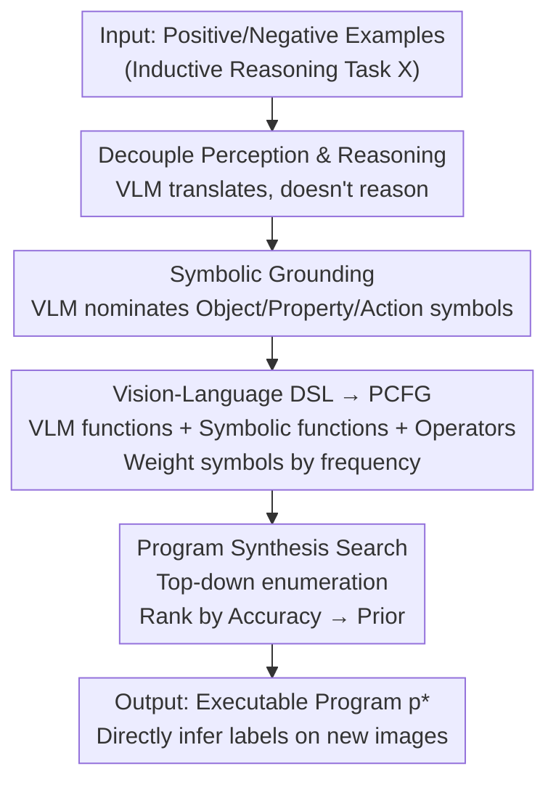

# Synthesizing Visual Concepts as Vision-Language Programs

**Conference**: CVPR 2026  
**Paper**: [CVF Open Access](https://openaccess.thecvf.com/content/CVPR2026/html/Wust_Synthesizing_Visual_Concepts_as_Vision-Language_Programs_CVPR_2026_paper.html)  
**Code**: None (Project page: ml-research.github.io/vision-language-programs)  
**Area**: Multi-modal VLM / Neuro-symbolic  
**Keywords**: Visual-Language Programs, neuro-symbolic reasoning, program synthesis, inductive visual reasoning, Probabilistic Context-Free Grammar (PCFG)

## TL;DR
Treat the VLM as a "perception function" rather than a "reasoner" — let it extract structured symbolic descriptions from images, and then use program synthesis over a Domain-Specific Language (DSL) to search for an executable logical program that expresses visual rules. This approach consistently outperforms direct VLM prompting on inductive visual reasoning tasks, while producing programs that are naturally interpretable and manually correctable.

## Background & Motivation
**Background**: Vision-Language Models (VLMs) perform strongly on multi-modal tasks but repeatedly fail in "systemic visual reasoning," especially **inductive reasoning** — given a set of positive and negative images, the model must summarize the rules distinguishing the two (e.g., Bongard tasks). VLMs often provide rules that violate constraints: in Fig. 1, the VLM proposes "contains candles," but this rule incorrectly satisfies one of the negative images.

**Limitations of Prior Work**: Two existing approaches are inadequate. First, **test-time scaling** (letting the model "think longer" via long chain-of-thought) is both expensive and prone to self-contradiction or repetitive loops. Second, **neuro-symbolic methods** can induce interpretable logical programs from examples, but they either rely on "explicit query-driven program generation" (suitable only for QA-style reasoning, not pure induction) or depend on **domain-specific object detectors/fixed predicate vocabularies**, which fail when switching visual domains.

**Key Challenge**: Perception flexibility (VLM strength) and reasoning systematicity (symbolic program strength) are tied together in the same module. VLMs treat perception and reasoning as an intertwined black box in an end-to-end fashion, causing perception errors and reasoning errors to contaminate each other without being locatable. Conversely, traditional neuro-symbolic methods excel at reasoning but are stifled by rigid domain detectors for perception.

**Goal**: To induce visual rules from a small set of labeled images that are compliant with task constraints, human-readable, and directly executable on new images, without training or reliance on manual detectors.

**Key Insight**: The authors advocate for **decoupling perception and reasoning** — instead of letting the VLM reason, it is used only for what it does best: translating images into structured symbolic descriptions (identifying objects, properties, and actions). Reasoning is delegated to a deterministic symbolic program synthesis process.

**Core Idea**: Use the VLM as a "callable perception function" embedded within a Domain-Specific Language (DSL), then use a Probabilistic Context-Free Grammar (PCFG) combined with enumerative search to synthesize the executable program that best distinguishes positive and negative examples — termed **Vision-Language Programs (VLP)**.

## Method

### Overall Architecture
The input to VLP is an inductive reasoning task $X=\{(I_1,y_1),\dots,(I_n,y_n)\}$ (where each image has a binary label; $y_i=1$ indicates the image satisfies an underlying visual rule, $y_i=0$ otherwise). The output is an executable program $p^*$ that maps any new image to a boolean prediction $\hat y = p^*(I)$. The entire pipeline is **training-free** and runs in three serial stages: first, the VLM "nominates" relevant object/property/action symbols for the current task (symbolic grounding); second, these symbols + a set of fixed functional primitives are assembled into a PCFG (DSL→PCFG); finally, an enumerative search is conducted within the program space defined by this grammar to pick the program with the "highest accuracy on examples and maximum generative prior."

Crucially, the VLM only appears in the first two steps: it is responsible for nominating symbols and acting as a "VLM function" that translates images into structured symbolic states (e.g., `[[birthday cake], [candles, colorful]]`) during execution. The actual logical combination and search are entirely deterministic symbolic processes. This allows perception errors to be traced to specific image/function outputs, while reasoning remains syntactically valid and logically consistent.

### Key Designs

**1. Decoupling Perception and Reasoning: VLM as a Perception Function**

This is the foundation of the paper, addressing the pain point where VLMs mix perception and reasoning in a black box. VLP does not embed reasoning inside the VLM; instead, it **only uses the VLM to produce structured visual descriptions**, compiles these into symbolic programs, and handles logic via deterministic execution/search. This provides dual benefits: the grammar ensures logical consistency and syntactic validity—unlike prompts that might violate constraints—and perception errors can be traced to specific outputs. For instance, the discussion reports Kimi produces malformed representations in ~13% of COCOLogic cases; such errors are unlocatable in end-to-end VLMs. Fig. 3 shows that while Qwen3 prompting yields a vague rule about "abundance," VLP searches and finds `p* = (exists_property (get_objects IMG) round)`, correctly classifying all queries.

**2. Symbolic Grounding: Dynamic Task-Specific Vocabularies**

Traditional neuro-symbolic methods rely on fixed vocabularies or detectors, which fail across domains. Symbolic grounding maps continuous visual input to discrete, type-constrained symbols across three types $G=\{\text{object}, \text{property}, \text{action}\}$. The vocabulary is **not hard-coded** but generated for each task $X$: for each type $G_i$, the pre-trained VLM $M$ is queried to obtain anchors $M(G_i, X)=E_i=\{e_{i,1},\dots,e_{i,m_i}\}$. For example, `birthday cake` and `candles` anchor the object type, while `colorful` anchors properties. This dynamic generation allows VLP to generalize to new domains and combinations without domain-specific training.

**3. Visual-Language DSL + PCFG: Searchable Program Space**

The DSL defines a **cross-task invariant** symbolic interface where task-specific semantics are carried by grounded symbols. It includes: **VLM functions** $V$ (translating images to symbolic states, e.g., `get_objects`), **Symbolic functions** $F$ (logical/arithmetic steps, e.g., `exists_object(s,e)`), and **Program operators** $O$ (AND/OR/NOT, comparisons). 

VLP **deterministically** derives a PCFG $\Gamma=(N,\Sigma,R,S,P)$ from the DSL's type system. Non-terminals $N$ correspond to return types $T=G\cup\{\text{IMG},\text{bool},\text{int},S\}$, and terminals $\Sigma$ are DSL functions and symbols. Since VLP is training-free, structural rules use **uniform weights**, while data-driven bias is applied only to terminal rules for grounded symbols $e$ using:

$$w(e) = \frac{n_{pos}}{N_{pos}} \cdot \frac{n_{pos}}{n_{pos}+n_{neg}}$$

Where $n_{pos}$ and $n_{neg}$ are occurrences in positive/negative examples. This combines **frequency and precision**, prioritizing symbols that appear often in positive examples and rarely in negatives. These weights are **not normalized within types**, ensuring highly discriminative symbols remain prioritized regardless of their category's vocabulary size.

**4. Program Synthesis Search: Top-Down Enumeration**

VLP performs a **top-down enumerative search** from the `bool` start symbol, prioritizing derivations with higher cumulative weights to traverse the large space efficiently. For each candidate $p$, it calculates task accuracy:

$$\mathrm{Acc}(p) = \frac{1}{n}\sum_{i=1}^{n} \mathbb{1}[p(I_i)=y_i]$$

Candidates are ranked primarily by $\mathrm{Acc}(p)$ and secondarily by the generative prior $W(p)$ (product of rule weights). To accelerate, VLM function outputs are **pre-computed** for each image before searching, ensuring the search phase involves only symbolic operations.

### Mechanism Example
Bongard-RWR "Round vs. Non-round objects" (Fig. 3): ① Symbolic grounding has Qwen3-VL nominate symbols like `round` for the property type. ② DSL+PCFG assembles `get_objects`, `exists_property`, and `round` into the space, weighting `round` highly. ③ Search pre-computes `get_objects` outputs, finds `(exists_property (get_objects IMG) round)` has 100% accuracy, and selects it as $p^*$. ④ Execution on query images yields correct classifications.

## Key Experimental Results

Evaluation uses balanced accuracy across Bongard-HOI, COCOLogic, and CLEVR-Hans3. Models include InternVL3, Kimi-VL, Qwen2.5-VL, and Qwen3-VL.

### Main Results (RQ1: VLP vs. Direct VLM, Balanced Accuracy %)

| Model | Average | Bongard-HOI | Bongard-OW | Bongard-RWR | COCOLogic | CLEVR-Hans3 |
|------|------|------|------|------|------|------|
| InternVL3-8B | 57.4 | 60.5 | 59.2 | 47.2 | 71.5 | 48.3 |
| **w/ VLP** | **70.9 (+13.5)** | 77.7 (+17.2) | 67.5 (+8.3) | 53.9 (+6.7) | 81.0 (+9.5) | 74.4 (+26.1) |
| Qwen2.5-VL-7B | 60.1 | 65.2 | 66.2 | 49.7 | 73.2 | 46.1 |
| **w/ VLP** | **69.5 (+9.4)** | 68.8 | 62.9 | 49.2 | 80.5 | 86.1 (+40.0) |
| Qwen3-VL-30B | 63.4 | 69.0 | 68.5 | 55.8 | 73.9 | 50.0 |
| **w/ VLP** | **68.9 (+5.5)** | 74.5 | 66.3 | 58.3 | 79.1 | 66.1 (+16.1) |

Average gains reach up to +13.5%, with **smaller models benefiting the most**. The highest gains are on CLEVR-Hans3, suggesting that as perception uncertainty increases, the advantage of structured reasoning grows. VLP also saves significantly on token usage compared to specialized "Thinking" models (RQ2).

### Key Findings
- **Scaling with Sample Size (RQ3)**: Increasing input images from 20 to 100 causes VLP performance to rise while baselines stagnate or drop. More evidence allows VLP to find more precise programs.
- **Interactive Correction (RQ4)**: In CLEVR-Hans3, InternVL3 rarely used `size` attributes. Manually adding a VLM function for size improved accuracy to 96%. Removing shortcut words like `red` or `gold` for Qwen3 improved performance by 13.3%, a level of control impossible in end-to-end VLMs.
- **Traceable Failure Modes**: Malformed symbolic representations in Kimi were identified in 13% of COCOLogic samples, providing clear debug leads.

## Highlights & Insights
- **Paradigm Shift**: The most significant insight is demoting the VLM from a "monolithic end-to-end predictor" to a `get_objects(IMG)` call within a program. This preserves neural perception while reclaiming symbolic reliability.
- **Unnormalized Weighting**: The weighting scheme $w(e)$ cleverly uses frequentist precision as a generative prior without normalization, preventing large-vocabulary types from being unfairly penalized.
- **Efficiency**: Outsourcing reasoning to deterministic search is training-free and consumes an order of magnitude fewer tokens than LLM "thinking" modes.

## Limitations & Future Work
- VLP lacks **explicit spatial representations**, making it unable to handle spatial reasoning tasks; future work needs to extend structured object representations.
- Perception Bottleneck: VLM nomination may miss attributes if done in one shot. Sequential prompting could help but increases cost.
- The DSL currently requires manual or semi-automatic configuration; automatically expanding the primitive set is a potential future direction.

## Related Work & Insights
- **vs. Query-Driven (VisProg, ViperGPT)**: Those generate programs based on **Natural Language instructions**; VLP induces programs purely from **labeled visual examples**.
- **vs. Wüst et al. (Prior Work)**: The prior version relied on **domain-specific detectors**; VLP uses general VLMs, removing the need for domain pre-training.
- **vs. Traditional Neuro-Symbolic**: Traditional methods are limited by fixed predicates; VLP uses dynamic grounding to gain cross-domain generalization.

## Rating
- Novelty: ⭐⭐⭐⭐⭐ Decoupling perception/reasoning via grounded synthesis is a clean and powerful paradigm.
- Experimental Thoroughness: ⭐⭐⭐⭐ Extensive coverage across 5 datasets and 4 RQs, though missing very large-scale real-world verification.
- Writing Quality: ⭐⭐⭐⭐⭐ Formalization of the pipeline and PCFG is clear.
- Value: ⭐⭐⭐⭐ Highly interpretable, correctable, and efficient for inductive reasoning scenarios.

<!-- RELATED:START -->

<!-- RELATED:END -->

## Related Papers

- [\[CVPR 2026\] Perception Programs: Unlocking Visual Tool Reasoning in Language Models](perception_programs_visual_tool_reasoning.md)
- [\[CVPR 2026\] Don't Show Pixels, Show Cues: Unlocking Visual Tool Reasoning in Language Models via Perception Programs](dont_show_pixels_show_cues_unlocking_visual_tool_reasoning_in_language_models_vi.md)
- [\[CVPR 2026\] Same or Not? Enhancing Visual Perception in Vision-Language Models](same_or_not_enhancing_visual_perception_in_vision-language_models.md)
- [\[CVPR 2026\] SVHalluc: Benchmarking Speech-Vision Hallucination in Audio-Visual Large Language Models](svhalluc_benchmarking_speech-vision_hallucination_in_audio-visual_large_language.md)
- [\[CVPR 2026\] LLMind: Bio-inspired Training-free Adaptive Visual Representations for Vision-Language Models](llmind_bio-inspired_training-free_adaptive_visual_representations_for_vision-lan.md)

<!-- RELATED:END -->
