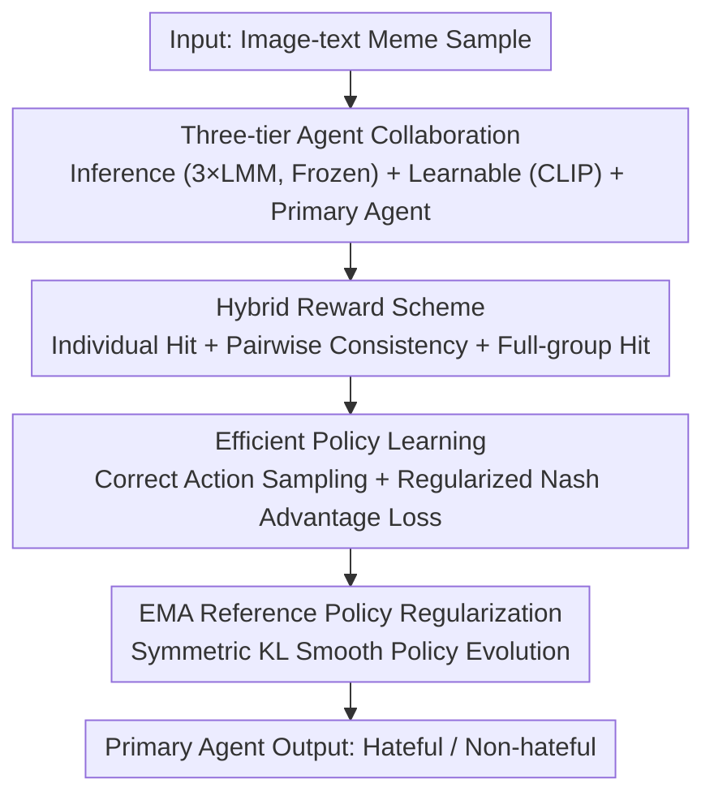

# Tackling Model Bias via Game-theoretic Multi-agent Collaboration Framework for Hateful Meme Classification

**Conference**: CVPR 2026  
**Paper**: [CVF Open Access](https://openaccess.thecvf.com/content/CVPR2026/html/Wei_Tackling_Model_Bias_via_Game-theoretic_Multi-agent_Collaboration_Framework_for_Hateful_CVPR_2026_paper.html)  
**Code**: https://github.com/NagisaG/GECO  
**Area**: Multimodal VLM / Multi-agent  
**Keywords**: Hateful meme detection, multi-agent collaboration, game theory, model bias, Nash equilibrium

## TL;DR
GECO organizes three Large Multimodal Models (LMMs), one learnable agent, and one primary decision agent into a regularized game. Driven by a "hybrid reward" system to achieve consensus on correct labels, it suppresses both individual and inter-model cognitive biases, achieving new SOTA results on five hateful meme benchmarks.

## Background & Motivation
**Background**: Hateful Meme Classification requires identifying implicit hateful sentiments from intertwined image and text content. Large Multimodal Models (LMMs) have become mainstream due to their strong reasoning capabilities, primarily through two approaches: enhancing a single LMM (e.g., LoRA modules, RAG) or multi-agent ensembles (e.g., voting, debate).

**Limitations of Prior Work**: Single models are limited by their training data and paradigms, often carrying inherent cognitive biases. Ensemble methods only partially alleviate this: voting-based approaches can amplify errors when multiple agents share the same bias; debate-based methods rely heavily on the impartiality of a judge model, which itself can be misled by the majority's incorrect interpretations. The paper cites the Nikki Haley meme as an example—where Qwen and LLaVA both misinterpret it while only Gemma captures the implicit hate. In this case, voting fails, and a judge is likely to be swayed by the majority.

**Key Challenge**: While collaboration can reduce individual model bias, it fails to address "inter-model bias." Directly applying game theory to optimize each agent independently does not guarantee convergence toward a consensus, potentially leading to unstable and self-contradictory collective decisions.

**Goal**: Enable heterogeneous LMMs to reach a consensus on "correct labels" within a game-theoretic framework while ensuring training stability.

**Key Insight**: Borrow the concept of guiding participants toward a Nash Equilibrium from game theory, but shift the objective from "individually optimal" to "collaborative equilibrium on the correct answer."

**Core Idea**: Model multimodal classification as a multi-agent game using a hybrid reward scheme (individual correctness + pairwise consistency + full-group hit) to drive the system toward a consistent collaborative solution.

## Method

### Overall Architecture
GECO decomposes detection into two steps: "agent definition" and "playing a game." The input is an image-text meme sample $\xi_k$, and the output is a binary classification (hateful / non-hateful) provided by the primary agent. The system consists of three types of agents: **Inference Agents** (three frozen LMMs: Qwen2-VL, LLaVA-1.5, Gemma3, providing complementary multimodal interpretations), a **Learnable Agent** (a CLIP model with fewer parameters, responsible for strategy learning and supplementing cross-modal alignment), and a **Primary Agent** (aggregates representations from all agents to produce the final prediction strategy). All agents project their features into a unified decision space $\mathbb{R}^D$ and output a strategy distribution over binary actions in a regularized normal-form game, optimized via a hybrid reward scheme and efficient policy learning to ensure stable convergence to equilibrium.

### Key Designs

**1. Three-tier Heterogeneous Agent Architecture: Multi-model Complementarity in a Unified Decision Space**

To address "single-model bias + inter-model bias," GECO uses three tiers instead of a single LMM. Inference agents employ three mainstream LMMs (4B to 13B), which are first fine-tuned with lightweight LoRA and then frozen during the game to preserve stable multimodal reasoning features. Each LMM takes the final token's hidden state $f_i^k$ and projects it as $z_i^k = \phi_i(f_i^k) \in \mathbb{R}^D$. The learnable agent $v_C$ uses CLIP, concatenating text tokens and image patches through $K$ Transformer layers, followed by lightweight fusion $f_{v_C}^k = p_s\tilde{s}_{cls} + p_v\tilde{v}_{cls}$. Since the LMMs are frozen, this agent is necessary to learn strategies. The primary agent $v_F$ concatenates the four representations into $z_{v_F}^k = [z_{v_L}; z_{v_Q}; z_{v_C}; z_{v_G}] \in \mathbb{R}^{4D}$ as the final decision-maker. Its utility depends on both its own actions and those of other agents, enhancing robustness. Each agent $v_i$ provides a strategy $\pi_i(a_i|\xi_k)$ over the binary action space $A_i=\{0,1\}$ using temperature-scaled softmax.

**2. Hybrid Reward Scheme: Explicitly Encoding "Consensus" into the Objective**

Traditional game theory rewards individual performance, which fails to eliminate inter-model bias. The hybrid reward designed for agent $i$ consists of three terms:

$$u_i(a_i, a_{-i}) = \alpha \cdot \mathbb{I}(a_i = y_k) + \lambda \sum_{j \in V\setminus\{i\}} \mathbb{I}(a_i = y_k)\,\mathbb{I}(a_j = y_k) + \beta \cdot \mathbb{I}(\forall j \in V,\, a_j = y_k)$$

These terms are: individual hit reward $\alpha$ (correctly answering), pairwise hit reward $\lambda$ (both the agent and a peer answering correctly), and full-group hit reward $\beta$ (all agents answering correctly). The latter two terms explicitly incorporate "consistency with others on the correct label" into the utility. By optimizing the overall expected utility $U_i(x_i, x_{-i})$, the system is pushed toward a collaborative equilibrium where everyone is correct, rather than working in isolation.

**3. Efficient Policy Learning and Regularized Nash Advantage (RNA) Loss: Stable Convergence for Binary Actions**

Since the action space is binary and incorrect classifications contribute nothing to the total expectation, GECO limits sampling to correctly classified actions for each agent. This saves computation and avoids noise from multiple samplings due to the contracted action space. To converge to a Nash Equilibrium, a regularized advantage vector $F_i^x = -\nabla_{x_i} u_i(x) + \eta \log(x_i)$ is introduced based on the expected conditional utility $U_i(a_i, x_{-i})$. This is then centralized by subtracting a baseline value $B_i$ to get $A_i = F_i^x - B_i \mathbf{1}$. The RNA loss is the inner product of the current policy and the (stop-gradient) centralized advantage: $L_{RNA}(x) = \sum_i \langle \text{sg}\,A_i, x_i \rangle$. Minimizing this pushes the policy toward actions with positive advantage.

**4. EMA Reference Policy Regularization: Suppressing Policy Oscillation**

To reduce oscillation during updates, GECO constrains the primary agent's current policy $p=\pi_{v_F}$ toward a slow reference policy $q$ maintained via EMA ($q_t \leftarrow \mu q_{t-1} + (1-\mu)p_t$). This uses a symmetric KL regularization term $J_\gamma(p,q) = (1-\gamma)D_{KL}(q\|p) + \gamma D_{KL}(p\|q)$. The final objective is $L = L_{RNA} + J_\gamma(p,q)$, where the former optimizes the game objective and the latter enforces smooth evolution.

### Loss & Training
The total loss is $L = L_{RNA} + J_\gamma(p,q)$. Inference agents are first adapted using standard language modeling loss $L_{LMM}_i$ with LoRA and then frozen. The unified decision space dimension $D=768$. Learning rate is $2\times10^{-5}$ for non-CLIP parameters and $5\times10^{-5}$ for CLIP-related modules (AdamW). Regularization coefficient $\eta=0.35$; reward weights $\alpha=1.0, \lambda=0.5, \beta=1.0$; mixing coefficient $\gamma=0.5$. Evaluation metrics include Acc / F1 / AUC.

## Key Experimental Results

### Main Results
GECO achieved SOTA across five public datasets (PrideMM, HatefulMemes, MAMI, HarMeme, MultiOff) compared to CLIP-based and LMM-based baselines:

| Dataset | Metric | Prev. SOTA (RA-HMD) | GECO | Gain |
|--------|------|------------------|------|------|
| PrideMM | Acc | 78.10 | 82.84 | +4.74 |
| MAMI | Acc / AUC | 79.90 / 90.40 | 81.50 / 91.80 | +1.60 / +1.40 |
| HatefulMemes | Acc / AUC | 82.10 / 91.10 | 84.35 / 91.57 | +2.25 / +0.47 |
| MultiOff | Acc | 71.11 | 78.52 | +7.41 |

The improvement is most significant in low-resource scenarios (MultiOff with <500 samples), indicating that collaborative optimization allows agents to exchange complementary vision-language cues and form more stable decision boundaries.

### Ablation Study
Single/dual agent ablation on PrideMM and MultiOff (Acc):

| Configuration | PrideMM Acc | MultiOff Acc | Description |
|------|-------------|--------------|------|
| Full Model | 82.84 | 78.52 | Complete model |
| w/o $v_F$ (Primary Agent) | 62.88 | 62.42 | Most significant drop; primary agent is indispensable |
| w/o $v_L$ (LLaVA) | 81.66 | 74.50 | Core inference agent; second in importance |
| w/o $v_C$ (CLIP) | 82.05 | 75.17 | Provides cross-modal semantic alignment |
| w/o $v_Q$ (Qwen) | 82.45 | 73.83 | Supplements contextual reasoning |
| w/o $\{v_L, v_C\}$ | 79.68 | 73.15 | Dual agent removal causes further degradation |

### Key Findings
- Removing the primary agent $v_F$ leads to the most severe degradation (PrideMM Acc 82.84$\rightarrow$62.88), proving that explicitly modeling the classifier as a game player is the core of the architecture.
- LMM-based methods generally outperform CLIP-based ones due to stronger reasoning, but a single LMM's perspective solidifies inherent bias; GECO proves this bias is not unavoidable through heterogeneity and collaboration.
- GECO consistently outperforms debate-based methods (ExplainHM, M2KE), as the game-theoretic adaptive collaboration is more robust than fixed dialogue rules or easily swayed judges.

## Highlights & Insights
- **Encoding Consensus into the Utility Function**: The pairwise and all-hit rewards make "being correct together with others" more profitable than "being correct alone." This is a clever way to attack inter-model bias directly through game mechanisms, which is more fundamental than post-processing ensembles like voting or debate.
- **Frozen LMMs + Learnable Small Agent**: This combination is practical. Three large models are only LoRA-adapted and then frozen to maintain stable features, while the actual strategy learning is handled by the "cheaper" CLIP agent, balancing performance and computation.
- **Restricted Sampling to Correct Actions + Single-step Update**: Leveraging the binary action space and the observation that incorrect answers contribute nothing to expectations reduces computation and avoids sampling noise. this engineering simplification could be transferred to other strategy learning tasks with small action spaces.

## Limitations & Future Work
- The framework is specifically designed for binary action spaces. Both the hybrid rewards and efficient policy learning rely on the "binary + zero-contribution for errors" assumption; extending this to multi-class classification would require redesigning the sampling and reward structures.
- Inference agents are fixed to three specific LMMs. There is a lack of systematic analysis on the sensitivity of performance to the number/selection of agents or whether more agents would yield further gains.
- Multiple hyperparameters ($\alpha, \lambda, \beta, \eta, \gamma, \mu$) require empirical setting. The trade-offs between reward weights—affecting consensus strength versus training stability—are largely empirical.

## Related Work & Insights
- **vs. Voting Ensembles (Mod-Hate)**: These use majority rules to aggregate multiple LoRA models. GECO uses game-theoretic collaborative equilibrium. The difference: voting amplifies errors when majorities share biases, while GECO explicitly pursues consistency "on the correct label."
- **vs. Debate Ensembles (ExplainHM / M2KE)**: These rely on LMM-generated explanations and a judge model. GECO has no judge; agents adaptively cooperate within a game, avoiding the risk of a judge being misled by majority bias.
- **vs. Traditional Game Theory**: Classic Nash Equilibrium optimizes for individual player optimality. GECO modifies the target to reach a collaborative equilibrium on the correct label, using RNA loss and EMA regularization to ensure stable convergence in classification tasks.

## Rating
- Novelty: ⭐⭐⭐⭐⭐ First to apply game-theoretic collaborative equilibrium to multi-agent hateful meme detection; hybrid rewards directly address inter-model bias.
- Experimental Thoroughness: ⭐⭐⭐⭐ Extensive SOTA results across five benchmarks + complete ablation; lacks sensitivity analysis for hyperparameters and agent quantity.
- Writing Quality: ⭐⭐⭐⭐ Clear motivation and methodological derivation, though some game theory notation is dense.
- Value: ⭐⭐⭐⭐ Provides a transferable game-theoretic paradigm for "debiasing via multi-model collaboration"; code is open-sourced.

<!-- RELATED:START -->

## Related Papers

- [\[CVPR 2026\] Hierarchical Attacks for Multi-Modal Multi-Agent Reasoning](hierarchical_attacks_for_multi-modal_multi-agent_reasoning.md)
- [\[ACL 2026\] MONETA: Multimodal Industry Classification through Geographic Information with Multi Agent Systems](../../ACL2026/multimodal_vlm/moneta_multimodal_industry_classification_through_geographic_information_with_mu.md)
- [\[AAAI 2026\] Large Language Models Meet Extreme Multi-label Classification: Scaling and Multi-modal Framework](../../AAAI2026/multimodal_vlm/large_language_models_meet_extreme_multi-label_classification_scaling_and_multi-.md)
- [\[AAAI 2026\] VipAct: Visual-Perception Enhancement via Specialized VLM Agent Collaboration and Tool-use](../../AAAI2026/multimodal_vlm/vipact_visual-perception_enhancement_via_specialized_vlm_age.md)
- [\[CVPR 2026\] Information-Theoretic Decomposition for Multimodal Interaction Learning](information-theoretic_decomposition_for_multimodal_interaction_learning.md)

<!-- RELATED:END -->
