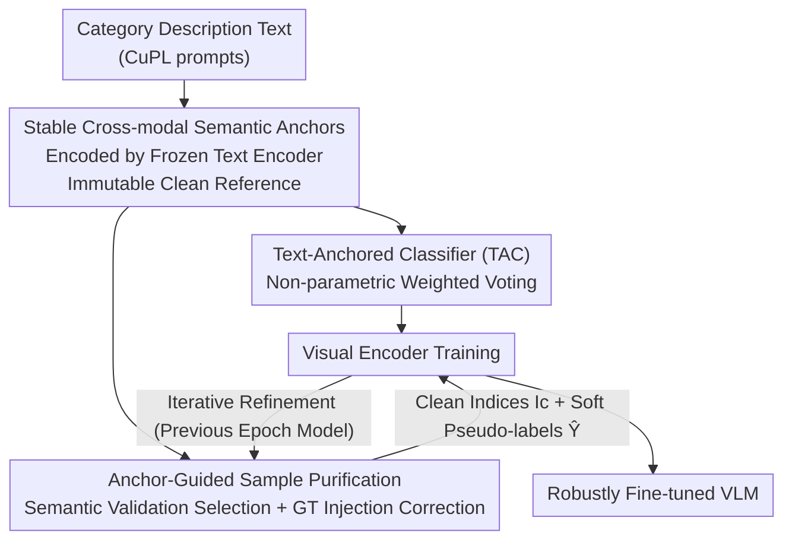

# TANGO: Text-Anchored Guided Optimization for Robust Fine-tuning Vision-Language Models under Label Noise

**Conference**: CVPR 2026  
**Paper**: [CVF Open Access](https://openaccess.thecvf.com/content/CVPR2026/html/Ma_TANGO_Text-Anchored_Guided_Optimization_for_Robust_Fine-tuning_Vision-Language_Models_under_CVPR_2026_paper.html)  
**Code**: None  
**Area**: Multimodal VLM  
**Keywords**: Label noise, robust fine-tuning, CLIP, semantic anchors, cross-modal supervision

## TL;DR
TANGO utilizes a set of "clean and immutable semantic anchors" generated by the CLIP text encoder as ground truth references independent of training labels. It replaces the noise-vulnerable parametric linear classification head with a non-parametric retrieval-based voting mechanism and employs anchors to validate and correct noisy samples. It achieves new SOTA results across six noisy benchmarks (e.g., 83.83% on CIFAR-100N, a 4.79% improvement over the strong baseline DeFT).

## Background & Motivation

**Background**: The standard practice for transferring Vision-Language Models (VLMs) like CLIP to specific downstream classification tasks is supervised fine-tuning. This involves attaching a learnable linear classification head to the vision encoder and training with cross-entropy loss on labeled data.

**Limitations of Prior Work**: Real-world datasets frequently contain label noise (errors in manual or automated annotation). Experimental results show that fine-tuning CLIP on CIFAR-100 with 40% real-world noise causes accuracy to drop by over 25%. Traditional "Learning with Noisy Labels" (LNL) methods rely on heuristics such as small-loss selection or prediction-guided correction. These essentially form a **self-referential loop**, where the model's own (already noise-polluted) predictions generate supervision signals, leading to the amplification of confirmation bias.

**Key Challenge**: Although recent VLM-specific methods have begun using cross-modal information to detect noise, they treat textual knowledge as an external oracle used only in multi-stage offline cleaning or preprocessing. Textual information is not truly integrated into the end-to-end optimization loop. The source of supervision remains rooted in potentially contaminated visual neighborhoods.

**Goal**: To make the text modality not just a tool for "noise detection," but a **completely independent ground truth reference system** that governs both classification decisions and sample purification.

**Key Insight**: By using a frozen text encoder to encode diverse category descriptions (e.g., "a deer has brown fur and four legs"), the resulting vectors naturally possess two critical properties: they are **pure** (labels are correct by definition) and **representative** (due to CLIP's alignment, they serve as proxies for the clean data manifold).

**Core Idea**: Shift the error correction mechanism from "introspective" (based on the model's own predictions) to "semantic-guided alignment" (using a set of frozen, immutable text anchors as external ground truth).

## Method

### Overall Architecture

TANGO addresses label noise during VLM fine-tuning. The approach starts by pre-computing a set of **semantic anchors** as a clean reference system. Within the standard LNL framework of "alternating epoch-wise purification and batch-wise training," these anchors are integrated into both the **classification head** and the **sample purification** process. Specifically, before each epoch, the model from the previous round performs anchor-guided purification on the entire dataset to produce clean sample indices $I_c$ and corrected soft pseudo-labels $\tilde{Y}$. The vision encoder is then trained for one epoch using a dual-component loss (hard label cross-entropy on clean samples and a regularization term for soft pseudo-labels on the full batch). The anchors remain frozen throughout, providing a stable target for the vision encoder and preventing noise from damaging the cross-modal correspondences within CLIP.

### Key Designs

**1. Stable Cross-modal Semantic Anchors: Creating an Immutable External Reference via Text**

To address the "self-referential loop"—where the model's predictions are untrustworthy—a clean reference independent of training labels is required. Diverse category-related prompts $\{p_{c,k}\}_{k=1}^K$ are prepared for each class $c$ (using CuPL prompts or LLM-generated sentences). These are encoded via a frozen text encoder $f_t(\cdot;\theta_t)$ into anchor features $A_c = \{t_{c,k} \mid t_{c,k} = f_t(p_{c,k})\}_{k=1}^K$, forming the full anchor set $A = \bigcup_c A_c$. These anchors are **pure** (labels are correct) and **representative** (proxy for the clean manifold). Because anchors are **immutable**, they force the vision encoder to maintain alignment with the original semantic space while adapting to downstream tasks, preventing noise from distorting cross-modal mappings.

**2. Text-Anchored Classifier (TAC): Replacing Noisy Linear Heads with Non-parametric Voting**

Linear heads $W$ easily overfit to noisy labels, distorting the feature space. TANGO replaces this with a **non-parametric** TAC. Instead of learning an abstract transformation, it treats image features as queries and the fixed anchor set as a key-value memory. For an image feature $v_i = f_v(x_i)$, the affinity for each anchor is calculated as $(\alpha_i)_j = \exp(\mathrm{sim}(v_i, t_j))$. The logits are obtained by the weighted sum of the clean one-hot label matrix $Y_A \in \mathbb{R}^{|A|\times C}$ of all anchors:

$$l_i = \alpha_i^{\top} Y_A.$$

Since there are no learnable parameters, predictions cannot "memorize" noise. Every decision is anchored to clean textual ground truth, mechanically blocking the path of head contamination.

**3. Anchor-Guided Sample Purification: Correcting Visual Neighborhoods with Semantic Signals**

While many LNL methods rely on local consistency (obtaining supervision from visual neighbors), pure visual neighborhoods can become "echo chambers" that propagate errors. TANGO augments and de-biases visual signals using clean semantic anchors through two paths (using fusion weight $\beta\in[0,1]$):

*Selection via Semantic Validation*: A corrected consistency score $\tilde{q}_i = (1-\beta)\cdot p_i^{\mathrm{vis}} + \beta\cdot p_i^{\mathrm{sem}}$ is calculated. Here, $p^{\mathrm{vis}}$ is based on k-NN voting (using **original noisy labels**). The semantic score $p^{\mathrm{sem}}$ is derived via a binary "vision-to-semantic" graph $A^{vs}\in\{0,1\}^{N\times|A|}$ where $(A^{vs})_{ij}=1$ if anchor $t_j$ is among the $(|A|/C)$ nearest neighbors of image $x_i$. This acts as a "committee of clean experts"; if the given label matches the semantic consensus $y_i = \arg\max(\tilde{q}_i)_c$, the sample is deemed clean.

*Correction via Ground Truth Injection*: Visual soft labels $Y^{\mathrm{vis}}$ are fused with direct ground truth injection: $\tilde{Y} = (1-\beta)\cdot Y^{\mathrm{vis}} + \beta\cdot Y^{\mathrm{sem}}$. Clean information flows from anchors to samples through a "semantic-to-vision" graph $A^{sv}\in\{0,1\}^{|A|\times N}$ (where $x_i$ is a neighbor of anchor $t_j$). The semantic labels are aggregated and normalized to produce $Y^{\mathrm{sem}} = D^{-1}(A^{sv})^{\top} Y_A$.

### Loss & Training
TANGO is embedded in a standard alternating LNL framework. The per-batch loss is $L = L_{\mathrm{clean}} + L_{\mathrm{reg}}$: $L_{\mathrm{clean}}$ is the cross-entropy on clean samples $I_c$ using **original hard labels**; $L_{\mathrm{reg}}$ is computed over the whole batch using corrected soft pseudo-labels $\tilde{Y}$, further enhanced by Mixup. Key hyperparameters are fixed ($K=40$, $\beta=0.5$). Utilizing the SGD optimizer (momentum 0.9, weight decay 5e-4), fine-tuning is performed for 20 epochs with a learning rate of 5e-4 and batch size of 64 on a CLIP ViT-B/16 backbone.

## Key Experimental Results

### Main Results

Synthetic Noise on CIFAR-100 (Test Acc %, Best) — TANGO leads across all noise types and ratios:

| Method | Sym.40% | Sym.60% | Ins.40% | Asym.30% |
|------|------|------|------|------|
| DivideMix | 87.50 | 85.09 | 85.82 | 83.74 |
| SSR | 86.34 | 83.86 | 86.85 | 86.63 |
| LSL | 87.66 | 85.36 | 88.27 | 88.01 |
| DeFT | 88.17 | 85.81 | 85.75 | 83.24 |
| **TANGO** | **89.83** | **87.89** | **89.58** | **89.23** |

Real-world Noise (Test Acc %), TANGO achieves SOTA on four out of five datasets:

| Method | CIFAR100N | Animal10N | WebVision | Food101N |
|------|------|------|------|------|
| SSR | 80.15 | 92.18 | 87.24 | 91.28 |
| LSL | 81.00 | 92.56 | 87.64 | 91.10 |
| DeFT | 79.04 | 88.26 | 83.84 | 89.12 |
| **TANGO** | **83.83** | **93.62** | 87.44 | **91.83** |

On CIFAR-100N, TANGO outperforms DeFT by 4.79%. The gap between Best and Last accuracy is minimal, indicating high training stability.

### Ablation Study

Ablation results on CIFAR-100 (synthetic) and CIFAR-100N (Real R40%):

| Configuration | S40% | I40% | A30% | R40% | Note |
|------|------|------|------|------|------|
| Baseline (Linear Head + Visual Only) | 88.80 | 88.11 | 88.42 | 81.97 | Starting point |
| **TANGO (Full)** | **89.82** | **89.58** | **89.21** | **83.83** | Complete model |
| Visual-Only Purification | 89.43 | 89.03 | 88.98 | 83.47 | Visual signal only |
| Semantic-Only Purification | 89.79 | 88.97 | 88.80 | 83.58 | Semantic signal only |
| Trainable Anchors | 89.71 | 89.14 | 89.42 | 84.01 | Anchors are learnable |
| Simpler Prompts | 89.22 | 89.04 | 88.96 | 83.86 | Simple LLM sentences |

### Key Findings
- **Visual and Semantic Complementarity**: Both Visual-Only and Semantic-Only exceed the Baseline (indicating TAC is a superior foundation). TANGO consistently outperforms both, proving the signals are complementary.
- **Strength of Semantic Signals**: Semantic-Only performance often approaches or exceeds Visual-Only, highlighting the power of clean anchor references.
- **Immutable Anchors are Robust**: While Trainable Anchors are competitive (84.01% on R40%), fixed anchors are more principled in maintaining alignment with the original semantic space.
- **Hyperparameter Insensitivity**: Performance stabilizes for $K \ge 10$. $\beta$ is robust over a wide range, peaking at 0.5. Prompt quality is beneficial but not a strict dependency.
- **Backbone Generalization**: Superior performance is maintained when switching to ViT-B/32 or SigLIP (82.11% and 85.31% on CIFAR-100N, respectively).

## Highlights & Insights
- **Upgrading "Text Detection" to "Text as Ground Truth"**: The core innovation is recognizing that because anchor labels are correct by definition, they can serve as clean supervision sources directly within classification and correction loops, breaking the self-referential cycle.
- **Decoupling via Non-parametric Head**: Replacing the linear head with retrieval-based voting prevents parameter-based memorization of noise and keeps the vision encoder aligned with CLIP's semantic space.
- **Transferable Trick**: The strategy of "frozen text anchors + neighborhood voting using original noisy labels" can be transferred to other weakly supervised or noisy scenarios, such as noisy retrieval or semi-supervised classification.

## Limitations & Future Work
- The method depends on strong cross-modal alignment (e.g., CLIP). On VLMs with weaker alignment, anchor representativeness may decrease.
- Semantic anchors are category-level and static; for fine-grained or long-tail tasks where intra-class multimodal distributions are strong, simple text descriptions may not cover all visual diversity.
- The robustness of the "ground truth injection" mechanism under extreme noise (>60%) or open-set noise requires further verification.

## Related Work & Insights
- **vs. DeFT / CLIPCleaner**: These treat VLM semantics as an offline oracle. TANGO embeds semantic anchors into end-to-end optimization, leading to significant gains on real noise benchmarks (+4.79% on CIFAR-100N).
- **vs. SSR / LSL**: These are pure visual unimodal strategies (k-NN selection / reverse k-NN relabeling). TANGO uses semantic anchors to de-bias the visual "echo chamber."
- **vs. ARF / Cluster-Adapter**: Their anchors are derived from training data as data-dependent regularizers. TANGO's anchors are immutable truths from text, aimed at combating label noise rather than OOD/few-shot regularization.

## Rating
- Novelty: ⭐⭐⭐⭐ 
- Experimental Thoroughness: ⭐⭐⭐⭐⭐ 
- Writing Quality: ⭐⭐⭐⭐ 
- Value: ⭐⭐⭐⭐ 

<!-- RELATED:START -->

## Related Papers

- [\[AAAI 2026\] Difference Vector Equalization for Robust Fine-tuning of Vision-Language Models](../../AAAI2026/multimodal_vlm/difference_vector_equalization_for_robust_fine-tuning_of_vis.md)
- [\[CVPR 2026\] FedMPT: Federated Multi-Label Prompt Tuning of Vision-Language Models](fedmpt_federated_multi-label_prompt_tuning_of_vision-language_models.md)
- [\[CVPR 2026\] AGFT: Alignment-Guided Fine-Tuning for Zero-Shot Adversarial Robustness of Vision-Language Models](agft_alignment-guided_fine-tuning_for_zero-shot_adversarial_robustness_of_vision.md)
- [\[CVPR 2026\] Towards Calibrating Prompt Tuning of Vision-Language Models](towards_calibrating_prompt_tuning_of_vision-language_models.md)
- [\[CVPR 2025\] NLPrompt: Noise-Label Prompt Learning for Vision-Language Models](../../CVPR2025/multimodal_vlm/nlprompt_noise-label_prompt_learning_for_vision-language_models.md)

<!-- RELATED:END -->
