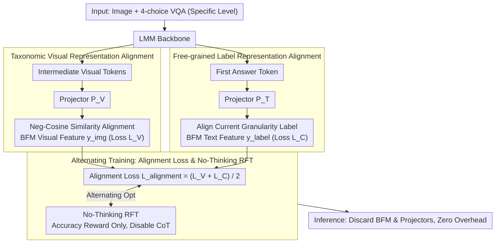

# Taxonomy-Aware Representation Alignment for Hierarchical Visual Recognition with Large Multimodal Models

**Conference**: CVPR 2026  
**arXiv**: [2603.00431](https://arxiv.org/abs/2603.00431)  
**Code**: [https://github.com/PKU-ICST-MIPL/TARA_CVPR2026](https://github.com/PKU-ICST-MIPL/TARA_CVPR2026)  
**Area**: Multimodal VLM  
**Keywords**: Hierarchical visual recognition, Biological taxonomy, Representation alignment, Biological foundation model, Reinforcement learning fine-tuning

## TL;DR
The TARA framework is proposed to inject taxonomic hierarchical knowledge into Large Multimodal Models (LMMs) by aligning their intermediate representations with the taxonomy-aware features of Biological Foundation Models (BFMs), significantly improving hierarchical visual recognition performance for both known and novel categories.

## Background & Motivation
**Background**: Large Multimodal Models perform exceptionally well in Fine-Grained Visual Recognition (FGVR), but Hierarchical Visual Recognition (HVR) requires models to predict consistent label paths from coarse to fine, a capability that remains insufficient.

**Limitations of Prior Work**: LMMs frequently violate taxonomic hierarchies—for instance, generating inconsistent predictions along the "Kingdom → Phylum → Class → Order → Family → Genus → Species" path. This issue is particularly severe for novel categories not seen in the training set.

**Key Challenge**: The visual feature encoding of LMMs lacks hierarchical biological priors, preventing them from maintaining consistent recognition results across different granularity levels.

**Goal**: To inject taxonomic hierarchical knowledge into LMMs so they can produce hierarchically consistent recognition results for both known and novel categories.

**Key Insight**: Biological Foundation Models (e.g., BioCLIP2) encode rich biological relationships through hierarchical contrastive learning, serving as a robust source of taxonomic knowledge.

**Core Idea**: Align the LMM's intermediate visual representations and the first answer token representation with the BFM's visual features and text label features, respectively, to achieve taxonomic knowledge injection.

## Method

### Overall Architecture
Input consists of an image and a four-choice VQA question specifying a taxonomic level. TARA injects the BFM's taxonomic knowledge into the LMM during training without altering the inference pipeline: one path performs **Taxonomic Visual Representation Alignment**, aligning intermediate LMM visual tokens with BFM visual features; the other performs **Free-grained Label Representation Alignment**, aligning the first answer token with BFM label text features. These alignment losses are combined into $\mathcal{L}_{\text{alignment}}$ and trained alternately with **No-Thinking RFT**, ensuring that knowledge injection and reinforcement exploration do not conflict. During inference, the BFM and projectors are discarded, incurring zero extra overhead.

### Key Designs

**1. Taxonomic Visual Representation Alignment: Cultivating Biological Hierarchies in LMM Visual Features**

The root cause of LMMs violating taxonomic hierarchies is the lack of biological priors in their visual encoding, failing to recognize that "Husky" and "Wolf" are closely situated on the taxonomic tree. TARA maps visual token representations $\mathbf{e}^{\text{img}}_{\ell,i}$ extracted from the $\ell$-th layer of the LMM through a learnable projector $P_V$ into the BFM feature space. It then minimizes the negative cosine similarity with the BFM's visual feature $\mathbf{y}_i^{\text{img}}$ for the same image:

$$\mathcal{L}_V = -\frac{1}{N}\sum_{i=1}^{N}\text{sim}\big(P_V(\mathbf{e}^{\text{img}}_{\ell,i}),\ \mathbf{y}_i^{\text{img}}\big)$$

By using BFMs (like BioCLIP2) as anchors—which are trained on massive species data using hierarchical contrastive learning—their feature spaces naturally encode "Kingdom → Phylum → Class → Order → Family → Genus → Species" relationships into geometric distances. Alignment distills this hierarchical structure into the LMM's intermediate representations.

**2. Free-grained Label Representation Alignment: Aligning the "First Answer Token" Only**

For the same bird photo, experts may want the species name while general users only need "bird"—forcing alignment for all levels simultaneously creates conflicts. TARA only takes the hidden state of the first generated answer token $\mathbf{e}^{\text{answer}}_m[0]$, maps it via projector $P_T$ to the BFM text space, and aligns it with the label feature $\mathbf{y}^{\text{label}}$ corresponding to the specific level queried in the question:

$$\mathcal{L}_C = \text{sim}\big(P_T(\mathbf{e}^{\text{answer}}_m[0]),\ \mathbf{y}^{\text{label}}\big)$$

Since the first token carries the decision-making information for the response, aligning it alone allows the model to map flexibly to the level requested by the user.

**3. Alignment Loss and No-Thinking RFT Alternating Training: Less thinking is more accurate for classification**

To ensure the model utilizes the injected knowledge, TARA alternates the optimization of alignment losses with No-Thinking RFT. No-Thinking RFT removes the Chain of Thought (CoT) to prevent the model from generating long, redundant reasoning, using only an accuracy-based reward to encourage short, direct answers. The authors observe that classification tasks do not require explicit reasoning; excessive "thinking" can introduce noise. Alternating between representation alignment (compressing knowledge) and RL (exploration in answer space) ensures both objectives are met without interference.

### Loss & Training
The total loss is $\mathcal{L}_{\text{alignment}} = (\mathcal{L}_V + \mathcal{L}_C)/2$, trained alternately with No-Thinking RFT. Projectors $P_V$ and $P_T$ are three-layer MLPs with SiLU activation. The BFM and projectors are removed during inference, ensuring no additional computational cost.

## Key Experimental Results

### Main Results

| Foundation Model | RL | TARA | HCA (Plant) | Acc_leaf (Plant) | HCA (Animal) | Acc_leaf (Animal) |
|---------|-----|------|-------------|-----------------|--------------|-------------------|
| Qwen3-VL-2B | ✗ | ✗ | 6.46 | 30.16 | 7.18 | 27.86 |
| Qwen3-VL-2B | ✓ | ✗ | 9.23 | 31.96 | 8.57 | 29.32 |
| Qwen3-VL-2B | ✓ | ✓ | **12.78** | **32.66** | **10.26** | **30.77** |
| Qwen2.5-VL-3B | ✗ | ✗ | 10.89 | 39.73 | 16.70 | 40.26 |
| Qwen2.5-VL-3B | ✓ | ✗ | 17.91 | 44.35 | 21.99 | 46.25 |
| Qwen2.5-VL-3B | ✓ | ✓ | **19.53** | **45.66** | **24.02** | **49.16** |

### TerraIncognita Novel Categories

| Species Type | RL | TARA | Order F1 | Family F1 |
|---------|-----|------|----------|-----------|
| Known | ✗ | ✗ | 17.16 | 10.83 |
| Known | ✓ | ✓ | **41.56** | **25.47** |
| Novel | ✗ | ✗ | 17.16 | 10.83 |
| Novel | ✓ | ✓ | **33.45** | **12.67** |

### Key Findings
- TARA provides consistent and significant improvements across all foundation models, with HCA metrics showing the most progress (+3.55% on Qwen3-VL-2B).
- On novel categories in TerraIncognita, TARA improves Order-level F1 by over 10 points, demonstrating effective generalization.
- The combination of RL + TARA outperforms either alone, indicating complementarity.
- Zero inference overhead as BFMs are not required during testing.

## Highlights & Insights
- **Zero Inference Overhead**: The BFM and projectors are only utilized during training. Taxonomic knowledge gains are essentially "free" at inference time.
- **No-Thinking RFT Insight**: For classification tasks, explicit reasoning can be counterproductive; direct output paired with exploratory RL is more effective. This insight is applicable to other non-reasoning-intensive VLM tasks.
- **Free-grained Alignment**: By aligning first-token representations rather than forcing all levels, the model adapts its recognition granularity based on the user's question.

## Limitations & Future Work
- Evaluation is limited to biological taxonomy; other hierarchical scenarios (e.g., product catalogs, document classification) are unexplored.
- Dependency on BioCLIP2 as a teacher model requires finding corresponding domain-specific foundation models for non-biological fields.
- Only the 1-shot setting was tested; the impact of few-shot counts remains to be explored.
- The four-choice VQA setting is simpler than open-set hierarchical classification; the design of distractors warrants further analysis.

## Related Work & Insights
- **vs Fine-R1**: Fine-R1 uses a two-stage framework to learn few-shot FGVR reasoning; TARA directly injects taxonomic knowledge via representation alignment, which is more lightweight.
- **vs HCPT**: HCPT performs hierarchically consistent prompt tuning on CLIP; TARA achieves similar goals on LMMs via BFM alignment and generalizes to novel categories.

## Rating
- Novelty: ⭐⭐⭐⭐ The approach of injecting BFM knowledge into LMMs is novel, and the zero-overhead inference design is practical.
- Experimental Thoroughness: ⭐⭐⭐⭐ Validated across multiple models and datasets with comprehensive ablation.
- Writing Quality: ⭐⭐⭐⭐ Clear structure and rigorous mathematical descriptions.
- Value: ⭐⭐⭐⭐ Opens a new direction for hierarchical recognition in LMMs.

<!-- RELATED:START -->

## Related Papers

- [\[CVPR 2026\] Unleashing the Intrinsic Visual Representation Capability of Multimodal Large Language Models](unleashing_the_intrinsic_visual_representation_capability_of_multimodal_large_la.md)
- [\[CVPR 2026\] Predictive Regularization Against Visual Representation Degradation in Multimodal Large Language Models](predictive_regularization_against_visual_representation_degradation_in_multimoda.md)
- [\[CVPR 2026\] CoVFT: Context-aware Visual Fine-tuning for Multimodal Large Language Models](covft_context-aware_visual_fine-tuning_for_multimodal_large_language_models.md)
- [\[CVPR 2026\] Direction-aware 3D Large Multimodal Models](direction-aware_3d_large_multimodal_models.md)
- [\[CVPR 2026\] Beyond Missing Modalities: Hypergraph Guided Diffusion for Uncertainty-Aware Multimodal Emotion Recognition](beyond_missing_modalities_hypergraph_conditioned_diffusion_for_uncertainty-aware.md)

<!-- RELATED:END -->
