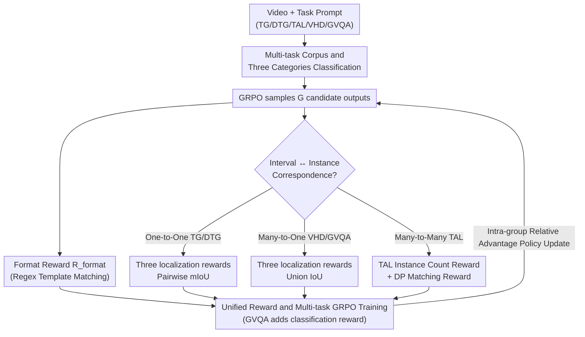

# TempR1: Improving Temporal Understanding of MLLMs via Temporal-Aware Multi-Task Reinforcement Learning

**Conference**: CVPR 2026  
**Paper**: [CVF Open Access](https://openaccess.thecvf.com/content/CVPR2026/html/Wu_TempR1_Improving_Temporal_Understanding_of_MLLMs_via_Temporal-Aware_Multi-Task_Reinforcement_CVPR_2026_paper.html)  
**Code**: None  
**Area**: Multimodal VLM  
**Keywords**: Video Temporal Understanding, Multi-modal Large Language Models, Reinforcement Learning, GRPO, Multi-task Reward Design  

## TL;DR
TempR1 unifies five video temporal tasks (Temporal Grounding TG, Dense Temporal Grounding DTG, Temporal Action Localization TAL, Video Highlight Detection VHD, and Grounded Video QA GVQA) into a multi-task reinforcement learning framework based on GRPO. The key lies in designing localization rewards based on three types of "predicted interval ↔ ground-truth instance" mappings (one-to-one, many-to-one, and many-to-many). It achieves new SOTA results across five benchmarks, demonstrating positive synergy where multi-task joint training benefits individual tasks.

## Background & Motivation
**Background**: Enabling MLLMs to understand "when events occur and how they evolve" in videos is a fundamental capability for long video analysis. This field currently follows two main tracks: Supervised Fine-Tuning (SFT) uses large-scale instruction data to strengthen temporal understanding, while Reinforcement Learning (RL) directly optimizes task objectives by rewarding reasonable predictions. RL is increasingly becoming mainstream due to its better data efficiency and generalization.

**Limitations of Prior Work**: Token-level hard supervision in SFT is prone to overfitting on limited temporal data and can weaken the model's original general reasoning capabilities. Meanwhile, existing RL methods almost exclusively narrow their scope to the **single task of temporal grounding (TG)**. They lack exposure to diverse temporal structures and fail to capture the hierarchy and compositionality of temporal dependencies, making them struggle when generalizing to broader scenarios like dense grounding, action localization, or time-sensitive QA.

**Key Challenge**: Query semantics and prediction targets vary significantly across different temporal tasks—TG focuses on event descriptions, TAL on action categories, and VHD on importance/emotional cues. While TG requires locating a single segment, TAL involves predicting multiple instances, and GVQA requires combining localization with reasoning for answering. However, they share underlying capabilities such as accurate temporal concept modeling, precise timestamp prediction, and video-text alignment. **Single-task RL fails to leverage the generalization from task diversity or the enhancement of fundamental capabilities from shared structures.**

**Goal**: Construct a unified RL framework that can simultaneously handle these five heterogeneous temporal tasks, allowing them to excel individually while mutually benefiting one another.

**Key Insight**: The authors noted that while these tasks appear very different, they essentially involve "outputting several time intervals to align with several ground-truth instances." The difference lies solely in the **correspondence between intervals and instances**, which serves as the breakthrough point for designing unified yet task-adaptive rewards.

**Core Idea**: Categorize all temporal tasks into three types based on the "predicted interval ↔ ground-truth instance" correspondence (one-to-one, many-to-one, many-to-many), tailor localization rewards for each category, and use GRPO for stable cross-task joint optimization.

## Method

### Overall Architecture
TempR1 uses Qwen2.5-VL-7B as its base model and performs reinforcement fine-tuning on a multi-task corpus of approximately 60K samples covering five temporal tasks. During training, samples from various tasks are randomly mixed per batch; prompts and reward functions are selected based on the task type of each sample. Model outputs are unified into the form `<answer>ts to te, ...</answer>` using regex parsing for time intervals. The reward system is rule-based and verifiable: first, a **format reward** ensures outputs are machine-parsable; then, **three types of localization rewards** are applied based on task correspondence; GVQA adds an additional **answer classification reward**. Finally, these rewards are fed into GRPO for policy updates based on intra-group relative advantage.

### Key Designs

**1. Multi-task Corpus and Three Correspondence Categories: Unifying Heterogeneous Tasks into One Reward Language**

Directly shoving five tasks into one RL framework makes reward design difficult because their output structures differ. The key observation is that all temporal tasks can be abstracted as "outputting $m$ predicted intervals $\{p_i\}$ to align with $n$ ground-truth instances $\{g_j\}$," with differences only in the mapping between $m$ and $n$. Tasks are categorized into: **Type 1 One-to-One** (TG, DTG, where each interval corresponds to one event, $m=n$); **Type 2 Many-to-One** (VHD, GVQA, where multiple segments represent one event or support one question); **Type 3 Many-to-Many** (TAL, where all instances of an action category must be predicted, $m$ and $n$ may differ and the true count is unknown). This categorization forms the backbone of all reward designs, ensuring "unified framework" and "task adaptation" are no longer contradictory. The corpus includes ~60K samples from Charades-STA/DiDeMo/TimeRFT (TG), ActivityNet-Caption (DTG), QVHighlights (VHD), NExT-GQA (GVQA), and ActivityNet-v1.3/HACS (TAL).

**2. Type 1/Type 2 Localization Rewards: Capturing Structure via IoU Aggregation**

For the first two types, different IoU aggregation methods provide continuous rewards rather than binary success/failure. **Type 1 (One-to-One)** directly calculates the average temporal IoU of paired intervals: $R_{\text{loc}}^{(\text{TG/DTG})} = \frac{1}{N}\sum_{i=1}^{N} \frac{\mathrm{Intersection}(p_i, g_i)}{\mathrm{Union}(p_i, g_i)}$, aligning pairs and averaging per event. The key for **Type 2 (Many-to-One)** is that "multiple predicted segments jointly represent one event"—multiple highlights in VHD describe the same highlight event, and multiple evidence segments in GVQA support a single question. Pairwise IoU would cause mismatching, so the authors merge all predicted intervals into a union region and all ground-truth intervals into another, then calculate the IoU of these two unions:

$$R_{\text{loc}}^{(\text{VHD/GVQA})} = \frac{\mathrm{Intersection}(\cup_i p_i, \cup_j g_j)}{\mathrm{Union}(\cup_i p_i, \cup_j g_j)}$$

This encodes the "multiple segments covering one event" semantics directly into the reward, avoiding segment-wise penalties that might suppress multi-segment synergy. Format-wise, $R_{\text{format}}$ ensures outputs are parsable.

**3. Type 3 Instance Count Reward + DP Matching Reward: Solving Double Uncertainty**

TAL is the hardest: the model must find all instances of an action category without knowing the count or which prediction aligns with which ground truth. The Type 3 award is split into two components. First, the **instance count reward** penalizes discrepancies between predicted and true counts: $R_{\text{num}} = \exp\!\left(-\frac{|N_{\text{pred}} - N_{\text{gt}}|}{\min(N_{\text{gt}}, 3)\cdot\sigma}\right)$, where the penalty decays exponentially with the difference, and $\sigma{=}1.0$. Second, the **matching reward**: predictions and ground truths are sorted by time, assuming "earlier predictions correspond to earlier truths." Dynamic Programming (Algorithm 1) finds the optimal matching by maximizing total IoU, yielding sIoU $=\sum_{(p_i,g_j)\in\mathcal{M}}\frac{\mathrm{Intersection}(p_i,g_j)}{\mathrm{Union}(p_i,g_j)}$, from which Precision $P$, Recall $R$, and $F1 = \frac{2PR}{P+R}$ are calculated. $R_{\text{match}}$ is set to $F1$. Final $R_{\text{loc}}^{(\text{TAL})} = R_{\text{num}} + R_{\text{match}}$. This DP matching is the soul of Type 3, as naive sequential matching fails in multi-instance scenarios.

**4. Unified Reward and Multi-task GRPO Training: Melting Three Rewards into One Objective**

All rewards are integrated into a unified objective for GRPO. GRPO replaces the PPO critic with intra-group relative comparison: given prompt $p$, policy $\pi_\theta$ samples $G$ candidates $\{o_1,\dots,o_G\}$, scores them, and normalizes them into relative advantage $A_i$ for policy updates with clipping and KL regularization. For each sample, the specific format and localization rewards are selected based on task type $t$; GVQA adds classification reward $R_{\text{cls}}$ (1 for correct choice, 0 otherwise). Total reward is:

$$R = R_{\text{format}} + R_{\text{loc}}^{(t)} + \mathbf{1}_{\{t=\text{GVQA}\}}\, R_{\text{cls}}$$

Mixed five-task data is sampled per batch, and prompt/reward functions switch dynamically. Training for 1 epoch on 60K data allows sharing of foundational temporal capabilities while preserving task-specific signals.

### Loss & Training
Base model Qwen2.5-VL-7B; videos sampled at 2 FPS (uniformly sampled to 448 frames if exceeding that); spatial resolution dynamically scaled to max 3584 visual tokens. GRPO hyperparameters follow VideoChat-R1. Trained for 1 epoch on the 60K corpus. Inference uses the same sampling and task prompts, with regex parsing for intervals.

## Key Experimental Results

### Main Results
Comprehensive comparison across five tasks against VLP experts and open-source MLLMs (multi-task joint training, 1 epoch):

| Task / Dataset | Metric | Prev. SOTA | TempR1 | Gain |
|------|------|------|------|------|
| TG / Charades-STA | mIoU | 60.8 (VideoChat-R1) | **61.4** | +0.6 |
| VHD / QVHighlights | mIoU | 65.9 (TAR-TVG) | **71.1** | +5.2 |
| DTG / ActivityNet | mIoU | — | **59.8** | Par with strongest VLP expert HSCNet |
| GVQA / NExT-GQA | Acc / Evid mIoU | 70.6 / 36.1 (VideoChat-R1) | 70.1 / **39.2** | Loc +3.1 |
| TAL / ActivityNet-v1.3 | mF1 | 58.0 (MUSEG) | **71.0** | +13.0 |

The largest improvement occurred in multi-segment retrieval (VHD, +5.2) and multi-instance tasks (TAL, +13.0), validating that "customizing rewards by correspondence" is crucial for complex structural tasks. Additional single-dataset fine-tuning pushes Charades-STA to 62.5 mIoU.

### Ablation Study

Components of Type-3 localization reward (TAL, ActivityNet-v1.3):

| Instance Count Reward | Matching Strategy | mF1 | Note |
|------|------|------|------|
| ✓ | DP Match | **70.6** | Full Type-3 Reward |
| ✗ | DP Match | 69.8 | Without Instance Count Reward |
| ✓ | Sequential Match | 45.4 | DP replaced by naive sequential matching |

Multi-task synergy (gradually adding tasks, overall evaluation across five tasks, selecting TAL mF1 and GVQA Evidence mIoU):

| Training Task Mix | Charades mIoU | NExT-GQA mIoU | TAL mF1 |
|------|------|------|------|
| TG Only | 60.2 | 21.0 | 19.9 |
| TG+DTG+GVQA | 60.8 | 38.3 | 66.6 |
| TG+DTG+VHD+GVQA | 60.3 | 37.4 | 68.2 |
| All Five Tasks | 61.4 | 39.2 | **71.0** |

### Key Findings
- **DP Matching is the Lifeline of Type-3**: Replacing DP matching with sequential matching causes TAL mF1 to crash from 70.6 to 45.4—mismatching in multi-instance scenarios distorts the optimization objective. ⚠️ Note: The text mentions mF1 drop to 60.8, but Table 3 shows 69.8; follow Table 3.
- **Multi-task Positive Synergy**: As complementary tasks are added, benchmark scores consistently rise. TAL mF1 surged from 19.9 (TG only) to 71.0 (all tasks), suggesting the model learns shared timestamp prediction, video-text alignment, and temporal reasoning.
- **RL Does Not Harm General Capabilities**: On VideoMME/Perception Test/TempCompass/MVBench, while SFT often weakens base model reasoning, TempR1's RL fine-tuning preserves or enhances it—consistent with VideoChat-R1/Time-R1 observations.
- **Algorithm Selection**: DAPO's token-level gradient favors samples with more output instances, performing weaker on TAL; GSPO's sequence-level optimization is better for VHD/TAL multi-segment tasks; GRPO is used for alignment with prior work.

## Highlights & Insights
- **The abstraction of "Interval ↔ Instance Correspondence" is elegant**: It unifies heterogeneous tasks under one reward language while allowing unique IoU aggregation for each type. This is transferable to any structural prediction RL task.
- **Union IoU for Many-to-One**: A small but precise design—when multiple segments represent one event, Union IoU avoids the suppression of synergy caused by segment-wise penalties.
- **DP Matching transforms alignment into optimization**: It provides a reliable reward signal for RL by finding the best matching between predictions and truth, which is the primary reason for the 13-point jump in TAL.
- **RL fine-tuning vs. SFT**: Unlike SFT's degradation via overfitting, RL's ability to boost specific task performance while maintaining general competency is highly attractive for MLLM deployment.

## Limitations & Future Work
- The five task types and three correspondences are manually categorized. Whether new temporal tasks (e.g., cross-video retrieval) fit these types remains undiscussed.
- Rewards remain rule-based and IoU-driven, which may amplify biases in datasets with blurred temporal boundaries or noisy labels. DP matching's monotonicity assumption might fail in scenarios with highly overlapping or interlaced actions.
- Analysis is limited to 7B base models and 1 epoch. Synergy or potential negative transfer when scaling to larger models or datasets is unexplored.

## Related Work & Insights
- **vs Traditional VLP Temporal Methods (M-DETR, etc.)**: These rely on specialized heads per task and struggle with cross-domain generalization. TempR1 uses a single MLLM end-to-end, supporting cross-task knowledge transfer.
- **vs Single-task RL (Time-R1, MUSEG, etc.)**: Most focus on TG with task-specific rewards. TempR1 expands RL to five tasks with a unified framework compatible with three correspondence structures.
- **vs SFT-based Temporal Enhancement (TRACE, etc.)**: SFT often leads to overfitting and reasoning decay; TempR1's RL fine-tuning improves targeted performance while preserving general video understanding.

## Rating
- Novelty: ⭐⭐⭐⭐ The classification of three correspondence types and typed rewards is a clean, effective abstraction.
- Experimental Thoroughness: ⭐⭐⭐⭐⭐ Covers five tasks, compares against VLP/MLLM baselines, and includes detailed ablations and general benchmarks.
- Writing Quality: ⭐⭐⭐⭐ Logic is clear; formulas are complete; minor numerical inconsistency between text and Table 3.
- Value: ⭐⭐⭐⭐ Provides an extensible multi-task RL paradigm for video temporal understanding with transferable reward design logic.

<!-- RELATED:START -->

## Related Papers

- [\[CVPR 2026\] InstAP: Instance-Aware Vision-Language Pre-Train for Spatial-Temporal Understanding](instap_instance-aware_vision-language_pre-train_for_spatial-temporal_understandi.md)
- [\[CVPR 2026\] SPARROW: Learning Spatial Precision and Temporal Referential Consistency in Pixel-Grounded Video MLLMs](sparrow_learning_spatial_precision_and_temporal_referential_consistency_in_pixel.md)
- [\[CVPR 2026\] ViKey: Enhancing Temporal Understanding in Videos via Visual Prompting](vikey_enhancing_temporal_understanding_in_videos_via_visual_prompting.md)
- [\[CVPR 2026\] Learning to Focus and Precise Cropping: A Reinforcement Learning Framework with Information Gaps and Grounding Loss for MLLMs](learning_to_focus_and_precise_croppinga_reinforcement_learning_framework_with_in.md)
- [\[CVPR 2026\] MM-ReCoder: Advancing Chart-to-Code Generation with Reinforcement Learning and Self-Correction](mm-recoder_advancing_chart-to-code_generation_with_reinforcement_learning_and_se.md)

<!-- RELATED:END -->
