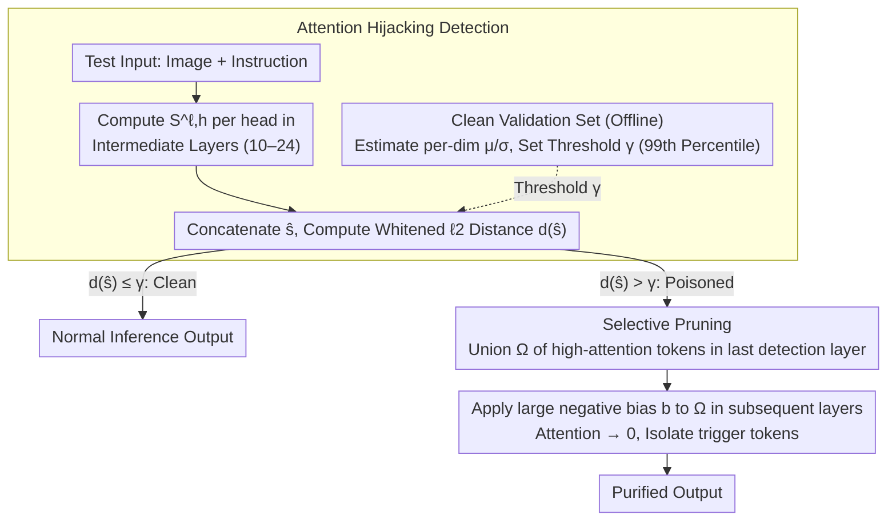

# Test-Time Attention Purification for Backdoored Large Vision Language Models

**Conference**: CVPR 2026  
**arXiv**: [2603.12989](https://arxiv.org/abs/2603.12989)  
**Code**: TBD  
**Area**: Multimodal LVLM  
**Keywords**: Backdoor Defense, Attention Purification, LVLM Security, Test-time Defense, Visual Token Pruning

## TL;DR
It is discovered that the essence of backdoor behavior in LVLMs is cross-modal attention hijacking (where trigger visual tokens seize attention from text tokens). This study proposes CleanSight—the first training-free test-time backdoor defense framework—which eliminates backdoor effects by detecting and pruning visual tokens with abnormally high attention.

## Background & Motivation
**Background**: Adapting LVLMs to downstream tasks by fine-tuning lightweight adapters has become the mainstream. However, this introduces risks of backdoor attacks—where attackers inject trigger samples into fine-tuning data, causing the model to output attacker-specified results when encountering the trigger during inference.

**Limitations of Prior Work**: Existing defense methods are primarily "training-time defenses," which involve retraining poisoned parameters using clean data. This is computationally expensive and often reduces downstream performance. The few existing test-time defenses (e.g., pixel perturbation) were designed for models trained from scratch and are largely ineffective against LVLMs.

**Key Challenge**: Backdoor associations in LVLMs do not reside in low-level pixel features but in cross-modal attention interactions—a discovery that fundamentally differs from traditional backdoor models (e.g., ViT, CLIP). Pixel perturbations cannot disrupt these attention-level associations.

**Goal**: Design the first test-time backdoor defense method for LVLMs that is training-free and plug-and-play.

**Key Insight**: The discovery of the "attention hijacking" phenomenon, where visual tokens in poisoned inputs abnormally seize attention weights from text tokens, with high-attention regions corresponding precisely to the trigger areas.

**Core Idea**: By detecting abnormal attention ratios and pruning high-attention visual tokens, backdoor effects can be eliminated at test time without modifying model parameters.

## Method

### Overall Architecture
The starting point for CleanSight is an observation: when a backdoored LVLM encounters a trigger, the visual tokens in the poisoned input abnormally seize attention that should flow to text tokens, and these "hijacking" tokens fall exactly within the trigger region. The entire defense is completed during inference without modifying any model parameters. When an input arrives, the "visual-to-text attention ratio" is quantified in the intermediate layers where cross-modal fusion is most active to determine if it is a poisoned sample. Once identified as poisoned, the abnormally high-attention visual tokens are masked in subsequent layers to prevent backdoor associations from taking effect, while normal samples remain almost unaffected. The process consists of two stages—**Attention Hijacking Detection** (including offline calibration of clean reference distributions) and **Selective Pruning**:

### Key Designs

**1. Attention Hijacking Detection: Identifying poisoned inputs via visual-text attention ratios**

Backdoor associations are hidden in cross-modal attention, and intermediate layers are where the fusion of visual and text features is most intense; therefore, detection is placed in a set of intermediate layers $\mathcal{L}_{\text{det}}$ (experimentally, layers 10–24 are most effective). For each attention head in these layers, the ratio of attention the query directs toward visual tokens versus text prompt tokens is computed: $S^{\ell,h} = \frac{\sum_{j\in\mathcal{I}_{\text{vis}}}\alpha_{q,j}^{\ell,h}}{\sum_{j\in\mathcal{I}_{\text{prm}}}\alpha_{q,j}^{\ell,h}}$. Poisoned inputs cause this ratio to be significantly higher in trigger-related heads. These ratios across all heads are concatenated into a vector $\hat{s}$, and the whitened $\ell_2$ distance from the clean reference distribution is calculated:

$$d(\hat{s}) = \left\|\tfrac{\hat{s}-\mu}{\sigma}\right\|_2,$$

If the distance exceeds the threshold $\gamma$, it is classified as poisoned. Head-level granularity is intentionally preserved rather than averaged across heads because hijacking often occurs only in a few specific heads—averaging would dilute the signal. Preserving this granularity leads to near-perfect AUROC. The "clean baseline" is calibrated offline: attention ratio vectors are collected for each sample in a small clean validation set to estimate the per-dimension mean $\mu$ and standard deviation $\sigma$. The 99th percentile of the whitened distance is set as the threshold $\gamma$. This requires only a small amount of clean data for statistics and no retraining, naturally fitting FTaaS (Fine-tuning as a Service) deployment scenarios where users cannot access the training process and only control the inference stack.

**2. Selective Pruning: Cutting off visual tokens controlled by the trigger**

Once a poisoned input is detected, the specific visual tokens causing the disruption must be accurately localized. CleanSight takes the union $\Omega$ of visual tokens whose attention exceeds a threshold $\tau$ across all heads in the last detection layer. A union is used instead of an intersection to ensure that anomalies are captured even if they appear in only a single head, leaving no suspicious positions behind. Subsequently, in all layers following the detection layers, a large negative bias $b\ll 0$ is added to the positions in $\Omega$. After the softmax operation, their attention weights approach zero, effectively isolating the trigger tokens from the information flow. Since only a small number of trigger-dominated tokens are pruned, original visual content is preserved, and performance on clean samples remains virtually undiminished.

### Loss & Training
CleanSight is a completely training-free test-time method, involving no parameter updates or loss functions. All computations are performed during forward inference.

## Key Experimental Results

### Main Results (ASR↓ / CU↑ on VQAv2 Dataset)

| Attack Type | No Defense ASR | CleanSight ASR | No Defense CU | CleanSight CU |
|-------------|----------------|----------------|---------------|---------------|
| BadNet      | 100.0          | **0.0**        | 62.89         | 62.63         |
| Blended     | 100.0          | **0.0**        | 67.06         | 65.50         |
| ISSBA       | 98.83          | **2.34**       | 65.49         | 64.71         |
| WaNet       | 100.0          | **0.0**        | 68.10         | 67.32         |
| TrojVLM     | 100.0          | **1.56**       | 68.36         | 67.97         |
| VLOOD       | 100.0          | **0.0**        | 53.65         | 53.26         |

### Comparison with Baselines

| Defense Method | BadNet ASR↓ | Blended ASR↓ | WaNet ASR↓ | Needs Training? |
|----------------|-------------|--------------|------------|-----------------|
| ST Defense     | 82.81       | 97.66        | 92.58      | No              |
| BDMAE          | 88.28       | 100.0        | 99.22      | No              |
| ZIP            | 80.47       | 84.77        | 7.03       | No              |
| CleanSight     | **0.0**     | **0.0**      | **0.0**    | No              |

### Key Findings
- CleanSight reduces ASR to near 0% across almost all attack types while maintaining clean sample performance.
- Traditional pixel perturbation defenses (Blur, ST Defense) are largely ineffective against LVLM backdoors, confirming the validity of the attention hijacking mechanism.
- The effect of attention perturbation increases monotonically with intensity; when attention is completely homogenized, the backdoor effect disappears entirely (even if trigger pixels remain).
- Detection is most effective in intermediate layers (layers 10–24), aligning with where cross-modal fusion occurs.

## Highlights & Insights
- **Significant Mechanism Discovery**: It reveals that the essence of LVLM backdoors lies in attention allocation rather than pixels. This discovery shifts the paradigm for understanding VLM backdoor attacks and defenses and can guide the design of future targeted attacks and defenses.
- **Zero Training Overhead**: As a plug-and-play inference-time method, it is suitable for FTaaS scenarios where users cannot control the training process but can control the inference stack.
- **Connection to Visual Token Pruning (e.g., FastV)**: It interestingly transforms efficiency-oriented token pruning into a security-oriented defense mechanism.

## Limitations & Future Work
- Requires a small-scale clean validation set to estimate reference distributions, making it inapplicable in scenarios with absolutely no clean data.
- The settings for thresholds $\gamma$ and $\tau$ may require adjustment for different models and attacks.
- Only backdoor attacks at the adapter/LoRA level were verified; applicability to full-parameter backdoors remains unknown.
- Detection is performed during the decoding of the first token; the impact on latency in streaming generation scenarios warrants further analysis.

## Related Work & Insights
- **vs FastV**: FastV prunes low-attention visual tokens to accelerate inference; CleanSight prunes high-attention tokens to eliminate backdoors—opposite directions but similar mechanisms.
- **vs ZIP**: ZIP defends via pixel-level perturbations, resulting in 80% ASR against BadNet; CleanSight reduces ASR to 0% through attention-level intervention.

## Rating
- Novelty: ⭐⭐⭐⭐⭐ First to reveal the attention hijacking mechanism of LVLM backdoors, opening a new direction for test-time defense.
- Experimental Thoroughness: ⭐⭐⭐⭐⭐ Covers 6 attack types, multiple datasets, and various baselines.
- Writing Quality: ⭐⭐⭐⭐⭐ Clear logic, seamlessly connecting mechanism discovery to method design.
- Value: ⭐⭐⭐⭐⭐ Provides significant momentum for the field of LVLM security.

<!-- RELATED:START -->

## Related Papers

- [\[CVPR 2026\] TTRV: Test-Time Reinforcement Learning for Vision Language Models](ttrv_test-time_reinforcement_learning_for_vision_language_models.md)
- [\[CVPR 2026\] Dynamic Logits Adjustment and Exploration for Test-Time Adaptation in Vision Language Models](dynamic_logits_adjustment_and_exploration_for_test-time_adaptation_in_vision_lan.md)
- [\[CVPR 2026\] TTL: Test-time Textual Learning for OOD Detection with Pretrained Vision-Language Models](ttl_test-time_textual_learning_for_ood_detection_with_pretrained_vision-language.md)
- [\[CVPR 2026\] STAR: Test-Time Adaptation Can Enhance Universal Prompt Learning for Vision-Language Models](star_test-time_adaptation_can_enhance_universal_prompt_learning_for_vision-langu.md)
- [\[CVPR 2026\] Activation Matters: Test-time Activated Negative Labels for OOD Detection with Vision-Language Models](activation_matters_test-time_activated_negative_labels_for_ood_detection_with_vi.md)

<!-- RELATED:END -->
