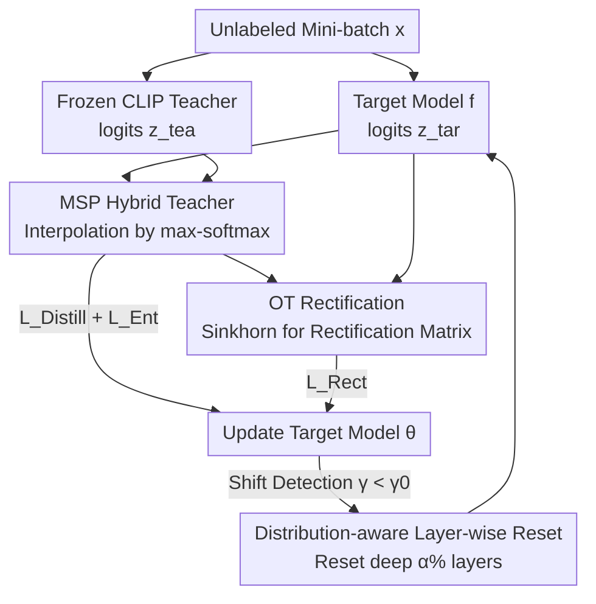

# Test-Time Distillation for Continual Model Adaptation

**Conference**: CVPR 2026  
**arXiv**: [2506.02671](https://arxiv.org/abs/2506.02671)  
**Code**: https://github.com/walawalagoose/TTD (Available)  
**Area**: Multimodal VLM / Test-Time Adaptation  
**Keywords**: Continual Test-Time Adaptation, Vision-Language Models, Knowledge Distillation, Optimal Transport, MSP Confidence

## TL;DR
Addressing the issue in Continual Test-Time Adaptation (CTTA) where "models use their own predictions for supervision, causing errors to accumulate," this paper proposes using a frozen CLIP as an external teacher to break this self-referential feedback loop (termed Test-Time Distillation, TTD). The authors design the CoDiRe framework—utilizing an MSP confidence-based hybrid teacher and Optimal Transport rectification—achieving a 10.55% improvement over CoTTA on ImageNet-C while requiring only 48% of its execution time.

## Background & Motivation
**Background**: Deep networks often suffer performance degradation during deployment due to distribution shifts (noise, blur, style changes). Test-Time Adaptation (TTA) allows models to align with the target distribution online without labels during the inference stage; Continual Test-Time Adaptation (CTTA) specifically handles scenarios where distributions **evolve continuously**. From CoTTA to subsequent variants, mainstream approaches are rooted in **self-supervision**: using the model's own predictions (entropy minimization or self-distillation with the source model as the teacher) to generate learning targets.

**Limitations of Prior Work**: Self-supervised signals form a **self-referential feedback loop**. Under significant domain shift, the model's initial predictions are inherently noisy and unreliable. Using such outputs as supervision signals creates a dangerous cycle—initial errors are amplified rather than corrected, leading to "model drift" away from the optimal point. The core problem of CTTA is not just "adaptation," but "how to adapt **reliably** without reinforcing self-bias."

**Key Challenge**: Since supervision signals originate entirely from within the model, there is a natural performance ceiling—internal signals cannot provide an "anchor" independent of the source training set and immune to target domain shifts.

**Key Insight**: The authors seek to introduce **external knowledge** as a stable anchor. Modern Vision-Language Models (VLM, represented by CLIP), pre-trained on internet-scale image-text pairs, possess rich semantic understanding that is **orthogonal to the inductive bias of any single-task classifier**. Being independent of the source training set and robust to target domain shifts, they serve as ideal external signal sources.

**Core Idea**: Reframing adaptation as a **distillation process with a frozen VLM as the teacher** (the TTD paradigm), shifting from "self-referential error correction" to "external guidance." However, direct CLIP distillation faces two pitfalls: ① **The Generalist Trap**—CLIP has broad but non-specialized knowledge, often underperforming compared to supervised classifiers with the same backbone under domain shifts (especially corruptions). Simple parameter scaling (ViT-L/14 is 10x larger than RN50) does not bridge this gap. ② **Entropy Bias**—Heterogeneous models have distinct entropy distributions due to differences in architecture, calibration, and training. Using entropy as a fusion weight systematically favors models with "globally lower entropy," yielding distorted distillation targets. Thus, the true objective becomes **constructing robust supervision signals** through effective fusion techniques and using them to guide stable adaptation.

## Method

### Overall Architecture
CoDiRe (Continual Distillation and Rectification) processes incoming unlabeled test mini-batches, using a **frozen CLIP ViT-L/14** as an external teacher to update the source pre-trained target model $f(\cdot)$ online. It consists of two main components: **Distillation**, which performs dynamic interpolation between CLIP and target model logits using MSP confidence to create a "hybrid teacher" more reliable than either single model, bypassing the generalist trap and entropy bias; and **Rectification**, which applies Optimal Transport (OT) to impose marginal constraints within the mini-batch, pulling predictions toward the class distribution determined by the hybrid teacher to prevent collapse. These, combined with a standard entropy loss, update the target model. Additionally, a **distribution-aware layer-wise reset** mechanism is employed to combat catastrophic forgetting during continual adaptation. CLIP remains frozen throughout, requiring no gradients and potentially accessible via API; the extra overhead is merely a single CLIP forward pass.

### Key Designs

**1. MSP Hybrid Teacher: Using Max-Softmax Probability as a Referee to Bypass the Generalist Trap and Entropy Bias**

Directly using CLIP as a teacher triggers the generalist trap (CLIP underperforms supervised classifiers on corruptions). Upgrading the teacher model (LLaVA, BLIP-2, GPT-4-Turbo) or scaling CLIP is ineffective. Therefore, the authors pursue "constructing a more reliable distillation target"—linearly interpolating CLIP and target model logits into a hybrid teacher: $\mathbf{z}^{\text{bt}}_i = \lambda_i \cdot \mathbf{z}^{\text{tea}}_i + (1-\lambda_i)\cdot \mathbf{z}^{\text{tar}}_i$. Both sets of logits are normalized to log-probability space by subtracting LogSumExp to ensure scale consistency.

The key lies in determining the weight $\lambda_i$. Ideally, the weight should be proportional to "who is more accurate on the current sample" (i.e., lower cross-entropy). In unlabeled scenarios, entropy is commonly used as a proxy, which causes entropy bias: heterogeneous model entropy peaks are misaligned, and weights are biased toward globally low-entropy models. The authors instead use **Maximum Softmax Probability (MSP)** as the confidence proxy:

$$\lambda_i = \frac{\exp(\max(p^{\text{tea}}_i))}{\exp(\max(p^{\text{tea}}_i)) + \exp(\max(p^{\text{tar}}_i))}.$$

Experimental correlations show that on samples where predictions conflict, MSP confidence correlates significantly better with cross-entropy than entropy does, while maintaining better distribution consistency across heterogeneous models. The distillation loss is weighted by the hybrid teacher's own confidence $\max(p^{\text{bt}}_i)$: $\mathcal{L}_{\text{Distill}}(x_i) = -\max(p^{\text{bt}}_i)\sum_{c=1}^{K} p^{\text{bt}}_{ic}\log p^{\text{tar}}_{ic}$, with $p^{\text{bt}}_i$ serving as the inference output.

**2. Optimal Transport Rectification: Imposing Marginal Constraints within Mini-batches to Prevent Collapse**

Distillation is sample-wise and lacks batch-level constraints, making it susceptible to collapse where "all samples are confidently assigned to the same class." The authors introduce an OT step to construct a **rectification matrix** $\mathbf{P}^{\text{rm}}$, which maintains fidelity to the target model's original predictions while enforcing global marginal constraints. Formally, it seeks a transport plan that maximizes alignment with target predictions: $\max_{\mathcal{P}} \operatorname{tr}(\mathbf{P}^{\text{rm}\top}\mathbf{P}^{\text{tar}})$, subject to $\mathbf{P}^{\text{rm}}\mathbf{1}_N = \mathbf{m}$ and $\mathbf{P}^{\text{rm}\top}\mathbf{1}_K = \mathbf{u}_N$. The row marginal $\mathbf{m}$ (class distribution prior of the mini-batch) is derived from a **pseudo-label vote** among $p^{\text{bt}}_i$, $p^{\text{tar}}_i$, and $p^{\text{tea}}_i$. This relaxed problem is solved via the **Sinkhorn algorithm**. The resulting distribution-aligned soft scores $p^{\text{rm}}_i$ are used to form a rectification loss through **mutual information**: $\mathcal{L}_{\text{Rect}}(x_i) = -\text{MI}(p^{\text{tar}}_i; p^{\text{rm}}_i)$. This enhances robustness at the mini-batch level and avoids severe class imbalance.

**3. Distribution-aware Layer-wise Reset: Targeted Combat Against Catastrophic Forgetting**

In long CTTA streams, models suffer from catastrophic forgetting. While CoTTA uses random parameter resets, the authors argue this is too coarse. They implement **domain shift detection followed by selective resetting**. An anchor $\theta^{\text{anchor}}$ (initialized as $\theta_0$, updated every $s$ steps) is maintained. Two displacement vectors are defined: $\delta_t = \theta_t - \theta_{t-1}$ and $\delta^{\text{anchor}}_t = \theta_{t-1} - \theta^{\text{anchor}}$. Their **cosine similarity** $\gamma = \cos(\delta_t, \delta^{\text{anchor}}_t)$ measures whether update directions are diverging; $\gamma < \gamma_0$ triggers a domain shift detection.

Instead of a full reset, based on the observation that "deep layers capture domain-specific activation statistics and are most susceptible to pollution, while shallow layers encode domain-invariant structural cues (shapes, edges)," the authors **reset only the final $\alpha\%$ of deep layers**. Ablations show that selective deep-layer resetting is consistently optimal across a wide range of $\alpha$, whereas resetting shallow, random, or high-drift layers often performs worse than no reset at all.

### Loss & Training
The total loss comprises three terms: $\mathcal{L}_{\text{total}} = \mathcal{L}_{\text{Ent}} + \mathcal{L}_{\text{Distill}} + \mathcal{L}_{\text{Rect}}$. The entropy loss follows standard TTA practices to update the model according to the current data stream: $\mathcal{L}_{\text{Ent}}(x_i) = \mathcal{E}_i / \exp(\mathcal{E}_i - \tau_{\text{Ent}})$, where $\mathcal{E}_i$ is the entropy of the target prediction and $\tau_{\text{Ent}}$ controls sensitivity. The target model uses ViT-B/16 (ImageNet-C) or ResNet-50 (other datasets), while the CLIP teacher is fixed as ViT-L/14 and remains frozen.

## Key Experimental Results

### Main Results
Evaluations are conducted in two real-world scenarios: corruption (CIFAR-10-C, ImageNet-C, with 15 types of corruption at severity 5) and domain generalization (OfficeHome, PACS).

| Dataset | Metric | CoDiRe (Ours) | Prev. SOTA | Gain |
|--------|------|------|----------|------|
| CIFAR-10-C | Avg. Accuracy | **87.25** | DeYO 80.60 | +6.65 |
| ImageNet-C | Avg. Accuracy | **60.69** | SANTA 59.62 | +1.07 |
| ImageNet-C | vs CoTTA | **60.69** | CoTTA 54.90 | +10.55 (at 48% time) |
| OfficeHome | Avg. Accuracy | **80.38** | CLIP zero-shot 78.70 | +1.68 |
| PACS | Avg. Accuracy | **98.33** | CLIP zero-shot 98.22 | +0.11 |

Notably, CLIP is weak on corruptions (ImageNet-C accuracy of 35.89 is lower than the ViT-B/16 source model's 39.05), yet CoDiRe fusion significantly outperforms either single model. On domain generalization tasks where CLIP is strong, CoDiRe still provides gains, demonstrating its ability to balance task specialization with open-world knowledge.

Comparison with VLM-TTA and baseline TTD (Average across 4 datasets, Table 4):

| Method | CIFAR-10-C | ImageNet-C | OfficeHome | PACS | Avg. |
|------|-----------|-----------|-----------|------|------|
| CLIP zero-shot | 74.39 | 35.89 | 78.70 | 98.22 | 71.80 |
| BoostAdapter (VLM-TTA) | 75.80 | 38.14 | 80.25 | 98.18 | 73.09 |
| Naive Ensemble | 76.90 | 47.95 | 79.89 | 96.29 | 75.26 |
| Distill. CLIP (Directly distill CLIP) | 77.52 | 48.29 | 61.02 | 78.34 | 66.29 |
| **CoDiRe (Ours)** | **87.25** | **60.69** | **80.38** | **98.33** | **81.66** |

The failure of "Distill. CLIP" on OfficeHome/PACS (dropping to 61/78) validates the Generalist Trap—directly using CLIP as the distillation target can misguide the target model.

### Ablation Study
Incremental addition of four components (Average CIFAR-10-C / ImageNet-C):

| Configuration | CIFAR-10-C | ImageNet-C | Avg. | Description |
|------|-----------|-----------|------|------|
| (1) Hybrid Teacher BT only (no grad) | 84.46 | 48.05 | 66.26 | Exceeds single models even without gradients |
| (2) w/o $\mathcal{L}_{\text{Distill}}$ | 86.71 | 59.30 | 73.01 | Largest drop without distillation |
| (3) w/o $\mathcal{L}_{\text{Rect}}$ | 87.02 | 59.82 | 73.42 | Without rectification |
| (5) w/o $\mathcal{L}_{\text{Ent}}$ | 87.11 | 60.15 | 73.63 | Without entropy loss |
| (6) w/o reset | 86.71 | 60.41 | 73.56 | Without reset |
| **(7) Full CoDiRe** | **87.25** | **60.69** | **73.97** | Full Method |

### Key Findings
- **Hybrid Teacher as the Foundation**: Configuration (1) shows that MSP hybrid fusion alone outperforms task-specific models and CLIP individually, proving the efficacy of fusion.
- **Distillation Loss Contribution**: Removing $\mathcal{L}_{\text{Distill}}$ causes the most significant performance drop.
- **Weighting Conflict**: MSP dynamic weights are generally more stable than fixed averages; entropy weights provide limited benefits and occasionally cause degradation, confirming the entropy bias. Naive averaging is a surprisingly strong baseline.
- **Reset Strategy**: Selective deep-layer resetting is consistently optimal. Resetting shallow or random layers often damages beneficial adaptation or interferes with domain-invariant feature learning.
- **Efficiency** (ImageNet-C, V100): CoTTA requires 18.41 GiB VRAM and 36.62 min; CoDiRe requires 8.18 GiB and 17.86 min (≈48% of CoTTA). The primary overhead is a single CLIP forward pass (approx. +30% latency).

## Highlights & Insights
- **Reframing the "Self-Referential Loop"**: By shifting from internal error correction to the "introduction of orthogonal external anchors," the authors move the problem into a new dimension. Using a frozen CLIP accessible via API is also highly practical for engineering.
- **Honest Discovery of Pitfalls**: The Generalist Trap and Entropy Bias are critical insights for any research involving VLM teachers or model fusion. It cautions against assuming CLIP is always better or using entropy for cross-model confidence.
- **MSP as a Cross-Model Referee**: MSP correlates better with cross-entropy and remains consistent across heterogeneous models compared to entropy. This strategy is highly transferable to model ensemble or merging tasks.
- **OT + Tri-party Voting**: Using CLIP, target, and hybrid models to estimate batch-level distributions via voting and Sinkhorn constraints is a lightweight and clever batch-level regularization.

## Limitations & Future Work
- **Dependency on CLIP Coverage**: Performance may be limited by CLIP's pre-training prior when the target task involves fine-grained or professional concepts CLIP has not seen.
- **Inference Overhead**: Although more efficient than CoTTA, the requirement of a ViT-L/14 forward pass per batch poses challenges for resource-constrained edge deployment.
- **Empirical Hyperparameters**: The parameters $\gamma_0$, $s$, and $\alpha$ depend on the target data. While robustness is reported, the "deep=domain-specific" assumption requires further validation on non-CNN/ViT architectures.
- **Task Scope**: Experiments are limited to image classification; the efficacy of the TTD paradigm in dense prediction tasks (detection/segmentation) remains to be verified.

## Related Work & Insights
- **vs. CoTTA / Self-distillation CTTA**: These methods use the source model as a teacher for self-distillation, which is inherently limited by an internal supervision ceiling. This work breaks the loop with an **external frozen CLIP**.
- **vs. VLM-TTA (TPT/TDA/BoostAdapter/ZERO)**: Those works improve CLIP itself at test time but struggle with corruptions. This work uses CLIP to enhance the **target model**, leveraging knowledge complementarity.
- **vs. Offline KD (CLIP-KD/CLIPPING)**: While traditional KD minimizes teacher-student feature differences offline, this method enables the target model to **evolve online** under CLIP's guidance.
- **vs. Entropy-based Fusion**: This work identifies systematic bias in entropy for heterogeneous models and proposes MSP as a methodological correction for confidence-weighted fusion.

## Rating
- Novelty: ⭐⭐⭐⭐⭐ First to introduce VLM as a distillation teacher in CTTA while honestly addressing non-trivial pitfalls like the Generalist Trap and Entropy Bias.
- Experimental Thoroughness: ⭐⭐⭐⭐⭐ 4 datasets, coverage of multiple baseline categories (TTA/CTTA/VLM-TTA), component-wise ablations, and efficiency analysis.
- Writing Quality: ⭐⭐⭐⭐⭐ Clear logical chain from motivation to method, well-supported motivating experiments, and self-consistent formulations.
- Value: ⭐⭐⭐⭐⭐ TTD is an efficient and practical new paradigm. The MSP fusion and external anchor concepts are transferable to broader OOD adaptation and model fusion scenarios.

<!-- RELATED:START -->

## Related Papers

- [\[CVPR 2026\] Condensed Test-Time Adaptation of VLMs for Action Recognition](condensed_test-time_adaptation_of_vlms_for_action_recognition.md)
- [\[CVPR 2026\] Decoupling Stability and Plasticity for Multi-Modal Test-Time Adaptation](decoupling_stability_and_plasticity_for_multi-modal_test-time_adaptation.md)
- [\[CVPR 2026\] Multi-modal Test-time Adaptation via Adaptive Probabilistic Gaussian Calibration](multi-modal_test-time_adaptation_via_adaptive_probabilistic_gaussian_calibration.md)
- [\[CVPR 2026\] Dynamic Logits Adjustment and Exploration for Test-Time Adaptation in Vision Language Models](dynamic_logits_adjustment_and_exploration_for_test-time_adaptation_in_vision_lan.md)
- [\[CVPR 2026\] Ramen: Robust Test-Time Adaptation of Vision-Language Models with Active Sample Selection](ramen_robust_test-time_adaptation_of_vision-language_models_with_active_sample_s.md)

<!-- RELATED:END -->
