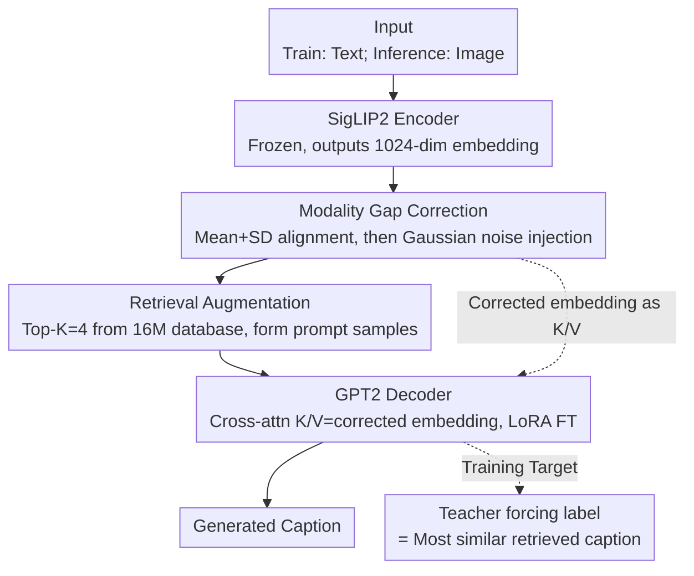

# Text-Only Training for Image Captioning with Retrieval Augmentation and Modality Gap Correction

**Conference**: CVPR 2026  
**arXiv**: [2512.04309](https://arxiv.org/abs/2512.04309)  
**Code**: To be confirmed  
**Area**: Multimodal VLM  
**Keywords**: Image Captioning, Text-Only Training, Retrieval Augmentation, Modality Gap Correction, CLIP

## TL;DR
The paper proposes TOMCap, a text-only training method for image captioning. By combining retrieval augmentation, modality gap correction, and LoRA fine-tuning, the model is trained exclusively on text but processes images during inference, outperforming existing training-free and text-only approaches.

## Background & Motivation
**Background**: Image captioning traditionally relies on supervised training using large-scale human-annotated image-text pairs. Recently, two types of low-resource methods have emerged: training-free methods (e.g., ZeroCap) that employ zero-shot inference with pre-trained models, and text-only methods that train on text corpora and switch to image inputs during inference.

**Limitations of Prior Work**: Training-free methods are prone to hallucinations. Text-only methods are constrained by the CLIP modality gap—the distributions of image and text embeddings in the same shared space are not perfectly aligned, leading to performance bias when text features are used during training and image features are used during inference.

**Key Challenge**: The core assumption of text-only training is that text embeddings can substitute for image embeddings. However, due to the CLIP modality gap, this assumption is not fully valid. Existing methods primarily rely on Gaussian noise injection to bridge this gap, which yields limited efficacy.

**Goal**: To build a more robust text-only training framework by integrating retrieval augmentation, modality gap correction, and latent representation decoding.

**Key Insight**: Instead of only correcting the mean, align the standard deviation to narrow the modality gap; simultaneously utilize retrieved similar descriptions as prompts to guide the generation process.

**Core Idea**: Seamlessly integrate retrieval-augmented prompt construction, mean-standard deviation alignment for modality gap correction, and cross-attention latent guidance to achieve high-quality text-only training for image captioning.

## Method

### Overall Architecture
TOMCap aims to solve the misalignment problem where "only text is available during training, but images must be described during inference." Its approach is to ensure that text and image embeddings stay as close as possible within the CLIP space, using retrieved similar descriptions as references and a lightweight decoder to organize this information into sentences.

The pipeline is mirrored for both training and inference, differing only at the entry point. During training, a text description is fed into a SigLIP2 encoder (acting as a CLIP-style shared encoder) to obtain embeddings. These undergo modality gap correction to "shift" them toward the image embedding distribution. The resulting embedding is used to retrieve the Top-$K=4$ similar descriptions from a 16M database to construct a prompt. Finally, a GPT2 decoder with cross-attention and LoRA decodes the sentence; the teacher forcing target is not the original text itself, but the most similar retrieved description. During inference, the only difference is the input: an image is processed by the same SigLIP2 encoder, followed by the identical correction, retrieval, prompt construction, and cross-attention decoding steps. Because the text embeddings were aligned to the image distribution during training, the model generalizes well to image embeddings during inference.

### Key Designs

**1. Modality Gap Correction: Aligning both Mean and Variance**

The bottleneck of text-only training lies in the assumption that text embeddings can substitute for image embeddings. However, in CLIP-style encoders like SigLIP2, image and text embeddings occupy the same space but their distributions do not fully overlap—a phenomenon known as the CLIP modality gap. Previous works (e.g., CapDec) only aligned the means of the two distributions, shifting the location but not the shape. TOMCap performs standardized rescaling for each dimension:

$$e_d^{T'_n} = (e_d^{T_n} - \mu_d^T) \times \frac{\sigma_d^I}{\sigma_d^T} + \mu_d^I$$

This involves subtracting the text-side mean $\mu_d^T$, scaling by the ratio of standard deviations $\sigma_d^I/\sigma_d^T$, and adding the image-side mean $\mu_d^I$. This ensures the text embeddings match both the center and the dispersion (variance) of the image distribution. Aligning both the first and second moments significantly reduces the modality gap, contributing roughly 2 additional CIDEr points over mean-only alignment. Following rescaling, TOMCap retains Gaussian noise injection with independent scaling coefficients ($B$ and $L$) for the cross-attention input and retrieval keys to further smooth residual gaps.

**2. Retrieval Augmentation: Using Similar Descriptions as Prompt Examples**

Aligning embeddings is insufficient; the model also needs to know how such content is typically described. TOMCap encodes a database of approximately 16M descriptions using SigLIP2. It retrieves the Top-$K$ nearest neighbors for the current input embedding and appends them to the text prompt: `"Similar images have the following captions: {c1}...{ck}. Write a caption:"`. These descriptions provide stylistic and semantic references, offloading the burden of "what to say and how to phrase it" from the decoder. Ablation studies indicate retrieval is the most critical component, with $K=4$ providing the optimal balance between guidance and noise.

**3. Cross-Attention + LoRA: Injecting Visual Cues at the Latent Level**

While prompts provide textual guidance, the corrected CLIP embeddings contain rich visual information. TOMCap inserts cross-attention layers into GPT2: using the corrected CLIP embeddings (input + retrieved embeddings) as keys/values and GPT2 hidden states as queries. This allows each decoding step to attend to visual/semantic vectors. To preserve GPT2’s language modeling capabilities and prevent catastrophic forgetting, only the attention projection matrices are fine-tuned using LoRA (rank=32), while the CLIP and GPT2 backbones remain frozen.

**4. Training Target: Most Similar Retrieved Description as Label**

Counter-intuitively, the teacher forcing target is not the ground truth of the input text, but rather the description from the database most similar to the input embedding. This forces the model to learn a specific mapping: "similar embeddings should decode into similar descriptions." Since the model will retrieve from the same database during inference using image embeddings, this strategy ensures behavioral consistency and enhances generalization during the modal switch.

### Loss & Training
The model uses standard cross-entropy loss to predict the token sequence of the most similar retrieved description. Since backbones are frozen and only cross-attention and LoRA parameters are trained, the number of trainable parameters is minimal. Training takes approximately 6 hours on a single NVIDIA RTX 6000.

## Key Experimental Results

### Main Results (MSCOCO Karpathy test)

| Category | Method | B@4 | METEOR | CIDEr |
|---------|--------|-----|--------|-------|
| Training-free | LMCap | 19.9 | 22.0 | 75.9 |
| Text-only | CapDec | 26.4 | 25.1 | 91.8 |
| Text-only | ViECap | 27.2 | 24.8 | 92.9 |
| Text-only | EntroCap | 27.6 | 25.3 | 94.3 |
| **Text-only** | **TOMCap (Ours)** | **28.8** | **25.5** | **97.8** |

### NoCaps Validation (CIDEr)

| Method | In-domain | Near-domain | Out-domain | Overall |
|------|-----------|-------------|------------|---------|
| ViECap | 61.1 | 64.3 | 65.0 | 66.2 |
| EntroCap | 62.5 | - | - | - |
| **TOMCap** | **71.2** | **70.8** | **68.5** | **70.4** |

### Key Findings
- TOMCap outperforms all text-only and training-free methods on MSCOCO and NoCaps.
- Retrieval augmentation is the most critical component; its removal causes the largest CIDEr drop.
- Mean+SD alignment provides a ~2-point CIDEr gain over mean-only alignment.
- $K=4$ retrieved samples is optimal; higher $K$ introduces noise.
- The significant advantage in the NoCaps Out-domain demonstrates superior generalization.

## Highlights & Insights
- **Refined Modality Gap Correction**: Extending alignment from first-order (mean) to second-order (standard deviation) moments is simple yet highly effective and likely transferable to other cross-modal tasks.
- **Retrieval as Training Target**: Using the most similar retrieval result instead of the original annotation as the training target effectively transforms retrieval from an input aid to a target constructor, improving robustness.
- **Low Compute Cost**: Requiring only text data and 6 hours on a single GPU makes this approach ideal for resource-constrained environments.

## Limitations & Future Work
- Performance still lags behind fully supervised methods by approximately 10-15 CIDEr points.
- High dependency on the external database (16M descriptions); database quality and coverage directly impact performance.
- The CLIP modality gap may vary across different domains, and uniform correction might not be optimal.
- The use of GPT2-base as a decoder is a bottleneck; larger LLMs could yield better results but require more compute.

## Related Work & Insights
- **vs SmallCap**: SmallCap also utilizes retrieval augmentation and cross-attention but requires image-text pairs for training; TOMCap removes the dependency on image training data.
- **vs CapDec**: While CapDec uses Gaussian noise to bridge the modality gap, TOMCap employs more precise statistical moment alignment.

## Rating
- Novelty: ⭐⭐⭐ (Optimized combination of existing techniques)
- Experimental Thoroughness: ⭐⭐⭐⭐ (Extensive testing on MSCOCO/NoCaps with detailed ablation)
- Writing Quality: ⭐⭐⭐⭐ (Clear methodology and well-organized experiments)
- Value: ⭐⭐⭐ (A meaningful contribution to the niche field of text-only image captioning)

<!-- RELATED:START -->

## Related Papers

- [\[CVPR 2026\] Is the Modality Gap a Bug or a Feature? A Robustness Perspective](is_the_modality_gap_a_bug_or_a_feature_a_robustness_perspective.md)
- [\[CVPR 2026\] Training-Only Heterogeneous Image-Patch-Text Graph Supervision for Advancing Few-Shot Learning Adapters](training-only_heterogeneous_image-patch-text_graph_supervision_for_advancing_few.md)
- [\[CVPR 2026\] Camouflage-aware Image-Text Retrieval via Expert Collaboration](camouflage-aware_image-text_retrieval_via_expert_collaboration.md)
- [\[CVPR 2026\] Bridging the Modality Gap in Compositional Zero-Shot Learning via Sparse Alignment and Unimodal Memory Bank](bridging_the_modality_gap_in_compositional_zero-shot_learning_via_sparse_alignme.md)
- [\[ICCV 2025\] SC-Captioner: Improving Image Captioning with Self-Correction by Reinforcement Learning](../../ICCV2025/multimodal_vlm/sc-captioner_improving_image_captioning_with_self-correction_by_reinforcement_le.md)

<!-- RELATED:END -->
