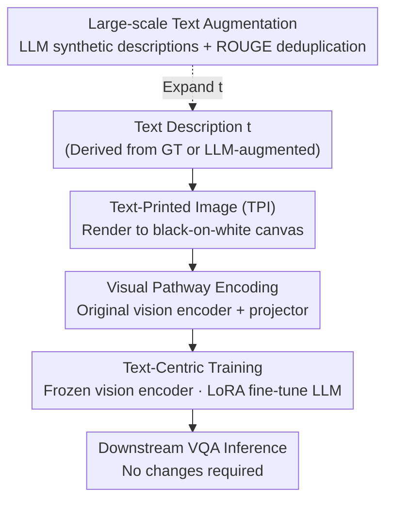

# Text-Printed Image: Bridging the Image-Text Modality Gap by "Printing" Text into Images

**Conference**: CVPR 2026  
**Paper**: [CVF Open Access](https://openaccess.thecvf.com/content/CVPR2026/html/Yamabe_Text-Printed_Image_Bridging_the_Image-Text_Modality_Gap_for_Text-centric_Training_CVPR_2026_paper.html)  
**Code**: None  
**Area**: Multimodal VLM  
**Keywords**: Text-centric training, Image-text modality gap, Text-rendered images, VLM fine-tuning, Low-cost data synthesis

## TL;DR
To fine-tune Large Vision Language Models (LVLMs) when real images are unavailable and only text descriptions exist, this paper proposes Text-Printed Image (TPI)—rendering text descriptions directly onto a plain white canvas as image input. By forcing text through the vision encoder, TPI bridges the modality gap while preserving 100% of the text semantics. It consistently outperforms "text-only" and "diffusion-generated image (T2I)" baselines across 4 models and 7 benchmarks.

## Background & Motivation

**Background**: To achieve practical performance on VQA tasks, LVLMs typically require extensive task-specific SFT using image-text pairs. Unlike LLMs that can consume massive text-only corpora, LVLMs rely on instruction data "conditioned on images," which is significantly more expensive to collect and difficult to crawl for niche or professional domains.

**Limitations of Prior Work**: Text is naturally cheap, editable, and can be expanded into diverse variants using LLMs. Consequently, "text-centric training" (training on text descriptions without real images) is an attractive low-cost paradigm. However, **directly training LVLMs on raw text is largely ineffective** due to the **image-text modality gap**: image features projected by the vision encoder and text features systematically reside in different regions of the representation space. The model treats image and text signals with the same semantics as distinct, preventing representations learned from text from transferring to image inputs at inference time.

**Key Challenge**: The most intuitive way to bridge the gap is using Text-to-Image (T2I) models (e.g., Diffusion) to synthesize images from text. However, T2I has **poor fidelity**—generated images often deviate from the original description semantics, conflicting with the paired QA. Furthermore, high-quality generation requires repeated sampling and manual screening, which balloons costs and negates the "low-cost" advantage of text-centric training. Existing CLIP-based gap reduction methods often rely on the assumption of one-to-one feature dimension alignment, which is **not directly applicable** to LVLMs where text features are token-level and vary with input length.

**Goal**: Find a transformation $T$ that synthesizes features $s=T(t)$ from text $t$ which align as closely as possible with the visual features $v_t$ of a "hypothetical image" corresponding to that description, without altering the architecture or increasing inference overhead.

**Key Insight**: The authors observe that the root of the modality gap is the **bias of the vision encoder itself**. Therefore, solving it must **utilize the representations produced by the vision encoder** rather than circumventing it.

**Core Idea**: Instead of struggling to generate "realistic" images, it is better to **directly render (print) text into an image**—black text on a plain white canvas. This forces the text through the visual pathway (via the vision encoder) while **preserving 100% of the semantics**, achieving two goals at once.

## Method

### Overall Architecture

The TPI setting follows "text-centric training": during training, real images $i$ are unavailable, and only triplets $(t, q, r)$—text description, question, and answer—are provided. The standard training objective is:

$$\mathcal{L}(\theta,\phi)=\mathbb{E}_{(t,q,r)\sim D_{\text{txt}}}\big[-\log f_\phi(r\mid T(t),\,q)\big]$$

Here, $p_\theta(\cdot)$ is the image processor comprising the "vision encoder + projector," and $f_\phi(\cdot)$ is the LLM. The key lies in defining $T$, the transformation from text to visual input. Text-only training is equivalent to $T$ being the text encoder; the T2I baseline is $T(t)=p_\theta(G(t))$ (generating an image with $G$ then encoding it). Ours uses a deterministic renderer $R(\cdot;\psi)$ to print text into an RGB image, followed by the normal visual pathway:

$$T_{\text{print}}(t)=p_\theta\big(R(t;\psi)\big)$$

The pipeline is lightweight: Take text description $\to$ render to 336×336 black-on-white image using Pillow (max font 32pt, auto-shrink to fit) $\to$ pass through the **exact same vision encoder and projector as real images** $\to$ fine-tune LLM with LoRA (freeze vision encoder, update only LLM). No changes are needed during inference.

### Key Designs

**1. Text-Printed Image (TPI): Forcing Text through the Visual Pathway**

This is the core of the paper. The pain point is that text-only training bypasses the vision encoder, resulting in mismatched representations. TPI uses a deterministic renderer $R(t;\psi)$ to print descriptions onto a canvas, creating an "image of text" encoded by the **same pathway used for real images**. The insight is "routing": since the gap comes from vision encoder bias, signals must flow through it. TPI satisfies this while ensuring **zero semantic loss**. t-SNE visualizations (ScienceQA) show TPI features residing in the same region as real image features, while text-only features form a separate cluster, confirming that text is projected into the image modality.

**2. Three Design Rules (R1–R3): Why TPI Outperforms CLIP-based and T2I Methods**

The authors define three criteria for a "good text-centric transformation":
- **(R1) Compatibility with Pretrained LVLMs**: $T$ should not rely on specific architectural assumptions. CLIP-based methods assume aligned feature dimensions, which fails for token-level LVLM text features. TPI uses the existing visual pathway, making it a true "drop-in" solution.
- **(R2) Semantic Preservation**: $s=T(t)$ must faithfully preserve the semantics of $t$. T2I often generates images that deviate from the text, while TPI has the highest fidelity because the image *is* the text (verified via Relevance Scores).
- **(R3) Efficiency and Scalability**: $T$ should not require extra training or expensive T2I pipelines. TPI is a training-free deterministic renderer with a throughput approximately **three orders of magnitude** higher than T2I.

**3. Text-Centric Training Flow: Description Generation + Frozen Vision Encoder LoRA**

For a fair comparison with "real image training," authors use Qwen2.5-VL-32B to **reverse-engineer descriptions** from real images (real images are only used offline for description generation). These descriptions are rendered as TPI. Training uses LoRA, **freezing the vision encoder and only updating the LLM** to prevent the geometric structure of visual representations from being destroyed. CKA analysis shows that while text-only training causes massive representational drift, TPI significantly suppresses this drift.

**4. Large-scale Text Augmentation: LLM Synthetic Descriptions + TPI**

TPI enables "text-based data expansion." Starting from a small pool, GPT-4o-mini generates new samples iteratively. After filtering with ROUGE-L≥0.8 for diversity, synthetic descriptions are rendered as TPI for training. Even using only **1%** of the original dataset as a seed, performance exceeds the pretrained model. Adding synthetic TPI to the full dataset further improves ScienceQA by ~2 points.

## Key Experimental Results

### Main Results

Average scores (selected) across 4 models and 7 benchmarks:

| Model | Training Method | ScienceQA | ChartQA | DocVQA | 7-Task Avg. |
|-------|-----------------|-----------|---------|--------|-------------|
| LLaVA 7B | Text-only | 72.63 | 19.24 | 28.61 | 47.12 |
| LLaVA 7B | T2I | 75.01 | 18.88 | 25.18 | 48.43 |
| LLaVA 7B | **TPI (Ours)** | 75.11 | 23.28 | 33.80 | **49.97** |
| LLaVA 7B | GT-Image (Oracle) | 78.78 | 36.68 | 39.93 | 55.58 |
| LLaMA Vision | Text-only | 66.91 | 46.68 | 83.38 | 58.50 |
| LLaMA Vision | T2I | 86.81 | 39.04 | 66.78 | 60.36 |
| LLaMA Vision | **TPI (Ours)** | 90.93 | 73.28 | 90.84 | **72.27** |
| LLaMA Vision | GT-Image (Oracle) | 93.65 | 76.48 | 92.47 | 74.43 |

TPI achieves the highest average scores among text-centric methods across all 4 models. It shows significant advantages over T2I in Text VQA tasks (ChartQA/DocVQA), where T2I often leads to performance drops.

### Efficiency and Fidelity Analysis

| Analysis | Metric | T2I | TPI (Ours) | Description |
|----------|--------|-----|------------|-------------|
| Avg. Relevance Score | Higher is better | 32.45 (46.3%) | **63.61 (90.8%)** | TPI fidelity is near GT (70.07); T2I recovers only 46% |
| Time for 6218 images | Total Time | 39347 s (1×H100) | **40 s (CPU only)** | TPI throughput is ~3 orders of magnitude higher |
| Distribution Similarity | JS Divergence (to GT) | Large | **Smallest** | TPI behavior is closest to GT training |
| Representation Similarity | Layer-wise CKA (to GT) | Medium | **Highest** | TPI best maintains the geometry of GT training |

### Key Findings

- **OCR Capability determines TPI's ceiling**: Measured by the Gap Ratio (recovery of GT gain), LLaMA Vision (OCRBench 75.2) achieves a GR of 92%, while LLaVA 7B (OCRBench 20.3) achieves 64%. Even with weak OCR, TPI outperforms text-only.
- **The "Illusion" of Text-only training**: On Qwen-VL, text-only scores seem high, but CKA shows internal representations have severely drifted. TPI maintains the representational geometry.
- **Low-resource Augmentation Works**: Using only 1% seed data, TPI growth is the largest. Gains in OK-VQA suggest the LLM synthesizes new knowledge missing from the seed set.

## Highlights & Insights
- **The concept of "printing text as images" is counter-intuitive yet elegant**: While others seek realism in T2I, this work proves realism is unnecessary—routing through the vision encoder and preserving semantics is what matters.
- **Addressing the root cause of the modality gap**: By identifying the bias in the vision encoder, the technical route of "rendering into images" rather than "aligning feature vectors" becomes the logical choice.
- **Zero training, zero inference changes, CPU-based**: TPI is a training-free deterministic process that fits into any existing LVLM pipeline with zero deployment cost.
- **Transferable Trick**: For other scenarios lacking real data in one modality, one can project the available modality into the target modality's pathway while preserving semantics, rather than synthesizing realistic samples.

## Limitations & Future Work
- **Strong dependence on Vision Encoder's OCR**: If the encoder cannot recognize rendered text, TPI gains diminish.
- **Suited for "describable" tasks**: For tasks with complex visual structures (layouts, complex charts), text descriptions inherently involve information loss.
- **Description quality depends on external models**: Errors in reverse-engineered or synthetic descriptions propagate to training; robustness to low-quality descriptions requires further study.
- **Basic Augmentation**: The augmentation method is a simple adaptation of LLM techniques; specialized text-centric augmentation for LVLMs remains open.

## Related Work & Insights
- **vs. CLIP-based methods**: TPI does not require dimension alignment or inference-time modifications, providing better compatibility (R1) and efficiency (R3).
- **vs. T2I Synthesis**: T2I pursues realism but lacks semantic fidelity (46% recovery). TPI trades realism for 100% semantic fidelity and 1000x speedup.
- **vs. Text-only Training**: Raw text training fails to bridge the modality gap and degrades internal representation geometry; TPI projects text into the image modality successfully.

## Rating
- Novelty: ⭐⭐⭐⭐⭐ 
- Experimental Thoroughness: ⭐⭐⭐⭐⭐ 
- Writing Quality: ⭐⭐⭐⭐ 
- Value: ⭐⭐⭐⭐⭐ 

<!-- RELATED:START -->

## Related Papers

- [\[CVPR 2026\] Camouflage-aware Image-Text Retrieval via Expert Collaboration](camouflage-aware_image-text_retrieval_via_expert_collaboration.md)
- [\[CVPR 2026\] Multimodal RewardBench 2: Evaluating Omni Reward Models for Interleaved Text and Image](multimodal_rewardbench_2_evaluating_omni_reward_models_for_interleaved_text_and_.md)
- [\[CVPR 2026\] Text-Only Training for Image Captioning with Retrieval Augmentation and Modality Gap Correction](text-only_training_for_image_captioning_with_retrieval_augmentation_and_modality.md)
- [\[CVPR 2026\] Training-Only Heterogeneous Image-Patch-Text Graph Supervision for Advancing Few-Shot Learning Adapters](training-only_heterogeneous_image-patch-text_graph_supervision_for_advancing_few.md)
- [\[ACL 2026\] TEMA: Anchor the Image, Follow the Text for Multi-Modification Composed Image Retrieval](../../ACL2026/multimodal_vlm/tema_anchor_the_image_follow_the_text_for_multi-modification_composed_image_retr.md)

<!-- RELATED:END -->
