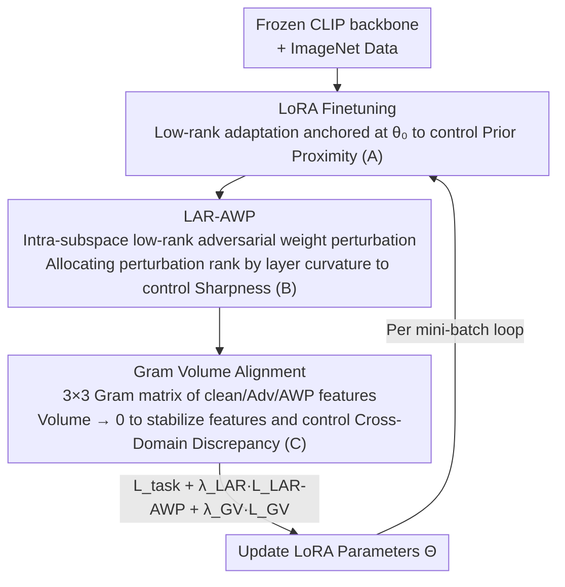

# The Geometry of Robustness: Optimizing Loss Landscape Curvature and Feature Manifold Alignment for Robust Finetuning of Vision-Language Models

**Conference**: CVPR 2026  
**Paper**: [CVF Open Access](https://openaccess.thecvf.com/content/CVPR2026/html/Chopra_The_Geometry_of_Robustness_Optimizing_Loss_Landscape_Curvature_and_Feature_CVPR_2026_paper.html)  
**Code**: None  
**Area**: Multimodal VLM  
**Keywords**: Robust Finetuning, CLIP, Loss Curvature, Adversarial Robustness, Feature Manifold Alignment

## TL;DR
This paper attributes the root cause of the "ID accuracy / OOD generalization / Adversarial robustness" trilemma in VLM robust finetuning to sharp anisotropic minima in parameter space and deformed feature manifolds under perturbation. It proposes the GRACE framework: utilizing layer-wise adaptive low-rank adversarial weight perturbation to flatten the loss curvature, combined with Gram volume alignment loss to stabilize the feature manifold. When finetuning CLIP on ImageNet, it simultaneously improves all three axes (ID 74.2%, OOD 57.0%, Adversarial 22.4%).

## Background & Motivation
**Background**: VLMs like CLIP and ALIGN are powerful universal feature extractors with strong zero-shot transfer capabilities and inherent robustness to natural distribution shifts. However, once finetuned for downstream tasks, reliability is hindered by a tri-way tradeoff: maintaining ① In-Distribution (ID) accuracy, ② Out-of-Distribution (OOD) generalization to natural/synthetic shifts, and ③ resistance to gradient-based adversarial attacks. Existing robust finetuning methods typically address at most two of these axes.

**Limitations of Prior Work**: The authors empirically categorize existing methods into two "specialized" camps. S1 Generalization camp (WiSE-FT, TPGM, SPD, FLYP, etc., relying on conservative adaptation/weight regularization/text anchoring) preserves ID/OOD but shows nearly 0% robustness against standard $\ell_p$ PGD attacks. S2 Adversarial camp (TeCoA, FARE, PMG-AFT, etc., relying on adversarial training) enhances PGD robustness but leads to significant drops in ID/OOD performance, performing even worse on natural adversarial samples like ImageNet-A/A-Plus.

**Key Challenge**: The authors' key insight is that this tradeoff is not a "pseudo-problem" solvable by hyperparameter tuning, but rather a result of different optimization objectives reshaping the underlying geometry. Theoretical and geometric analysis reveals three coupled failures: (i) finetuned weights deviate significantly from the pre-trained $\theta_0$; (ii) sharp, anisotropic minima (high parameter space complexity); (iii) feature manifold deformation under distribution shifts, leading to the collapse of feature alignment between clean/OOD/adversarial inputs.

**Goal**: To simultaneously control parameter space curvature (pushing towards flatter, lower-complexity solutions) and feature space invariance (stabilizing class structures under both input and weight perturbations) within a unified framework, thereby achieving the first joint optimization of the ID–OOD–Adv axes.

**Key Insight / Core Idea**: Under Robust PAC-Bayes theory, robust risk is decomposed into three terms: "pre-trained prior proximity + parameter space sharpness + cross-domain feature discrepancy." These are addressed by engineered modules: low-rank LoRA for prior proximity, curvature-adaptive adversarial weight perturbation for sharpness, and Gram volume alignment for cross-domain discrepancy.

## Method
The design of GRACE (Gram-aligned Robustness via Adaptive Curvature Estimation) is strictly driven by its theoretical analysis. It proves a Robust PAC-Bayes bound that decomposes the robust risk $R_{\text{Rob}}(\theta)$ into three observable terms, and then assigns a specific module to minimize each.

The bound (Theorem 3.1) is formulated as:
$$R_{\text{Rob}}(\theta) \le \hat{R}_{\text{ID}}(\theta) + \underbrace{\frac{\lVert\theta-\theta_0\rVert^2}{2n\sigma^2}}_{\text{(A) Prior Proximity}} + \underbrace{\frac{\sigma^2}{2}\mathrm{Tr}(\mathbb{E}[\nabla^2_\theta R_{\text{Rob}}])}_{\text{(B) Parameter Space Sharpness}} + \underbrace{\max_{s,t\in S} d_{\mathcal{H}\Delta\mathcal{H}}(D_s,D_t)}_{\text{(C) Cross-Domain Discrepancy}} + \lambda^*$$

where $S=\{\text{ID, OOD, Adv}\}$. The authors predict that methods optimizing only a subset will suffer predictable failures: lacking (A) leads to deviation from the pre-trained manifold and zero-shot degradation; lacking (B) leads to sharp minima and adversarial vulnerability; lacking (C) leads to unstable features and OOD degradation. Empirical verification in Tables 1/4 confirms these predictions.

### Overall Architecture
The input consists of a frozen CLIP backbone and ImageNet training data, outputting a set of trained low-rank LoRA adapters (merged back into the backbone during inference with zero overhead). Three modules minimize one term each: LoRA finetuning addresses (A), Layer-wise Adaptive Low-Rank AWP (LAR-AWP) addresses (B), and Gram Volume Alignment addresses (C). The training loop for each mini-batch involves: computing clean features and task loss → generating PGD adversarial samples → performing several steps of adversarial weight perturbation in the low-rank subspace (guided by a curvature curriculum) → computing Gram alignment loss using clean/Adv/AWP features → updating LoRA parameters using the combined loss.

The total objective is a weighted sum:
$$\mathcal{L}_{\text{GRACE}} = \mathcal{L}_{\text{task}} + \lambda_{\text{LAR}}\,\mathcal{L}_{\text{LAR-AWP}} + \lambda_{\text{GV}}\,\mathcal{L}_{\text{GV}}$$
where $\mathcal{L}_{\text{task}}$ is the standard cross-entropy loss.

### Key Designs

**1. LoRA Finetuning: Restricting adaptation to the proximity of pre-trained weights to control the KL prior term.**

Addressing failure (A) — adversarial training methods often drift too far from $\theta_0$, leading to zero-shot collapse (TeCoA shows a relative drift of 0.47 and 38.75% zero-shot, while WiSE-FT shows 0.08 drift and 60.40% zero-shot; the Pearson correlation between drift and zero-shot degradation reaches $-0.82$). GRACE trains low-rank adapters only on the frozen backbone: for each weight matrix $W\in\mathbb{R}^{n_1\times n_2}$, $W(\theta)=W(\theta_0)+B_W A_W$, where rank $r\ll\min(n_1,n_2)$, and only $\{A_W,B_W\}$ are trainable. This constrains the parameters to a small affine subspace around $\theta_0$, directly controlling the $\mathrm{KL}(Q\Vert P)$ term in the bound. LoRA acts not just as a parameter-efficient tool, but as a "geometric proximity regularizer"—subsequent adversarial perturbations reuse this same low-rank subspace, ensuring shared geometry across modules.

**2. Layer-wise Adaptive Low-Rank Adversarial Weight Perturbation (LAR-AWP): Prioritizing sharper layers.**

Addressing failure (B) — sharp anisotropic minima cause adversarial vulnerability (WiSE-FT has top Hessian eigenvalue $\lambda_{\max}=3.3\times10^3$ and 0% adversarial accuracy). Standard AWP applies uniform perturbation strength across all layers, but the VLM Hessian $\nabla^2 R$ is highly anisotropic with significant inter-layer eigenvalue variance. LAR-AWP introduces an adversarial perturbation branch $W_{\text{pert}}=W(\theta_0)+B_WA_W+B_{\text{AWP}}A_{\text{AWP}}$ within the same LoRA subspace, making the perturbation rank $r_{\text{AWP}}$ adaptive to the layer's curvature: layers with higher curvature receive higher ranks. Curvature is estimated using the mini-batch first-order gradient to approximate the Hessian diagonal trace—$h_W\approx n_v\,g_W\odot g_W$ (where $g_W$ is the cross-entropy gradient). An exponential moving average (EMA) of $h_W$ is maintained, and perturbation ranks are assigned based on curvature percentiles (higher percentiles get larger ranks, while flat layers get minimal ranks, forming a "curvature curriculum"). During training, an inner loop performs gradient ascent to find the worst-case perturbation:
$$\mathcal{L}_{\text{LAR-AWP}}\approx\frac{1}{n}\sum_i \max_{\lVert\delta_i\rVert_p\le\epsilon,\ \lVert\Delta\rVert\le\rho} \mathcal{L}\big(F_{W_{\text{pert}}(\theta,\Delta)}(x_i),y_i\big)$$
The outer loop minimizes $\mathcal{L}_{\text{task}}+\lambda_{\text{LAR}}\mathcal{L}_{\text{LAR-AWP}}$, forcing the model to perform well at $\theta$ and within its weight perturbation neighborhood, leading to flatter minima (GRACE observes $\lambda_{\max}=1.6\times10^3$, half that of unregularized methods). Locking perturbations to the low-rank subspace and allocating rank by curvature allows for sharpness reduction without the severe ID/OOD performance drops typical of standard AT.

**3. Gram Volume Alignment Loss: Forcing clean/adversarial/perturbed feature triplets to converge.**

Addressing failure (C) — the cross-domain $\mathcal{H}\Delta\mathcal{H}$ divergence is non-computable for neural networks. The authors first provide a feature-space upper bound (Lemma 3.2): $d_{\mathcal{H}\Delta\mathcal{H}}(D_s,D_t)\le 2L_f\sum_c\pi_c(\lVert\mu_s^c-\mu_t^c\rVert^2+\sqrt{\mathrm{Tr}(\Sigma_s^c-\Sigma_t^c)^2})$, reducing domain discrepancy to "class centroid alignment + covariance stability." For implementation, Gram volume is used as a differentiable proxy: for a sample $i$, let $f_{\text{ID}}, f_{\text{Adv}}, f_{\text{AWP}} \in \mathbb{R}^D$ be the $\ell_2$-normalized image features under clean, adversarial, and LAR-AWP perturbed states. These form a $3\times 3$ Gram matrix $G_i$ (with elements as pairwise dot products, including $\varepsilon I$ for stability). The loss is defined as:
$$\mathcal{L}_{\text{GV}}=\sqrt{\lvert\det(G_i)\rvert}$$
Geometrically, $\mathcal{L}_{\text{GV}}$ represents the volume of the parallelepiped spanned by the three feature vectors. As they converge (manifold stability), the volume approaches 0. When perturbations push features toward divergence, the volume increases. This constrains "clean = adversarial = perturbed" on a per-sample basis, preserving inter-class separation while ensuring intra-sample robustness.

### Loss & Training
Each mini-batch alternates through five steps. Key hyperparameters include LoRA rank $r$, AWP perturbation radius $\rho$, PGD settings (10 steps, $\ell_\infty$ radius $4/255$, step size $1/255$), and loss weights $\lambda_{\text{LAR}}, \lambda_{\text{GV}}$. Curvature scores are updated via an EMA of $h_W$. LoRA weights are merged into the backbone for inference, resulting in zero additional inference cost.

## Key Experimental Results

The backbone used is CLIP ViT-B/32, finetuned on ImageNet-1K. OOD is evaluated on ImageNet-V2/-S/-R; natural adversarial on ImageNet-A/A-Plus; synthetic adversarial on AutoAttack (APGD-CE, $\epsilon=4/255$); and zero-shot on 8 additional datasets.

### Main Results (Comprehensive Comparison, Table 6)

| Method | ID | OOD Avg | Adv Avg | Harmonic Mean |
| :--- | :--- | :--- | :--- | :--- |
| CLIP (Zero-shot) | 63.35 | 57.44 | 8.82 | 20.46 |
| Vanilla FT | 74.86 | 56.59 | 8.95 | 21.01 |
| WiSE-FT (S1 Gen.) | 70.20 | **58.05** | 9.04 | 21.11 |
| TeCoA (S2 Adv.) | 52.54 | 37.96 | 17.48 | 29.24 |
| PMG-AFT (Strong Baseline) | 58.20 | 43.40 | 19.57 | 32.85 |
| **GRACE (Ours)** | **74.21** | 57.01 | **22.44** | **39.69** |

GRACE is the only method that avoids imbalance across the ID, OOD, and Adversarial axes: ID nearly equals Vanilla FT, OOD is close to the strongest WiSE-FT, and adversarial accuracy exceeds all S2 baselines. Compared to vanilla FT, PGD adversarial accuracy increases by 13.6% on average.

### LoRA-based PEFT Cross-Comparison (Table 7)

| Method | ID | OOD | Adv | Harmonic Mean |
| :--- | :--- | :--- | :--- | :--- |
| LoRA-FT | 72.8 | 55.0 | 8.2 | 19.4 |
| LoRA-SPD | 73.0 | 56.0 | 8.5 | 19.5 |
| LoRA-TeCoA | 60.0 | 45.0 | 22.5 | 37.5 |
| VPT-PMG-AFT | 70.0 | 52.0 | 22.7 | 38.6 |
| **GRACE** | **74.2** | **57.0** | 22.4 | **39.6** |

Using the same LoRA foundation, GRACE still achieves the best overall performance, indicating that the advantage stems from "adaptive curvature perturbation + Gram alignment" rather than just low-rank adaptation.

### Ablation Study (Table 8)

| Config | ID | OOD | Adv | Harmonic Mean | Description |
| :--- | :--- | :--- | :--- | :--- | :--- |
| LoRA-FT (Baseline) | 72.8 | 55.0 | 8.2 | 19.4 | Low-rank adaptation only |
| + GV only | 72.0 | 56.5 | 8.6 | 20.2 | GV primarily improves OOD (+1.5%) |
| + LAR-AWP (No curr.) | 71.0 | 53.0 | 17.2 | 32.9 | Adv increases (+8.6%) but OOD drops |
| + LAR-AWP (Curriculum) | 72.5 | 54.0 | 22.2 | 38.7 | Curriculum pushes Adv to 22.2 |
| **GRACE (Full)** | **74.2** | **57.0** | **22.4** | **39.6** | Modules are complementary |

### Key Findings
- **Modular Complementarity**: GV primarily improves OOD (manifold stability), while LAR-AWP improves adversarial robustness (sharpness reduction). Their combination is necessary to recover ID/OOD performance, validating the theoretical prediction that all three terms must be optimized.
- **Curvature Curriculum is Crucial**: Without the curriculum, LAR-AWP achieves 17.2% Adv and 53.0% OOD; with it, Adv rises to 22.2% and OOD to 54.0%. This confirms that "prioritizing sharper layers" is far more effective than uniform perturbation.
- **Drift as a Zero-shot Predictor**: Methods with relative parameter drift >0.30 consistently lose >15% zero-shot accuracy (correlation $-0.82$). GRACE limits drift to 0.09 via LoRA, preserving pre-trained knowledge.
- **Computational Efficiency**: Pareto curves show that while GRACE costs ~5× vanilla training, it is 1.4× faster than standard adversarial training (~7×) while yielding superior harmonic means.

## Highlights & Insights
- **Theoretical-to-Empirical Pipeline**: The derivation from the PAC-Bayes bound to a three-module architecture (LoRA/LAR-AWP/Gram-Volume) followed by "failure-mode" validation creates a very clean logical chain.
- **Gram Volume as a Domain Proxy**: Reducing the complex $\mathcal{H}\Delta\mathcal{H}$ divergence to a $3\times 3$ determinant is highly intuitive. The geometric meaning (volume → 0 means feature triplet overlap) is clear and computationally inexpensive.
- **Curvature-Adaptive Low-Rank Perturbation**: Using Sophia-style gradient traces to estimate Hessian diagonals and allocating perturbation rank accordingly focuses the "flattening budget" on the sharpest layers. This "curvature-budgeting" is applicable to general sharpness-aware training.
- **Unified Low-Rank Geometry**: By sharing the low-rank subspace between LoRA updates and adversarial perturbations, proximity and sharpness regularizations are naturally coupled.

## Limitations & Future Work
- Main experiments focus on CLIP ViT-B/32 on ImageNet; scalability to larger backbones (ViT-L, other VLM families) and larger downstream datasets requires further validation.
- GRACE introduces PGD inner loops, AWP maximization, and curvature estimation, costing ~5× vanilla training. Although cheaper than standard AT, this is still significantly more expensive than pure generalization methods.
- The theoretical bound relies on smoothness and Lipschitz assumptions; the tightness of the Gram volume as an upper-bound proxy remains to be quantified.
- In OOD tasks, GRACE (57.01) still slightly trails pure generalization methods like WiSE-FT (58.05), indicating the trilemma is mitigated but not entirely eliminated.
- Adversarial evaluation is focused on $\ell_\infty$ PGD/AutoAttack; robustness against other norms or attack types remains to be explored.

## Related Work & Insights
- **vs WiSE-FT / TPGM / SPD (Gen. S1)**: These methods preserve ID/OOD via weight interpolation or constrained adaptation (minimizing term A) but ignore sharpness, resulting in ~0% adversarial accuracy. GRACE adds sharpness and manifold regularization.
- **vs TeCoA / FARE / PMG-AFT (Adv. S2)**: These improve adversarial robustness but often drift too far from $\theta_0$ (missing term A), hurting OOD/zero-shot. GRACE uses LoRA to anchor the model while replacing brute-force AT with curvature-adaptive perturbation.
- **vs Standard AWP**: While standard AWP perturbs the whole model uniformly, LAR-AWP focuses on the LoRA subspace and uses curvature-driven rank allocation to address the anisotropic VLM Hessian.
- **vs FARE**: GRACE adopts the "align clean and adversarial features" concept but extends it to a clean/Adv/AWP triplet via Gram volume and supplements it with curvature regularization.

## Rating
- **Novelty**: ⭐⭐⭐⭐⭐ A unified geometry-driven framework derived from PAC-Bayes decomposition is rare and innovative.
- **Experimental Thoroughness**: ⭐⭐⭐⭐ Includes multiple benchmarks, failure-mode analysis, and efficiency Pareto curves, though predominantly on ViT-B/32.
- **Writing Quality**: ⭐⭐⭐⭐ Clear logic from theory to method; minor typos in result descriptions.
- **Value**: ⭐⭐⭐⭐⭐ Successfully addresses the ID-OOD-Adv trilemma in VLMs with a transferable geometric paradigm.

<!-- RELATED:START -->

## Related Papers

- [\[CVPR 2026\] Is the Modality Gap a Bug or a Feature? A Robustness Perspective](is_the_modality_gap_a_bug_or_a_feature_a_robustness_perspective.md)
- [\[CVPR 2026\] TANGO: Text-Anchored Guided Optimization for Robust Fine-tuning Vision-Language Models under Label Noise](tango_text-anchored_guided_optimization_for_robust_fine-tuning_vision-language_m.md)
- [\[CVPR 2026\] GaussianVision: Vision-Language Alignment from Compressed Image Representations using 2D Gaussian Splatting](gaussianvision_vision-language_alignment_from_compressed_image_representations_u.md)
- [\[CVPR 2026\] SynCLIP: Synonym-Coherent Language-Image Pretraining for Robust Open-Vocabulary Dense Perception](synclip_synonym-coherent_language-image_pretraining_for_robust_open-vocabulary_d.md)
- [\[CVPR 2026\] Continual Learning with Vision-Language Models via Semantic-Geometry Preservation](continual_learning_with_vision-language_models_via_semantic-geometry_preservatio.md)

<!-- RELATED:END -->
