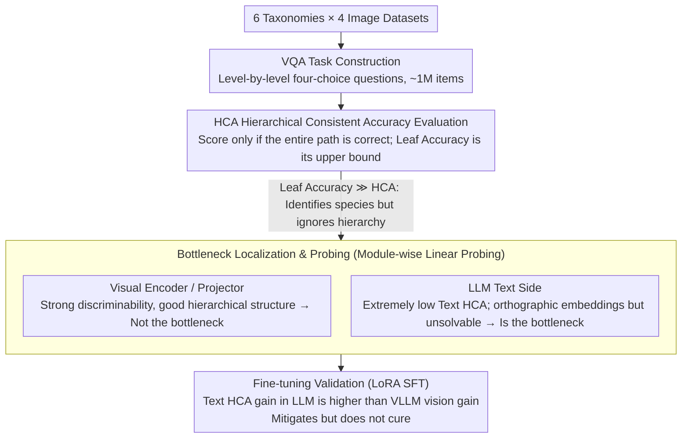

# The LLM Bottleneck: Why Open-Source Vision LLMs Struggle with Hierarchical Visual Recognition

**Conference**: CVPR2026  
**arXiv**: [2505.24840](https://arxiv.org/abs/2505.24840)  
**Code**: [yuanqing-ai.github.io/llm-hierarchy](https://yuanqing-ai.github.io/llm-hierarchy/)  
**Area**: Multimodal VLM  
**Keywords**: Hierarchical Visual Recognition, Taxonomic Consistency, LLM Bottleneck, Taxonomic Knowledge, VQA

## TL;DR
This paper reveals that open-source LLMs lack hierarchical taxonomic knowledge of the visual world (even failing at basic biological taxonomic systems), which makes the LLM a bottleneck for hierarchical visual recognition in Vision LLMs.

## Background & Motivation

**Key Challenge**: Taxonomy is central to visual recognition (e.g., Boston Terrier → Terrier → Dog → Mammal → Animal forms a semantic path). An ideal general-purpose visual recognition system should simultaneously map to leaf nodes and internal nodes of a taxonomy while maintaining hierarchical consistency. Vision LLMs (VLLMs) unify multiple visual tasks and possess the potential to build such a system, but existing evaluations primarily focus on leaf-node classification accuracy, ignoring hierarchical consistency.

**Background**: Open-source and commercial VLLMs lack severe consistency in hierarchical recognition. For instance, Qwen2.5-VL-72B fails on over 67% of the paths in the iNaturalist taxonomy.

**Limitations of Prior Work**: The root of the problem does not lie in the visual encoders or projectors (which preserve highly discriminative, well-structured features), but in the LLM—open-source LLMs lack taxonomic knowledge.

**Goal**: While fine-tuning VLLMs can assist, it cannot fundamentally solve the issue. Furthermore, the improvement in text-level hierarchical consistency for the LLM during fine-tuning exceeds the improvement in visual hierarchical consistency for the VLLM, further confirming the LLM's bottleneck effect.

## Method

### Overall Architecture

This is an analytical paper rather than a methodology paper, aiming to locate "why open-source VLLMs underperform in hierarchical visual recognition." The research follows a chain of investigation in four steps: first, constructing a unified question bank of approximately 1 million level-by-level four-choice VQA questions from 6 taxonomies across 4 image datasets; second, measuring the scale of the problem using a stricter hierarchical consistency metric, HCA; third, performing linear probing module-by-module on the visual encoder, projector, and LLM to exclude the visual side and pinpoint the LLM as the bottleneck; finally, validating this conclusion through LoRA fine-tuning experiments from the opposite direction.

### Key Designs

**1. VQA Task Construction: Decomposing Taxonomic Knowledge into Level-by-level Four-choice Questions**

To systematically compare model performance across different granularities, a question bank covering complete hierarchies is required. The authors generated four-choice questions for each level across 6 taxonomies (4 image datasets): iNat21-Animal, iNat21-Plant, ImgNet-Artifact, ImgNet-Animal, CUB-200, and Oxford-Pets. All four options come from the same level, covering all hierarchies from coarse-grained (vertebrate/invertebrate) to fine-grained (specific species), resulting in approximately 1 million questions. Since each question tests only one granularity, it can cleanly isolate exactly at which layer the model begins to fail—serving as a unified benchmark for subsequent analysis.

**2. Hierarchical Consistency Metric HCA: Scoring Entire Paths Instead of Single Points**

Leaf accuracy only checks if the finest granularity is correct, failing to measure whether the model understands the hierarchy. The authors employ HCA (Hierarchical Consistent Accuracy): an image is considered correct only if every level along the taxonomic path is answered correctly:

$$HCA = \frac{1}{N}\sum_{i=1}^N \prod_{j=1}^{L^i} \mathbb{1}[f_\theta(x^i; Y_j) = y_j^i]$$

If any level in the product sequence is wrong, the entire path is judged as 0. Leaf accuracy $Acc_{leaf}$ focuses only on the finest granularity and is the upper bound of HCA. The massive gap between the two (e.g., Qwen2.5-VL-72B's 54.20 leaf accuracy vs. 35.73 HCA) provides quantitative evidence of "recognizing the species but not knowing its category," serving as the starting point for bottleneck investigation.

**3. Bottleneck Localization & Probing: Module-wise Linear Probing to Pinpoint the LLM**

The authors investigate whether errors stem from vision or language. The three components of VLLMs are the visual encoder, projector, and LLM. The authors trained independent linear classifiers for each taxonomic level to probe the visual encoder, the projector, and the visual token representations in the final layer of the LLM. Results showed that these linear probes outperformed the VLLM itself in both leaf accuracy and HCA, with almost no decay across forward propagation stages—indicating that discriminability and hierarchical structure are preserved in visual features. Shifting focus to the LLM text side: the text HCA of the LLM is extremely low, yet linear probing of its text embeddings can nearly perfectly recover the hierarchy (even if taxonomic labels are removed from input), and hierarchical semantics are encoded orthogonally in the representation space. The conclusion is counter-intuitive: the LLM internally encodes sufficient hierarchical clues but cannot decode them itself; thus, the LLM is the bottleneck. (The authors emphasize this conclusion applies to open-source VLLMs where internal representations are accessible and does not necessarily extend to GPT-4o, which has a text HCA of 98.81.)

**4. Fine-tuning Validation: LoRA Mitigation vs. Fundamental Cure**

Having located the bottleneck in the LLM, can fine-tuning fix it? The authors used LoRA to fine-tune the best-performing Qwen2.5-VL-7B on the VQA set constructed from iNat21-Plant. While fine-tuning improved performance (iNat21-Plant HCA rose from 17.67 to 29.34 with generalization to other datasets), the key finding was that the text HCA gain of the LLM (+20.66 on iNat21-Plant) was significantly higher than the visual HCA gain of the VLLM (+11.67). The LLM's gain capped the VLLM's gain. This confirms the "LLM as bottleneck" from the opposite direction and indicates that "patching" via fine-tuning is a temporary fix; taxonomic knowledge gaps likely need to be addressed during pre-training.

### Loss & Training

Fine-tuning utilized LoRA (rather than full-parameter SFT), with training data derived from the VQA tasks of the iNat21-Plant training set. Evaluation considered performance gains on this dataset, generalization to other datasets, and the maintenance of general vision-language capabilities.

## Key Experimental Results

### Main Results

| Model | iNat21-Animal HCA | iNat21-Plant HCA | CUB-200 HCA | ImgNet-Animal HCA |
|------|------------------|-----------------|-------------|-------------------|
| Qwen2.5-VL-72B | 35.73 | 32.82 | 66.36 | 64.08 |
| GPT-4o | 42.95 | 35.53 | 81.96 | 67.69 |
| BioCLIP2 | 41.84 | 37.91 | 55.80 | 8.34 |
| LLaVA-OV-7B | 4.53 | 4.46 | 11.51 | 34.36 |

### Ablation Study

| Configuration | Key Metric | Description |
|------|---------|------|
| Leaf Acc vs. HCA Gap | Huge | e.g., Qwen2.5-VL-72B: 54.20 Leaf Acc vs. 35.73 HCA |
| BioCLIP2 Leaf Acc | 95.94 | Expert model has high leaf accuracy but HCA remains at 41.84 |
| Visual Encoder Probing | High Discriminability | Bottleneck is not on the vision side |

### Key Findings
- A massive gap exists between leaf accuracy and HCA: models identify specific species but fail to recognize higher-level categories.
- Domain-specific CLIP models (BioCLIP2) outperform VLLMs in leaf accuracy but still exhibit low HCA.
- A significant gap remains between open-source VLLMs and GPT-4o.
- VLLMs perform better on ImgNet-Artifact than on biological taxonomies (knowledge of tools/daily items is more common).

## Highlights & Insights
- Identifies an overlooked and critical research problem: the hierarchical visual recognition capability of VLLMs.
- The "LLM as the bottleneck" conclusion provides guidance for VLLM development—improving visual encoders alone is insufficient; taxonomic knowledge in LLMs must be enhanced.
- HCA is a more rigorous evaluation metric than leaf accuracy and reflects real-world requirements.
- The discovery that LLM embeddings encode hierarchical information that cannot be decoded suggests that activation via specific training strategies might be possible.

## Limitations & Future Work
- Authors explicitly state the conclusions target open-source LLMs and should not be extrapolated to commercial LLMs (due to the inability to probe internal representations).
- The four-choice VQA evaluation might underestimate hierarchical consistency issues in open-ended generation scenarios.
- Effective methods for injecting taxonomic knowledge into LLMs were not explored in depth.
- Fine-tuning helps but does not cure the root cause; more fundamental solutions are needed.

## Related Work & Insights
- CLIP models suffer from hierarchical consistency issues, though domain-specific BioCLIP2 is extremely strong in leaf accuracy.
- Complementary to VR-FGVC works like Zhang et al. and Liu et al., this paper focuses on hierarchy rather than pure fine-grained recognition.
- Implications for Agent system design: if the LLM does not understand hierarchies, it will struggle in tasks requiring multi-granularity understanding.

## Rating
- Novelty: ⭐⭐⭐⭐ First systematic evaluation of hierarchical visual recognition in VLLMs.
- Experimental Thoroughness: ⭐⭐⭐⭐⭐ 1M VQA tasks, 10+ models, 6 taxonomies, in-depth probing analysis.
- Writing Quality: ⭐⭐⭐⭐⭐ Clear structure, strong and cautious conclusions.
- Value: ⭐⭐⭐⭐⭐ Highlights a fundamental weakness in VLLMs with significant implications for the community.

## Additional Notes
- Evaluated 10 open-source VLLMs (including LLaVA-OV, InternVL, Qwen2.5-VL, Qwen3-VL) and GPT-4o.
- Used 4 CLIP models (OpenCLIP, SigLIP, BioCLIP, BioCLIP2) as non-LLM baselines.
- The 6 taxonomies cover biology and artifacts, with depths ranging from 2 to 7 layers.
- iNaturalist HCA is generally extremely low (best GPT-4o is only 42.95%), indicating it is a difficult and neglected problem.
- BioCLIP2 reached 58%+ HCA on the Oxford-Pets dataset, showing domain-specific training helps.

## Related Papers

- [\[CVPR 2026\] WikiCLIP: An Efficient Contrastive Baseline for Open-domain Visual Entity Recognition](wikiclip_an_efficient_contrastive_baseline_for_open-domain_visual_entity_recogni.md)
- [\[CVPR 2026\] Taxonomy-Aware Representation Alignment for Hierarchical Visual Recognition with Large Multimodal Models](taxonomy-aware_representation_alignment_for_hierarchical_visual_recognition_with.md)
- [\[CVPR 2026\] Enhancing Part-Level Point Grounding for Any Open-Source MLLMs](enhancing_part-level_point_grounding_for_any_open-source_mllms.md)
- [\[CVPR 2026\] SeD-UD: An Influence-Driven and Hierarchically-Decoupled Information Bottleneck for Multimodal Intent Recognition](sed-ud_an_influence-driven_and_hierarchically-decoupled_information_bottleneck_f.md)
- [\[CVPR 2026\] DialogueVPR: Towards Conversational Visual Place Recognition](dialoguevpr_towards_conversational_visual_place_recognition.md)

<!-- RELATED:END -->

<!-- RELATED:START -->

## Related Papers

- [\[CVPR 2026\] Taxonomy-Aware Representation Alignment for Hierarchical Visual Recognition with Large Multimodal Models](taxonomy-aware_representation_alignment_for_hierarchical_visual_recognition_with.md)
- [\[CVPR 2026\] Enhancing Part-Level Point Grounding for Any Open-Source MLLMs](enhancing_part-level_point_grounding_for_any_open-source_mllms.md)
- [\[CVPR 2026\] SeD-UD: An Influence-Driven and Hierarchically-Decoupled Information Bottleneck for Multimodal Intent Recognition](sed-ud_an_influence-driven_and_hierarchically-decoupled_information_bottleneck_f.md)
- [\[CVPR 2026\] VCU-Bridge: Hierarchical Visual Connotation Understanding via Semantic Bridging](vcu-bridge_hierarchical_visual_connotation_understanding_via_semantic_bridging.md)
- [\[CVPR 2026\] Customized Visual Storytelling with Unified Multimodal LLMs](customized_visual_storytelling_with_unified_multimodal_llms.md)

<!-- RELATED:END -->
