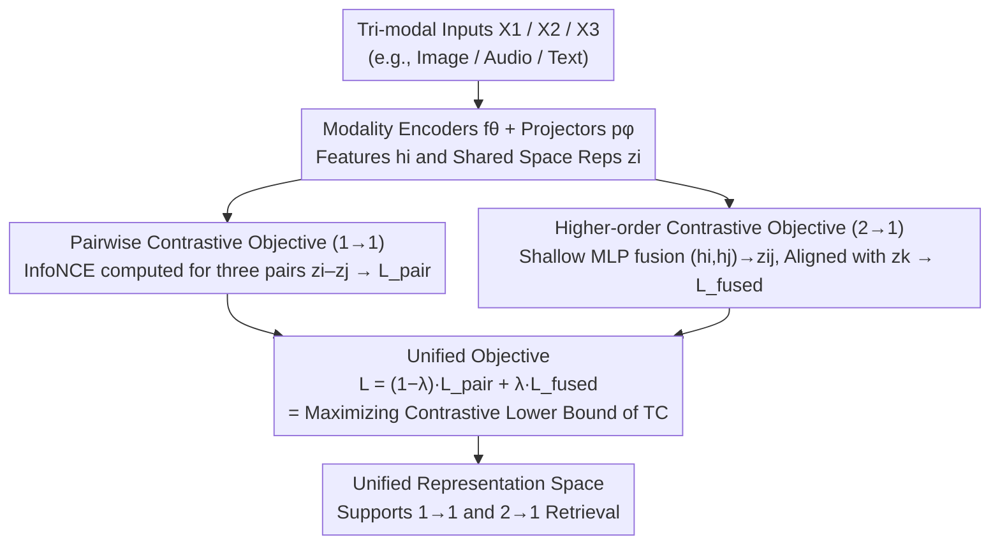

# The More, the Merrier: Contrastive Fusion for Higher-Order Multimodal Alignment

**Conference**: CVPR2026  
**arXiv**: [2511.21331](https://arxiv.org/abs/2511.21331)  
**Code**: [github.com/estafons/confu](https://github.com/estafons/confu)  
**Area**: Multimodal VLM  
**Keywords**: Multimodal alignment, higher-order dependencies, contrastive learning, total correlation, tri-modal fusion

## TL;DR
The authors propose the Contrastive Fusion (ConFu) framework, which extends CLIP-style pairwise contrastive learning to tri-modal higher-order alignment. By learning both paired and fused representations within a unified objective, it supports both 1→1 and 2→1 retrieval.

## Background & Motivation
The core challenge of multimodal representation learning is acquiring joint cross-modal representations. Existing methods like CLIP are essentially pairwise, capturing correlations only between two modalities:
- **Pairwise methods** (e.g., AudioCLIP, VALOR): Extend pairwise contrastive to three modalities, but the objectives remain limited to dual alignment.
- **Hub methods** (e.g., ImageBind, LanguageBind): Use a single modality as a reference space; while scalable, they cannot model direct dependencies between non-hub modalities.
- **Higher-order methods** (e.g., Symile, TRIANGLE, GRAM): Attempt to model higher-order dependencies, but Symile and TRIANGLE require all modalities to be present during inference, making them incompatible with standard 1→1 retrieval.

**Key Challenge**: Much real-world information is complementary (e.g., song = melody + lyrics, 3D design = sketch + text). Pairwise contrastive methods fail to capture XOR-type synergistic information that only emerges when multiple modalities are combined.

## Method

### Overall Architecture

ConFu addresses the limitation of pairwise contrastive learning (such as CLIP) in capturing synergistic information across three modalities. For $M=3$ modalities, it simultaneously learns two tasks within a unified objective: pairwise alignment between all pairs of modalities (1→1), and higher-order alignment where two modalities are fused to align with a third modality (2→1). Each modality utilizes independent encoders $f_\theta$ and projectors $p_\phi$ to map inputs into a shared latent space $\mathcal{Z}$, while fusion is performed by a lightweight MLP. The workflow follows a **branch-then-converge** structure: shared representations are processed via pairwise contrastive paths (yielding $\mathcal{L}_{pair}$) and higher-order contrastive paths (yielding $\mathcal{L}_{fused}$), which are then combined into a single loss using a weight $\lambda$. Consequently, the model supports both standard 1→1 retrieval and 2→1 retrieval at inference time. The validity of this "pairwise + higher-order" decomposition is theoretically grounded in the fact that Total Correlation (TC) can be decomposed into the sum of pairwise mutual information and higher-order mutual information.

### Key Designs

**1. Pairwise Contrastive Objective (1→1): Solidifying pairwise correlations**

Higher-order alignment cannot be established in a vacuum; the foundation remains the standard InfoNCE for all modality pairs. The pairwise contrastive loss is the sum of losses for the three modal pairs:

$$\mathcal{L}_{pair} = \hat{\mathcal{L}}_{InfoNCE}^{(1,2)} + \hat{\mathcal{L}}_{InfoNCE}^{(1,3)} + \hat{\mathcal{L}}_{InfoNCE}^{(2,3)}$$

This term ensures the capability for single-modality to single-modality retrieval, enabling ConFu to remain compatible with 1→1 tasks.

**2. Higher-order Contrastive Objective (2→1): Aligning fused modalities with the third**

XOR-style synergistic information, such as "melody + lyrics = song," cannot be captured by looking at any two modalities in isolation; the two inputs must be fused. ConFu uses a shallow MLP to fuse two modality representations into $z_{ij} = g_{\psi_{ij}}(h_i, h_j)$, which is then aligned with the third modality via InfoNCE:

$$\mathcal{L}_{fused} = \hat{\mathcal{L}}_{InfoNCE}^{(3,\{1,2\})} + \hat{\mathcal{L}}_{InfoNCE}^{(2,\{1,3\})} + \hat{\mathcal{L}}_{InfoNCE}^{(1,\{2,3\})}$$

This component allows ConFu to succeed in XOR synthetic tasks where pure pairwise methods fail (CLIP achieves only 3%, GRAM/TRIANGLE <15%).

**3. Unified Objective: Balancing pairwise and higher-order via weights**

The two types of objectives should not be trained in isolation. ConFu integrates them into a single loss $\mathcal{L} = (1-\lambda)\mathcal{L}_{pair} + \lambda\mathcal{L}_{fused}$. When $\lambda=0$, the model reverts to pure pairwise CLIP; an intermediate value is typically optimal, providing a tunable knob for high-order modeling.

**4. Theoretical Foundation: Decomposing TC into Pairwise MI + Higher-order MI**

The authors prove that the Total Correlation (TC) of three modalities can be symmetrically decomposed into the sum of pairwise mutual information and higher-order mutual information:

$$TC(X_1,X_2,X_3) = \frac{1}{3}\sum_{perm}[I(X_i;X_j) + I(X_k;X_i,X_j)]$$

Minimizing the InfoNCE loss is equivalent to maximizing the contrastive lower bound of TC. Thus, $\mathcal{L}_{pair}$ corresponds to the pairwise terms and $\mathcal{L}_{fused}$ to the higher-order terms. This design directly implements the TC decomposition, distinguishing it from Symile, which uses a single critic for implicit modeling.

### Loss & Training

Similarity is estimated using dot products with temperature scaling as a density ratio estimator. The fusion network is a shallow MLP, and the additional computational overhead is minimal, consisting only of these few MLP layers.

## Key Experimental Results

### Main Results

| Dataset | Metric | ConFu | Prev. SOTA | Note |
|--------|------|-------|----------|------|
| AV-MNIST | A+V Classification | 71.2% | 70.9% (Symile) | Fused input improves over best single modality by +8% |
| AV-MNIST | V Uni-modal | 64.6% | 63.0% (CLIP) | Multimodal training improves single modality by +1.5% |
| SSW60/VB100 | Retrieval | Competitive | Various Baselines | Unified support for 1→1 and 2→1 retrieval |

### Ablation Study

| Configuration | Key Metric | Description |
|------|---------|------|
| XOR Synthetic Task | ConFu Solved | CLIP failed (3%), GRAM/TRIANGLE < 15% |
| Noise Robustness | More Stable | Better performance with distracting modalities |
| $\lambda$ Analysis | Balance | $\lambda=0$ reverts to pure pairwise |

### Key Findings
- ConFu successfully addresses synergistic dependency issues in XOR tasks that pure pairwise methods cannot solve.
- Multimodal training improves the quality of single-modality representations even during uni-modal evaluation.
- Advantage over Symile: Does not require all modalities at inference, supporting flexible 1→1 retrieval.
- Demonstrates stronger robustness against distracting modalities and noise distribution shifts.

## Highlights & Insights
- Clear theoretical motivation: TC is decomposed into pairwise and higher-order components, each corresponding to an InfoNCE objective.
- Key difference from methods like Symile: It decomposes dependencies at the loss level rather than using a single critic for implicit modeling.
- The construction of the Bird-MML dataset fills a gap in tri-modal (image-audio-text) evaluation.
- Architecture-agnostic design where the only additional overhead is a lightweight MLP fusion network.

## Limitations & Future Work
- Currently limited to $M=3$ modalities; the number of fusion combinations grows exponentially with more modalities.
- The fusion network is a simple MLP, which may limit the modeling of complex cross-modal interactions.
- Bird-MML is a synthetic dataset, and generated captions may contain noise.
- The advantage over real-world data is less pronounced than on synthetic tasks.

## Related Work & Insights
- Hub methods like ImageBind offer scalability but are inherently limited to pairwise relations.
- ConFu shares the TC maximization philosophy with Symile but decomposes it into more controllable components.
- Potential application value for multi-sensor fusion (e.g., autonomous driving) where the system must function even if certain sensors fail.

## Rating
- Novelty: ⭐⭐⭐⭐ Theoretical elegance in TC decomposition and unified contrastive framework.
- Experimental Thoroughness: ⭐⭐⭐ Thorough verification on synthetic tasks, but real-world data scale is Relatively small.
- Writing Quality: ⭐⭐⭐⭐ Clear theoretical derivation and thorough comparison with prior work.
- Value: ⭐⭐⭐ Primarily focused on tri-modal learning; current application scenarios are relatively narrow.

## Related Papers
- The Bird-MML dataset contains 149,681 triplets (image-audio-text) across 150 bird species.
- Images are sourced from the iNaturalist open dataset, audio from Xeno-Canto, and text is generated by Gemma-2.
- Approximately 43% of species required audio reuse due to insufficient data.
- Evaluations were also conducted on MultiBench sentiment analysis datasets (MOSI, UR-FUNNY, MUStARD).

<!-- RELATED:START -->

## Related Papers

- [\[CVPR 2026\] Multi-Hierarchical Contrastive Spectral Fusion for Multi-View Clustering](multi-hierarchical_contrastive_spectral_fusion_for_multi-view_clustering.md)
- [\[CVPR 2026\] PowerCLIP: Powerset Alignment for Contrastive Pre-Training](powerclip_powerset_alignment_for_contrastive_pre-training.md)
- [\[CVPR 2026\] β-CLIP: Text-Conditioned Contrastive Learning for Multi-Granular Vision-Language Alignment](b-clip_text-conditioned_contrastive_learning_for_multi-granular_vision-language_.md)
- [\[CVPR 2026\] Where Does Vision Meet Language? Understanding and Refining Visual Fusion in MLLMs via Contrastive Attention](where_does_vision_meet_language_understanding_and_refining_visual_fusion_in_mllm.md)
- [\[CVPR 2026\] MuCo: Multi-turn Contrastive Learning for Multimodal Embedding Model](muco_multi-turn_contrastive_learning_for_multimodal_embedding_model.md)

<!-- RELATED:END -->
