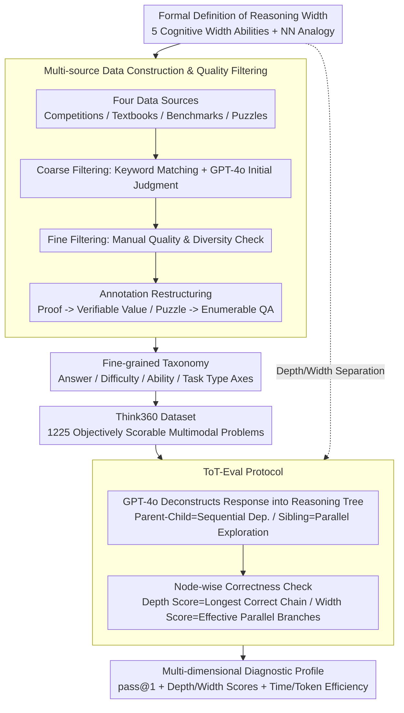

# Think360: Evaluating the Width-centric Reasoning Capability of MLLMs Beyond Depth

**Conference**: CVPR 2026  
**arXiv**: [2603.22689](https://arxiv.org/abs/2603.22689)  
**Code**: [Think360](https://github.com/Think360-Benchmark/Think360)  
**Area**: Multimodal VLM / LLM Reasoning  
**Keywords**: Multimodal Reasoning, Reasoning Width, Tree-of-Thought Evaluation, Benchmark, Large Language Models

## TL;DR

This paper introduces Think360, a multimodal benchmark focusing on "reasoning width"—specifically a model's capability in multi-path searching, multi-constraint pruning, and trial-and-error backtracking. It contains 1200+ high-quality samples and utilizes a fine-grained Tree-of-Thought evaluation protocol, revealing significant weaknesses in the width-dimension reasoning of current MLLMs.

## Background & Motivation

1. **Background**: Recently, Large Reasoning Models (LRMs) have made significant progress in test-time scaling and long-chain reasoning. Existing benchmarks like MathVista, MathVerse, and OlympiadBench continuously push the boundaries of difficulty and task coverage, ranging from K-12 to graduate levels and from text to multimodal inputs.

2. **Limitations of Prior Work**: Almost all existing evaluation benchmarks implicitly measure only "reasoning depth," which is the capability of a model to derive conclusions step-by-step along a single reasoning chain. However, humans rarely solve problems through linear deduction alone; success often involves searching multiple directions in the solution space, branching and backtracking, and trial-and-error pruning to integrate partial findings into an answer.

3. **Key Challenge**: Reasoning depth and reasoning width are two orthogonal dimensions. Existing benchmarks conflate the two, making it impossible to distinguish whether a model "thinks deeply" or "searches broadly." The lack of systematic evaluation for the width dimension leads to a one-sided assessment of true reasoning capabilities.

4. **Goal**: To construct a multimodal benchmark specifically for evaluating reasoning width, including: (a) systematically defining the cognitive capability dimensions of reasoning width, (b) designing an evaluation protocol to simultaneously quantify depth and width, and (c) comprehensively evaluating the width reasoning capabilities of mainstream MLLMs.

5. **Key Insight**: The authors establish a correspondence between architecture and reasoning by analogizing "width" designs in neural network architectures (shortcut connections, dropout, pyramid features, backpropagation) with strategies in the reasoning process (pruning, divide-and-conquer, trial-and-error, backtracking).

6. **Core Idea**: By building the width-centric multimodal benchmark Think360 (1200+ samples) and the Tree-of-Thought evaluation protocol, the study systematically reveals the deficiencies of MLLMs in exploratory reasoning.

## Method

### Overall Architecture

Think360 aims to answer a question ignored by existing benchmarks: Do MLLMs "think deeply" or "search broadly"? Instead of training new models, it treats "reasoning width" as a quantifiable evaluation target. The work follows two tracks: the **Data Track** collects raw problems from competitions, textbooks, existing benchmarks, and puzzles, which are then refined through coarse-to-fine filtering and rewriting into 1225 multimodal problems with objectively verifiable answers. The **Evaluation Track** complements traditional pass@1 accuracy with a Tree-of-Thought (ToT) protocol that decomposes model responses into reasoning trees to measure "depth" and "width" scores separately, alongside efficiency metrics like inference time and token consumption. These tracks are unified by a "Formal Definition of Reasoning Width."

### Key Designs

**1. Formal Definition of Reasoning Width: Decoupling "Searching Broadly" from "Thinking Deeply"**

Existing benchmarks assume reasoning ability equals the depth of a single chain. Think360 defines horizontal capability as reasoning width, subdivided into five cognitive sub-abilities: trial-and-error search, multi-constraint pruning (branch-and-bound), divide-and-conquer, hypothesize-and-test, and perceive-and-comprehend. These are analogized to neural network "width" designs: dropout for pruning, shortcuts for backtracking, and pyramid features for divide-and-conquer. This mapping transforms "width" from a vague intuition into measurable dimensions.

**2. Multi-source Data Construction & Quality Filtering: Targeted Selection of Width-centric Problems**

Width-centric problems are scarce in existing benchmarks (e.g., only 2.7% in MathVista and 1.7% in OlympiadBench). Think360 sources data from math/logic competitions, textbooks, existing benchmarks (MathVision, DynaMath, MME-Reasoning), and online IQ puzzles. A two-stage filtering process is applied: coarse filtering uses keywords (e.g., "maximum/minimum," "possible ways") and GPT-4o scoring; fine filtering involves manual review for quality and diversity. Problems are restructured (e.g., converting proofs to verifiable numerical answers) to ensure objective evaluation.

**3. Fine-grained Taxonomy: Reflecting Multi-ability Requirements via Non-exclusive Labels**

Width reasoning often requires multiple abilities simultaneously. Think360 tags problems along four axes: Answer Type (16.9% Multiple Choice, 83.1% Freeform), Difficulty (5 levels: Easy to Olympiad), Cognitive Ability (the 5 defined categories), and Task Type (6 categories). Both Cognitive Ability and Task Type axes use **non-exclusive** labels, allowing a single problem to carry multiple tags to accurately reflect the complexity of reasoning.

**4. Tree-of-Thought Evaluation Protocol (ToT-Eval): Quantifying Exploration Quality**

Outcome-based evaluation cannot distinguish between a "one-shot" lucky guess and genuine exploration. ToT-Eval fills this gap by using GPT-4o to extract key reasoning steps and organize them into a hierarchical tree. Parent-child relationships signify sequential dependencies (depth), while sibling nodes signify parallel exploration (width). Correctness is judged node-by-node. The Depth Score is the length of the longest entirely correct chain, and the Width Score is the count of valid parallel branches.

### Loss & Training

This is a benchmark study and does not involve model training. For evaluation, the temperature is set to 0.7, and each problem is repeated 3 times to average the results and reduce variance. Models are configured to their maximum output length. The impact of Chain-of-Thought (CoT) prompting is also tested.

## Key Experimental Results

### Main Results

The evaluation covers 12 major model series (GPT, Gemini, Claude, Grok, Doubao, QwenVL, InternVL, LLaVA, Llama, GLM-V, MiMo, Kimi) with over 30 models.

| Model | Overall Accuracy | Inference Time (s) | Token Consumption | Trial-and-Error | Branch-and-Bound |
| :--- | :--- | :--- | :--- | :--- | :--- |
| Gemini-2.5-pro | **46.0%** | 160.19 | 17270 | 38.5% | 51.8% |
| o3 | 42.3% | 261.59 | 6326 | 35.5% | 48.0% |
| o4-mini | 42.1% | 84.61 | 6736 | 34.3% | 48.0% |
| Gemini-2.5-flash-thinking | 38.3% | 107.33 | 21273 | 31.1% | 43.4% |
| o1 | 36.8% | 186.81 | 6537 | 29.6% | 40.6% |
| Claude-3.7-Sonnet-Thinking | 35.5% | 295.94 | 13819 | 29.4% | 38.8% |
| MiMo-VL-RL (7B) | 28.3% | 334.21 | 7381 | 24.9% | 27.9% |
| GPT-4o | 16.0% | 13.28 | 309 | 15.3% | 16.8% |
| LLaVA-Onevision (7B) | 8.3% | 36.58 | 648 | 5.8% | 10.0% |

### Ablation Study

| Configuration | Key Metric | Description |
| :--- | :--- | :--- |
| CoT prompting (GPT-4o) | +0.4% Accuracy | CoT brings minimal gain while doubling inference time |
| Perceive-and-Comprehend Subset | Above Overall Avg | Models perform relatively better on perception-heavy tasks |
| Trial-and-Error Subset | Below Overall Avg | Trial-and-error search is a significant weakness |
| Divide-and-Conquer Subset | Below Overall Avg | Tasks requiring decomposition are equally difficult |
| Text-Only vs Image+Text | See Appendix | Analysis of the impact of multimodal inputs |

### Key Findings

- **Gemini-2.5-pro ranks first with 46.0% accuracy**. Its average thinking tokens (17,270) are approximately 3x that of o3/o4-mini, yet its inference time is shorter (160s vs. o3's 262s), suggesting higher efficiency.
- **o4-mini is the most cost-effective**: It achieves 42.1% accuracy (comparable to o3) with only 1/3 of o3's inference time (85s).
- **All models struggle below the 40% threshold**: Only three models surpassed 40% accuracy, indicating that width reasoning remains a severe challenge for current MLLMs.
- **Divergence between Perception and Search**: Performance on Perceive-and-Comprehend is generally higher than the average, but significantly lower on Trial-and-Error and Divide-and-Conquer, showing that MLLMs excel at structured perception rather than exploratory reasoning.
- **Open-source gap remains large**: The best open-source model, MiMo-VL-RL (7B), scored 28.3%, about 18 percentage points behind the closed-source leaders.

## Highlights & Insights

- **Conceptualization of Reasoning Width**: Explicitly separating width from depth and creating an insightful analogy with neural network architecture designs (dropout $\leftrightarrow$ pruning, shortcut $\leftrightarrow$ backtracking, etc.) provides a clear and heuristic framework.
- **ToT-Eval Protocol**: By analyzing the tree structure of responses rather than just the final answer, it quantifies the "depth" and "width" dimensions, providing richer diagnostic information than traditional pass@1.
- **Rigorous Construction Process**: The multi-source data pipeline ensures task relevance and quality, offering a template for transforming diverse problem formats (proofs, puzzles) into verifiable benchmarks.

## Limitations & Future Work

- **Dependency on GPT-4o**: Both tree construction and node-wise judgment rely on GPT-4o, introducing potential evaluator bias and high costs.
- **Dataset Scale**: 1225 samples is relatively small compared to benchmarks like MathVista (5000+), which might limit the statistical robustness of some sub-category analyses.
- **Lack of Process Reward Integration**: While ToT-Eval is proposed for assessment, it has not yet been applied to training (e.g., process-based reward models) to verify its utility in improving model performance.
- **Scalability**: Automating the generation of high-quality width reasoning problems without manual bottlenecks remains a key challenge for expansion.

## Related Work & Insights

- **vs. MathVista/MathVerse**: These cover multimodal math reasoning, but width-centric problems are sparse (<3%). Think360 focuses on the width dimension, making it complementary.
- **vs. CLEVR/GQA**: Earlier benchmarks focused on semantic composition; Think360 emphasizes higher-level search and planning strategies.
- **vs. OlympiadBench**: Competition-level benchmarks focus on deep reasoning chains; Think360 targets multi-path search at similar difficulty levels.
- **Insight**: Think360 exposes a systemic lack of exploration and backtracking in current MLLMs. This suggests that RL-based training (e.g., o1/o3 style) should encourage models to engage in multi-branch search rather than solely lengthening the reasoning chain.

## Rating

- Novelty: ⭐⭐⭐⭐ Systematizing reasoning width as an independent dimension is a novel perspective.
- Experimental Thoroughness: ⭐⭐⭐⭐⭐ Comprehensive evaluation across 30+ models and detailed sub-dimension analysis.
- Writing Quality: ⭐⭐⭐⭐ Clear concepts and apt analogies, though some tables are quite dense.
- Value: ⭐⭐⭐⭐ Identifies a blind spot in MLLM reasoning, providing guidance for future architecture and training strategies.

<!-- RELATED:START -->

## Related Papers

- [\[CVPR 2026\] TableMix: Enhancing Multimodal Table Reasoning in MLLMs from a Data-Centric Perspective](tablemix_enhancing_multimodal_table_reasoning_in_mllms_from_a_data-centric_persp.md)
- [\[ACL 2026\] Can MLLMs Reason Beyond Language? VisReason: A Comprehensive Benchmark for Vision-Centric Reasoning](../../ACL2026/multimodal_vlm/can_mllms_reason_beyond_language_visreason_a_comprehensive_benchmark_for_vision-.md)
- [\[CVPR 2026\] EgoProx: Evaluating MLLMs on Egocentric 3D Proximity Reasoning Across a Cognitive Hierarchy](egoprox_evaluating_mllms_on_egocentric_3d_proximity_reasoning_across_a_cognitive.md)
- [\[CVPR 2026\] Beyond Perceptual Shortcuts: Causal-Inspired Debiasing Optimization for Generalizable Video Reasoning in Lightweight MLLMs](beyond_perceptual_shortcuts_causal-inspired_debiasing_optimization_for_generaliz.md)
- [\[CVPR 2026\] HumanVBench: Probing Human-Centric Video Understanding in MLLMs with Automatically Synthesized Benchmarks](humanvbench_probing_human_centric_video_understanding_in_mllms_with_automatica.md)

<!-- RELATED:END -->
