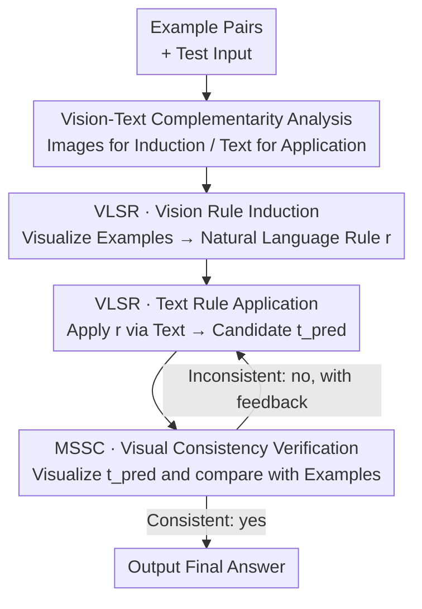

# Think Visually, Reason Textually: Vision-Language Synergy in Abstract Reasoning

**Conference**: CVPR 2026  
**Paper**: [CVF Open Access](https://openaccess.thecvf.com/content/CVPR2026/html/Zhang_Think_Visually_Reason_Textually_Vision-Language_Synergy_in_Abstract_Reasoning_CVPR_2026_paper.html)  
**Code**: None  
**Area**: Multimodal VLM / LLM Reasoning  
**Keywords**: ARC-AGI, Abstract Reasoning, Vision-Language Synergy, Modality Switching, Self-Correction

## TL;DR
Addressing ARC-AGI abstract reasoning, the authors identify a complementarity where "vision excels at rule induction, while text excels at precise execution." They propose training-free VLSR (using images for rule induction and text for rule application) and MSSC (using vision to verify text answers for cross-modal self-correction). These methods achieve an average improvement of up to 4.33% over text-only baselines on GPT-4o / Gemini-2.5-Pro / o4-mini / Qwen3-VL.

## Background & Motivation

**Background**: ARC-AGI is a benchmark measuring the general intelligence capability of inducing transformation rules from minimal examples and migrating them to new tasks. While human accuracy exceeds 97%, frontier models like GPT-5 and Grok-4 frequently fail. Currently, nearly all methods treat ARC-AGI as a **pure text task**, encoding input-output matrices into nested lists (e.g., `[[0,1,2],[3,4,5]]`) for both training and inference.

**Limitations of Prior Work**: This pure text approach contradicts human intuition. Humans naturally perceive matrices as colored 2D grids, easily identifying spatial relationships like symmetry, rotation, and shape transformations. Inferring these from coordinate-based text is laborious and prone to information loss. Textual representations flatten 2D structures into 1D token sequences—two cells vertically adjacent in a column may be separated by dozens of tokens in text.

**Key Challenge**: The authors' preliminary experiments reveal a counter-intuitive paradox: **simply rendering grids as images and feeding them to models performs worse than text-only baselines**. While visual representations capture global 2D structures, they struggle with precise element-wise operations. When a 20×20 grid is treated as an image, models often confuse the value at position (5,7) with adjacent cells. This exposes a fundamental tension: **vision is adept at identifying overall spatial patterns, while text naturally provides the discrete precision required for exact execution.**

**Goal**: Rather than choosing between "vision or text," the goal is to determine "at which stage and how to combine the two." The authors decompose ARC-AGI into two sub-tasks—rule summarization (extracting patterns from examples) and rule application (applying rules to new inputs)—to systematically measure the performance of each modality.

**Key Insight**: Analysis of o4-mini provides clear evidence: vision brings a +3.0% improvement in rule induction (benefiting from global 2D spatial perception), whereas text is significantly stronger in rule application (performance drops by 20.5% when using vision for application due to imprecise element-wise operations).

**Core Idea**: Route each sub-task to its most proficient modality—**images for induction, text for application**. This is further extended by using "modality-switching verification" to solve the challenge of self-correction. Both strategies are training-free, inference-time methods.

## Method

### Overall Architecture

The framework is built upon the empirical finding that vision and text have **complementary advantages** at different stages of abstract reasoning. The authors split the reasoning pipeline into two complementary routes. The first is **VLSR (Vision-Language Synergy Reasoning)**: example matrix pairs are visualized as colored grids to allow the model to induce rules in natural language via global visual perception. The process then switches back to the text modality for precise element-wise rule application. The second is **MSSC (Modality-Switch Self-Correction)**: candidate answers generated via text are re-visualized as images, using the visual modality to judge consistency with example patterns. If inconsistent, the model returns to the text modality with feedback for another iteration.

Crucially, the induction, application, and verification stages utilize the **same base model**, merely switching input modalities and prompts. Formally, the text representation of matrix $m$ is denoted as $t = \mathcal{T}(m)$, and the visual representation as $i = \mathcal{V}(m)$ (mapping values 0-9 to unique colors). Both are reversible: $\mathcal{T}^{-1}(t)=m$ and $\mathcal{V}^{-1}(i)=m$, enabling seamless transitions.

### Key Designs

**1. Vision-Text Complementarity Analysis: Using Controlled Experiments to Locate Modality Roles**

This serves as the empirical foundation of the method. The authors decomposed ARC-AGI into rule induction and application, performing controlled comparisons by swapping modalities for a single step (see Tab. 1). In the induction phase, rules were extracted using text vs. vision, then consistently applied via text for a fair comparison of rule quality. In the application phase, high-quality rules from vision induction were fixed, while the matrix representation (image vs. text) was varied. Results were conclusive: vision for induction yielded an average +3.2% gain (e.g., Gemini-2.5 rose from 37.25% to 40.75%), while vision for application caused an average drop of 15.0% (Gemini fell from 40.75% to 23.75%).

The authors synthesized four qualitative features explaining this complementarity: ① **Global vs. Independent Processing**—vision naturally anchors connected spatial structures (center blocks, checkerboards), while text relies on type-level statistics (frequency counts). ② **2D Structure Preservation**—text flattens dimensions, making diagonal or cross-row patterns hard to capture; visual rules remain stable under matrix transposition where text rules distort due to token order changes. ③ **Encoding Efficiency for Large Matrices**—a 30×30 matrix requires thousands of text tokens but only a few hundred vision tokens. ④ **Lack of Element-wise Precision**—images treat matrices as wholes, failing to reliably locate single cells. These findings directly inform the modality routing in VLSR.

**2. VLSR: Routing Sub-tasks to Optimal Modalities**

VLSR addresses two flaws of pure text baselines: the loss of 2D structural information and the merging of induction and application into a single step. It decomposes reasoning into two serial stages. **Stage 1: Visual Rule Induction**: All example pairs are converted to images, allowing the model to induce **explicit natural language rules** (e.g., "Rotate each connected component 90 degrees clockwise") via spatial perception:

$$r_{pred} = f^{vision}_{sum}(i^{input}_1, i^{output}_1, \dots, i^{input}_K, i^{output}_K)$$

**Stage 2: Textual Rule Application**: Given rule $r_{pred}$, matrices are converted back to text, and the **same model** applies the rule element-wise in the text modality:

$$t_{pred} = f^{text}_{app}(r_{pred}, t^{input}_1, t^{output}_1, \dots, t^{input}_K, t^{output}_K, t^{input}_{test})$$

Compared to text-only baselines predicting outputs in one step ($t_{pred} = f(\dots)$), VLSR gains from task decomposition and modality matching—induction benefits from global perception, while application benefits from precise operation. This explains কেন naive image rendering fails: the error lies in using images for the wrong stage.

**3. MSSC: Breaking Confirmation Bias via Modality Switching**

Intrinsic self-correction is difficult due to the paradox: "if a model could find its own error, why didn't it provide the correct answer initially?" Prior work identifies the issue as confirmation bias within the same modality. MSSC resolves this by using **different modalities for forward reasoning and backward verification**. First, textual candidate $t_{pred}$ is visualized as $i_{pred}$. Then, the visualized test pair and examples are given to the model as a critic to judge pattern consistency:

$$s_{consistent} = f^{vision}_{critic}(i^{input}_1, i^{output}_1, \dots, i^{input}_{test}, i_{pred}), \quad s_{consistent} \in \{yes, no\}$$

If $s_{consistent} = no$, the model returns to the text modality with $feedback_{prev}$ for another iteration, up to $N_{max}=3$. Switching to vision provides a "fresh perspective," revealing spatial inconsistencies (missed symmetry, wrong spatial relations) overlooked during text reasoning. Crucially, this requires no external ground truth.

## Key Experimental Results

### Main Results

Evaluated across four base models (GPT-4o, Gemini-2.5-Pro, o4-mini, Qwen3-VL-235B) and three benchmarks (ARC-AGI-400, BARC-100, Re-ARC) using Pass@1 (temp 0.7). VLSR and MSSC are individually effective, with the combination performing best:

| Model | Config | ARC-AGI | BARC-100 | Re-ARC |
|------|------|---------|----------|--------|
| GPT-4o | Baseline | 8.25 | 28.0 | 10.0 |
| GPT-4o | +both (Ours) | **14.5** | **33.0** | **16.0** |
| Gemini-2.5-Pro | Baseline | 35.0 | 56.0 | 30.0 |
| Gemini-2.5-Pro | +both (Ours) | **42.25** | **60.0** | **33.0** |
| o4-mini | Baseline | 42.25 | 59.0 | 36.0 |
| o4-mini | +both (Ours) | **46.75** | **65.0** | **39.0** |

The combined strategy improved GPT-4o by +6.25% and Gemini-2.5-Pro by +7.25% on ARC-AGI. Averaged across tasks, VLSR contributed +3.02% and MSSC an additional +1.82%.

### Ablation Study

Controlled modality analysis (Tab. 1) confirms the complementarity that informs the method design:

| Stage | Modality | GPT-4o | Gemini-2.5 | o4-mini |
|------|------|--------|------------|---------|
| Baseline (Pure text) | text | 8.25 | 35.0 | 42.25 |
| Rule Summarization | text | 10.5 | 35.25 | 42.5 |
| Rule Summarization | **vision** | **13.5** | **38.75** | **45.5** |
| Rule Application | text | 13.5 | 38.75 | 45.5 |
| Rule Application | vision | 6.25 | 23.75 | 25.0 |

Self-correction comparison (Tab. 4) shows that text-only correction (TOSC) stagnates, while MSSC improves monotonically:

| Model | Base | TOSC R3 | MSSC R1 | MSSC R2 | MSSC R3 |
|------|------|---------|---------|---------|---------|
| GPT-4o | 8.25 | 8.75 | 10.25 | 11.5 | **12.0** |
| Gemini | 35.0 | 36.0 | 35.75 | 36.25 | **36.5** |
| o4-mini | 42.25 | 42.0 | 43.5 | 44.25 | **44.75** |

### Key Findings

- **Using the wrong modality is worse than no vision**: Using vision for rule application dropped o4-mini from 45.5 to 25.0. This explains why naive rendering fails—the issue is the stage of application.
- **MSSC gain stems from modality switching, not just more iterations**: TOSC barely moved over three rounds due to confirmation bias (GPT-4o gained only +0.5). In contrast, MSSC's visual verification provided stable monotonic gains (+3.75 total for GPT-4o).
- **Principles transfer to fine-tuning**: Applying VLSR task decomposition to training—using Qwen3-VL-8B for vision induction and Qwen3-8B for text application—on ARC-Heavy-200k yielded 13.25% on ARC-AGI. This outperformed pure text fine-tuning (9.75%) and allowed an 8B model to surpass GPT-4o (8.25%).

## Highlights & Insights
- **"When to use vision" is more critical than "whether to use vision"**: The study identifies the reasoning sub-stage where modalities excel, explaining previous failures and providing an operational routing principle.
- **Cross-modal verification as a solution to confirmation bias**: Switching modalities for generation and verification bypasses internal reasoning loops. This concept is transferable to any task with multimodal representations (e.g., code as text vs. AST).
- **Training-free and fine-tunable**: VLSR/MSSC can be used as a plug-and-play enhancement for closed-source models or as a training paradigm for open-source ones.

## Limitations & Future Work
- **Small absolute performance gains**: Improvements peak at 7.25%, but overall accuracy remains far below the human 97%, suggesting vision synergy mitigates but does not solve abstract reasoning.
- **Dependency on base model visual capacity**: The quality of MSSC verification relies on base visual perception; weak visual models might introduce noise.
- **Sensitivity of visualization function $\mathcal{V}$**: Details like color mapping and resolution for large matrices are omitted here (found in supplementary material) but may be sensitive factors for reproduction.

## Related Work & Insights
- **vs. Text-only ARC methods (Fine-tuning / Test-time training / Retrieval)**: Text-only methods cannot access global 2D structures. This work proves visual information provides complementary benefits that text-only retrieval cannot replicate.
- **vs. Image-aided reasoning (Visual Sketchpad)**: While prior work "adds an image," this method focuses on **modality switching** based on the specific requirements of sub-tasks and verification.

## Rating
- Novelty: ⭐⭐⭐⭐⭐ (Precise localization of modality advantages and cross-modal switching for self-correction is highly novel)
- Experimental Thoroughness: ⭐⭐⭐⭐ (Covers 4 models and 3 benchmarks with controlled analytical experiments)
- Writing Quality: ⭐⭐⭐⭐⭐ (Clear logical progression from paradox to empirical evidence to methodology)
- Value: ⭐⭐⭐⭐ (Provides a transferable "modality routing + cross-modal verification" principle for multimodal reasoning)

<!-- RELATED:START -->

## Related Papers

- [\[CVPR 2026\] Abstract 3D Perception for Spatial Intelligence in Vision-Language Models](abstract_3d_perception_for_spatial_intelligence_in_vision-language_models.md)
- [\[CVPR 2026\] Modeling Cross-vision Synergy for Unified Large Vision Model](modeling_cross-vision_synergy_for_unified_large_vision_model.md)
- [\[CVPR 2025\] Seeing the Abstract: Translating the Abstract Language for Vision Language Models](../../CVPR2025/multimodal_vlm/seeing_the_abstract_translating_the_abstract_language_for_vision_language_models.md)
- [\[CVPR 2026\] Think with 3D: Geometric Imagination Grounded Spatial Reasoning from Limited Views](think_with_3d_geometric_imagination_grounded_spatial_reasoning_from_limited_view.md)
- [\[CVPR 2026\] Select Less, Reason More: Prioritizing Evidence Purity for Video Reasoning](select_less_reason_more_prioritizing_evidence_purity_for_video_reasoning.md)

<!-- RELATED:END -->
