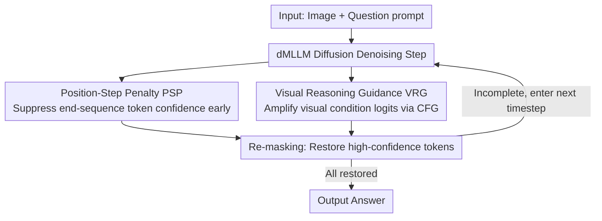

# Thinking Diffusion: Penalize and Guide Visual-Grounded Reasoning in Diffusion Multimodal Language Models

**Conference**: CVPR2026  
**arXiv**: [2604.05497](https://arxiv.org/abs/2604.05497)  
**Code**: None  
**Area**: Multimodal VLM  
**Keywords**: Diffusion Language Models, Multimodal Reasoning, Chain-of-Thought, Visual Grounding, Re-masking Strategy

## TL;DR
This paper provides the first quantitative analysis of the CoT reasoning process in diffusion multimodal LLMs (dMLLM), identifying two key issues: "early answer generation" and "weak visual dependence." It proposes two training-free methods, Position-Step Penalty (PSP) and Visual Reasoning Guidance (VRG), achieving up to a 7.5% accuracy improvement with 3x acceleration.

## Background & Motivation

**Background**: Diffusion LLMs (dLLM) such as LLaDA and Dream are emerging alternatives to autoregressive LLMs, providing faster inference by restoring multiple tokens in parallel. Extending these to the multimodal domain results in dMLLMs. However, the reasoning process of dMLLMs is not yet fully understood. The authors make two key observations:

1.  **Early Answer Generation**: dMLLMs generate final answer tokens at very early timesteps (at L=64/T=32, over 30% of answers are determined before step 7), only later generating intermediate reasoning to rationalize the answer.
2.  **Weak Visual Grounding**: In initial timesteps, dMLLMs exhibit extremely low dependence on visual prompts (low PDM values), which contrasts sharply with AR-VLMs that rely heavily on visual features in early stages.

Conclusion: dMLLMs tend to generate answers prematurely before sufficiently utilizing visual inputs.

## Method

### Overall Architecture

To address the issues of premature answer determination and initial visual neglect, the authors propose two training-free inference-time methods: Position-Step Penalty (PSP), which suppresses the urge to generate answers in early timesteps, and Visual Reasoning Guidance (VRG), which amplifies visual conditioning signals during generation. Both are embedded in the dMLLM diffusion denoising loop: at each timestep, PSP adjusts token confidence and VRG modifies logits to jointly determine the re-masking strategy (deciding which tokens to restore). This process iterates until all tokens are restored. These methods can be applied to any re-masking strategy (Low-conf/Entropy/Margin) without model modification or retraining.

### Key Designs

**1. Position-Step Penalty (PSP): Suppressing end-sequence answer tokens in early timesteps**

Answers typically reside at the end of a sequence, yet dMLLMs often fix these tokens during early diffusion stages. PSP applies a stronger penalty to tokens positioned further toward the end during early stages:

$$\tilde{C}_j^i = C_j^i \cdot [1 - \gamma(1-\tau_i)\text{rel}(j)]$$

Where $\tau_i = i/K$ represents diffusion progress, $\text{rel}(j)\in[0,1]$ is the relative position of the token, and $\gamma$ is the penalty strength. Tokens that are both early in the process ($\tau_i$ is small) and late in the sequence ($\text{rel}(j)$ is large) are penalized most heavily, forcing the model to complete intermediate reasoning before finalizing the answer. Ablations confirm that PSP successfully delays answer generation.

**2. Visual Reasoning Guidance (VRG): Amplifying visual signals via CFG**

dMLLMs show weak dependence on visual prompts initially. VRG adapts Classifier-Free Guidance (CFG) from image diffusion to the logit level, amplifying the difference between "visually conditioned" and "unconditioned" outputs:

$$\text{logits}_{vrg} = \text{logits}_u + (s_{vrg}+1) \cdot (\text{logits}_c - \text{logits}_u)$$

$\text{logits}_c$ is the output conditioned on the visual prompt, $\text{logits}_u$ is the unconditional output, and $s_{vrg}$ controls the amplification magnitude. This forces the model to attend more closely to visual information. It performs slightly better than PSP when used alone and yields the best results when combined with PSP.

### Loss & Training

The approach is entirely training-free and only active during the inference phase. Hyperparameters are set to $\gamma=0.5$ and $s_{vrg}=0.5$, with greedy decoding used to ensure reproducibility.

## Key Experimental Results

### Main Results

| Model | Method | M3CoT(64/32) | MMBench(64/32) | SQA-IMG(64/32) | V*Bench(64/32) |
|------|------|-------------|---------------|----------------|---------------|
| LaViDa | Low-conf | 45.8 | 72.8 | 71.0 | 42.9 |
| LaViDa | PSP+VRG | 48.4 | 74.9 | 72.8 | 45.5 |
| MMaDa | Low-conf | 33.7 | 56.1 | 56.4 | 35.6 |
| MMaDa | PSP+VRG | 36.3 | 59.9 | 56.9 | 38.2 |

### Ablation Study

| Configuration | M3CoT | MMBench | SQA-IMG | V*Bench |
|------|-------|---------|---------|--------|
| Low-conf | 45.8 | 72.8 | 71.0 | 42.9 |
| +PSP | 47.6 | 74.3 | 72.0 | 44.5 |
| +VRG | 47.8 | 75.1 | 72.1 | 45.0 |
| +PSP+VRG | 48.4 | 74.9 | 72.8 | 45.5 |

### Key Findings
- PSP effectively postpones answer generation to later timesteps.
- VRG alone slightly outperforms PSP, while their combination yields the best performance.
- PSP+VRG at L/T=64/32 outperforms Low-conf at L/T=256/128, achieving >3x speedup.
- Standard AR-VLM CoT methods (e.g., DDCoT and CCoT) perform poorly on dMLLMs, confirming that dMLLMs require distinct reasoning enhancement strategies.
- Gains are consistent across different re-masking strategies (Low-conf/Entropy/Margin).

## Highlights & Insights
- Provides the first quantitative analysis of the dMLLM reasoning process; the two key discoveries are highly insightful.
- The comparison of visual dependence patterns between AR-VLMs and dMLLMs reveals fundamental paradigm differences.
- The design of PSP is intuitive and effective: the dual penalty on position and step perfectly aligns with the observed problem.
- VRG represents a natural and effective migration of CFG from image diffusion to visual reasoning in language diffusion.

## Limitations & Future Work
- VRG requires an additional unconditional forward pass (though this can be parallelized), increasing computational overhead.
- Fixed values for $\gamma$ and $s_{vrg}$ (0.5) may not be optimal; adaptive strategies warrant exploration.
- Analysis is primarily based on the M3CoT dataset; generalization needs to be verified on more diverse reasoning tasks (e.g., visual math, chart understanding).
- dMLLM reasoning capabilities still lag behind AR-VLMs; this method serves as a mitigation rather than a fundamental cure.

## Related Work & Insights
- Compared to AR-CoT, the core of Diffusion CoT lies in the re-masking strategy rather than sequential generation.
- The failure of AR-VLM methods like ICoT on dMLLMs highlights the paradigm shift.
- This work provides a significant reference for future dMLLM reasoning research, emphasizing the need for enhancement methods tailored for parallel generation.

## Rating
- Novelty: ⭐⭐⭐⭐⭐ (First analysis of dMLLM reasoning; novel observations and methods)
- Experimental Thoroughness: ⭐⭐⭐⭐ (Validated on two models across multiple benchmarks and configurations; comprehensive ablation)
- Writing Quality: ⭐⭐⭐⭐⭐ (Natural logical progression from analysis to problem identification to method)
- Value: ⭐⭐⭐⭐ (Significant guidance for the emerging field of dMLLM research)

## Additional Info
- LaViDa is based on LLaDA + reasoning fine-tuning; MMaDa is based on 8B MixCoT.
- PSP and VRG are compatible with any re-masking strategy (Low-conf/Entropy/Margin), showing improvements across all.
- VRG requires an extra unconditional forward pass, but it can be computed in parallel with the conditional pass.
- M3CoT covers multiple reasoning domains including science, math, and common sense, serving as a comprehensive CoT benchmark.
- MMaDa with PSP+VRG improved MMBench scores from 56.1 to 59.9, an absolute gain of 3.8%.
- All experiments use greedy decoding without temperature scaling to ensure reproducibility.

<!-- RELATED:START -->

## Related Papers

- [\[CVPR 2026\] LLaDA-V: Large Language Diffusion Models with Visual Instruction Tuning](llada-v_large_language_diffusion_models_with_visual_instruction_tuning.md)
- [\[CVPR 2026\] Sparse-LaViDa: Sparse Multimodal Discrete Diffusion Language Models](sparse-lavida_sparse_multimodal_discrete_diffusion_language_models.md)
- [\[CVPR 2026\] Guiding Diffusion-based Reconstruction with Contrastive Signals for Balanced Visual Representation](guiding_diffusion-based_reconstruction_with_contrastive_signals_for_balanced_vis.md)
- [\[ICML 2026\] Conditional Diffusion Sampling](../../ICML2026/multimodal_vlm/conditional_diffusion_sampling.md)
- [\[CVPR 2026\] Diffusion Guided Chain-of-Vision for Large Autoregressive Vision Models](diffusion_guided_chain-of-vision_for_large_autoregressive_vision_models.md)

<!-- RELATED:END -->
