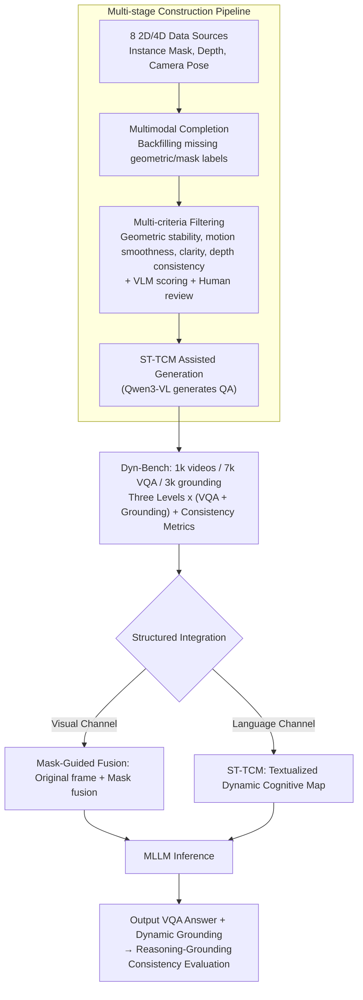

# Thinking in Dynamics: How Multimodal Large Language Models Perceive, Track, and Reason Dynamics in Physical 4D World

**Conference**: CVPR 2026  
**arXiv**: [2603.12746](https://arxiv.org/abs/2603.12746)  
**Code**: [https://dyn-bench.github.io/](https://dyn-bench.github.io/)  
**Area**: Multimodal VLM / Video Spatio-temporal Reasoning  
**Keywords**: 4D dynamics, Dyn-Bench benchmark, spatio-temporal reasoning, dynamic grounding, MLLM evaluation

## TL;DR
This paper introduces Dyn-Bench—a large-scale benchmark for dynamic understanding of the physical 4D world (comprising 1k videos, 7k VQA pairs, and 3k dynamic grounding pairs). It systematically evaluates the spatio-temporal reasoning capabilities of general-purpose, spatial-aware, and region-level MLLMs, revealing that existing models fail to maintain consistency between reasoning and grounding. The authors propose two structured integration methods, Mask-Guided Fusion and ST-TCM, to significantly enhance dynamic perception.

## Background & Motivation

### Background
Humans inhabit a physical 4D world where geometric structures and semantic content evolve over time. While current Multimodal Large Language Models (MLLMs) excel at static image understanding, their capacity to comprehend dynamic sequences—specifically perceiving, tracking, and reasoning about spatio-temporal dynamics in videos—has not been systematically assessed.

### Limitations of Prior Work
1. **Lack of specialized benchmarks**: Existing video QA datasets primarily focus on event descriptions rather than the spatio-temporal reasoning required for **dynamic 4D scenes**.
2. **Inconsistency in existing models**: Models exhibit a gap between spatio-temporal reasoning and dynamic object grounding; for instance, a model might correctly state "the ball moved left" but fail to accurately box its trajectory in the video.
3. **Limited effectiveness of prompting**: Traditional strategies such as Chain-of-Thought (CoT) or caption-based hints provide marginal improvements for dynamic reasoning.

### Key Challenge
Success in static image understanding does not directly transfer to dynamic scenarios. Spatio-temporal dynamics involve complex reasoning regarding motion trajectories, object interactions, and physical causality, necessitate dedicated modeling approaches.

### Core Idea
The goal is to construct the Dyn-Bench benchmark to evaluate MLLM dynamic understanding across multiple dimensions (linguistic reasoning + visual grounding) and to propose structured integration methods (Mask-Guided Fusion + ST-TCM) to augment dynamic perception.

## Method

### Overall Architecture
This work addresses a question often obscured by static image performance: Can MLLMs truly perceive, track, and reason about dynamics evolving in a 4D physical world? To answer this, the authors first establish the Dyn-Bench "yardstick" and then propose two structured integration methods to address identified weaknesses. Starting from eight 2D video segmentation and 4D dynamic scene sources, Dyn-Bench utilizes a pipeline involving "multimodal completion → multi-criteria filtering → structured cognitive map-assisted generation" to curate high-quality dynamic scenes. Evaluation is decomposed into three complementary levels (dynamic inter-object perception, dynamic object-scene tracking, and dynamic camera-object reasoning). Each level includes paired Spatio-Temporal VQA (7k pairs for "correctness") and Dynamic Object Grounding (3k pairs for "precision"), bridged by a new "reasoning-grounding consistency" metric. To improve performance, dynamic cues are injected via two channels: Mask-Guided Fusion (MGF) blends masks with original frames at the visual end, while ST-TCM textualizes dynamics at the language end, both serving as inputs to the MLLM to boost spatio-temporal reasoning and localization.

### Key Designs

**1. Dyn-Bench’s Three-Level x Dual-Task Evaluation & Consistency Metric: Aligning "Correct Reasoning" with "Accurate Pointing"**

Existing video QA benchmarks often stop at scene-level event descriptions and lack fine-grained evaluation centered on "dynamic objects." Dyn-Bench decomposes dynamic understanding into three complementary levels: dynamic inter-object perception (spatial relations and interactions like approaching or overtaking), dynamic object-scene tracking (object motion and temporal evolution within a scene), and dynamic camera-object reasoning (object behavior under camera motion). Each level features paired tasks: Spatio-Temporal VQA tests reasoning via natural language, while Dynamic Object Grounding requires the model to delineate the queried object using instance masks. A key innovation is the "reasoning-grounding consistency" metric: if a model answers the VQA correctly but fails the grounding, it is penalized for inconsistency. This quantifies the disconnect where models can "describe" but not "locate" dynamics—a core weakness identified across general, spatial, and region-level MLLMs.

**2. Multi-stage Construction Pipeline: Filtering True Dynamics and Automated Question Generation**

Benchmarks are prone to "pseudo-dynamics" where camera motion creates an illusion of movement in a static scene, allowing models to cheat via background cues. Dyn-Bench ensures quality through a multi-stage pipeline: it aggregates videos from four 2D segmentation datasets (DAVIS, SA-V, DynPose-100K, YouTube-VIS) and four 4D dynamic datasets (DynamicReplica, PointOdyssey, Spring, Total-Recon) featuring masks, depth, and poses. Missing annotations are backfilled via multimodal completion. A rigorous filtering strategy—considering geometric stability, motion smoothness, and depth consistency, alongside VLM scoring—removes low-quality clips. Finally, ST-TCM and Qwen3-VL automatically generate paired VQA and grounding tasks, ensuring the benchmark tests true dynamic understanding.

**3. Mask-Guided Fusion (MGF): Focusing Visual Attention on Dynamic Objects**

Failures often occur at the visual end when models cannot distinguish moving targets in complex frames. MGF fuses target object masks with original frames before feeding them to the MLLM. Unlike "Masked Frames Only" variants that lose appearance data, MGF preserves both visual context and motion localization cues, effectively "highlighting" the focus at the pixel level. Experiments on Qwen3-VL-8B show that while simple masking has limited benefits, MGF provides gains across all tasks, particularly in "inter-object" and "camera-object" reasoning, confirming that grounding bottlenecks often stem from not knowing "where to look."

**4. Spatio-Temporal Textual Cognitive Map (ST-TCM): Translating Visual Dynamics for LLMs**

Cross-modal reasoning is a second bottleneck; LLM backbones struggle to extract spatio-temporal relations directly from raw visual features. ST-TCM constructs a structured textual map for each video. Using RGB-D and masks, it reconstructs 3D trajectories and organizes them into a JSON format: each frame records camera pose, depth statistics, object positions/motion (velocity, direction), and inter-object relationships (e.g., "approaching" with distance). Including this map in the prompt translates implicit visual facts into symbols the LLM can process. Ablations show that "motion + spatial geometry" cues yield the highest gains, complementing the visual-heavy MGF. ST-TCM is central to both the dataset construction and inference enhancement.

## Key Experimental Results

### Main Results: MLLM Dynamic Understanding Comparison

| Model | VQA Acc (%) | Grounding IoU (%) | Consistency (%) |
|-------|-------------|-------------------|-----------------|
| GPT-4o | 62.3 | 28.5 | 31.2 |
| Gemini-2.0 | 58.7 | 25.1 | 28.9 |
| LLaVA-Video | 51.2 | 32.4 | 35.6 |
| + Mask-Guided Fusion | 55.8 | 41.7 | 43.2 |
| + ST-TCM | 59.1 | 38.5 | 44.8 |
| + MGF + ST-TCM | **61.3** | **44.2** | **48.5** |

### Prompting Strategy Comparison

| Prompting Strategy | VQA Acc (%) | Grounding IoU (%) |
|--------------------|-------------|-------------------|
| Direct | 51.2 | 32.4 |
| Chain-of-Thought | 52.8 | 33.1 |
| Caption-based Hints | 53.1 | 34.0 |
| **Mask-Guided Fusion** | **55.8** | **41.7** |
| **ST-TCM** | **59.1** | **38.5** |

### Key Findings
- **Existing MLLMs struggle with simultaneous reasoning and grounding**: While GPT-4o achieves high VQA accuracy (62.3%), its grounding IoU is very low (28.5%), indicating a severe inconsistency between "saying" and "pointing."
- **Traditional prompting is largely ineffective**: CoT and caption hints provide less than a 2% improvement, suggesting dynamic understanding is not solvable by merely "thinking more."
- **Structured integration is effective**: MGF and ST-TCM successfully inject dynamic information via visual and textual channels, respectively.
- **Spatial awareness does not guarantee dynamic understanding**: Models like SpatialVLM perform well in static spatial tasks but remain unstable in dynamic scenarios.

## Highlights & Insights
- **The "Thinking in Dynamics" Proposition**: This work goes beyond traditional video QA by scrutinizing MLLMs through the lens of the physical 4D world.
- **Reasoning-Grounding Consistency**: It provides the first systematic quantification of the gap between an MLLM's internal "understanding" and its spatial "localization."
- **Information Injection over Prompting**: The results suggest the bottleneck for dynamic understanding lies in "information acquisition" rather than "reasoning capacity."
- **Multi-source Construction Strategy**: Combining 2D video and 4D point cloud data ensures both the authenticity and diversity of dynamic scenes in Dyn-Bench.

## Limitations & Future Work
- The scale of Dyn-Bench (1k videos) is relatively small for training dedicated large-scale models.
- ST-TCM relies on pre-extracted object positions and trajectories, requiring external trackers/detectors.
- Lack of evaluation in closed-loop scenarios, such as dynamic reasoning during robotic manipulation.
- Grounding is limited to bbox IoU, without considering pixel-level or 3D spatial localization.

## Related Work & Insights
- **vs. VideoChat/Video-LLaMA**: Those works focus on video dialogue but do not evaluate structured spatio-temporal reasoning.
- **vs. EgoPlan-Bench**: EgoPlan focuses on first-person planning; Dyn-Bench covers broader third-person dynamic scenes.
- **Insight**: The logic of MGF and ST-TCM can be extended to autonomous driving, where textualizing sensor data can serve as an auxiliary input for MLLM scene understanding.

## Rating
- Novelty: ⭐⭐⭐⭐⭐ Pioneering systematic evaluation of MLLMs from a 4D dynamic perspective.
- Experimental Thoroughness: ⭐⭐⭐⭐ Comprehensive cross-model comparison, though dataset scale is limited.
- Writing Quality: ⭐⭐⭐⭐ Clear problem definitions and detailed analysis.
- Value: ⭐⭐⭐⭐⭐ Dyn-Bench fills a gap in MLLM evaluation; the consistency analysis is highly influential for future research.

<!-- RELATED:START -->

## Related Papers

- [\[CVPR 2026\] Dynamics-Aware Preference Optimization for Vision-Language Models](dynamics-aware_preference_optimization_for_vision-language_models.md)
- [\[CVPR 2026\] Mixture of States (MoS): Routing Token-Level Dynamics for Multimodal Generation](mos_mixture_of_states_multimodal_generation.md)
- [\[CVPR 2026\] FlowHijack: A Dynamics-Aware Backdoor Attack on Flow-Matching VLA Models](flowhijack_dynamics_aware_backdoor_attack_on_flow_matching_vla_models.md)
- [\[CVPR 2026\] HanDyVQA: A Video QA Benchmark for Fine-Grained Hand-Object Interaction Dynamics](handyvqa_a_video_qa_benchmark_for_fine-grained_hand-object_interaction_dynamics.md)
- [\[CVPR 2026\] PhyCritic: Multimodal Critic Models for Physical AI](phycritic_multimodal_critic_models_for_physical_ai.md)

<!-- RELATED:END -->
