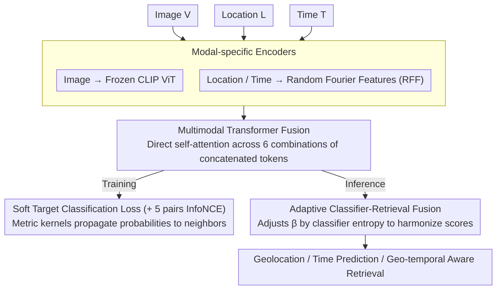

# TIGeR: A Unified Framework for Time, Images and Geo-location Retrieval

**Conference**: CVPR2026  
**arXiv**: [2603.24749](https://arxiv.org/abs/2603.24749)  
**Code**: None  
**Area**: Multimodal VLM  
**Keywords**: Geo-temporal aware retrieval, Multimodal Transformer, Geolocation, Time prediction, Webcam data cleaning

## TL;DR
The TIGeR framework is proposed to learn a unified geo-temporal embedding space for images, locations, and time using a multimodal Transformer. It unifies three tasks—geolocation, time-of-capture prediction, and geo-temporal aware image retrieval—and introduces a high-quality benchmark dataset of 4.5M images.

## Background & Motivation
Many real-world applications (digital forensics, urban monitoring, environmental analysis) require joint reasoning across visual appearance, location, and time. Limitations of prior work:
- **Image Retrieval**: Ranks based on appearance similarity, which is often invariant to the time of capture.
- **Composable Retrieval**: Can modify visual attributes (e.g., "add snow") but does not guarantee results from the same geographic location.
- **Geolocation**: Estimates the capture location but often encodes modalities independently and aligns them via contrastive loss, lacking explicit cross-modal fusion.

Key Challenge: Learning representations that can factorize time-driven appearance changes while preserving the underlying geographic semantic information.

## Method

### Overall Architecture

TIGeR aims to unify geolocation, time prediction, and geo-temporal aware retrieval into a single embedding space. The difficulty lies in factorizing "time-driven appearance changes" (e.g., the same location looking different across seasons) while retaining underlying geographic semantics. The mechanism is divided into four parts: each modality first passes through **modal-specific encoders** to map disparate scales of image/location/time into a comparable space. Then, six input combinations {V, L, T, [V;L], [V;T], [L;T]} are concatenated and fed into a shared **Multimodal Transformer Fusion** module, utilizing self-attention for direct inter-modal interaction. During training, the model uses contrastive loss combined with a **soft target classification loss**, where the soft targets leverage geo/temporal continuity to propagate supervision signals to neighboring classes. During inference, an **adaptive classifier-retrieval fusion** reconciles retrieval and classification scores based on the classifier's confidence.

### Key Designs

**1. Modal-specific Encoders: Frozen CLIP for Images, Fourier Features for Location/Time**

To handle the vast scale differences between modalities, images are processed by a frozen CLIP ViT (outputting CLS + patch embeddings). Low-dimensional continuous values like location and time are projected into a high-dimensional space using Random Fourier Features (RFF) with frequencies $\sigma_i \in \{2^{2i}\}$, ensuring 2D coordinates and time timestamps have sufficient expressivity for the Transformer.

**2. Multimodal Transformer Fusion: Direct Inter-modal Attention**

Geolocation methods typically encode modalities independently and align them at the end, failing to learn fine-grained cross-modal correlations. TIGeR concatenates dual-modality inputs along the token dimension and passes them through self-attention layers. By performing forward passes for six input combinations, the model allows image, location, and time to attend to each other directly during fusion. This enables the learning of precise associations like "same location, different seasons," representing a qualitative shift over post-alignment methods like GT-Loc.

**3. Classification Loss and Soft Targets: Propagating Probability via Continuity**

Geography and time are continuous. Hard classification treats "near misses" as identical to "far misses." TIGeR partitions the Earth into 768 equal-area HEALPix regions and time into 288 bins (24 hours × 12 months, mapped to a flat torus). A metric kernel is then used to propagate probability mass to neighboring classes:

$$K_{i,j} = \exp[-\kappa(C_i,C_j)/\gamma]$$

Haversine distance is used for geography, and toroidal geodesic distance for time. This allows adjacent cells to share supervision signals, reflecting the continuous nature of geo-temporal data.

**4. Adaptive Classifier-Retrieval Fusion Inference: Reconciling Signals via Confidence**

Retrieval and classification scores each have strengths, but fixed-weight fusion can introduce noise for uncertain queries. TIGeR combines them as follows:

$$\text{score}(x_i^G) = (\bar{v}^Q)^T x_i^G / \psi + \beta(I^Q) \log P(b(x_i^G)|I^Q)$$

Here, $\beta$ is adaptively adjusted by the classifier’s entropy. When classification confidence is high, $\beta$ increases to emphasize the classification signal; when uncertain, $\beta$ decreases, reverting primarily to retrieval. This prevents classification noise from degrading results for ambiguous queries.

### Loss & Training

The training strategy utilizes 5 pairs of InfoNCE contrastive losses (excluding direct location-time alignment) and a soft-target cross-entropy classification loss applied to image embeddings.

## Key Experimental Results

### Main Results

| Task | Metric | TIGeR | Prev. SOTA | Gain |
|------|------|-------|----------|------|
| Geo-temporal Retrieval (86k) | R@1 | 3.51% | 2.60% (Zhai+CLIP) | +0.91% |
| Geo-temporal Retrieval (86k) | R@10 | 37.51% | 13.70% (Zhai+CLIP) | +23.81% |
| Time Prediction (Year) | - | +16% avg. gain | GT-Loc | Significant |
| Time Prediction (Day) | - | +8% avg. gain | GT-Loc | Significant |

### Ablation Study

| Configuration | Key Metric | Description |
|------|---------|------|
| Multimodal Transformer vs. Indep. Encoders | Massive Gain | Cross-modal attention is critical |
| Soft Targets vs. Hard Targets | Improvement | Continuity in geo/time requires soft supervision |
| Adaptive β vs. Fixed β | More Stable | Prevents noise introduction in uncertain queries |

### Key Findings
- Independent encoder methods like GT-Loc achieve extremely low R@1 (0.34%) on geo-temporal retrieval, proving that post-alignment is insufficient.
- Cross-modal self-attention allows the model to learn fine-grained associations such as "same location in different seasons."
- Achieving 37.51% R@10 on the 86k test set demonstrates the feasibility of a unified geo-temporal embedding.

## Highlights & Insights
- Valuable new task definition: retrieving an image of the same location at a target time given a query image.
- Significant dataset contribution: A systematic multi-stage quality filtering pipeline that transforms noisy AMOS data into a high-quality benchmark.
- Clever soft classification design: Leverages the inherent continuity of geography and time to share probabilities across neighboring classes.
- The adaptive inference fusion strategy effectively balances retrieval and classification signals.

## Limitations & Future Work
- Overall R@1 remains low, reflecting the extreme challenge of geo-temporal retrieval.
- High computational cost due to 6 forward pass combinations during training.
- Data sources are limited to fixed cameras (AMOS); generalization to social media imagery requires further verification.
- Textual descriptions are not considered as a fourth modality, which could help in disambiguation.

## Related Work & Insights
- Complementary to geolocation methods like GeoCLIP and PIGEON, TIGeR adds the temporal dimension.
- While GT-Loc is the most related, it only performs post-alignment; TIGeR provides a qualitative leap through Transformer-based cross-modal fusion.
- The data cleaning pipeline serves as a valuable reference for any research involving webcam or outdoor imagery.

## Rating
- Novelty: ⭐⭐⭐⭐ New task definition + multimodal Transformer fusion for geo-temporal data.
- Experimental Thoroughness: ⭐⭐⭐⭐ Multi-task evaluation + large-scale dataset + comprehensive baselines.
- Writing Quality: ⭐⭐⭐⭐ Clear problem definition and detailed data construction.
- Value: ⭐⭐⭐⭐ Geo-temporal understanding is a promising new direction with practical demand.

## 补充说明 (Additional Notes)
- The image encoder uses a frozen CLIP ViT-L/14; location and time use Random Fourier Features.
- The 4.5M image training set comes from 1,255 global static webcams; the 86k test set has no webcam overlap.
- HEALPix divides the Earth into 768 equal-area regions; time is divided into 288 bins (24 hours × 12 months).
- The quality classifier achieved 91% accuracy on 400 hold-out images.
- On the CVT dataset (social media images), TIGeR's R@1 is 14.55%, slightly lower than GT-Loc's 16.45%, as CVT does not include repeat camera scenes.

<!-- RELATED:START -->

## Related Papers

- [\[CVPR 2026\] Thinking with Programming Vision: Towards a Unified View for Thinking with Images](thinking_with_programming_vision_towards_a_unified_view_for_thinking_with_images.md)
- [\[CVPR 2026\] Factorize, Reconstruct, Enhance: A Unified Framework for Multimodal Sentiment Analysis](factorize_reconstruct_enhance_a_unified_framework_for_multimodal_sentiment_analy.md)
- [\[CVPR 2026\] UniT: Unified Multimodal Chain-of-Thought Test-time Scaling](unit_unified_multimodal_chain-of-thought_test-time_scaling.md)
- [\[CVPR 2026\] CodeMMR: Bridging Natural Language, Code, and Image for Unified Retrieval](codemmr_bridging_natural_language_code_and_image_for_unified_retrieval.md)
- [\[CVPR 2026\] One Patch to Caption Them All: A Unified Zero-Shot Captioning Framework](one_patch_to_caption_them_all_a_unified_zero-shot_captioning_framework.md)

<!-- RELATED:END -->
