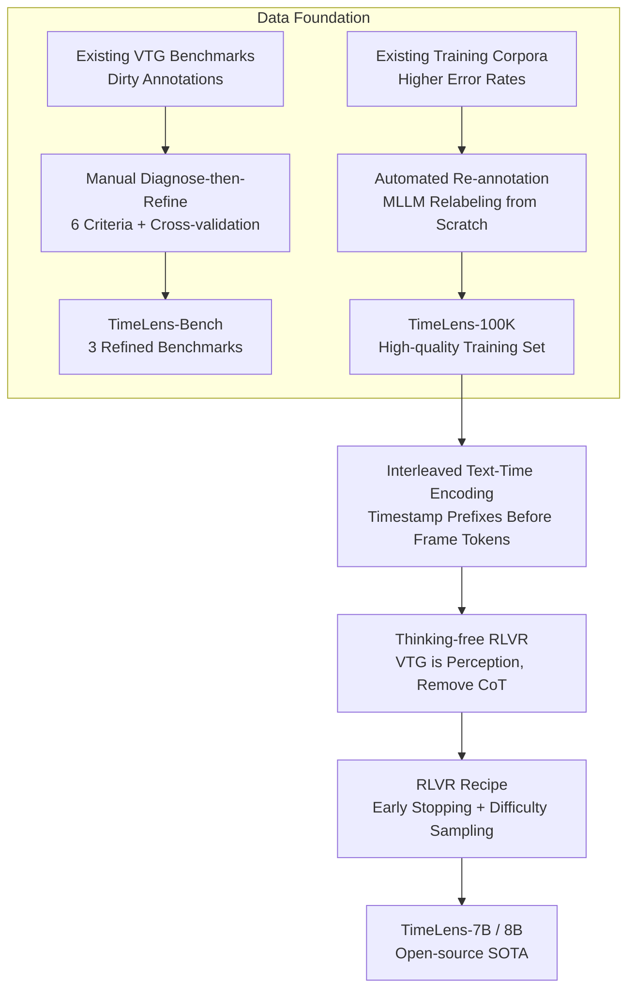

# TimeLens: Rethinking Video Temporal Grounding with Multimodal LLMs

**Conference**: CVPR 2026  
**arXiv**: [2512.14698](https://arxiv.org/abs/2512.14698)  
**Code**: [timelens-arc-lab.github.io](https://timelens-arc-lab.github.io/)  
**Area**: Video Temporal Grounding / Multimodal LLM  
**Keywords**: video temporal grounding, data quality, RLVR, timestamp encoding, benchmark refinement

## TL;DR

This work systematically investigates the key factors for constructing Video Temporal Grounding (VTG) capabilities in MLLMs. From the dimensions of data quality and algorithmic design, the authors release the high-quality TimeLens-Bench and the TimeLens-100K training set. By adopting an interleaved text-time encoding and a thinking-free RLVR training paradigm, they develop the TimeLens model series, achieving SOTA among open-source models and surpassing GPT-5 and Gemini-2.5-Flash.

## Background & Motivation

**Background**: MLLMs perform exceptionally well in "what" understanding but are significantly deficient in "when" capabilities. VTG (localizing specific segments given a video and a text query) is a core task for establishing temporal awareness, yet research methods are fragmented and lack unified best practices.

**Limitations of Prior Work**:

1. The quality of existing VTG benchmarks is concerning: In Charades-STA, 20.6% of samples violate query uniqueness, and 34.9% have annotation precision issues; multiple datasets suffer from non-existent events, ambiguous queries, and information leakage.
2. Different open-source methods use varying training data and experimental settings, preventing fair comparisons of design choices like temporal encoding and training strategies.
3. The error rate in training data (sourced from multiple datasets) is even higher than that of the evaluation benchmarks.

**Key Challenge**: Model rankings shift drastically after fixing the benchmarks—open-source models scored higher than GPT-5 on the original benchmarks, but the ranking completely reversed after refinement—proving that previous evaluation standards were unreliable.

**Goal**: To establish a reliable data foundation for VTG and systematically explore optimal algorithmic design principles.

**Key Insight**: Instead of introducing complex new methods, this work conducts incremental but necessary systematic baseline research along the lines of data quality and algorithmic design.

**Core Idea**: Data quality refinement + Interleaved text-time encoding + Thinking-free RLVR = A simple and optimal VTG solution.

## Method

### Overall Architecture

TimeLens does not simply propose a new model but rather answers "which factors are critical to correctly implement VTG in MLLMs." It proceeds along two lines: at the data level, it diagnoses and refines three mainstream benchmarks to release TimeLens-Bench, then automates re-annotation of training data to create TimeLens-100K; at the algorithmic level, it systematically compares timestamp encoding methods, training paradigms, and RLVR recipes to ultimately train TimeLens-7B/8B.

### Key Designs

**1. Data Foundation: Cleaning both Evaluation and Training Data**

The authors discovered that existing VTG benchmarks have alarming error rates (20.6% of Charades-STA samples violate query uniqueness, 34.9% have precision issues), making comparisons on dirty benchmarks untrustworthy. For evaluation, TimeLens-Bench establishes 6 strict annotation criteria (query clarity/uniqueness, event existence, avoidance of info-leakage, annotation precision/completeness) and uses a "Diagnose-then-Refine" workflow where the same annotator detects and fixes errors for efficiency and quality. After multiple rounds of cross-validation and batch re-work for high error rates, three refined benchmarks—Charades-TimeLens, ActivityNet-TimeLens, and QVHighlights-TimeLens—were produced. The dramatic reversal in model rankings (open-source models dropping below GPT-5) confirms the necessity of this step. For training, manual audits revealed even higher error rates in training corpora than in benchmarks. Consequently, an **automated re-annotation** pipeline was developed—using advanced multimodal models to **re-annotate videos from scratch** rather than patching old labels—resulting in TimeLens-100K with 100,000 high-quality samples. This pipeline is independent of manual evaluation refinement, ensuring no data contamination.

**2. Interleaved Text-Time Encoding: Feeding Time to Models Simply**

There has been no consensus on how to represent timestamps for MLLMs. The authors compared three schemes: position-encoding-based (e.g., MRoPE), visual overlay (rendering time text directly on frames), and text encoding (interleaved vs. non-interleaved). Each was tested with two formats: raw timestamps ("10.2s") vs. frame indices ("1, 2, 3"). Results show that interleaved text prefixes + raw timestamps are optimal (mIoU: Charades 48.3, ActivityNet 43.1, QVHighlights 56.7), significantly outperforming position-encoding schemes (36.6, 33.1, 49.2) without requiring architectural changes.

**3. Thinking-free RLVR: VTG is Perception, Explicit Thinking is Harmful**

While thinking/CoT is widely assumed to help reasoning, its benefit for VTG remained unverified. The authors compared four paradigms: SFT, thinking-based RLVR, SFT + thinking-free RLVR, and pure thinking-free RLVR. They found that VTG is essentially a perception task rather than a reasoning task. Explicit thinking processes not only provide no benefit but actually degrade performance (Charades mIoU 42.7 vs. 48.3). Pure thinking-free RLVR achieves peak performance with 1.0× training time (approx. 4h10m on 8×H20), while a preceding SFT stage (increasing total time to 2.9×) yields no additional gain.

**4. RLVR Recipe: Early Stopping + Difficulty Sampling**

After selecting thinking-free RLVR, the authors addressed "how long to train" and "how to sample data." **Early Stopping**: IoU rewards and intra-group reward standard deviations are monitored; training stops when both plateau. Continuing training leads to performance degradation even with high-quality data. **Difficulty-based Data Sampling**: The training model performs offline inference on training data to calculate difficulty (IoU) per sample. Sampling then follows a Gaussian distribution biased toward high-difficulty samples. Performance improves as average difficulty increases, saturating at mean > 0.75, with approximately 12K samples being sufficient. These recipes each contribute 1-2 mIoU points and save over 50% in training time.

### Loss & Training

RLVR uses GRPO optimization with segment IoUs as verifiable rewards, without any Chain-of-Thought (i.e., thinking-free). TimeLens-7B is based on Qwen2.5-VL-7B, and TimeLens-8B is based on Qwen3-VL-8B. The 1.0× training time is approximately 4h10m on 8×H20. The early stopping and difficulty sampling recipes are summarized in Key Design 4.

## Key Experimental Results

### Main Results

Comparison of mIoU on TimeLens-Bench:

| Model | Charades | ActivityNet | QVHighlights | Type |
|-------|----------|-------------|--------------|------|
| GPT-4o | 41.8 | 40.4 | 52.1 | Commercial |
| GPT-5 | 40.5 | 42.9 | 56.8 | Commercial |
| Gemini-2.5-Flash | 48.6 | 52.5 | 64.3 | Commercial |
| Gemini-2.5-Pro | 52.8 | 58.1 | 70.4 | Commercial |
| Time-R1-7B | 36.6 | 33.1 | 49.2 | Open-source |
| MiMo-VL-7B | 39.6 | 35.5 | 41.5 | Open-source |
| Qwen2.5-VL-7B (Baseline) | 39.3 | 31.4 | 31.6 | Open-source |
| **TimeLens-7B** | **48.8** | **46.2** | **56.0** | Open-source |
| Qwen3-VL-8B (Baseline) | 48.3 | 46.8 | 59.4 | Open-source |
| **TimeLens-8B** | **55.2** | **53.2** | **65.5** | Open-source |

### Ablation Study

**Training Paradigm Comparison** (using TimeLens-100K training data):

| Training Paradigm | Charades mIoU | ActivityNet mIoU | QVHighlights mIoU | Training Time |
|-------------------|---------------|------------------|-------------------|--------------|
| SFT (32K) | 47.4 | 39.9 | 52.0 | 1.0× |
| SFT (100K) | 48.6 | 39.7 | 49.0 | 2.4× |
| Thinking-based RLVR | 42.7 | 41.2 | 57.8 | 1.9× |
| SFT + Thinking-free RLVR | 50.1 | 42.7 | 55.9 | 2.9× |
| **Thinking-free RLVR** | **48.3** | **43.1** | **56.7** | **1.0×** |

### Key Findings

- TimeLens-8B achieves mIoU of 55.2/53.2/65.5 across three benchmarks, surpassing GPT-5 (40.5/42.9/56.8) and Gemini-2.5-Flash (48.6/52.5/64.3).
- Open-source models showed inflated performance on original benchmarks; rankings reversed after refinement, proving original benchmarks were unreliable.
- Thinking-free RLVR achieves best or near-best performance with minimal training time (1.0×); explicit thinking decreases Charades mIoU (42.7 vs. 48.3).
- Interleaved text encoding consistently outperforms visual overlay and position encoding across all benchmarks.
- Early stopping and difficulty sampling contribute approximately 1-2 mIoU gain and save over 50% of training time.

## Highlights & Insights

- The positioning of "essential baseline rather than new method" is honest, but the scale of data refinement is massive; its impact exceeds many methodological papers.
- The "ranking flip" after benchmark refinement is the most impactful discovery, implying that prior conclusions based on old benchmarks need re-evaluation.
- The insight that "VTG is perception, not reasoning" is counter-intuitive: CoT/thinking is not only useless but harmful for VTG.
- The two RLVR recipes (early stopping + difficulty sampling) have broad applicability for other tasks with verifiable rewards.
- The victory of interleaved text encoding suggests: Simple scheme + good data > complex architectural modifications.

## Limitations & Future Work

- Benchmark refinement requires extensive manual labor (annotator training, cross-validation), limiting scalability.
- Thinking-free RLVR might not apply to complex temporal reasoning tasks (e.g., event localization requiring causal reasoning).
- Validated only on Qwen2.5-VL/Qwen3-VL; the transferability of best practices to other architectures like InternVL or LLaVA remains to be investigated.
- No quantitative analysis was conducted on the quality gap between automated re-annotation (TimeLens-100K) and manual annotation.
- Multi-granularity temporal grounding (e.g., joint moment retrieval and video summarization) was not explored.

## Related Work & Insights

- **vs. Time-R1**: Both use RLVR, but Time-R1 uses thinking-based RLVR, resulting in mIoU of only 36.6/33.1/49.2, far below TimeLens. The gap stems from data quality and the thinking-free design.
- **vs. TRACE/TRACE-uni**: Specialized VTG models with mIoU of only 27.1-28.1/32.7-33.6/39.0-39.8, falling short of strong MLLM-based solutions.
- **vs. TimeSuite**: Another systemic VTG solution; its mIoU of 19.8 on ActivityNet suggests that data and training strategies are more critical than model design.
- Insight: The research paradigm of Data Refinement → Fair Evaluation → Establishing Best Practices is a model for other tasks like detection or segmentation.

## Rating

- Novelty: ⭐⭐⭐ (Incremental methodology, but systemic value is high)
- Experimental Thoroughness: ⭐⭐⭐⭐⭐ (Exhaustive exploration of encoding schemes, training paradigms, and RLVR recipes)
- Writing Quality: ⭐⭐⭐⭐⭐ (Clear structure, well-supported findings, and convincing visualization of ranking flips)
- Value: ⭐⭐⭐⭐⭐ (Benchmark refinement and best practices are extremely useful; TimeLens-Bench may become the new standard)

<!-- RELATED:START -->

## Related Papers

- [\[CVPR 2026\] PAS: A Training-Free Stabilizer for Temporal Encoding in Video LLMs](pas_a_training-free_stabilizer_for_temporal_encoding_in_video_llms.md)
- [\[CVPR 2026\] GroundVTS: Visual Token Sampling in Multimodal Large Language Models for Video Temporal Grounding](groundvts_visual_token_sampling_in_multimodal_large_language_models_for_video_te.md)
- [\[ICCV 2025\] Enrich and Detect: Video Temporal Grounding with Multimodal LLMs](../../ICCV2025/multimodal_vlm/enrich_and_detect_video_temporal_grounding_with_multimodal_llms.md)
- [\[CVPR 2026\] Pointing at Parts: Training-Free Few-Shot Grounding in Multimodal LLMs](pointing_at_parts_training-free_few-shot_grounding_in_multimodal_llms.md)
- [\[CVPR 2026\] FAVE: A Structured Benchmark for Fine-Grained Audio-Visual Temporal Evaluation in Multimodal LLMs](fave_a_structured_benchmark_for_fine-grained_audio-visual_temporal_evaluation_in.md)

<!-- RELATED:END -->
