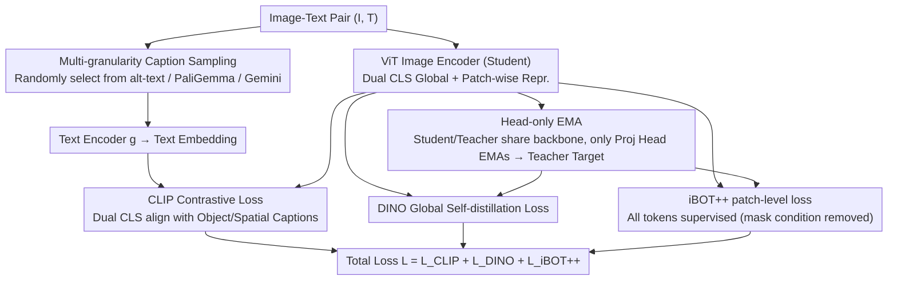

# TIPSv2: Advancing Vision-Language Pretraining with Enhanced Patch-Text Alignment

**Conference**: CVPR 2026  
**arXiv**: [2604.12012](https://arxiv.org/abs/2604.12012)  
**Code**: [https://gdm-tipsv2.github.io/](https://gdm-tipsv2.github.io/)  
**Area**: Multimodal VLM  
**Keywords**: Vision-Language Pretraining, patch-text alignment, iBOT++, distillation, zero-shot segmentation

## TL;DR

This paper proposes TIPSv2, discovering that distillation significantly enhances patch-text alignment. This insight is transformed into a new pretraining objective, iBOT++ (where visible tokens also participate in loss computation). Combined with Head-only EMA and multi-granularity text augmentation, the model achieves SOTA across 20 datasets in 9 tasks.

## Background & Motivation

**Background**: Vision-language pretraining (VLP) follows two main paradigms: contrastive/sigmoid methods (CLIP, SigLIP, PE) providing image-text alignment and zero-shot capabilities, and self-supervised methods (DINO, iBOT) excelling at spatial understanding for dense tasks.

**Limitations of Prior Work**: Generating a unified representation that excels in both global (image-level) and dense (patch-level) understanding remains a major challenge. Unified methods like TIPS and SigLIP2 still struggle to maintain precise patch-level text alignment. A surprising trend is that the largest flagship models often exhibit worse patch-text alignment than smaller models.

**Key Challenge**: Final Transformer layers tend to function as global contrastive "decoders" rather than preserving local semantics, leading to the degradation of patch-level alignment.

**Goal**: To directly address the patch-text alignment problem during the pretraining stage.

**Key Insight**: The authors found that the distillation process significantly improves spatial alignment by imposing effective supervision on all patch tokens—the patch-text alignment of distilled student models substantially exceeds that of their teacher models.

**Core Idea**: Transform the distillation insight into the pretraining objective iBOT++, allowing visible tokens to directly participate in the MIM loss.

## Method

### Overall Architecture

TIPSv2 aims to simultaneously excel at two traditionally conflicting goals within a single model: image-level image-text alignment (the CLIP paradigm) and patch-level spatial understanding (the DINO/iBOT paradigm). It retains the dual-CLS token encoder from TIPS without redesigning the architecture, applying three key modifications to the training objectives: expanding Masked Image Modeling (MIM) from "focusing only on masked patches" to "supervising all patches" (iBOT++), streamlining the stable EMA teacher from the entire model to just the projection heads (Head-only EMA), and replacing single-source web alt-text with multi-source, multi-granularity synthetic captions. When an image is processed, the encoder simultaneously outputs global representations aligned with text and patch-wise representations aligned with text. The total loss combines three supervision signals: $\mathcal{L} = \mathcal{L}_{CLIP} + \mathcal{L}_{DINO} + \mathcal{L}_{iBOT++}$. The diagram below illustrates the training framework: images enter the vision encoder while captions are sampled at multiple granularities. The encoder student and teacher share the backbone via Head-only EMA, and three losses (with iBOT++ being the core modification) are aggregated into a single objective.

### Key Designs

**1. iBOT++: Incorporating visible tokens into MIM loss to fix patch-text alignment at its root**

This addresses the paper's core observation: patch-level semantics in large models are "diluted" by global contrastive loss, with larger flagship models showing worse patch-text alignment. Standard iBOT only computes consistency loss for masked patches: $\mathcal{L}_{iBOT} = -\sum_i m_i \cdot h_t(f_t(I)_i)^\top \log h_s(f_s(I_{mask})_i)$, where $m_i$ is the mask indicator, and only masked tokens enter the summation. iBOT++ makes one change: removing the mask condition $m_i$ so that visible tokens are also included in the loss. This is equivalent to imposing a teacher-student consistency constraint on every patch in the image. This is identified as key because authors observed evidence in distillation—TIPS ViT-L (the distilled student) outperformed its teacher TIPS ViT-g by over 20 points in mIoU for zero-shot segmentation. Distillation essentially imposes supervision on all patches rather than just masked ones. iBOT++ incorporates this "accidental benefit of distillation" directly into the pretraining objective, eliminating the need for an extra distillation stage.

**2. Head-only EMA: EMA for projection heads only to save nearly half of trainable parameters**

Pure self-supervised methods require an EMA teacher of the entire model to prevent representation collapse, which doubles memory and parameter costs. TIPSv2 observes that it already utilizes an image-text contrastive loss; this text-based supervision signal serves as an anchor to prevent collapse. Consequently, the EMA teacher does not need to replicate the entire vision encoder—only the projection heads are subjected to EMA, while the backbone encoder is shared between student and teacher. This reduces trainable parameters by nearly half and saves resources during large-scale training. Experiments show that under text supervision, it achieves downstream performance comparable to full-model EMA.

**3. Multi-granularity Caption Sampling: Feeding multi-source captions to the model for diverse levels of supervision**

Standard web alt-text is often noisy and limited in granularity, insufficient for teaching the model both object recognition and spatial relationships. TIPSv2 mixes three types of captions randomly during training steps: original web alt-text (close to real distribution), PaliGemma-generated descriptions (focused on spatial relations), and Gemini-generated fine-grained detailed descriptions. Captions at different granularities emphasize different visual information. When combined with dual CLS tokens (one aligned with object-type captions and one with spatial captions), the model learns appropriate text signals for diverse downstream tasks like classification, retrieval, and segmentation.

### Loss & Training

The total objective is a combination of three supervisions: CLIP contrastive loss (dual CLS tokens aligning with object and spatial captions), DINO global self-distillation loss, and the iBOT++ patch-level loss (supervising all tokens rather than just masked ones). EMA only updates the projection heads while the backbone is shared, significantly reducing overall training costs compared to full-model EMA.

## Key Experimental Results

### Main Results

| Model | PC59 mIoU | PC60 mIoU | VOC21 mIoU | ADE150 mIoU |
|------|-----------|-----------|------------|-------------|
| TIPS ViT-g (Teacher) | 11.4 | 10.8 | 19.7 | 2.6 |
| TIPS ViT-L (Distilled Student) | 33.5 | 30.4 | 30.5 | 20.8 |
| TIPSv2 ViT-L | **42.1** | **38.2** | **45.3** | **28.7** |
| DINOv2 ViT-L | 35.8 | 32.1 | 38.6 | 23.4 |
| PE-core ViT-L | 28.3 | 25.6 | 32.1 | 18.2 |

### Ablation Study

| Configuration | Mask Ratio | PC59 | VOC21 | ADE150 |
|------|--------|------|-------|--------|
| Standard Pretraining | 0.75 | 6.9 | 6.7 | 0.3 |
| Distillation | 0.75 | 16.0 | 22.5 | 5.9 |
| Distillation | 0.5 | 15.5 | 24.0 | 7.0 |
| Distillation (No Mask = iBOT++) | 0.0 | **31.4** | **30.8** | **20.0** |

### Key Findings

- Removing masks is critical: Reducing the mask ratio from 0.75 to 0.0 during distillation caused PC59 mIoU to jump from 16.0 to 31.4.
- Head-only EMA performs comparably to full-model EMA under text supervision but reduces memory usage by approximately half.
- The phenomenon of distilled students significantly outperforming teachers indicates that patch-text alignment can be acquired post-hoc.

## Highlights & Insights

- The discovery that "distilled students surpass teachers" is highly enlightening: it suggests that in large models, patch semantics are "diluted" by global contrastive loss, whereas distillation restores local semantics through dense supervision on all tokens.
- The modification for iBOT++ is extremely simple (a one-line code change: removing the mask condition), yet the impact is transformative. Such minimal changes yielding large effects are highly valuable.
- The observation of Head-only EMA points out that text supervision can substitute for the role of EMA in preventing representation collapse.

## Limitations & Future Work

- Validated primarily on Google internal-scale data, making community replication difficult.
- Theoretical explanation for iBOT++ is not yet exhaustive.
- Performance on video understanding and 3D tasks has not been evaluated.
- Exploring the effects of iBOT++ on even larger models.

## Related Work & Insights

- **vs TIPS**: iBOT++ in TIPSv2 directly enhances patch-text alignment during pretraining, eliminating the need for a separate distillation step.
- **vs DINOv2**: DINOv2 lacks text alignment; TIPSv2 achieves both spatial understanding and text alignment simultaneously.
- **vs PE**: PE optimizes global contrast at the expense of dense tasks; TIPSv2 balances both via iBOT++.

## Rating

- Novelty: ⭐⭐⭐⭐⭐ The Discovery of students surpassing teachers and the proposal of iBOT++ are both highly novel.
- Experimental Thoroughness: ⭐⭐⭐⭐⭐ Comprehensive evaluation across 20 datasets and 9 tasks.
- Writing Quality: ⭐⭐⭐⭐⭐ Very clear logical chain from discovery to methodology.
- Value: ⭐⭐⭐⭐⭐ High instructional significance for vision foundation model pretraining.

<!-- RELATED:START -->

## Related Papers

- [\[CVPR 2026\] Training-Only Heterogeneous Image-Patch-Text Graph Supervision for Advancing Few-Shot Learning Adapters](training-only_heterogeneous_image-patch-text_graph_supervision_for_advancing_few.md)
- [\[CVPR 2026\] β-CLIP: Text-Conditioned Contrastive Learning for Multi-Granular Vision-Language Alignment](b-clip_text-conditioned_contrastive_learning_for_multi-granular_vision-language_.md)
- [\[CVPR 2026\] Concept-Aware Batch Sampling Improves Language-Image Pretraining](concept-aware_batch_sampling_improves_language-image_pretraining.md)
- [\[CVPR 2026\] Gravitation-Driven Semantic Alignment for Text Video Retrieval](gravitation-driven_semantic_alignment_for_text_video_retrieval.md)
- [\[CVPR 2026\] Mostly Text, Smart Visuals: Asymmetric Text-Visual Pruning for Large Vision-Language Models](mostly_text_smart_visuals_asymmetric_text-visual_pruning_for_large_vision-langua.md)

<!-- RELATED:END -->
