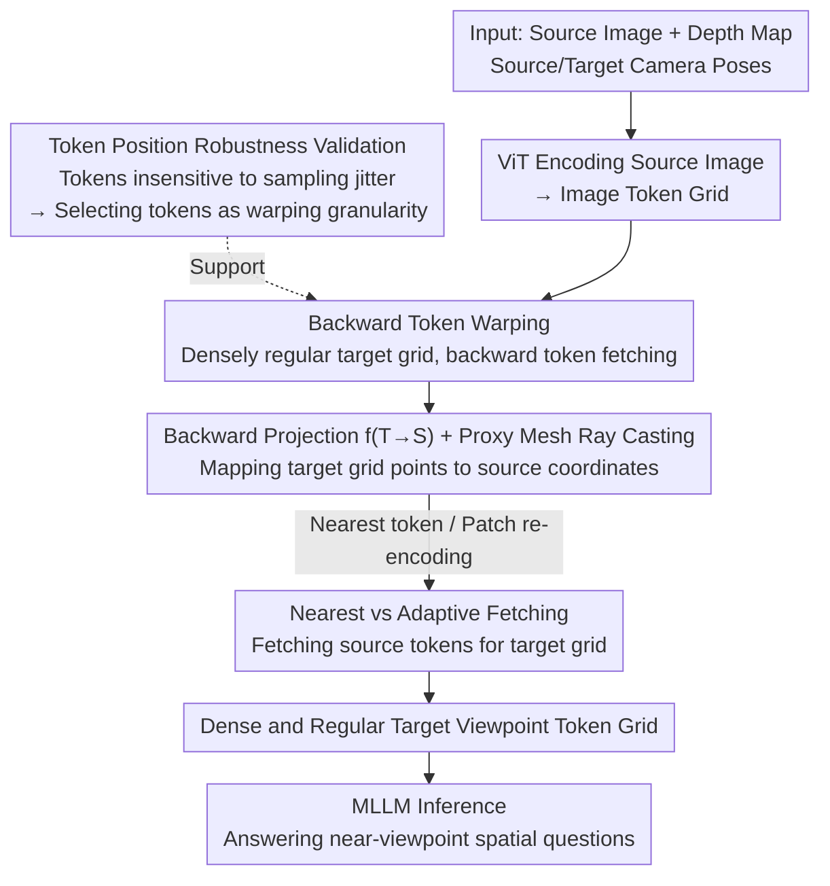

# Token Warping Helps MLLMs Look from Nearby Viewpoints

**Conference**: CVPR 2026  
**arXiv**: [2604.02870](https://arxiv.org/abs/2604.02870)  
**Code**: [https://token-warping-mllm.github.io/](https://token-warping-mllm.github.io/) (Project Page)  
**Area**: Multimodal VLM  
**Keywords**: Viewpoint transformation, token warping, spatial reasoning, mental imagery, MLLM

## TL;DR
This paper proposes performing spatial warping on ViT image tokens of MLLMs (rather than traditional pixel-level warping) to simulate viewpoint changes. Backward token warping is found to maintain semantic consistency while remaining robust to depth estimation noise, significantly outperforming pixel-level warping, specialized spatial reasoning MLLMs, and generative warping methods on the self-constructed ViewBench.

## Background & Motivation

**Background**: Multimodal Large Language Models (MLLMs) exhibit excellent performance in visual reasoning but are fragile when facing viewpoint changes. Even with near-perfect depth estimation, integrating predicted depth into MLLMs does not necessarily provide true 3D understanding. MLLMs specifically fine-tuned for spatial reasoning (e.g., SpatialReasoner) show limited improvement in viewpoint transformation tasks.

**Limitations of Prior Work**: Traditional approaches use pixel-level warping to transform source images to target viewpoints, but pixel-level operations are extremely sensitive to minor errors in depth maps—even small inaccuracies lead to significant geometric distortion and semantic degradation (e.g., deformed books, blurred objects). Generative new-view synthesis methods (e.g., GenWarp) can synthesize complete images but may hallucinate non-existent objects or lose existing ones.

**Key Challenge**: Viewpoint transformation requires an internal representation transformation of the scene, but there is a fundamental contradiction in the choice of granularity—object-level representations are too coarse and lose spatial details, while pixel-level representations are too fine and overly sensitive to noise. An intermediate-level representation is needed.

**Goal**: (1) Identify a viewpoint transformation representation robust to depth errors; (2) Explore optimal warping strategies (forward/backward, nearest/adaptive); (3) Construct a standard benchmark to evaluate MLLM viewpoint reasoning capabilities.

**Key Insight**: Inspired by the "mental imagery" theory in cognitive science—Shepard, Minsky, Pylyshyn, and Hinton proposed that mental images rely on "part-level structural descriptions" rather than holistic representations. Image tokens in ViT happen to reside at the intermediate granularity between pixels and objects, naturally serving as "part-level" representation units.

**Core Idea**: Elevate the viewpoint transformation operation from the pixel level to the token level, utilizing image tokens as robust semantic units for viewpoint transformation to achieve near-viewpoint reasoning in MLLMs.

## Method

### Overall Architecture
The core problem addressed is enabling MLLMs to answer "what the scene looks like from a target viewpoint" given a source image, its depth map, and the source/target camera poses. Traditional pixel-level warping causes geometric and semantic degradation when depth errors occur. This paper shifts the warping operation upward by one level—moving ViT image tokens instead of pixels. The process involves validating token robustness to positional perturbations, reordering source tokens onto a regular target grid using backward projection, and feeding the rearranged tokens directly to the MLLM. This operation occurs at inference time without any training.

### Key Designs

**1. Token Position Robustness Validation: Proving tokens as the appropriate warping granularity**

Viewpoint transformation requires selecting a granularity to transport information. This paper argues that ViT image tokens sit perfectly in the middle. To verify this, the authors designed a "positional noise sensitivity test": applying Gaussian displacement perturbations (from 0 up to 20 pixels, nearly the length of a patch side) to current token grid coordinates, then fetching patches and feeding them into the ViT. Results showed that Qwen2.5-VL's accuracy on CV-Bench-2D remained nearly unchanged, whereas similar perturbations at the pixel level significantly degraded performance. Since tokens are insensitive to "where" they are sampled from, the positional shifts caused by depth errors during warping do not severely harm MLLM understanding.

**2. Backward Token Warping: Ensuring dense and regular grids**

Once token granularity is chosen, the warping direction is critical. Forward warping (projecting source tokens to the target plane) results in sparse, irregular distributions with holes, which are Out-of-Distribution (OOD) inputs for MLLMs trained on regular grids. This paper uses backward warping: a dense regular grid is established for the target viewpoint, and each target grid point is mapped back to the source image plane using the back-projection function $f_{T \to S}$ to find the corresponding token.

$$p_S = f_{T \to S}(p_T)$$

A lightweight 3D proxy mesh is built from the source depth map, and ray casting is performed from each target grid position to find source coordinates. Because the grid is defined from the target side, every point receives a token, resulting in a dense, regular output that matches the expected MLLM input format.

**3. Nearest vs Adaptive Fetching: Two ways to fetch tokens**

Back-projected source coordinates usually fall between existing token grid points. Nearest fetching picks the closest existing token, avoiding extra computation. Adaptive fetching re-crops and re-encodes a patch centered at the mapped coordinates. Experiments show both perform similarly; nearest is faster without sacrificing performance, confirming that precise sub-patch alignment is unnecessary due to token robustness.

### Loss & Training
This method involves no training and is a pure inference-time operation. Warping the image tokens before the MLLM reads them incurs minimal computational cost, primarily from proxy mesh ray casting.

## Key Experimental Results

### Main Results

Experiments were conducted on the self-built ViewBench based on ScanNet real indoor scenes, evaluating three tasks: Text (spatial relations with text labels), Shape (spatial relations of geometric shapes), and Object (target viewpoint object description).

| Method | ViewBench-Text (5-15%) | ViewBench-Shape (5-15%) | ViewBench-Object (5-15%) |
|------|----------------------|------------------------|-------------------------|
| SpatialReasoner | 46.73 | 33.72 | - |
| VLM-3R | 63.82 | 49.22 | - |
| GenWarp | 69.35 | 53.10 | 4.32 |
| Pixel Backward | 71.86 | 62.40 | 4.53 |
| Token Backward-Nearest | 74.87 | 67.44 | 4.80 |
| **Token Backward-Adaptive** | **77.89** | **67.44** | **4.97** |
| Oracle (GT Target View) | 100.00 | 100.00 | 6.64 |

### Ablation Study

| Configuration | ViewBench-Text (5-15%) | ViewBench-Shape (5-15%) | Note |
|------|----------------------|------------------------|------|
| Token Forward | 60.30 | 55.04 | Forward warping leads to irregular tokens |
| Token Backward-Nearest | 74.87 | 67.44 | Backward + Nearest, excellent performance |
| Token Backward-Adaptive | 77.89 | 67.44 | Backward + Adaptive, more expensive but limited gain |
| Pixel Forward | 70.85 | 56.20 | Pixel-level forward |
| Pixel Backward | 71.86 | 62.40 | Pixel-level backward |

### Key Findings
- **Backward > Forward** is the most critical design choice: backward token warping improves performance by 14.57% over forward warping in Text (5-15%) because MLLMs require dense, regular token grids.
- **Token-level > Pixel-level**: Backward token warping outperforms backward pixel warping by 6% on Text and 5% on Shape due to its robustness to depth noise.
- Nearest vs Adaptive fetching show similar performance, indicating that token representation robustness makes precise alignment non-essential.
- The gap between using predicted depth and GT depth is small, further validating the method's robustness to depth errors.
- All specialized spatial reasoning MLLMs (SpatialReasoner, VLM-3R, ViLaSR) are inferior to token warping, suggesting that spatial fine-tuning cannot substitute for explicit viewpoint transformation.

## Highlights & Insights
- **Integration of Cognitive Science and Engineering**: Mapping the "part-level representation" from mental imagery theory to ViT patch tokens provides an elegant link between theory and method.
- **Zero-training Inference-time Enhancement**: The method requires no additional training and significantly improves viewpoint reasoning through a simple token-level transformation.
- **Importance of Regular Token Grids**: The discovery that MLLMs are highly sensitive to the spatial distribution of tokens (treating irregular grids as OOD) is a movable insight for other token manipulation tasks.

## Limitations & Future Work
- Restricted to **near-viewpoint transformation** (overlapping views); warping fails during large angular changes due to occlusion and large holes.
- Dependency on depth maps (GT or predicted) limits application scenarios compared to purely visual methods.
- Generalization to outdoor or dynamic scenes remains unverified as ViewBench focused on indoor ScanNet scenes.
- Experiments were focused on Qwen2.5-VL; robustness to token perturbation might vary across different MLLM architectures.
- The combination with spatial fine-tuning (e.g., token warping + SpatialReasoner) has not yet been explored.

## Related Work & Insights
- **vs SpatialReasoner / VLM-3R**: These methods fine-tune MLLMs on spatial data, but this paper finds fine-tuning doesn't replace explicit warping. Token warping outperforms them without training.
- **vs GenWarp (Generative Warping)**: Generative methods use diffusion to synthesize target views but suffer from hallucinations. Token warping rearranges existing tokens, avoiding this issue.
- **vs Pixel Warping**: Classic 3D vision methods are sensitive to depth noise; token warping leverages the coarse granularity of ViT patches to tolerate positional errors.

## Rating
- Novelty: ⭐⭐⭐⭐ Creative use of part-level representation from cognitive science for token warping.
- Experimental Thoroughness: ⭐⭐⭐⭐ Reasonable benchmark design and comprehensive ablation, though limited to indoor scenes and one MLLM.
- Writing Quality: ⭐⭐⭐⭐⭐ Clear arguments with a complete logical chain from theory to experiment.
- Value: ⭐⭐⭐⭐ High practical value as a training-free enhancement, though limited to near-view transforms.

<!-- RELATED:START -->

## Related Papers

- [\[ICLR 2026\] Constructive Distortion: Improving MLLMs with Attention-Guided Image Warping](../../ICLR2026/multimodal_vlm/constructive_distortion_improving_mllms_with_attention-guided_image_warping.md)
- [\[CVPR 2026\] EgoMind: Activating Spatial Cognition through Linguistic Reasoning in MLLMs](egomind_activating_spatial_cognition_through_linguistic_reasoning_in_mllms.md)
- [\[CVPR 2026\] When to Think and When to Look: Uncertainty-Guided Lookback](when_to_think_and_when_to_look_uncertainty-guided_lookback.md)
- [\[CVPR 2026\] Asking like Socrates: Socrates helps VLMs understand remote sensing images](asking_like_socrates_socrates_helps_vlms_understand_remote_sensing_images.md)
- [\[CVPR 2026\] Where MLLMs Attend and What They Rely On: Explaining Autoregressive Token Generation](where_mllms_attend_and_what_they_rely_on_explaining_autoregressive_token_generat.md)

<!-- RELATED:END -->
