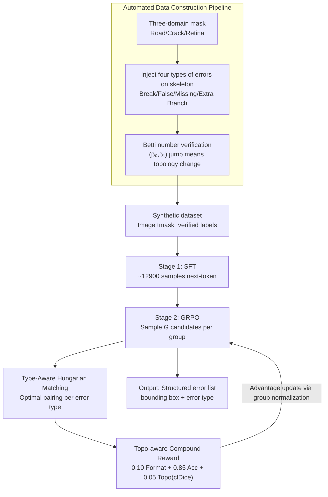

# Topo-R1: Detecting Topological Anomalies via Vision-Language Models

**Conference**: CVPR 2026  
**arXiv**: [2603.13054](https://arxiv.org/abs/2603.13054)  
**Code**: TBD  
**Area**: Multimodal VLM  
**Keywords**: Topological Anomaly Detection, Tubular Structure Segmentation, GRPO Reinforcement Learning, clDice, VLM Fine-grained Perception

## TL;DR
Topo-R1 is proposed as the first framework giving VLMs topology-aware capabilities. By leveraging an automated data construction pipeline, SFT, and GRPO reinforcement learning with a topo-aware compound reward, it achieves zero-annotation topological anomaly detection and classification for tubular structures.

## Background & Motivation
**Background**: The topological correctness of tubular structures (vessels, nerve fibers, road networks) is critical. Existing topology-preserving segmentation methods (e.g., persistent homology loss, clDice) rely on pixel-level annotations to constrain training losses.

**Limitations of Prior Work**: Topological annotation requires domain expertise and is extremely time-consuming; cross-domain transfer is difficult (e.g., retinal labels are inapplicable to road networks); models cannot detect topological errors when deployed in new, unlabeled domains.

**Key Challenge**: Topological anomalies are extremely sparse and localized—a single missing pixel among thousands of correct ones can disconnect a vessel. Detecting such "needle-in-a-haystack" errors requires a combination of global structural reasoning and local fine-grained perception, which current VLMs entirely lack.

**Goal**: To enable VLMs to locate and classify topological errors in tubular structures without domain-specific annotations.

**Key Insight**: Redefine topological anomaly detection as a structured visual reasoning task: given an image and a segmentation mask, the model must output bounding boxes with type labels.

**Core Idea**: Synthesize topological anomalies with verifiable labels via an automated pipeline, then train the VLM using GRPO reinforcement learning incorporating type-aware Hungarian matching and clDice rewards.

## Method

### Overall Architecture
Topo-R1 addresses a "needle-in-a-haystack" detection problem: identifying local errors that disrupt connectivity in an otherwise nearly perfect tubular mask. The challenge lies in the absence of target-domain topo-labels and the VLM's inherent lack of topological awareness. The mechanism follows a "synthesize-then-train" strategy: first, an automated pipeline generates verifiable topological anomalies as training data; then, the VLM undergoes two-stage training. Stage 1 uses synthetic data for SFT to bring the model from near-random performance to stable structured output; Stage 2 employs GRPO reinforcement learning with a topo-aware compound reward to force precise localization and classification. The system takes "image + mask + detection prompt" as input and outputs a structured error list containing bounding boxes and error types.

### Key Designs

**1. Automated Data Construction Pipeline: Bypassing Annotation Deadlocks with Synthesis and Betti Number Verification**

Manual annotation of topological anomalies is prohibitively expensive, requiring experts to judge every pixel. The pipeline reverses this: it aggregates masks from three domains (60% road, 20% crack, 20% retina) and **actively injects** four types of errors—broken connections, false connections, missing branches, and extra branches—onto the skeletons. These types exhaustively cover topological disruptions along connectivity and branching axes. Post-injection, the pipeline automatically verifies changes using Betti numbers $(\beta_0, \beta_1)$, where $\beta_0$ represents connected components and $\beta_1$ represents loops. A jump in these numbers ensures the synthetic sample has a "verified" ground truth, eliminating manual labor and providing reliable training signals.

**2. Topo-aware Compound Reward: Transforming clDice into a VLM Reward Signal**

The anchor of the GRPO stage is the reward design. Standard detection rewards only check box accuracy, but topological errors are defined by connectivity changes, to which IoU is insensitive. The reward is weighted into three components:

$$R_{\text{total}} = 0.10\,R_{\text{fmt}} + 0.85\,R_{\text{acc}} + 0.05\,R_{\text{topo}}$$

The format reward $R_{\text{fmt}}$ ensures parsable output; the accuracy reward $R_{\text{acc}}$ includes soft F1 detection, localization, and type rewards via Hungarian matching. The topological prior is injected through $R_{\text{topo}}$: for each matched prediction-label pair, $(1-\text{clDice})$ is calculated to quantify skeletal deviation, multiplied by an area penalty to prevent "large-box" reward hacking. Since clDice measures skeletal overlap, $R_{\text{topo}}$ encodes the prior that topological errors are connectivity-based—models only score if they correctly align with the broken or extra skeleton segments.

**3. Type-Aware Hungarian Matching: Preventing Topo-Rewards for Misclassified Detections**

To calculate rewards, predicted boxes must be paired with labels. Global greedy matching is order-dependent and prone to one-to-many issues. Ours uses type-aware optimal matching: an IoU affinity matrix is constructed for each error type $t$ independently. A linear assignment problem (Hungarian algorithm) is solved to find the one-to-one optimal match within that type. This ensures matching is globally optimal and order-invariant. Crucially, it makes "correct type" a prerequisite; boxes with correct locations but wrong types receive no $R_{\text{topo}}$, avoiding misleading positive feedback.

### Loss & Training
Stage 1 (SFT) involves full-parameter training on ~12,900 synthetic samples for next-token prediction to guide the model toward structured output. Stage 2 (GRPO) trains on ~50,300 samples: for each query, $G$ candidates are sampled. Their group-normalized rewards serve as the advantage for policy updates using PPO clipping and KL regularization, leveraging group exploration to hit sparse topological anomalies.

## Key Experimental Results

### Main Results (Detection F1@IoU)

| Model | Method | F1@0.3 | F1@0.5 | F1@0.75 | aF1 |
|------|------|--------|--------|---------|-----|
| GPT-4o | Zero-shot | 0.5 | 0.3 | 0.0 | 0.1 |
| GPT-5.2 | Zero-shot | 0.4 | 0.2 | 0.0 | 0.1 |
| Qwen2.5-VL-3B | Zero-shot | 0.0 | 0.0 | 0.0 | 0.0 |
| Qwen2.5-VL-3B | SFT | ~15 | ~10 | ~3 | ~5 |
| Qwen2.5-VL-3B | **Ours (Topo-R1)** | **32.5** | **22.8** | **8.1** | **12.4** |
| Qwen3-VL-8B | **Ours (Topo-R1)** | **38.7** | **28.3** | **11.2** | **16.0** |

### Ablation Study

| Config | F1@0.5 | aF1 | Note |
|------|--------|-----|------|
| SFT only | 10.2 | 5.1 | Supervised fine-tuning only |
| SFT + GRPO (no topo reward) | 18.5 | 9.3 | Without topological reward |
| SFT + GRPO (w/ topo reward) | **22.8** | **12.4** | Full Topo-R1 |
| No format reward | 20.1 | 10.8 | Increased format errors |

### Key Findings
- Strong closed-source VLMs (GPT-5.2, Gemini-2.5-Flash) perform near-randomly on topo-anomaly detection, confirming a lack of topological awareness.
- SFT provides a baseline but limited gains; GRPO's exploration is essential for discovering sparse anomalies.
- Although the $R_{\text{topo}}$ weight is only 0.05, its contribution is significant, suggesting direction is more important than magnitude in reward design.
- Cross-domain training (roads + cracks + vessels) yields better generalization than single-domain training.

## Highlights & Insights
- **Novelty**: First to apply GRPO reinforcement learning to topological quality assessment, opening a new direction for VLM topological perception.
- **Reward Design**: Successfully repurposes clDice from a loss function to an RL reward signal, conditioned by type-aware Hungarian matching to prevent misleading feedback.
- **Value**: Enables topological quality assessment without target-domain labels, serving as a post-processing QA tool for existing segmentation pipelines.

## Limitations & Future Work
- Currently limited to 2D; 3D networks (e.g., cerebrovascular, connectomes) require extension.
- Synthetic anomalies might not perfectly match real-world post-processing error distributions.
- Fixed error categories may not cover all scenarios (e.g., occlusion-induced false positives).
- Patch size (256×256) limits the model's ability to perceive large-scale topological relationships.

## Related Work & Insights
- **vs AnomalyR1**: AnomalyR1 targets industrial defects; Topo-R1 focuses on topology with distinct reward designs (clDice vs IoU).
- **vs clDice Loss**: While clDice typically optimizes segmentation pixel-by-pixel, Topo-R1 uses it as a high-level RL signal for detection and classification.

## Rating
- Novelty: ⭐⭐⭐⭐⭐ 
- Experimental Thoroughness: ⭐⭐⭐⭐ 
- Writing Quality: ⭐⭐⭐⭐ 
- Value: ⭐⭐⭐⭐⭐ 

<!-- RELATED:START -->

## Related Papers

- [\[CVPR 2026\] AV-Reasoner: Improving and Benchmarking Clue-Grounded Audio-Visual Counting for MLLMs](av-reasoner_improving_and_benchmarking_clue-grounded_audio-visual_counting_for_m.md)
- [\[CVPR 2026\] Geoint-R1: Formalizing Multimodal Geometric Reasoning with Dynamic Auxiliary Constructions](geoint-r1_formalizing_multimodal_geometric_reasoning_with_dynamic_auxiliary_cons.md)
- [\[CVPR 2026\] EvoGraph-R1: Self-Evolving Multimodal Knowledge Hypergraphs for Agentic Retrieval](evograph-r1_self-evolving_multimodal_knowledge_hypergraphs_for_agentic_retrieval.md)
- [\[CVPR 2026\] DeepAlign: Mitigating Modality Conflict through Modality-Specific Alignment](deepalign_mitigating_modality_conflict_through_modality-specific_alignment.md)
- [\[CVPR 2026\] STAR-R1: Multi-View Spatial TrAnsformation Reasoning by Reinforcing Multimodal LLMs](star-r1_multi-view_spatial_transformation_reasoning_by_reinforcing_multimodal_ll.md)

<!-- RELATED:END -->
