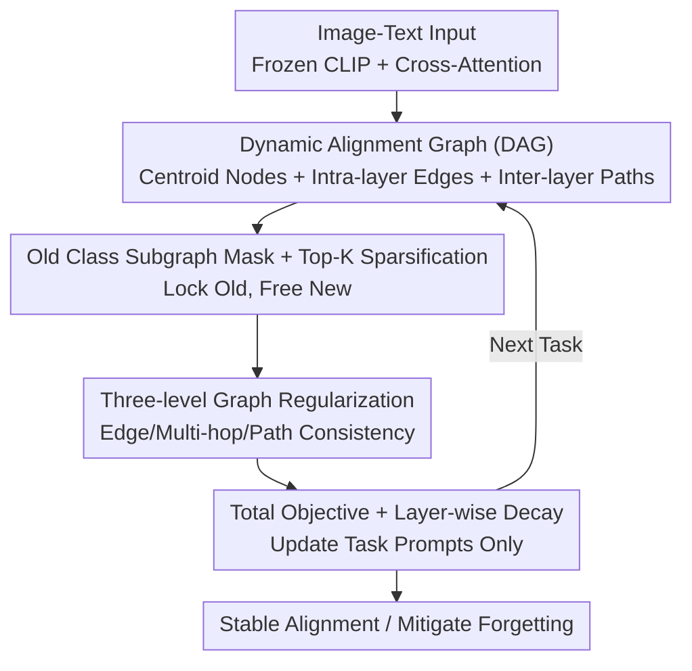

# Towards Dynamic Modality Alignment in Multimodal Continual Learning

**Conference**: CVPR 2026  
**Paper**: [CVF Open Access](https://openaccess.thecvf.com/content/CVPR2026/html/Tan_Towards_Dynamic_Modality_Alignment_in_Multimodal_Continual_Learning_CVPR_2026_paper.html)  
**Code**: To be confirmed  
**Area**: Multimodal VLM / Continual Learning  
**Keywords**: Multimodal Continual Learning, Modality Alignment, Graph Regularization, Catastrophic Forgetting, Prompt Learning

## TL;DR
This paper argues that "modality alignment is not a static one-time constraint, but a dynamic process evolving with tasks and network layers." It constructs a "Dynamic Alignment Graph" for each task (nodes are cross-modal cluster centroids, intra-layer edges capture token interactions, and inter-layer edges capture representation propagation). By using three-level graph regularization to lock the evolution of old class subgraphs while keeping new ones flexible, it prevents shallow misalignments from snowballing into deeper layers. On the MTIL 11 dataset, it pushes Avg./Last accuracy to 79.4%/87.1% with only 1.8M trainable parameters, exceeding the previous strongest baseline DIKI by approximately +3.1%/+2.0%.

## Background & Motivation
**Background**: Multimodal Continual Learning (MMCL) aims to enable a model to continuously absorb new knowledge across a sequence of tasks without forgetting old ones. This is more challenging than unimodal continual learning because it relies on the coordination and complementarity of image and text modalities. Traditional approaches revolve around "modality alignment"—using weight regularization or maintaining alignment during incremental learning—often by forcing image-text features together at specific layers or in the final representation.

**Limitations of Prior Work**: These methods treat alignment as a **static** goal, assuming that "once alignment is established, it remains fixed." However, in continual learning, tasks change (class-incremental, distribution shift), and internal representations also change (shallow feature distributions shift first, gradually affecting deeper layers). Static constraints only focus on the top layer or a few specific layers, completely ignoring how alignment "flows" and "drifts" between layers.

**Key Challenge**: The authors' key observation is that task-level changes and model-level changes are **intertwined and mutually amplified**. A task switch first perturbs the shallow feature distribution, causing slight misalignment. This misalignment propagates down the layers, being amplified at each step, and eventually provides incorrect alignment guidance when learning new tasks, leading to escalating catastrophic forgetting (demonstrated in Fig. 1 as the "snowball chain" of increasing $\Delta Align$ layer by layer). Existing works (including distillation) mostly constrain only the final logits; while two models' logits may be consistent, their inter-layer dynamics can be vastly different, leaving this propagation chain unmanaged.

**Goal**: To explicitly model and constrain "how cross-modal alignment evolves across layers," ensuring alignment consistency between layers and tasks to sever the propagation of shallow misalignment at its source.

**Core Idea**: Use a task-evolving Dynamic Alignment Graph to structurally represent the "inter-layer dynamics of alignment," and then apply graph regularization to constrain the evolution of this graph—**locking old class subgraphs while freeing new class subgraphs** to achieve a balance between stability and plasticity.

## Method

### Overall Architecture
DAGR (Dynamic Alignment Graph Regularization) is built upon a frozen vision-language backbone (CLIP-style dual-tower + cross-attention), where the only learnable components are task-specific prompts for each task. The workflow consists of two major steps: **first, constructing a dynamic alignment graph for the current task, and then using graph regularization to stabilize the evolution of this graph**.

During the graph construction phase: Image-text fusion features from each cross-attention module are clustered into $K$ centroids to serve as graph nodes. Intra-layer edges are formed using head-wise softmax-normalized attention (capturing local token dependencies), while inter-layer edges combine "explicit cosine similarity + implicit attention rollout" (capturing how representations propagate from layer $l$ to $l+1$). During the regularization phase: Cross-attention prototypes are matched with historical prototypes to generate a binary mask $M$ that retains only old class nodes/edges. Three KL divergence terms then constrain **intra-layer edge consistency**, **multi-hop edge consistency**, and **inter-layer path consistency**, which are combined with the image-text matching loss. Since the backbone is frozen, these constraints are realized via the prompts, effectively teaching them "how to steer the alignment dynamics."

### Key Designs

**1. Dynamic Alignment Graph (DAG): Explicitly Mapping "Inter-layer Evolution of Alignment"**

To address the failure of static alignment in managing inter-layer drift, the authors construct a graph $G=(V,E)$ for each task, upgrading alignment from a "scalar target at a specific layer" to a "structure spanning the entire network." Nodes are not raw tokens but $K$ centroids clustered from image-text features mixed by a fusion ratio $\alpha$ at each layer: $V^{(l)} = \mathrm{Cluster}\big(\alpha Z^{(l)}_{img} + (1-\alpha) Z^{(l)}_{txt},\, K\big)$. Each centroid represents a semantically coherent, cross-modally aligned unit. Intra-layer edges capture local dependencies using head-wise softmax attention with temperature $\beta$: $e^{(l)}_{ij} = \frac{1}{H}\sum_{h} \frac{\exp(\beta A^{(l,h)}_{ij})}{\sum_{j'}\exp(\beta A^{(l,h)}_{ij'})}$. Inter-layer edges characterize how representations propagate, blending explicit similarity and implicit rollout: $e^{(l\to l+1)}_{ij} = \gamma\cos\!\big(f(v^{(l)}_i),\,v^{(l+1)}_j\big) + (1-\gamma)R^{(l\to l+1)}_{ij}$, where $R$ is the attention rollout matrix, representing the cumulative effect of attention transformed by the Transformer's projection matrix $W^{(l)}$. This explicitly expresses how alignment flows across layers for the first time.

**2. Old Class Subgraph Mask + Top-K Sparsification: Selective Locking for Stability and Plasticity**

Uniformly constraining the entire graph would stifle the plasticity needed for new classes. The authors match cross-attention prototypes with historical prototypes to create a binary mask $M_l[i,j]=1$ if the edge $(i,j)$ belongs to an old class subgraph, and 0 otherwise. All subsequent regularizations are multiplied by this mask, ensuring constraints only apply to old class subgraphs while new classes remain flexible. Top-K sparsification is also applied to remove weak edges and highlight critical connections, reducing complexity and improving interpretability.

**3. Three-level Graph Regularization: Blocking Misalignment Propagation Layer-by-Layer**

This core component uses three KL divergence terms to constrain graph evolution between adjacent tasks. **Intra-layer edge consistency** $L_{edge}$ penalizes the drift of interaction distributions for old class tokens. **Multi-hop edge consistency** $L_{multi}$ extends this to $k$-step propagation ($k\in\{2,3\}$) to ensure misalignment doesn't accumulate along "inference chains." **Path consistency** $L_{path}$ directly constrains information propagation between adjacent layers using the rollout transition matrix, ensuring shallow perturbations do not propagate unchecked to deep layers. Ablations show this **inter-layer path constraint is the most critical**, as it directly addresses the primary cause: "shallow misalignment amplified by forward propagation."

**4. Total Objective + Layer-wise Decay: Steering Alignment via Prompts**

The total loss is: $L = L_{match} + \lambda_1 L_{edge} + \lambda_2 L_{multi} + \lambda_3 L_{path}$. A subtle detail is making $\lambda$ coefficients **decay layer-wise**—stronger constraints in shallow layers and weaker in deep layers. This matches the diagnosis that "misalignment starts in shallow layers." Since the backbone is frozen, these constraints do not modify backbone weights but are fulfilled by the task-specific prompts. Graph construction complexity is $O(K^2 L)$, and each task graph takes only ~0.2MB.

### Loss & Training
- The total objective is shown above (Eq. 14), with $\lambda$ controlling the stability-plasticity tradeoff via layer-wise decay.
- Backbone is frozen; only task-specific prompts (1.8M parameters) are trained. Compact graphs (~0.2MB) are stored without a rehearsal buffer.
- To improve forward transfer and zero-shot generalization, the next task prompt is initialized with components of the previous task prompt, retaining task-agnostic patterns.

## Key Experimental Results

### Main Results
Evaluation on MTIL (11 datasets, 1201 classes, significant distribution drift) using Avg. (average accuracy during training) and Last (final accuracy after all tasks).

| Method | Extra Data | Trainable Params | Avg.(%) | Last(%) |
|------|---------|---------|---------|---------|
| Zero-shot | - | - | 64.7 | - |
| ZSCL | ✓ | 211M | 75.4 | 83.6 |
| MoEAdapters | × | 84M | 75.4 | 84.2 |
| C-CLIP | × | 2M | 77.8 | 85.9 |
| DIKI (Prev. SOTA) | × | 1.8M | 76.3 | 85.1 |
| **DAGR** | × | 1.8M | **79.4** | **87.1** |
| Upper Bound | - | - | 89.3 | - |

DAGR is optimal across almost all datasets and both metrics: Avg. 79.4% and Last 87.1%, outperforming DIKI by +3.1% / +2.0% with only 1.8M parameters and no external data dependencies.

### Ablation Study
| Configuration | Avg.(%) | Last(%) | Description |
|------|---------|---------|------|
| w/o Graph Reg. | 71.2 | 79.5 | Removed all graph regularization |
| $L_{edge}$ only | 73.0 | 81.0 | Intra-layer edge consistency |
| $L_{multi}$ only | 74.1 | 82.3 | Multi-hop edge consistency |
| $L_{path}$ only | 75.4 | 83.7 | Inter-layer path consistency (Strongest single term) |
| Full Model | **79.4** | **87.1** | Complete DAGR |

### Key Findings
- **Inter-layer path constraint $L_{path}$ is most significant**: It alone increases Avg. from 71.2 to 75.4 by blocking the snowball effect.
- **The three terms are complementary**: Each handles local, intra-layer, and cross-layer consistency respectively, providing a balanced stability-plasticity tradeoff.
- **Training is efficient**: MTIL training takes ~2.9 GPU hours (vs 12.9h for ZSCL).
- **Robust to task order**: DAGR shows minimal fluctuation across forward, backward, and random task sequences.

## Highlights & Insights
- **Structuralizing the "Dynamic Alignment Process"**: Progressing from diagnosing the snowball effect to implementing a graph-based solution that sever the propagation chain.
- **Mask-based selective constraints**: Using a binary mask for old class subgraphs is a clean, reusable approach for the stability-plasticity tradeoff.
- **Layer-wise decay logic**: Introducing stronger constraints where misalignment originates (shallow layers) is an effective way to inject prior knowledge into optimization.
- **Repurposing Attention Rollout**: Successfully utilizing attention rollout, typically used for visualization, as a metric for inter-layer propagation.

## Limitations & Future Work
- **Scalability**: Challenges remain in managing a very large number of tasks efficiently.
- **Forward Transfer**: Task-specific prompts inherently struggle with unseen tasks; the current "inheritance" patch is a heuristic rather than a fundamental solution.
- **Hyperparameter Sensitivity**: Robustness of selections for $\alpha, \beta, \gamma, K$ requires verification across different backbones.
- **Architecture Dependency**: The method is currently tied to frozen backbones with cross-attention.

## Related Work & Insights
- **Vs. Static Alignment/Regularization (e.g., LwF, ZSCL)**: These methods ignore inter-layer drift, whereas DAGR intercepts misalignment propagation, leading to higher stability with fewer parameters.
- **Vs. Prompt-based MMCL (L2P, DualPrompt, DIKI)**: While these focus on adaptation via prompts, DAGR adds structural graph regularization to stabilize alignment dynamics within those prompts.
- **Vs. Representation Dynamics**: While prior work noted that "alignment error scales with depth," DAGR translates this insight into an optimizable graph regularization.

## Rating
- Novelty: ⭐⭐⭐⭐ Formalizing modality alignment as a dynamic inter-layer process using graphs is innovative.
- Experimental Thoroughness: ⭐⭐⭐⭐ Comprehensive testing on MTIL 11, though verification on more diverse backbones could be beneficial.
- Writing Quality: ⭐⭐⭐⭐ Clear alignment between motivation, diagnosis, and method.
- Value: ⭐⭐⭐⭐ Significant SOTA improvement on MTIL with high practical efficiency.

<!-- RELATED:START -->

## Related Papers

- [\[CVPR 2026\] Multimodal Continual Instruction Tuning with Dynamic Gradient Guidance](multimodal_continual_instruction_tuning_with_dynamic_gradient_guidance.md)
- [\[CVPR 2026\] MOON2.0: Dynamic Modality-balanced Multimodal Representation Learning for E-commerce Product Understanding](moon20_dynamic_modality-balanced_multimodal_representation_learning_for_e-commer.md)
- [\[CVPR 2026\] DeepAlign: Mitigating Modality Conflict through Modality-Specific Alignment](deepalign_mitigating_modality_conflict_through_modality-specific_alignment.md)
- [\[CVPR 2026\] Enhancing Continual Learning of Vision-Language Models via Dynamic Prefix Weighting](enhancing_continual_learning_of_vision-language_models_via_dynamic_prefix_weight.md)
- [\[CVPR 2026\] DSCA: Dynamic Subspace Concept Alignment for Lifelong VLM Editing](dsca_dynamic_subspace_concept_alignment_for_lifelong_vlm_editing.md)

<!-- RELATED:END -->
