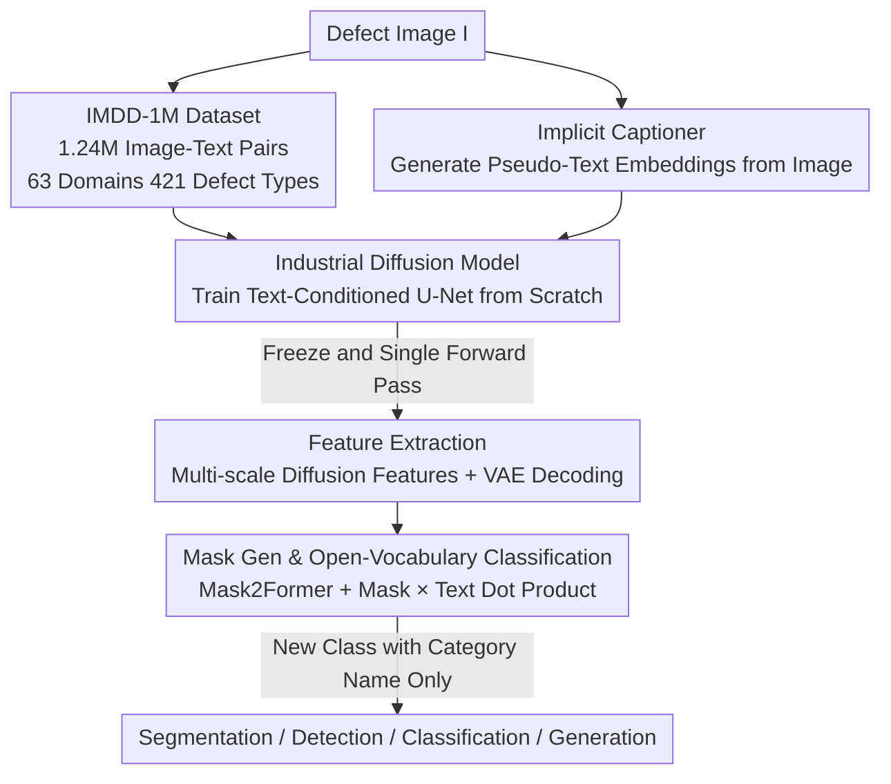

# Towards Open-Vocabulary Industrial Defect Understanding with a Large-Scale Multimodal Dataset

**Conference**: CVPR 2026  
**Paper**: [CVF Open Access](https://openaccess.thecvf.com/content/CVPR2026/html/Ni_Towards_Open-Vocabulary_Industrial_Defect_Understanding_with_a_Large-Scale_Multimodal_Dataset_CVPR_2026_paper.html)  
**Code**: To be confirmed  
**Area**: Multimodal VLM / Industrial Defect Detection / Dataset  
**Keywords**: Industrial defects, image-text pair dataset, diffusion foundation model, open-vocabulary classification, data-efficient

## TL;DR
This paper constructs the first million-scale industrial defect "image-text pair" dataset, IMDD-1M (1.24 million images, 63 manufacturing domains, 421 defect types), and trains a text-conditioned diffusion foundation model from scratch. It unifies segmentation, detection, classification, and generation into a single framework. Downstream tasks achieve performance close to specialized models using only about 200 samples per class (less than 5% of the annotation volume required by expert models).

## Background & Motivation

**Background**: Industrial inspection has long relied on Automated Optical Inspection (AOI) and specialized detectors represented by YOLO. While these methods are strong on single tasks, each task requires individual training, massive pixel-level annotations, and functions as a "black-box discriminator"—providing only "defect/no-defect" results without semantic explanations.

**Limitations of Prior Work**: On one hand, AOI/YOLO approaches exhibit high false alarm rates, adapt poorly to unseen defect patterns, and fail to generalize across production lines. On the other hand, vision-language models (VLMs) like CLIP, ALIGN, and Flamingo align vision and text semantics well on natural images but lack professional industrial domain knowledge. Industrial defects are often "tiny, local, and require professional terminology" (e.g., delamination, solder void), which are concepts unknown to general VLMs.

**Key Challenge**: Enabling VLMs to understand industrial defects requires a large-scale training corpus of "images paired with professional text descriptions." However, existing industrial defect datasets (MVTec AD, VisA, Real-IAD, etc.) are limited to tens of thousands of images at most and **completely lack text annotations**, which is about two orders of magnitude smaller than the volume required for multimodal learning. Without image-text pairs, it is impossible to train a foundation model that understands industrial semantics.

**Goal**: (1) Create a million-scale industrial defect dataset with expert-verified image-text annotations; (2) Train a unified multimodal foundation model capable of both discrimination (segmentation/detection/classification) and generation (synthesis/augmentation); (3) Enable transfer to new defect categories with minimal annotations.

**Key Insight**: The authors bet on the premise that "the intermediate features of diffusion models themselves represent strong semantic representations." Rather than training a discriminative backbone, it is more effective to train a **text-conditioned diffusion model** from scratch and utilize its learned multi-scale features as general representations for downstream heads. A single set of weights can thus generate defect images and extract features for discrimination.

**Core Idea**: First, train an industrial diffusion model from scratch using a million image-text pairs. Then, freeze it and transfer the diffusion features to a Mask2Former-style mask generator. Open-vocabulary defect segmentation and classification are achieved through a "mask embedding × text embedding" dot product.

## Method

### Overall Architecture
The system consists of two stages. **Stage 1** involves training an 860M parameter text-conditioned diffusion U-Net from scratch on IMDD-1M, while simultaneously training a tiny "implicit captioner" (0.3M parameters) to allow the model to generate pseudo-text embeddings when real text is unavailable. **Stage 2** freezes the entire diffusion model and trains a 45M parameter Mask2Former mask generator on downstream datasets. A single forward pass encodes the image into diffusion features, and the VAE decoder restores these features to pixel-aligned multi-scale representations. The mask generator predicts binary masks and corresponding embeddings, and finally, open-vocabulary classification is performed via a dot product between mask embeddings and category text embeddings. At test time, given a completely new category $C_{test}$ (category name only), segmentation and classification are performed without retraining.

The problem is formalized as follows: Given image $I \in \mathbb{R}^{H \times W \times 3}$ and optional text $t$, predict semantic masks $M \in \{0,1\}^{H \times W}$. Training is conducted on base classes $C_{train}$, and testing is on disjoint $C_{test}$, where only category names are provided during inference.

### Key Designs

**1. IMDD-1M: Filling the "Image-Text Pair" gap in the industrial domain**

The root cause for the lack of foundation models for industrial defect understanding is the absence of large-scale text-annotated data. The authors consolidated 26 public and corporate datasets (incl. BTAD, MVTec AD, VisA, NEU-DET, WM-811K, ICCAD) to form 1.24 million images (285,451 normal + 954,928 abnormal), covering 63 manufacturing domains and 421 defect types. This is about two orders of magnitude larger than Real-IAD (67K). All images are unified to $512 \times 512$ resolution. Crucially, each image is paired with an "expert-verified + LLM-assisted" text description averaging 42 words, detailing the defect's location, severity, and contextual attributes (e.g., "metal plate with scratches"). A hybrid annotation pipeline ensures linguistic consistency via LLMs and professional accuracy via experts. This corpus serves as the foundation for the diffusion model to learn industrial vision-semantic associations.

**2. Industrial Diffusion Model Trained from Scratch: Diffusion Features as General Representations**

General VLMs lack industrial expertise, and fine-tuning may be biased by natural image priors; thus, the authors **initialize randomly and train from scratch**. The backbone uses the Stable Diffusion v1.5 U-Net (four encoder blocks, channels 320/640/1280/1280, corresponding to strides 1/2/4/8), where text conditions are injected via cross-attention after each ResNet block. Images are first compressed 8-fold by a frozen VAE $z_0 = E_{VAE}(I) \in \mathbb{R}^{4 \times h \times w}$, then noise is added according to DDPM $z_t = \sqrt{\bar\alpha_t} z_0 + \sqrt{1-\bar\alpha_t}\,\epsilon$ ($T=1000$). Text is encoded by a frozen CLIP into $e_T \in \mathbb{R}^{768}$. The training objective is the standard diffusion denoising loss:

$$L_{diff} = \mathbb{E}_{z_0,\epsilon,t}\big[\|\epsilon - \epsilon_\theta(z_t, t, e_T)\|_2^2\big]$$

All 860M parameters are trained for 100 epochs on 1.24 million images using 8 H100 GPUs for 72 hours. The model effectively encodes defect texture, position, and semantics into intermediate features, which can then be transferred to discriminative tasks.

**3. Implicit Captioner: Enabling Diffusion Features for Unlabeled Downstream Data**

Extracting diffusion features requires text conditions, but most downstream datasets only have category labels or "normal/abnormal" binary labels, which would hinder feature extraction. The authors introduce an implicit captioner: a trainable two-layer MLP following a frozen CLIP image encoder projects 512D image embeddings to the 768D text space, $t_{imp} = W_2 \cdot \text{GELU}(W_1 \cdot V(I) + b_1) + b_2$, generating "pseudo-text embeddings" directly from images. During training, a **random conditioning** strategy uses real text $e_T$ or pseudo-embeddings $t_{imp}$ with equal probability ($p=0.5$), forcing the pseudo-embeddings to be effective substitutes. A cosine similarity alignment loss $L_{imp} = 1 - \frac{t_{imp}^T e_T}{\|t_{imp}\|\|e_T\|}$ is also used. Ablations show that removing it drops classification by 4.8%, while removing diffusion conditioning altogether drops it by 7.0%.

**4. Mask Generation + Open-Vocabulary Classification: Bridging Vision and Text via Dot Product**

For open-vocabulary capabilities, classification cannot use a fixed softmax head; vision embeddings must align with arbitrary category text embeddings. After freezing the diffusion model, latent noise is added at $t=50$, and a single forward pass yields multi-scale features $\{h_\ell\}_{\ell=1}^4$, which are decoded into pixel-aligned features. The mask generator uses Mask2Former: a pixel decoder (FPN) produces $F \in \mathbb{R}^{256 \times h \times w}$, and a Transformer decoder uses 100 learnable queries to produce 100 masks $\{m_i\}$ and embeddings $\{z_i\}$, supervised by binary cross-entropy $L_{mask}$. For classification, category names are encoded via CLIP into $T = [\text{CLIP}_{text}(c_1), \dots, \text{CLIP}_{text}(c_K)]$, and mask embeddings calculate $L_{cls} = \frac{1}{N}\sum_i \text{CE}(\text{Softmax}(z_i \cdot T^T / \tau), y_i)$. When only captions are available, nouns are used as pseudo-labels with a bidirectional grounding loss $L_{ground}$. At test time, $\hat y_i = \arg\max_c p(z_i, C_{test})_c$.

### Loss & Training
Total losses for the two stages: Stage 1 $L_{Stage1} = L_{diff} + 0.3 L_{imp}$ (U-Net 860M + Implicit Captioner 0.3M fully trained, AdamW, lr $1\times10^{-4}$, batch 256, 72h / 8×H100). Stage 2 $L_{Stage2} = L_{mask} + 0.5 L_{cls/ground}$ (Frozen diffusion, train mask generator 45M, AdamW, lr $5\times10^{-5}$, batch 16, 4h / 8×H100, 50 epochs).

## Key Experimental Results

### Main Results

Dataset scale comparison—IMDD-1M significantly exceeds prior work in both image volume and text availability:

| Dataset | Year | Images | Domains | Text Annot. |
|---------|------|--------|---------|-------------|
| MVTec AD | 2019 | 5.4K | 15 | None |
| VisA | 2022 | 10.8K | 12 | None |
| Real-IAD | 2024 | 67K | 30 | None |
| **IMDD-1M (Ours)** | 2025 | **1.24M** | **63** | **Yes (Pairs)** |

Performance of the unified framework on downstream tasks:

| Task | Dataset/Metric | Ours | Comparison | Note |
|------|----------------|------|------------|------|
| Classification | 4-Dataset Avg Acc | 96.7% | — | No task-specific changes |
| Detection | MVTec AD mAP@0.5 | 74.6% | YOLOv8-m 78.3% | Only 200 samples/class |
| Detection | MVTec AD mAP@0.75 | 58.9% | YOLOv8-m 62.1% | No box annotations required |
| AD Seg. | MVTec AD P-AUC-ROC | 96.1% | Full SOTA ~98.2% | Only 200 samples/class |
| AD Seg. | MVTec AD AUC-PRO | 90.2% | Full SOTA ~94.0% | ~2% lower |
| Generation | Magnetic Tile FID | 5.5–13.6 | Better than SDXL | IS 100.29, more realistic |

### Ablation Study
Ablations on VisA (Full model Acc 91.0% / IoU 52.9%):

| Configuration | Acc (%) | IoU (%) | Note |
|---------------|---------|---------|------|
| Full Model | 91.0 | 52.9 | Complete model |
| w/o Implicit Text Embedding | 86.2 | 49.2 | Acc drops 4.8% |
| w/o Grounding Loss | 88.3 | 49.8 | IoU drops 3.1% |
| w/o Diffusion Condition | 84.0 | 46.7 | Acc drops 7.0% (Most significant) |

### Key Findings
- **Diffusion text conditioning is the lifeblood**: Removing the diffusion condition drops accuracy by 7.0%, confirming that "text-conditioned diffusion features" are fundamental to the method's effectiveness rather than just an enhancement.
- **Significant data efficiency**: Fine-tuning with ~200 samples per class reaches 96.1% accuracy, whereas traditional supervised methods require ~4000 samples (including augmentation) to achieve similar levels—reducing annotation needs to less than 5%.
- **Shared weights for generation and discrimination**: The same diffusion backbone synthesizes high-fidelity defect images (maintaining reflections on metal, fiber structure on textiles) and extracts features for detection/segmentation, validating the core hypothesis that "diffusion features are general representations."

## Highlights & Insights
- **Data construction as a first-class citizen**: The real bottleneck in industrial defect understanding is data with semantic labels rather than models. IMDD-1M, through its hybrid annotation pipeline, addresses both scale and professionalism.
- **Implicit captioner solves the "No-caption" dilemma**: The use of random conditioning and cosine alignment allows pseudo-embeddings to replace real text, a trick transferable to any scenario where text-conditioned diffusion features are desired in a domain lacking captions.
- **Engineering value of a unified framework**: A single set of weights covers classification, detection, segmentation, and generation, meaning production lines do not need individual models for every defect or line, significantly lowering maintenance costs.

## Limitations & Future Work
- **Detection still trails specialized models**: mAP@0.5 is 74.6% vs. 78.3% for YOLOv8, and segmentation AUC-PRO is ~2% lower than full-data SOTA. While the selling point is high performance with <5% annotation, the gap may still matter in precision-critical inspection.
- **Comparability across tasks**: Detection boxes are derived from segmentation masks, which is not perfectly comparable to native box detectors; different dataset difficulties make the 96.7% average accuracy comparison limited.
- **Captioning evaluation postponed**: The paper claims support for captioning tasks, but quality evaluation is left for future work.
- **Future Work**: Extending to temporal/multi-view information for video-level tracking and 3D reasoning, exploring cross-domain generalization, and combining multimodal reasoning with physical simulation.

## Related Work & Insights
- **vs. Traditional Datasets (MVTec AD / VisA / Real-IAD)**: These focus on images and pixel-level labels; this work introduces multimodal alignment. It is two orders of magnitude larger, though some images are consolidated rather than newly collected.
- **vs. General VLMs (CLIP / ALIGN / Flamingo)**: General models align vision-text on natural images; this work trains a diffusion model from scratch on industrial data, enabling understanding of professional terminology and fine-grained localization.
- **vs. Specialized Detectors (YOLOv8)**: YOLO is strong on single tasks but requires massive box annotations and is a semantic black box. This work uses a unified framework and open-vocabulary classification with minimal annotations, yielding slightly lower accuracy but better generalization and efficiency.

## Rating
- Novelty: ⭐⭐⭐⭐ First million-scale image-text pair industrial dataset + industrial diffusion foundation model trained from scratch.
- Experimental Thoroughness: ⭐⭐⭐⭐ Covers 4 tasks + data-efficiency ablations, though comparisons for detection are somewhat indirect.
- Writing Quality: ⭐⭐⭐⭐ Clear flow and formulas; captioning evaluation omission is a slight disappointment.
- Value: ⭐⭐⭐⭐⭐ The dataset itself is highly valuable; the "5% annotation" promise is significant for industrial deployment.

<!-- RELATED:START -->

## Related Papers

- [\[CVPR 2026\] Vocabulary Scaling Law: Tuning Open-vocabulary Predictors for Their Openness](vocabulary_scaling_law_tuning_open-vocabulary_predictors_for_their_openness.md)
- [\[CVPR 2026\] ChartNet: A Million-Scale, High-Quality Multimodal Dataset for Robust Chart Understanding](chartnet_a_million-scale_high-quality_multimodal_dataset_for_robust_chart_unders.md)
- [\[ICLR 2026\] TABLET: A Large-Scale Dataset for Robust Visual Table Understanding](../../ICLR2026/multimodal_vlm/tablet_a_large-scale_dataset_for_robust_visual_table_understanding.md)
- [\[CVPR 2026\] SynCLIP: Synonym-Coherent Language-Image Pretraining for Robust Open-Vocabulary Dense Perception](synclip_synonym-coherent_language-image_pretraining_for_robust_open-vocabulary_d.md)
- [\[AAAI 2026\] O3SLM: Open Weight, Open Data, and Open Vocabulary Sketch-Language Model](../../AAAI2026/multimodal_vlm/o3slm_open_weight_open_data_and_open_vocabulary_sketch-language_model.md)

<!-- RELATED:END -->
