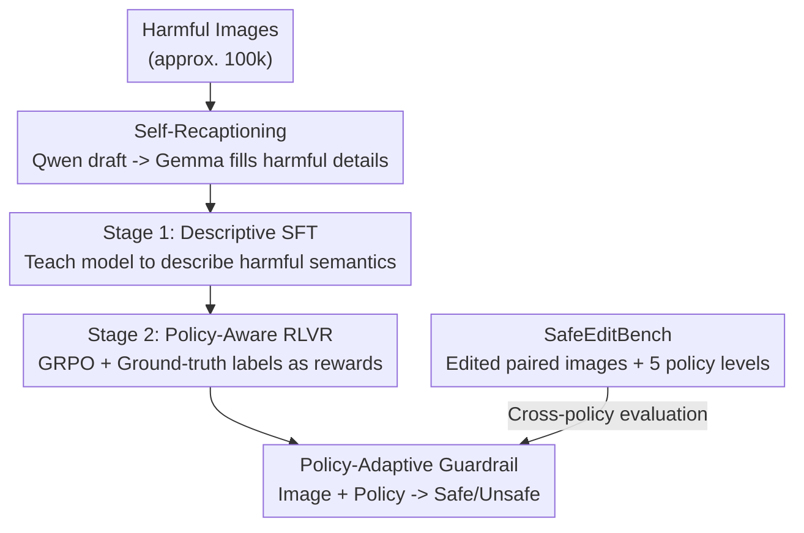

# Towards Policy-Adaptive Image Guardrail: Benchmark and Method

**Conference**: CVPR 2026  
**Paper**: [CVF Open Access](https://openaccess.thecvf.com/content/CVPR2026/html/Piao_Towards_Policy-Adaptive_Image_Guardrail_Benchmark_and_Method_CVPR_2026_paper.html)  
**Code**: Yes (The paper states "release code & data at GitHub", but the specific repository address is not given, ⚠️ subject to the original text)  
**Area**: Multimodal VLM Safety / Harmful Image Guardrail / Content Moderation  
**Keywords**: Image Guardrail, Cross-Policy Generalization, Verifiable Reward RL, VLM Safety, Safety Benchmark

## TL;DR
Addressing the problem where "existing VLM image guardrails only fit a single fixed safety policy and fail when policies change," this paper introduces SafeEditBench, a cross-policy evaluation benchmark that utilizes image editing to generate "safe/unsafe paired images under 5 policy levels." Furthermore, the paper proposes a two-stage method, SafeGuard-VL (first injecting harmful semantics via descriptive SFT using "self-recaptioning," and then aligning decisions with policies using policy-aware verifiable reward RL). This approach improves the overall UnsafeBench score from 41.7 to 72.2 while preserving general multimodal capabilities.

## Background & Motivation
**Background**: Harmful image guardrails aim to determine whether an image should be permitted. Traditional methods employ fixed category classifiers (e.g., "pornography", "violence", "illegal"). Recently, Vision-Language Models (VLMs) have been used because of their world knowledge, instruction-following ability, and semantic reasoning, which appear more flexible.

**Limitations of Prior Work**: However, what is considered "safe" is never universal; it is defined by a **safety policy**—rules vary across organizations, jurisdictions, cultures, and time periods, and continue to evolve. Existing VLM guardrails almost HTML-exclusively use a **single fixed policy** for supervised fine-tuning (SFT). Since SFT essentially fits the joint distribution of "question-answer" in the training data, it is highly sensitive to policy templates and data styles. Consequently, once a policy changes, the learned distribution no longer holds, leading to a severe degradation of both safety performance and instruction-following capabilities. The authors find that these models "perform well on seen policies but suffer a catastrophic performance drop on unseen ones," even losing basic instruction-following and general knowledge capabilities. This indicates that their "understanding" of policies is superficial and rigid.

**Key Challenge**: Although VLMs possess stronger semantic capabilities, they remain trapped in the same **overfitting** trap as traditional classifiers: degrading "understanding policies" into "memorizing a fixed set of rules." Safety recognition and general semantic understanding are coupled together during SFT. Forcing safety supervision hurts general capability.

**Goal**: Decompose into two sub-problems: (1) the lack of an evaluation benchmark that **genuinely tests "cross-policy generalization" rather than "single-policy fitting"**, and (2) the lack of a training method that does not fail when policies change, without sacrificing general capabilities.

**Key Insight**: The authors observe two things. First, RL optimizes under its own generation distribution, naturally possessing stronger generalization and knowledge preservation compared to SFT, making it suitable for "aligning to evolving policies." Second, instead of directly teaching models to classify "safe/unsafe," it is better to first teach them to **describe** the harmful elements in the image—since baseline models tend to give vague, whitewashed answers when facing harmful content, failing to establish a clear semantic understanding of risks.

**Core Idea**: Decouple "semantic understanding" from "safety judgment." In the first stage, descriptive SFT (augmented by self-recaptioning to recover harmful details suppressed by safety mechanisms) is used to inject harmful semantics. In the second stage, policy-aware verifiable reward RL is applied to align decisions with specific policies. For evaluation, image editing is used to construct safe/unsafe paired images that "differ only in local offending regions" to rigorously inspect policy consciousness.

## Method

### Overall Architecture
This paper makes two parallel contributions: a **method**, SafeGuard-VL (a guardrail model trained in two stages), and a **benchmark**, SafeEditBench (a cross-policy evaluation suite). The input to SafeGuard-VL is "an image + a policy text," and the output is a safe/unsafe judgment under that policy (along with reasoning based on the policy). It deliberately **avoids direct classification supervision** in the early stages: it first achieves semantic grounding (understanding what harmful content is in the image) and then introduces policy-based reasoning, minimizing damage to the model's original generalization capability. The two stages are executed serially: Stage 1 is descriptive SFT (using data constructed from self-recaptioning), and Stage 2 is policy-aware RLVR (using GRPO with ground-truth labels as verifiable rewards). SafeEditBench is a parallel evaluation-side contribution—using image editing to modify unsafe images into "locally different" safe versions, which are then manually labeled under 5 policy levels to specifically expose the cross-policy vulnerability of guardrails.

### Key Designs

**1. SafeEditBench: Inspecting policy consciousness in detail using "locally edited offending region" safe-unsafe paired images**

Existing safety benchmarks assume an "unsafe" definition is fixed, failing to test "whether the model adapts when the policy changes." The authors use image editing models (such as Nano Banana / Gemini Image Generation) to perform **minimal, semantic-preserving** edits on unsafe images, generating "safe versions" that differ only in local offending regions—such as replacing weapons with cameras or reinterpreting semantics while keeping the global scene, composition, and objects unchanged. This yields visually near-identical safe/unsafe pairs, forcing the model to rely on **fine-grained contextual cues** rather than coarse scene-level features to differentiate (which also corresponds to real-world threats where malicious users bypass filters with minor perturbations). The benchmark is derived from the LlavaGuard test set, containing 128 images covering 9 harmful categories and their safe counterparts.

More crucially, **policy alignment**: the same set of 62 pairs of images is uniformly relabeled under 5 policy levels (L1–L5), with each policy level assigning a different binary label to each image. L1 is extremely permissive (treating all human expression as safe, unsafe comprising 0%), while L5 is extremely strict (even harmless physical contact is considered unsafe, with unsafe rising to 59%). L3/L4 align with mainstream societal expectations. L1 and L5 are counter-intuitive extreme regimes, specifically designed to test policy compliance. The evaluation metrics use binary F1 under each policy (accuracy is used for L1 as it contains only safe images), and the final metric is the macro average of F1 across the 5 policy levels. This design directly quantifies the concept that "safety is not an inherent attribute of an image, but is determined by policy" into comparable numbers.

**2. Self-recaptioning: Letting the model generate draft captions, then using a more permissible model to recover suppressed harmful details**

The goal of Stage 1 SFT is not to teach the model to output "safe/unsafe", but to teach it to **describe** the harmful elements in the image. This is because the authors found that the baseline (Qwen2.5-VL) provides vague, whitewashed descriptions when facing harmful images due to its built-in safety protocols, losing the semantic understanding of risks. However, directly generating descriptions using an external model alters the neutral/factual components of the original image. Self-recaptioning solves this in two steps: first, the baseline model generates an initial caption (which has fewer harmful details due to its safety mechanism), and then a more permissive model (Gemma 27B) performs a **minimal edit recaptioning**—only restoring the suppressed harmful semantics, maintaining the original syntactic structure, modifying only necessary words, and never changing neutral/factual descriptions. Around 100k harmful images from internet sources (pornography, violence, illegal activities, etc.) are captioned this way. This injects key safety knowledge without damaging core descriptive capabilities. Ablation shows that this step contributes a gap of 13+ points on UnsafeBench (53.22 vs. 66.96) while preserving general benchmark scores, whereas direct SFT like LlavaGuard leads to unexpected generalization loss.

**3. Stage 2: Policy-Aware RLVR: Using ground-truth labels as verifiable rewards to force the model to reason "why it violates" rather than memorize**

Stage 1 only teaches semantics and does not touch the classification task. Thus, Stage 2 must learn from scratch "why this image violates/complies with this policy." The authors apply Group Relative Policy Optimization (GRPO) for reinforcement learning: for each "image-policy" pair, the **ground-truth safe/unsafe label acts directly as the reward signal** (rule-based RL with verifiable rewards, RLVR). This encourages the model to generate responses that "justify their judgment based on the provided policy text," thereby fostering internal reasoning instead of rote memorization. The training data repurposes the LlavaGuard training set but adapts it for **policy-conditional** RL. The benefit of RL is that it optimizes under the model's own sampling distribution, enhancing generalization and knowledge retention. Consequently, by simply changing SFT to RL on the same dataset, cross-benchmark safety performance is significantly improved while maintaining general capabilities (see Table 4). This step enables the guardrail to adapt dynamically to changing policies—such as a "permissive content" policy allowing images previously flagged as unsafe under strict rules—and supports broader use cases like policy-compliant safety QA, rather than just fixed binary classification.

> The three contributing components named in the framework—SafeEditBench, self-recaptioning, and policy-aware RLVR—correspond to the three designs above. Stage 1 SFT itself is the training step that carries the "self-recaptioning data" and is not listed separately. The paper also defines 4 model variants for ablation: Ours(SFT) = Stage 1 only, Ours(Full) = complete SFT+RL pipeline, Ours(RL) = RL only (for a fair comparison against QwenGuard with same data), Ours(RL+SafeEditTrain) = RL performed on SafeEdit edited data (to verify the effectiveness of data construction).

### Loss & Training
Two stages: Stage 1 is standard SFT (supervised descriptive capturing); Stage 2 is GRPO reinforcement learning, where the reward is a verifiable rule-based reward (RLVR) checking "whether the model's judgment equals the human ground-truth label," requiring no extra scoring model. The authors additionally construct SafeEditTrain—applying the same editing pipeline as SafeEditBench to the unsafe images of the LlavaGuard training set. Performing RL with this data further boosts performance.

## Key Experimental Results

### Main Results
UnsafeBench (9 categories of harmful content; OpenAI content policy is injected as a prompt during inference), metrics show scores for individual categories and the overall average:

| Model | Type | Hate | Sexual | Spam | Overall |
|------|------|------|--------|------|---------|
| Qwen2.5-VL-7B | Generic VLM | 24.5 | 35.5 | 23 | 41.7 |
| GLM-4V-9B | Generic VLM | 24.9 | 81.9 | 53.5 | 56.5 |
| QwenGuard-7B | Safety Guardrail | 26.3 | 51.2 | 3.7 | 43.6 |
| ShieldGemma2 | Safety Guardrail | 24.1 | 72.9 | 48.4 | 47.3 |
| **Ours (SFT)** | Ours | 33.8 | 87 | 53.1 | 67.0 |
| **Ours (Full)** | Ours | **50.6** | **89** | **63.3** | **72.2** |

The full version achieves an overall score of 72.2, significantly leading the general-purpose Qwen2.5-VL-7B (41.7) and the safety-specific QwenGuard-7B (43.6), with particularly prominent improvements in Hate/Sexual/Spam.

Safety vs. general capability trade-off (Table 4, same training data, showing only the difference of SFT vs. RL):

| Model | LlavaGuard | UnsafeBench | SafeEditBench | General Overall |
|------|-----------|-------------|---------------|-------------|
| Qwen2.5-7B | 57.08 | 41.71 | 48.68 | 56.92 |
| QwenGuard-7B | **84.57** | 43.56 | 32.76 | 35.98 |
| **Ours (RL)** | 71.78 | **62.39** | 45.59 | **57.02** |

QwenGuard achieves 84.57 on its own benchmark but suffers a severe collapse on other safety benchmarks (UnsafeBench 43.56) and general tasks (BLINK is only 12.05, general overall is 35.98)—a classic case of over-specialization. Ours(RL), which simply replaces SFT with RL, is much more balanced across all benchmarks, significantly improving safety while preserving general capabilities.

### Ablation Study
Effectiveness of recaptioning and RL (Table 5):

| Variant | Recap | RL | UnsafeBench | General |
|------|-------|-----|-------------|------|
| Qwen2.5-VL-7B | – | – | 41.71 | 56.92 |
| w/o Recap (SFT) | ✗ | ✗ | 53.22 | 54.51 |
| Ours (SFT) | ✓ | ✗ | 66.96 | 53.37 |
| Ours (Full) | ✓ | ✓ | **72.16** | 53.09 |

Removing self-recaptioning drops UnsafeBench from 66.96 to 53.22 ($-13.7$), indicating that carefully constructed harmful descriptions are crucial for learning "fine-grained, context-aware" harmful patterns. Adding RL on top of SFT increases the score by $+5.2$, validating the two-stage paradigm. General capability remains stable across variants at 53–57, showing that safety gains do not sacrifice default functionality.

Vulnerability of cross-policy generalization (Table 3, trained on a single policy level, evaluated on five levels): SFT trained on L1 degenerates into a classifier that "always says safe" ($0\%$ on all other levels); when trained on L5, performance drops severely on L1/L2. RL mitigates overfitting, but the model remains highly dependent on the policy—which is the fundamental limitation this paper exposes.

F1 of models on SafeEditBench (Table 6): Models perform well on moderate policies (L3/L4) but plummet or drop to near zero on counter-intuitive ones (L1/L5), indicating a mismatch between the model's "internal safety prior" and "explicit policy rules". Ours(RL+SafeEditTrain) scores 49.43, outperforming Ours(RL) at 45.59, proving that editing paired data helps learn policy-defined subtle semantic boundaries.

### Key Findings
- The single step with the greatest contribution is **self-recaptioning** (removing it drops performance by 13.7 points), followed by Stage 2 RL ($+5.2$); neither can be omitted to reach the full version's performance.
- **SFT is the root cause of overfitting**: Under the same data, simply replacing SFT with RL transitions from "high scores on own benchmark, collapse elsewhere" to "balanced performance across benchmarks," confirming the generalization advantage of RL optimizing under its own sampling distribution.
- Counter-intuitive policies (L1 completely safe, L5 extremely strict) are major failure regions for all models, exposing the mismatch of "model safety prior $\neq$ explicit policy," which is also the most challenging aspect of this task.

## Highlights & Insights
- **Quantifying "Safety is Policy-Dependent" as an Evaluatable Benchmark**: Using image editing to construct paired images with "only local differences in offending regions" + 5 levels of counter-intuitive policies directly measures the cross-policy vulnerability of guardrails—this strikes closer to the core of the problem than simply piling up more harmful categories.
- **Clever Self-Recaptioning**: Using "own model for draft + looser model to minimally complete harmful details" bypasses the challenge where safety models refuse to describe harmful content, without contaminating neutral factual descriptions. It is a trick transferable to any "safety alignment data construction."
- **Decoupling Semantic Understanding and Safety Judgment**: First teaching description and then using RLVR to align with policies avoids the old issue where SFT hard-couples safety supervision with general capabilities. This two-stage idea of "SFT for knowledge injection, RL for policy alignment" can be transferred to other alignment tasks requiring "resilience to rule changes."
- The most "Aha!" point: Simply changing the training paradigm from SFT to RL (with identical data) recovers the general capabilities of an over-specialized safety model, suggesting that many "safety vs. utility" trade-offs are caused by training methods rather than inherent conflicts in the tasks.

## Limitations & Future Work
- The authors acknowledge: existing guardrails (including the RL version in this paper) **remain highly dependent on policies**; RL only mitigates rather than cures the cross-policy generalization issue, and models still struggle under extreme and counter-intuitive policies (L1/L5).
- The scale of SafeEditBench is relatively small (128 images / 62 paired images $\times$ 5 policy levels), and it relies on a single image editing model (Nano Banana) to generate "safe versions." The quality and coverage of editing may limit the generalizability of the findings.
- The evaluation only considers binary safe/unsafe judgments, skipping fine-grained harmful category determination; policies consist of only 5 manually designed levels, leaving real-world policy continuity and composability untouched.
- Future directions: extending policy representation from "discrete 5 levels" to a composable natural language policy space, adding intermediate reasoning step supervision for policy compliance, and expanding the benchmark with larger and more diverse edited paired data.

## Related Work & Insights
- **vs. LlavaGuard / QwenGuard (SFT-based fixed policy guardrails)**: They perform SFT on their own fixed policies/categories, collapsing when policies change and hurting general capabilities. This paper uses descriptive SFT + policy-aware RL to decouple semantics from judgment, ensuring more stable cross-policy generalization and preserving general capabilities.
- **vs. Llama Guard / ShieldGemma / OpenAI Mod (fixed category guardrails)**: These rely on fixed harmful categories (14/9/6 classes) or predefined blocks, requiring retraining for any policy change. This paper supports arbitrary natural language policies, allows dynamic expansion of categories, and achieves zero-shot cross-policy generalization.
- **vs. AIR-BENCH / Traditional safety benchmarks**: They choose from fixed 314 blocks or a fixed definition of "unsafe", unable to handle unseen risks. SafeEditBench explicitly tests "whether the model adapts when policies change" using edited pairs + multi-level policies.
- **vs. SafeWatch**: Also accepts natural language policy descriptions, but is not open-sourced. This paper offers an open schema along with publicly released code and data.

## Rating
- Novelty: ⭐⭐⭐⭐ The problem definition of "safety is policy-dependent" + editing paired benchmark + self-recaptioning is highly novel, though individual techniques (GRPO/RLVR) are off-the-shelf.
- Experimental Thoroughness: ⭐⭐⭐⭐ Tested on three safety benchmarks + multiple general benchmarks + single-policy generalization analysis + comprehensive ablations, but the benchmark scale is relatively small.
- Writing Quality: ⭐⭐⭐⭐ Clear motivation, well-designed charts, and the explanation of the problem motivation is particularly thorough.
- Value: ⭐⭐⭐⭐ Content moderation/guardrails are highly demanded, and "resilience to policy changes" directly addresses painful deployment issues in industry. Both the benchmark and the method are highly reusable.

<!-- RELATED:START -->

## Related Papers

- [\[CVPR 2026\] MMSD3.0: A Multi-Image Benchmark for Real-World Multimodal Sarcasm Detection](mmsd30_a_multi-image_benchmark_for_real-world_multimodal_sarcasm_detection.md)
- [\[ACL 2026\] Doc-PP: Document Policy Preservation Benchmark for Large Vision-Language Models](../../ACL2026/multimodal_vlm/doc-pp_document_policy_preservation_benchmark_for_large_vision-language_models.md)
- [\[CVPR 2026\] HiconAgent: History Context-aware Policy Optimization for GUI Agents](hiconagent_history_context-aware_policy_optimization_for_gui_agents.md)
- [\[CVPR 2026\] SketchVL: Policy Optimization via Fine-Grained Credit Assignment for Chart Understanding and More](sketchvl_policy_optimization_via_fine-grained_credit_assignment_for_chart_unders.md)
- [\[CVPR 2026\] Conflict-Aware Adaptive Cross-Reconstruction for Multimodal Sentiment Analysis](conflict-aware_adaptive_cross-reconstruction_for_multimodal_sentiment_analysis.md)

<!-- RELATED:END -->
