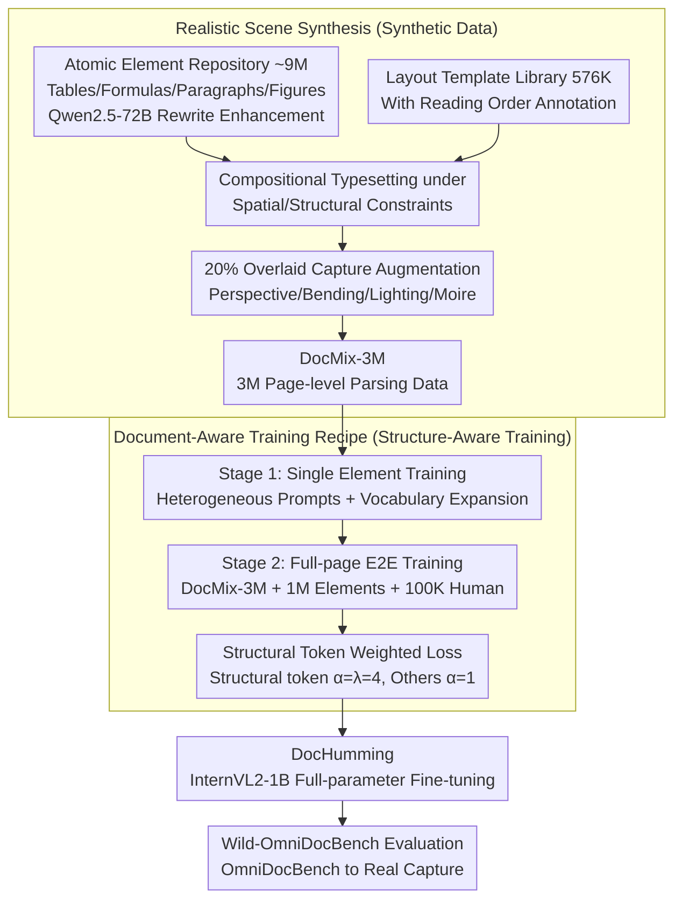

# Towards Real-World Document Parsing via Realistic Scene Synthesis and Document-Aware Training

**Conference**: CVPR 2026  
**arXiv**: [2603.23885](https://arxiv.org/abs/2603.23885)  
**Code**: To be open-sourced  
**Area**: Document Understanding / End-to-end Document Parsing  
**Keywords**: Document parsing, synthetic data, progressive training, structural token weighting, real-world robustness

## TL;DR

Ours proposes DocHumming, a data-training co-design framework. It constructs the large-scale synthetic dataset DocMix-3M via Realistic Scene Synthesis and implements a Document-Aware Training Recipe combining progressive learning with structural token weighting. DocHumming achieves an Overall score of 93.75 on OmniDocBench using only a 1B MLLM (surpassing Qwen3-VL-235B's 89.15), with a performance degradation of only 6.72 points in realistic capture scenarios (compared to 18-20 points for modular methods).

## Background & Motivation

**Background**: Document parsing has evolved from traditional modular pipelines (layout analysis → OCR → element parsing) to end-to-end MLLMs that directly map images to structured outputs. While modular methods excel on digital/scanned documents (e.g., MinerU2.5 at 90.67 on OmniDocBench), end-to-end methods still face severe challenges in real-world scenarios.

**Limitations of Prior Work**: (1) Modular methods rely on precise layout analysis; under causal photography conditions, layout errors propagate downstream (18-20 points degradation). (2) End-to-end methods produce repetitive content, hallucinations, and structural inconsistencies in real-world captured scenes. (3) There is a lack of large-scale, high-quality, page-level end-to-end parsing training data (SynthDog has simple layouts; GOT's PDF-to-LaTeX lacks visual diversity).

**Key Challenge**: The end-to-end paradigm is naturally more robust as it eliminates explicit layout segmentation, but its potential is constrained by data scarcity and the lack of structure-aware training strategies.

**Goal**: To unlock the potential of end-to-end document parsing in real-world scenarios through data-training co-design.

**Key Insight**: Simultaneously address the data bottleneck (large-scale synthesis) and the training bottleneck (structure-aware optimization) rather than focusing on only one.

**Core Idea**: Synthesize 3M page-level data using 576K layout templates and 9M atomic elements, combined with short-to-long progressive training and structural token weighted loss, enabling a 1B model to match the performance of a 235B model.

## Method

### Overall Architecture

This paper aims to enable a 1B-parameter end-to-end MLLM to stably parse structured text from casual document photographs. Existing end-to-end methods fail due to monotonous training data (repetitive PDF-to-LaTeX layouts) and training objectives that ignore structure (leading to repetitions/serialization of tables and formulas). DocHumming addresses both: on the data side, Realistic Scene Synthesis (RSS) "assembles" 3M visually diverse page-level parsing data (DocMix-3M) from atomic elements and layout templates; on the training side, the Document-Aware Training Recipe (DATR) introduces a curriculum of "element-first, whole-page-second" and a loss function that penalizes structural token errors more heavily. The entire pipeline is fine-tuned on the InternVL2-1B base. To evaluate performance, the authors also manually constructed Wild-OmniDocBench.

### Key Designs

**1. Realistic Scene Synthesis: Assembling Diverse Pages from Scratch instead of PDF Conversion**

The data bottleneck stems from current synthesis routes—SynthDog's layouts are too simple, and GOT's PDF-to-LaTeX inherits fixed PDF formats, limiting visual diversity. RSS adopts "bottom-up synthesis": first, an atomic element repository is built by unifying formats from multi-source datasets (tables, formulas, paragraphs), then enhanced via Qwen2.5-72B (reorganizing tables, perturbing formula symbols, generating multilingual paragraphs). These are rendered into "image-annotation" pairs via a LaTeX pipeline, totaling ~9M elements. Simultaneously, 576K+ layout templates with reading order annotations are collected from public datasets and web mining. During synthesis, sampled elements are placed into templates under spatial constraints, and ~20% of samples receive capture augmentations: perspective, bending, creases, lighting changes, camera rotation, and environmental backgrounds. This allows active control over layout diversity and visual conditions.

**2. Document-Aware Training Recipe: Elements first, then Full Pages with Structural Token Penalties**

Document parsing outputs are long and highly structured. Direct full-page training struggles with convergence and table repetitions. DATR splits training into two steps. First, a progressive learning curriculum: Stage 1 trains only on single elements (tables, formulas, etc.) using heterogeneous prompts to gain type-specific capabilities while expanding the vocabulary with structural tokens. Stage 2 uses DocMix-3M as the primary data, mixed with 1M Stage 1 samples and 100K human annotations for end-to-end full-page training. Second, structural token weighting: tokens falling within structural tags (e.g., `<table>`…`</table>`) are assigned a larger weight in the loss function. The loss is defined as:

$$L = -\sum_t \alpha_t\, y_t \log P(x_t \mid x_{<t}),$$

where structural tokens take $\alpha_t = \lambda = 4$, and others $\alpha_t = 1$. This "heavier penalty" on structural positions directly reduced the repetition rate from 4.6% to 2.1%.

**3. Wild-OmniDocBench: Porting Benchmarks to Realistic Capture Scenarios**

Existing benchmarks primarily cover digital and scanned documents. To measure vulnerability in real-world photography, the authors manually transformed OmniDocBench into "captured" forms: one set involves physical deformation (folding, bending) of printed pages photographed under various lighting; the other involves photographing content on screens, introduced Moire patterns and reflections.

### Loss & Training

A structural token weighted cross-entropy loss is used (see equation above, $\lambda=4$). Stage 1: batch=512, lr=4e-5, 2 epochs. Stage 2: batch=256, lr=2e-5, 2 epochs. Cosine learning rate decay with a maximum output length of 8192 tokens. The model is a full-parameter fine-tuned InternVL2-1B using 16× NVIDIA H20 GPUs.

## Key Experimental Results

### Main Results: OmniDocBench Document Parsing

| Type | Method | Params | Overall↑ | TextEdit↓ | FormulaCDM↑ | TableTEDS↑ | ReadOrder↓ |
|------|------|-------|---------|-----------|-------------|------------|------------|
| Pipeline | PP-StructureV3 | - | 86.73 | 0.073 | 85.79 | 81.68 | 0.073 |
| General MLLM | Qwen2.5-VL-72B | 72B | 87.02 | 0.094 | 88.27 | 82.15 | 0.102 |
| General MLLM | Qwen3-VL-235B | 235B | 89.15 | 0.069 | 88.14 | 86.21 | 0.068 |
| E2E Specialized | dots.ocr | 3B | 88.41 | 0.048 | 83.22 | 86.78 | 0.053 |
| Modular Specialized | MinerU2.5 | 1.2B | 90.67 | 0.047 | 88.46 | 88.22 | 0.044 |
| Modular Specialized | PaddleOCR-VL | 0.9B | 91.93 | 0.039 | 88.67 | 91.01 | 0.043 |
| **E2E Specialized** | **Ours** | **1B** | **93.75** | **0.035** | **93.27** | **91.49** | **0.041** |

### Wild-OmniDocBench Real-World Robustness

| Type | Method | Origin | Wild | Gain↓ | Description |
|------|------|--------|------|-------|------|
| General MLLM | Qwen3-VL-235B | 89.15 | 79.69 | -9.46 | Large model also degrades |
| Modular | MonkeyOCR-3B | 88.85 | 70.00 | -18.85 | Layout error propagation |
| Modular | MinerU2.5 | 90.67 | 70.91 | -19.76 | Worst degradation |
| Modular | PaddleOCR-VL | 91.93 | 72.19 | -19.74 | ~20 points drop |
| E2E | DeepSeek-OCR | 87.01 | 74.23 | -12.78 | E2E degrades less |
| E2E | dots.ocr | 88.41 | 78.01 | -10.40 | E2E degrades less |
| **E2E** | **Ours** | **93.75** | **87.03** | **-6.72** | **Minimal degradation** |

### Ablation Study

| # | RSS | PTP | ST | OmniDoc↑ | Repeat↓ | Wild↑ | Wild Repeat↓ |
|---|-----|----------|------------|---------|---------|------|-------------|
| 1 | X | Y | Y | 89.96 | 4.7% | 78.82 | 8.6% |
| 2 | Y | Y | X | 88.74 | 4.6% | 84.90 | 5.4% |
| 3 | Y | X | Y | 91.24 | 4.2% | 85.39 | 4.9% |
| 4 | Y | Y | Y | **93.75** | **2.1%** | **87.03** | **4.3%** |

Data scaling curve: DocMix-1M (85.41) -> 2M (88.14) -> 3M (89.96) -> 4M (89.31, saturating). 3M synthetic data outperforms 100K human annotations (89.96 vs 89.26).

### Key Findings

- Significant divergence between E2E and Modular in real scenes: Modular degrades 18-20 points vs DocHumming's 6.72 points.
- 1B exceeds 235B: With proper data and training strategies, the 1B model (93.75) outperforms Qwen3-VL-235B (89.15).
- 3M synthetic data outperforms 100K human annotations (89.96 vs 89.26), but saturates at 4M due to constraints in element and template diversity.
- Structural token weighting is critical for reducing repetition: its removal increases the rate from 2.1% to 4.6%.
- Leads across all categories in XFUND multilingual tests (German 85.15, Japanese 87.99, Spanish 84.39).

## Highlights & Insights

- The data-training co-design framework is noteworthy: joint optimization provides significant gains over focusing on only one aspect.
- Progressive training mirrors LLM short-to-long context curricula—mapping elements to pages corresponds directly to short-to-long sequence learning.
- Defining a repetition rate metric (continuous pattern repeats > 10 times or reaching max length) provides a practical tool for quantifying decoding stability.
- The saturation point of the data scaling effect (~3M) offers practical guidance on the ROI of synthetic data.

## Limitations & Future Work

- Irregular layouts (newspapers, posters) remain challenging; reading orders and structural boundaries are blurred in nested or interleaved blocks.
- High-resolution pages requiring downsampling or tiling can lead to repetitions or loss of long tables and dense formulas.
- Data scale saturation after 3M is fundamentally limited by the diversity of the element repository and template pool.
- Inference efficiency: Text-dense pages take ~3s, limiting interactive use.
- The $\lambda=4$ structural token weight is heuristic; adaptive strategies have not been explored.

## Related Work & Insights

- **vs GOT/SmolDocling**: These E2E methods use PDF-to-LaTeX data with rigid layouts; DocHumming achieves diversity via bottom-up synthesis.
- **vs MinerU2.5/PaddleOCR-VL**: Performance is similar on standard docs, but these modular methods degrade 3x more on Wild scenarios, highlighting their inherent fragility.
- **Training Strategy Inspiration**: Structural token weighting can be generalized to any structured generation task (code, HTML/JSON generation).
- **Data Synthesis Methodology**: The paradigm of atomic element repository + layout templates + compositional synthesis is transferable to other multi-modal data generation tasks.

## Rating

⭐⭐⭐⭐ (4/5)

- **Novelty** ⭐⭐⭐⭐: Systematic data-training co-design; structural token weighting is simple yet effective.
- **Experimental Thoroughness** ⭐⭐⭐⭐⭐: Triple benchmark (OmniDocBench, Wild, XFUND) with comprehensive ablations (RSS/ST/PTP) and scaling curves.
- **Writing Quality** ⭐⭐⭐⭐: Clear framework diagrams, detailed data construction process, and rigorous ablation design.
- **Value** ⭐⭐⭐⭐: The "1B outperforms 235B" conclusion is compelling, and the Wild benchmark fills an evaluation gap.

<!-- RELATED:START -->

## Related Papers

- [\[CVPR 2026\] Boosting Document Parsing Efficiency and Performance with Coarse-to-Fine Visual Processing](boosting_document_parsing_efficiency_and_performance_with_coarse-to-fine_visual_.md)
- [\[CVPR 2026\] SEA-Vision: A Multilingual Benchmark for Document and Scene Text Understanding in Southeast Asia](sea-vision_a_multilingual_benchmark_for_comprehensive_document_and_scene_text_un.md)
- [\[CVPR 2026\] VinQA: Visual Elements Interleaved Long-form Answer Generation for Real-World Multimodal Document QA](vinqa_visual_elements_interleaved_long-form_answer_generation_for_real-world_mul.md)
- [\[CVPR 2026\] MMSD3.0: A Multi-Image Benchmark for Real-World Multimodal Sarcasm Detection](mmsd30_a_multi-image_benchmark_for_real-world_multimodal_sarcasm_detection.md)
- [\[CVPR 2026\] M3Grounder: Mask-Based Multi-Span and Multi-Granular Grounding for Document QA](m3grounder_mask-based_multi-span_and_multi-granular_grounding_for_document_qa.md)

<!-- RELATED:END -->
