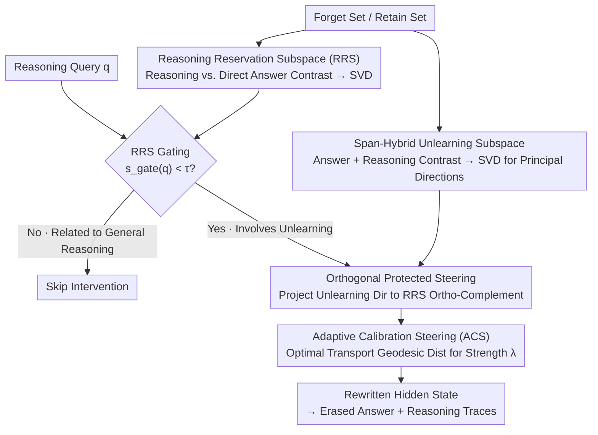

# Towards Reasoning-Preserving Unlearning in Multimodal Large Language Models

**Conference**: CVPR 2026  
**Paper**: [CVF Open Access](https://openaccess.thecvf.com/content/CVPR2026/html/Li_Towards_Reasoning-Preserving_Unlearning_in_Multimodal_Large_Language_Models_CVPR_2026_paper.html)  
**Code**: To be confirmed  
**Area**: Multimodal VLM / Machine Unlearning / AI Safety  
**Keywords**: Machine Unlearning, Reasoning Multimodal Large Language Models, Activation Steering, Reasoning Leakage, Subspace Projection

## TL;DR
Addressing "reasoning-capable" Multimodal Large Language Models (MLLMs), this paper proposes RMLLMU-Bench to specifically measure **information leakage within reasoning chains** and the **preservation of reasoning capabilities**. It introduces R-MUSE, a training-free, inference-time intervention framework that employs subspace guidance and adaptive steering to erase target answers and intermediate reasoning traces while minimizing disruption to general reasoning.

## Background & Motivation

**Background**: Machine unlearning allows models to "forget" specific data without full retraining. Most unlearning methods for Multimodal Large Language Models (MLLMs) directly adopt gradient ascent, preference optimization, or targeted fine-tuning from text-only LLMs, primarily targeting **final answers** or short responses.

**Limitations of Prior Work**: As MLLMs evolve into Reasoning Multimodal Large Language Models (RMLLMs) that output a "chain-of-thought" before answering, modifying only the final answer is insufficient. Figure 1 of the paper illustrates two sharp failure modes: ① Traditional MLLM unlearning methods change the answer correctly, but the intermediate reasoning chain reconstructs the facts from memory (**Reasoning Leakage**) — e.g., "She studied at Stockholm University, so she lives in Stockholm"; ② Traditional LRM (Language Reasoning Model) unlearning methods suppress leakage but collapse reasoning into incoherent loops like "wait, no, wait, no, I'm not sure" (**Destruction of Reasoning Capability**).

**Key Challenge**: There is a direct trade-off between suppressing reasoning leakage and preserving general reasoning — more aggressive interventions reduce leakage but are more likely to break general reasoning. At the time of research, **no benchmark existed** to measure both phenomena simultaneously.

**Goal**: (1) Build a benchmark capable of measuring both "reasoning chain leakage" and "reasoning capability preservation"; (2) Develop an unlearning method that balances both without requiring retraining.

**Key Insight**: Recent work has found that the impact of a few samples, and even high-level abilities like "reasoning," tend to be concentrated in **low-dimensional linear subspaces** of model activations, which can be controlled via linear directions. Consequently, unlearning can be modeled as "steering activations along a certain direction." The key is identifying **what to steer, where/when to steer, and how strongly to steer**, separating "what should be forgotten" from "reasoning capabilities to be preserved" within the subspace.

**Core Idea**: Use inference-time activation steering with "unlearning subspace + orthogonal protection of reasoning preservation subspace + adaptive strength via optimal transport" to directionally erase answers and reasoning traces without touching the directions supporting general reasoning.

## Method

### Overall Architecture
The paper makes contributions at two levels: the **RMLLMU-Bench evaluation benchmark** and the **R-MUSE unlearning method**. The benchmark enhances the existing MLLMU-Bench by adding structured reasoning chains to each sample and introducing two reasoning-aware metrics: RIL (Reasoning Information Leakage) and RCR (Reasoning Capability Preservation). R-MUSE is a training-free, inference-time activation steering framework focused on three questions: **what, where/when, and how strong to steer**.

In the offline stage, an **unlearning subspace** is constructed from the forget set using "answer + reasoning" dual-span contrasts, and a **Reasoning Reservation Subspace (RRS)** is constructed from the retain set using "reasoning vs. direct answer" contrasts. During inference, for each query, an RRS gate first determines whether to intervene. If intervention is triggered, the primary unlearning direction is projected onto the orthogonal complement of the RRS (to protect general reasoning), and the steering strength is adaptively determined by the Optimal Transport distance. Finally, a spherical interpolation (slerp) on the unit hypersphere generates the rewritten hidden state.

### Key Designs

**1. RMLLMU-Bench and Reasoning-Aware Metrics RIL/RCR: Quantifying Reasoning Leakage**

Existing MLLM unlearning benchmarks only check if the final prediction changed or if utility on non-forget data dropped, failing to detect "hidden information leakage in reasoning chains" and "degradation of reasoning capacity." This paper supplements RMLLMU-Bench with structured reasoning chains following three principles: Attributability (steps linked to verifiable evidence), Conservatism (using only provided text/images), and Consistency (logical alignment with answers). These are generated by Gemini-2.5-Pro, verified by Gemini-2.5-Flash for self-correction, and manually audited.

Two core metrics are introduced: **RIL (Reasoning Information Leakage)** uses two-level detection — Level 1 rule-matching for explicit leakage (forgotten attribute strings in reasoning) and Level 2 LLM-judge for paraphrased/semantic leakage (e.g., if "residence: Japan" is forgotten, saying "He lives in Tokyo" counts as leakage).
$$\mathrm{RIL} = \alpha\cdot\frac{N_{\text{explicit}}}{N_{\text{total}}} + (1-\alpha)\cdot\frac{N_{\text{implicit}}}{N_{\text{total}}},\quad \alpha=0.5$$
Lower RIL indicates cleaner unlearning. **RCR (Reasoning Capability Preservation)** uses a judge to evaluate reasoning chains of non-forget samples over 3 independent trials via majority voting, calculating the ratio of logically valid and evidence-supported chains.

**2. Span-Hybrid Unlearning Subspace: What to Steer — Targeting both Answer and Reasoning**

Subtracting only final answer tokens fails to erase traces in reasoning chains. For each forget sample, the method constructs a "refusal" guided positive sample $x_i^+$ (Question + Refusal Prefix + Ideal Refusal). The model's original answer and reasoning sequences are treated as negative samples. **Span pooling is applied separately to the answer span $S_{\text{ans}}$ and reasoning span $S_{\text{cot}}$**, generating $\Delta^{\text{ans}}_\ell(i)$ and $\Delta^{\text{cot}}_\ell(i)$. To prevent one component from dominating due to high variance, both are dimension-wise z-score normalized within the batch before being summed: $\Delta_\ell(i)=\mathrm{ZScore}(\Delta^{\text{ans}}_\ell)+\mathrm{ZScore}(\Delta^{\text{cot}}_\ell)$. Finally, SVD is performed on the stacked differences, taking the top $k$ left singular vectors accounting for $\ge\eta=0.8$ energy to form the unlearning subspace $U^{\text{un}}_\ell$.

**3. Reasoning Reservation Subspace (RRS) + Gating + Orthogonal Protection: Where and When to Steer**

Applying steering to all inputs would degrade unrelated queries and erode general reasoning. The **Reasoning Reservation Subspace (RRS)** is constructed on the retain set using span differences where $x_i^+$ contains explicit reasoning and $x_i^-$ is a direct answer. SVD yields directions that "push hidden states toward full reasoning and away from shortcut answering."

This serves a dual purpose. **When to steer (Gating)**: The alignment of the query hidden state with RRS is measured at the scoring layer:
$$s_{\text{gate}}(q)=\frac{\lVert P^{\text{rrs}}_{\ell^*} h_{\ell^*}(g\oplus q)\rVert_2}{\lVert h_{\ell^*}(g\oplus q)\rVert_2}\in[0,1]$$
If $s_{\text{gate}}$ is high, the query is likely related to general reasoning and unrelated to unlearning, so the gate $g(q)=\mathbb{I}[s_{\text{gate}}(q)<\tau]$ skips intervention. **Where to steer (Orthogonal Protection)**: Steering updates target the rank-1 projection of the unlearning direction $v^{\text{un}}_\ell$, multiplied by $(I-P^{\text{rrs}}_\ell)$ to cast it onto the RRS orthogonal complement:
$$\mathrm{Upd}_\ell(q;h_\ell)=g(q)\,(I-P^{\text{rrs}}_\ell)\,(v^{\text{un}}_\ell v^{\text{un}\top}_\ell)\,h_\ell$$
This ensures unlearning only occurs in directions that do not support general reasoning.

**4. Adaptive Calibration Steering (ACS): How Strong to Steer — No Hyperparameter Tuning**

Classical steering $\tilde h=h+\lambda f(h)$ relies on manually tuned $\lambda$, where strength and direction are coupled. This paper models steering as an **Optimal Transport (OT)** problem on the unit sphere. The target distribution $\mu$ is supported on a set of "purified/refusal" directions. Using the squared spherical geodesic distance $c(a,b)=\arccos\langle a,b\rangle^2$ as the OT cost, the barycenter target $\hat z^\star$ is found, yielding the intrinsic cost $\theta_{\text{tar}}=\arccos\langle\hat h,\hat z^\star\rangle$. The maximum available rotation angle $\theta_{\text{dir}}=\arccos\langle\hat h,\hat v\rangle$ along the steering direction $\hat v$ is calculated, and the actual rotation angle is matched to the OT cost:
$$\lambda=\min\{1,\ \theta_{\text{tar}}/\theta_{\text{dir}}\}$$
If the current state is far from the purified manifold, the step is nearly full; if already close, it scales down. This **removes additional hyperparameters**. The update is finalized via norm-preserving spherical linear interpolation: $\tilde h=r\,\mathrm{slerp}(\hat h,\hat v;\lambda)$.

### Loss & Training
R-MUSE is **training-free and inference-time only**, with no learnable parameter updates. The paper provides a first-order analysis based on loss: defining a "golden model" as the solution to jointly minimizing retain loss $L_R$ and forget-refusal loss $L^{\text{ref}}_F$. Under the local linear readout assumption, the orthogonal protection update $(I-P^{\text{rrs}}_\ell)$ ensures perturbations only occur in the RRS orthogonal directions. Appendix Theory D.1 proves that R-MUSE strictly decreases $L^{\text{ref}}_F$ for forget-related queries while keeping the first-order change of $L_R$ bounded.

## Key Experimental Results

The backbone models used are LLaVA-1.5-7B and Qwen-2.5-VL-7B-Instruct. Evaluation is performed on RMLLMU-Bench across classification accuracy, open-ended ROUGE-L, cloze accuracy, RIL, and RCR. Baselines include classical unlearning (GA, GA Diff, KL Min, NPO) and recent SOTAs (MMUnlearner, MANU for MLLMs; R2MU for LRMs). Lower is better for Forget (Fgt) and Test; higher is better for Retain (Ret) and Celebrity (Cele).

### Main Results (LLaVA-1.5-7B, 5% Forget)

| Metric | Vanilla | R2MU (LRM SOTA) | MANU (MLLM SOTA) | **Ours (R-MUSE)** |
|------|---------|----------------|-----------------|------------------|
| Class. Fgt ↓ | 51.70 | 47.20 | 41.20 | **20.50** |
| Class. Ret ↑ | 46.11 | 42.50 | 40.80 | **45.90** |
| Gen. ROUGE Fgt ↓ | 0.645 | 0.560 | 0.491 | **0.225** |
| Cloze Fgt ↓ | 25.81 | 24.00 | 19.30 | **12.50** |
| Reasoning Leakage Fgt ↓ | 78.50 | 51.20 | 71.50 | **38.50** |
| Reasoning Preservation Ret ↑ | 81.20 | 68.00 | 70.30 | **80.10** |

R-MUSE reduces classification accuracy on the forget set from 51.70 to 20.50 and leakage from 78.50 to 38.50 (compared to 51.20 for R2MU), while keeping the retain set metrics nearly identical to the original model.

### Cross-Setting Leakage Comparison (Fgt Reasoning Leakage ↓)

| Setting | Vanilla | Best Baseline | **R-MUSE** |
|------|---------|----------|-----------|
| LLaVA 5% Forget | 78.50 | 51.20 (R2MU) | **38.50** |
| LLaVA 10% Forget | 79.20 | 51.70 (R2MU) | **41.30** |
| Qwen-2.5-VL 5% Forget | 82.40 | 72.50 (GA Diff) | (Lowest in paper) |

### Key Findings
- **Traditional methods fail to balance both**: MLLM unlearning methods (like MMUnlearner) fail to address the reasoning process, with leakage still exceeding 60%. LRM unlearning (R2MU) reduces leakage but degrades reasoning quality in multimodal contexts.
- **Dual-span (Answer & Reasoning) is key to reducing leakage**: Only targeting answer tokens leaves traces in the reasoning chain. Applying span differences to both reduced leakage from ~78% to ~38%.
- **Orthogonal protection is essential for utility**: R-MUSE metrics on Ret/Cele are nearly identical to the vanilla model, confirming that restricting steering to the RRS orthogonal complement avoids damaging general reasoning.
- **Robustness to scale**: Increasing the forget ratio (5% to 10%) only slightly increased leakage (38.5 to 41.3), showing robustness to unlearning volume.

## Highlights & Insights
- **Explicit quantification of "Reasoning Leakage"**: Unlike works that only look at final answers, this paper identifies that RMLLMs can reconstruct facts in reasoning chains even if the answer is changed. The two-level RIL detection is a practical design transferable to any CoT-based safety/privacy evaluation.
- **Training-Free Inference-Time Intervention**: No weight updates or retraining required. Steering hidden states directly is cost-effective and supports "on-demand unlearning" via gating.
- **Solving Steering Strength via Optimal Transport**: Converting "how hard to steer" from a hyperparameter to an OT cost problem decodes the coupling between direction and strength, offering insights for other activation steering applications.
- **Orthogonal Complement Protection**: Constraining interventions to the orthogonal complement of a "capability to be preserved" subspace provides a general paradigm for "balancing act" problems in AI.

## Limitations & Future Work
- Dependency on Gemini models as generators and judges for benchmarking RIL/RCR introduces potential bias and costs. Semantic leakage detection remains somewhat subjective.
- Subspace methods assume that unlearning and reasoning abilities lie in low-dimensional linear subspaces that are orthogonally separable. Whether this holds for more complex knowledge or larger models requires further validation.
- Certain parameters like the gating threshold $\tau$, energy threshold $\eta$, and intervention layer $\ell^*$ still require selection; cross-backbone transferability is not fully explored.
- Effectiveness across more diverse backbone scales and the cumulative effects of sequential unlearning episodes remain unknown.

## Related Work & Insights
- **vs. Classic LLM/MLLM Unlearning (GA/NPO/MANU)**: These rely on weight retraining and focus on answers, resulting in high reasoning leakage. Ours is training-free and targets both answer and reasoning traces.
- **vs. LRM Unlearning (R2MU)**: R2MU reduces leakage but damages multimodal reasoning; Ours uses RRS orthogonal protection to preserve utility.
- **vs. Classic Activation Steering**: Previous methods used fixed directions and manual strength. Ours systematizes "what/where/how" via OT adaptive strength and orthogonal protection.

## Rating
- Novelty: ⭐⭐⭐⭐⭐ First specialized reasoning-preserving unlearning benchmark for RMLLMs + training-free subspace steering framework.
- Experimental Thoroughness: ⭐⭐⭐⭐ Solid results across two backbones and multiple baselines, though lacks a fine-grained ablation table for all components.
- Writing Quality: ⭐⭐⭐⭐ Clear problem characterization (Figure 1 failure modes) and rigorous mathematical formulation.
- Value: ⭐⭐⭐⭐⭐ Addresses the critical "reasoning leakage" issue with a deployable training-free solution, significant for RMLLM privacy/safety.

<!-- RELATED:START -->

## Related Papers

- [\[CVPR 2026\] VL-Eraser: Vacuum Distillation for Machine Unlearning in Vision-Language Models](vl-eraser_vacuum_distillation_for_machine_unlearning_in_vision-language_models.md)
- [\[CVPR 2026\] Which Concepts to Forget and How to Refuse? Decomposing Concepts for Continual Unlearning in Large Vision-Language Models](which_concepts_to_forget_and_how_to_refuse_decomposing_concepts_for_continual_un.md)
- [\[CVPR 2026\] SALMUBench: A Benchmark for Sensitive Association-Level Multimodal Unlearning](salmubench_a_benchmark_for_sensitive_association-level_multimodal_unlearning.md)
- [\[CVPR 2026\] ConeSep: Cone-based Robust Noise-Unlearning Compositional Network for Composed Image Retrieval](conesep_cone-based_robust_noise-unlearning_compositional_network_for_composed_im.md)
- [\[CVPR 2026\] ADSeeker: A Knowledge-Grounded Reasoning Framework for Industry Anomaly Detection and Reasoning](adseeker_a_knowledge-grounded_reasoning_framework_for_industry_anomaly_detection.md)

<!-- RELATED:END -->
