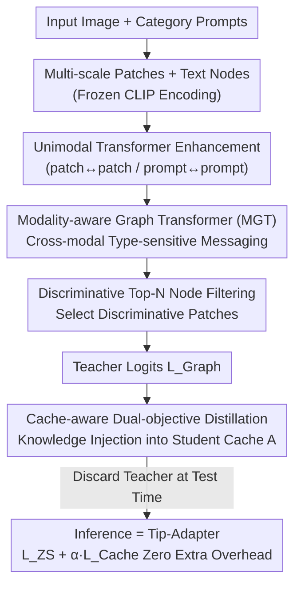

# Training-Only Heterogeneous Image-Patch-Text Graph Supervision for Advancing Few-Shot Learning Adapters

**Conference**: CVPR 2026  
**Paper**: [CVF Open Access](https://openaccess.thecvf.com/content/CVPR2026/html/Mohammad_Training-Only_Heterogeneous_Image-Patch-Text_Graph_Supervision_for_Advancing_Few-Shot_Learning_Adapters_CVPR_2026_paper.html)  
**Code**: https://github.com/MR-Sherif/TOGA.git  
**Area**: Multimodal VLM  
**Keywords**: Few-shot learning, CLIP adapter, Heterogeneous graph, Cross-modal distillation, Training-time supervision

## TL;DR
TOGA attaches an "image-patch-text" heterogeneous graph teacher during the training phase for fine-grained cross-modal reasoning. These relational insights are distilled into the key-value cache of a Tip-Adapter student. During inference, the entire graph teacher is discarded, keeping the inference path identical to Tip-Adapter (zero extra latency or VRAM). It achieves new SOTA results on 11 benchmarks across 1–16 shot settings.

## Background & Motivation

**Background**: Adapting large vision-language models like CLIP to few-shot downstream tasks primarily relies on Parameter-Efficient Fine-Tuning (PEFT). The Tip-Adapter family is particularly favored because it caches global features of a few support samples as a key-value cache. During testing, it performs prototype matching with minimal parameters and extremely fast inference.

**Limitations of Prior Work**: Existing lightweight adapters operate solely on "global unimodal feature vectors." CLIP spatially averages an image into a global descriptor, which blurs fine-grained local cues (e.g., beak shape or feather patterns) critical for distinguishing "Yellow-bellied Sapsucker" from "Grey Sapsucker." Consequently, global feature adapters are inherently disadvantaged in Fine-Grained Visual Categorization (FGVC).

**Key Challenge**: Current PEFT methods are stuck in a trade-off—either **fast but coarse** (global adapters like Tip-Adapter/CLIP-Adapter with zero inference overhead but limited to global vectors) or **strong but slow** (patch-level adapters like GraphAdapter/VPT that reason on patch tokens but permanently carry the computational burden of GNNs or extra tokens during testing, often ignoring text semantics). An ideal few-shot adapter must simultaneously achieve two conflicting goals: ① sufficient expressive power to reason over fine-grained patch evidence and its alignment with category text; ② preservation of the zero-overhead inference of lightweight baselines.

**Goal**: To provide an adapter with "patch-level + cross-modal" relational reasoning capabilities without changing the inference path at test time (latency, VRAM, and parameters remain identical to Tip-Adapter).

**Key Insight**: The authors observe that relational reasoning only needs to exist during the training phase to "teach" the adapter how to encode fine-grained knowledge. Since only the adapter and its key-value cache participate in testing, cross-modal relational reasoning can be injected during training and directionally distilled into the components that remain at deployment (the cache).

**Core Idea**: Utilize a **high-capacity heterogeneous graph teacher that exists only during training** to distill fine-grained cross-modal relational knowledge directly into Tip-Adapter's key-value cache (the student). The teacher is discarded post-training: "Train with graphs, test with Tip-Adapter."

## Method

### Overall Architecture
TOGA (Training-Only Graph Adapter) is an **asymmetric distillation framework**. During training, it runs an ensemble of three branches: ① a frozen Zero-Shot CLIP branch $L_{ZS}$; ② a lightweight student—the key-value cache adapter $A$ of Tip-Adapter-F, producing $L_{Cache}$; and ③ a powerful, **training-only** heterogeneous graph teacher, producing $L_{Graph}$.

Within the teacher branch: Multi-scale patches are cropped from the input image and passed through a frozen CLIP encoder alongside category text prompts to obtain node features → features pass through unimodal Transformers for "intra-modal" context enhancement → patch and text nodes are combined into a heterogeneous graph, where a Modality-aware Graph Transformer (MGT) performs type-sensitive cross-modal message passing → discriminative Top-N node filtering selects the most salient patches, which are aggregated into a teacher visual feature to compute teacher logits. Finally, a "cache-aware dual-objective" transfers this relational knowledge into the student adapter $A$. During testing, the entire teacher branch is discarded, and prediction reverts to $L_{test}=L_{ZS}+\alpha\cdot L_{Cache}$, identical to the original Tip-Adapter-F.

### Key Designs

**1. Asymmetric "Training Teacher / Permanent Student" Distillation: Keeping reasoning costs on the training side**

Patch-level cross-modal reasoning is powerful, but deploying GNNs is undesirable. TOGA resolves this via **structural asymmetry**: the permanent student is the Tip-Adapter-F key-value cache (a lightweight adapter $A$ that maps query features $z$ for cosine prototype matching, $L_{Cache}(x)=\exp(-\beta(1-s))^{\top}V$ where $s_j=\cos(A(z),K_j)$). During training, a high-capacity graph teacher is attached. Classification uses mixed logits $L_{train}(x)=L_{ZS}(x)+\alpha\cdot L_{Cache}(x)+\delta\cdot L_{Graph}(x)$, and gradients update both student and teacher. Unlike standard KD, the teacher is not pre-trained offline; it is trained **online and asymmetrically** with the student, with supervision targets applied directly to the cache's keys/values—upgrading the "prototype memory." Since $L_{Graph}$ vanishes at test time, the expressive power of graph reasoning is "compiled" into the student without carrying the overhead to deployment.

**2. Heterogeneous Image-Patch-Text Graph + MGT: Reasoning fine-grained visual evidence and category semantics in a single graph**

Global vectors miss patch-level evidence and the mapping between specific patches and class names. TOGA performs **multi-scale patch extraction**: slicing the image into a union of 5 views—global, 3×3 local grid (9 patches), 2×2 mid-scale (4 patches), top/bottom halves, and left/right halves, totaling $M=18$ patches. These are resized to 224×224 and passed through frozen CLIP for normalized features $V_{vis}^{(0)}$, while category prompts provide text embeddings $V_{text}^{(0)}$. Both modalities first pass through unimodal Transformers for intra-modal enhancement (patch-patch co-occurrence and prompt-prompt semantics).

The nodes then form a heterogeneous graph $G=(N,E)$ with node types $\phi(v)\in\{\text{patch},\text{text}\}$ and edge types $r\in\{pp,pt,tp\}$. MGT uses node-type projections for type-dependent $Q,K,V$ and relation-specific transforms for relation-aware keys $\tilde K^{(h)}_{s\to t}=W^{(h)}_{K,r}K^{(h)}_s$ and biases $b^{(h)}_{r}$. Attention is defined as:

$$e^{(h)}_{s\to t}=\frac{Q_t^{(h)\top}\tilde K^{(h)}_{s\to t}}{\sqrt{d_k^G}}+b^{(h)}_r,\quad m_t^{(h)}=\sum_{s\in\mathcal N(t)}\mu_r^{(h)}\,\alpha^{(h)}_{s\to t}\,\tilde V^{(h)}_{s\to t}$$

where $\mu_r^{(h)}\in\mathbb R^+$ is a **learned relation-level scaling coefficient** to weight different interactions (e.g., patch-patch vs. patch-text). Type-sensitive parameters preserve modal characteristics, while relation-sensitive parameters allow the model to specifically leverage cross-modal patch-text interactions, which align visual evidence with correct text labels.

**3. Discriminative Top-N Node Filtering: Retaining discriminative patches to avoid background dilution**

MGT outputs refined patch nodes $V'_{vis}=\{h_i\}$. Global pooling would include all patches (including background), diluting small-object fine-grained evidence—particularly harmful for datasets like EuroSAT. TOGA learns a projection vector $p$ to score nodes $s_i=\langle h_i\cdot p\rangle/\|p\|_2\|h_i\|_2$ and selects the Top-N nodes for aggregation into $f_{graph}$. Teacher logits are computed as $L_{Graph}(x)_c=\cos(f_{graph},\hat t_c)$. Visualizations confirm the model retains high-score foreground patches (ant heads, cat eyes) while suppressing background nodes.

**4. Cache-aware Dual-objective Collaborative Training: Using Focal Loss for effective teacher-forcing**

Using only a joint Cross-Entropy (CE) loss allows the teacher to "free-ride" on the student's predictions without learning specialized knowledge. TOGA splits the total loss:

$$\mathcal L_{Total}=\underbrace{\mathcal L_{CE}(L_{train},y)}_{\text{Joint Ensemble Loss}}+\lambda\cdot\underbrace{\mathcal L_{Focal}(L_{Graph},y)}_{\text{Teacher Forcing}}$$

The first term is standard CE on mixed logits. The second is **Focal Loss applied solely to the teacher's logits**: $p_t=\mathrm{softmax}(L_{Graph})_y$, $L_{Focal}=-(1-p_t)^{\gamma}\log(p_t)$. Focal loss down-weights easy samples where the teacher is already correct ($p_t\to1$), forcing the teacher to dedicate capacity to difficult fine-grained samples. This ensures the teacher becomes a robust expert, providing higher-quality relational signals to be "imprinted" into the student's cache keys/values via the joint loss.

## Key Experimental Results

### Main Results
On 11 standard benchmarks (Aircraft, Flowers102, SUN397, Food101, Caltech101, UCF101, StanfordCars, DTD, ImageNet, OxfordPets, EuroSAT) using a frozen CLIP ViT-B/16 backbone, TOGA refreshes the SOTA across all shots and datasets while maintaining the exact inference latency of Tip-Adapter-F.

| Shot | Metric (Avg. % of 11 Datasets) | TOGA | CCA (Strong Baseline) | Tip-Adapter-F | GraphAdapter | Gain over CCA |
|------|------|------|------|------|------|------|
| 1 | Avg Acc | **72.2** | 66.3 | 64.6 | 64.8 | +5.9 |
| 2 | Avg Acc | **75.0** | 68.9 | 66.6 | 67.7 | +6.1 |
| 4 | Avg Acc | **77.9** | 72.2 | 69.7 | 70.3 | +5.7 |
| 8 | Avg Acc | **80.0** | 75.0 | 72.4 | 73.4 | +5.0 |
| 16 | Avg Acc | **82.3** | 77.6 | 75.7 | 76.2 | +4.7 |

On FGVC-Aircraft, TOGA outperforms CCA by +9.8% in the 2-shot setting. On EuroSAT, it reaches 89.4% (16-shot), significantly higher than Tip-Adapter-F (84.5%). For OOD robustness (ImageNet variants), TOGA averages 63.1, outperforming zero-shot CLIP (59.1) and various prompt-tuning baselines, indicating that it does not overfit the support set.

### Ablation Study

| Configuration (EuroSAT example) | 1-shot | 16-shot | Note |
|------|------|------|------|
| Full (T+M+F+P, Focal) | 67.4 | 89.4 | Complete model |
| Only $L_{CE}$ | 65.1 | 88.1 | Weak teacher signal |
| $L_{CE} + L^{Graph}_{CE}$ | 67.1 | 87.5 | Gradient conflict at high shots |
| w/o MGT (Remove M) | 61.9 | 85.7 | Largest drop; cross-modal reasoning is key |
| w/o patch-text edges (Remove P) | 64.1 | 86.7 | Unimodal interaction is insufficient |
| Global Pooling (Remove Top-N) | 63.4 | 88.7 (N=All) | Background noise dilution |
| MultiScale → 3×3 fixed | 61.7 | 88.8 | Fixed scale lacks flexibility |

### Key Findings
- **MGT is the primary performance driver**: Removing the cross-modal reasoning component (M) causes the most significant drop across all datasets.
- **Top-N filtering has an optimal point**: $N=50\%$ balances retaining discriminative foreground and suppressing noise.
- **Greater gains in data-scarce settings**: The 1-shot average gain (+5.9) is higher than the 16-shot gain (+4.7), suggesting relational supervision effectively extracts category-defining evidence from very few samples.
- **Multi-scale outperforms fixed grids**: Parallelizing 18 multi-scale patches allows the teacher to capture both local texture and global structure.

## Highlights & Insights
- **Decoupling Expressive Power and Inference Cost**: The asymmetric "Training Teacher / Permanent Student" design is elegant. Relational knowledge from the trainer is "compiled" into the student's cache, a paradigm applicable to any scenario requiring strong reasoning with strict deployment budgets.
- **Direct KV Cache Supervision**: Directly upgrading the prototype memory that dictates testing behavior (the cache) is more effective for zero-overhead adapters than traditional logit-based KD.
- **Focal Loss as Teacher-Forcing**: Forcing the teacher to focus on difficult samples prevents it from "free-riding" on ZS or student predictions.
- **Heterogeneous graph structure** unites the visual hierarchy (image↔patch) and cross-modality (patch↔text) in a single topology, using $\mu_r$ to automatically weight different interactions.

## Limitations & Future Work
- **High training cost**: Running multi-scale patches (18 crops through CLIP) + Transformers + MGT + Focal loss increases VRAM and training time significantly compared to Tip-Adapter.
- **Hyperparameter sensitivity**: Tuning $(\alpha, \beta, \gamma, N)$ requires effort, and the optimal $N=50\%$ may vary depending on the foreground-to-background ratio of specific datasets.
- **Evaluated only on CLIP ViT-B/16 for classification**: Benefits in dense prediction tasks like detection or segmentation have not been verified.
- **Static knowledge**: Discarding the teacher means the model cannot use online patch evidence for OOD samples that fall outside the "knowledge" distilled into the cache.

## Related Work & Insights
- **vs. Tip-Adapter-F**: Testing paths are identical. TOGA simply improves the quality of the cache during training, providing "free gains" with zero extra inference cost.
- **vs. GraphAdapter**: GraphAdapter requires the GNN during testing. TOGA performs cross-modal fusion in a training-only heterogeneous graph and outperforms GraphAdapter (82.3% vs 76.2% at 16-shot) while staying lighter at test time.
- **vs. KD / Mutual Learning**: Most VLM distillation uses offline teachers or symmetric learning on logits. TOGA uses online asymmetric learning and supervises the KV cache directly.

## Rating
- **Novelty**: ⭐⭐⭐⭐⭐ 
- **Experimental Thoroughness**: ⭐⭐⭐⭐⭐ 
- **Writing Quality**: ⭐⭐⭐⭐ 
- **Value**: ⭐⭐⭐⭐⭐ 

<!-- RELATED:START -->

## Related Papers

- [\[CVPR 2026\] TIPSv2: Advancing Vision-Language Pretraining with Enhanced Patch-Text Alignment](tipsv2_patch_text_alignment.md)
- [\[CVPR 2026\] Learning complete and explainable visual representations from itemized text supervision](learning_complete_and_explainable_visual_representations_from_itemized_text_supe.md)
- [\[CVPR 2026\] Pointing at Parts: Training-Free Few-Shot Grounding in Multimodal LLMs](pointing_at_parts_training-free_few-shot_grounding_in_multimodal_llms.md)
- [\[CVPR 2026\] Noise-Aware Few-Shot Learning through Bi-directional Multi-View Prompt Alignment](noise-aware_few-shot_learning_through_bi-directional_multi-view_prompt_alignment.md)
- [\[AAAI 2026\] Few-Shot Precise Event Spotting via Unified Multi-Entity Graph and Distillation](../../AAAI2026/multimodal_vlm/few-shot_precise_event_spotting_via_unified_multi-entity_graph_and_distillation.md)

<!-- RELATED:END -->
