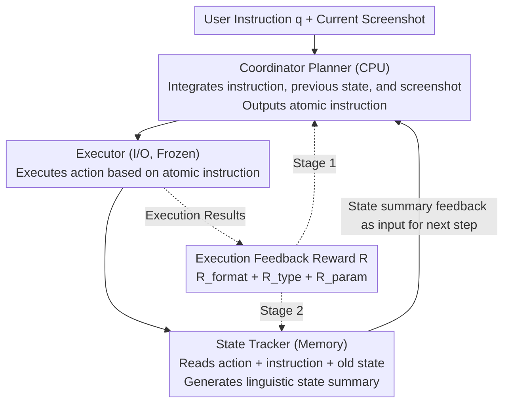

# Training High-Level Schedulers with Execution-Feedback Reinforcement Learning for Long-Horizon GUI Automation

**Conference**: CVPR2026  
**arXiv**: [2511.22235](https://arxiv.org/abs/2511.22235)  
**Code**: [hehehahi4/CES](https://github.com/hehehahi4/CES)  
**Area**: Multimodal VLM  
**Keywords**: GUI Automation, Long-Horizon Tasks, Multi-Agent Framework, Reinforcement Learning, State Tracking, Task Scheduling

## TL;DR

The authors propose CES (Coordinator-Executor-State Tracker), a multi-agent framework and phased execution-feedback reinforcement learning algorithm. By decoupling high-level task planning from low-level execution through specialized training of the Coordinator and State Tracker, the framework significantly enhances the planning and state management capabilities of GUI agents in long-horizon tasks.

## Background & Motivation

1.  **Conflict in Single-Agent Capabilities**: Existing end-to-end GUI agents attempt to couple heterogeneous capabilities such as task planning, multi-step reasoning, GUI element localization, and precise action execution within a single model. Given limited parameters, simultaneously mastering both high-level and low-level capabilities is difficult, often leading to catastrophic capability collapse as task complexity increases.
2.  **Lack of Task State Perception**: In long-horizon tasks, agents primarily rely on screenshots to infer progress. However, screenshots are insufficient and unreliable state representations—recurring home screens or Out-Of-Distribution (OOD) interfaces make progress judgment difficult.
3.  **Limitations of SFT Paradigm**: Supervised Fine-Tuning (SFT) heavily depends on large-scale, high-quality annotated trajectory data, which is costly and possesses poor generalization.
4.  **Insufficient Single-step RL**: Although existing RL methods achieve some success in simple tasks, they still train a single policy network and fail to resolve the capability coupling issue.
5.  **Multi-Agent Lacks Optimization**: Existing multi-agent frameworks mostly utilize general VLMs with prompt engineering to play roles but lack deep specialization and optimization for each specific role.
6.  **Temporal Verification Experiment**: The paper designs a screenshot temporal judgment experiment, finding that accuracy drops sharply as the step interval increases. This empirically demonstrates that screenshots cannot fully represent task states.

## Method

### Overall Architecture

The goal of this paper is to solve the dilemma in long-horizon GUI automation where "one model must handle both high-level planning and low-level execution, leading to conflicting capabilities." Drawing inspiration from Operating System (OS) task division, CES decomposes the task into three specialized agents: the Coordinator acts as the CPU for planning, decomposing high-level user instructions into atomic instructions; the Executor acts as the I/O device, serving as a frozen pre-trained GUI model that executes actions on the current interface based on atomic instructions; and the State Tracker acts as memory, maintaining a natural language summary of "what step the task has reached" using a pure language model. These three collaborate in a cyclic loop where the state summary from the State Tracker is fed back into the Coordinator to assist in the next step of planning, forming a "Plan $\rightarrow$ Execute $\rightarrow$ Update State $\rightarrow$ Re-plan" closed loop. Training is conducted in two stages using downstream execution results as rewards, first training the Coordinator and then the State Tracker.

### Key Designs

**1. OS-style Three-Role Decoupling: Planning, Execution, and Memory**

Single end-to-end agents face "capability collapse" in complex tasks. CES decouples these responsibilities: the Coordinator integrates the user instruction $q$, the previous state summary $m^{t-1}$, and the current screenshot $s^t$ to generate an atomic instruction $l^t = \pi_c(q, m^{t-1}, s^t)$; the Executor is a frozen model that only needs to output an action $u^t = (th^t, a^t) = \pi_e(l^t, s^t)$ based on $l^t$ and $s^t$, without needing to understand long-term intent. Each module is optimized only for its specialized sub-capability, preventing heterogeneous capabilities from competing for the same parameter set.

**2. Linguistic State Tracker: Moving State Understanding Out of High-Dimensional Visual Space**

Temporal experiments confirmed that screenshots cannot reliably represent state in long-horizon tasks. The State Tracker avoids directly looking at the GUI; instead, it reads the Executor’s output $u^t$, the user intent $q$, and the previous state $m^{t-1}$ to generate a new natural language state summary $m^t = \pi_s(q, m^{t-1}, u^t)$. This shifts the state from a high-dimensional, confusing visual space to a low-dimensional, semantically clear linguistic space, nearly eliminating progress misjudgment (State Loss errors dropped from 14% to 2%).

**3. Execution Feedback Reward: Inferring Optimal Planning from Downstream Results**

Abstract outputs like planning and state summaries are difficult to score directly. CES does not evaluate the "literary quality" of intermediate outputs; rather, it passes them to the Executor for actual execution and scores them objectively using rule-based rewards:
$$R = \alpha_1 R_{format} + \alpha_2 R_{executor}, \quad R_{executor} = \gamma_1 R_{type} + \gamma_2 R_{param}$$
Where $R_{format}$ ensures format validity, $R_{type}$ checks the action type, and $R_{param}$ checks the accuracy of action parameters. The ultimate standard is "whether it could be executed," providing clear optimization signals for upstream modules that are otherwise difficult to evaluate.

**4. Phased RL: Optimizing Coordinator then State Tracker**

To prevent interference between the two trainable modules, the process is split into two stages, both based on GRPO. First, Warm-up SFT is performed for both to learn basic duties and output formats. In Stage 1, the Executor is frozen, and ground-truth states are used as $m^{t-1}$ inputs to optimize only the Coordinator's planning policy. In Stage 2, the trained Coordinator and Executor are frozen, and the State Tracker's generated summaries complete the full CES loop, with final execution feedback propagated back to it. This ensures it learns "what kind of state summary is most useful for the Coordinator" rather than just mimicking human summaries.

### Loss & Training

- Coordinator base: Qwen2.5-VL-7B; State Tracker base: Qwen3-4B; Executor: Frozen GUI-R1-7B.
- SFT used LLaMA Factory (1 epoch, lr=5e-5); RL used Verl (Coordinator: 10 epochs, lr=1e-6; State Tracker: 5 epochs).
- Reward coefficients: $\alpha_1=0.1, \alpha_2=0.9$, $\gamma_1=0.2, \gamma_2=0.8$; Hardware: 8×80G GPUs.

## Key Experimental Results

### Main Results: Long-Horizon Task Performance (Table 1)

Performance across AITZ (avg 7.5 steps), AMEX (avg 12.8 steps), and GUI-Odyssey (avg 15.3 steps):

| Model | Method | AITZ SR | AMEX SR | GUI-Odyssey SR |
|------|------|---------|---------|----------------|
| Qwen2.5-VL-7B | Zero Shot | 18.11 | 35.10 | 34.37 |
| GUI-R1-7B | RL | 30.59 | 43.69 | 38.79 |
| GUI-Owl-7B | RL | 32.70 | 40.48 | 35.82 |
| + GPT-5 | Multi-Agent | 40.55 | 35.80 | 42.47 |
| **+ CES (Ours)** | **Multi-Agent** | **43.05** | **48.48** | **53.69** |

CES improved the average Type accuracy by 10.38% over the GUI-R1-7B baseline, with GUI-Odyssey SR increasing from 38.79% to 53.69% (+14.9%).

### Generalization Study (Table 2)

CES as a plug-and-play module significantly improves performance across various Executor scales:

| Executor | Setting | AMEX SR | GUI-Odyssey SR |
|----------|------|---------|----------------|
| UI-R1-3B | Baseline $\rightarrow$ Ours | 35.81 $\rightarrow$ 43.38 (+7.57) | 32.49 $\rightarrow$ 38.04 (+5.55) |
| GUI-Owl-7B | Baseline $\rightarrow$ Ours | 40.48 $\rightarrow$ 47.24 (+6.76) | 35.82 $\rightarrow$ 46.65 (+10.83) |
| GUI-Owl-32B | Baseline $\rightarrow$ Ours | 43.16 $\rightarrow$ 52.05 (+8.89) | 39.60 $\rightarrow$ 56.75 (+17.15) |

### Ablation Study (Table 3)

| Configuration | AMEX SR | GUI-Odyssey SR |
|------|---------|----------------|
| Full CES | 48.48 | 53.69 |
| w/o Coordinator | 33.27 (-15.21) | 39.15 (-14.54) |
| w/o State Tracker | 42.08 (-6.40) | 42.52 (-11.17) |
| w/o RL (SFT only) | 36.54 (-11.94) | 42.89 (-10.80) |

Removing any component or RL stage leads to significant performance drops, validating the necessity of each component and training strategy.

## Highlights & Insights

1.  **OS-style Design Philosophy**: Analytically compares GUI automation to the CPU-I/O-Memory architecture of an operating system, elegantly decoupling planning, execution, and state management.
2.  **Innovation in State Tracker**: Uses a pure language model for dynamic context compression and state summarization, shifting state understanding from high-dimensional visual space to low-dimensional semantic space, nearly eliminating State Loss errors (14% $\rightarrow$ 2%).
3.  **Execution Feedback Reward**: Cleverly resolves the difficulty of evaluating abstract tasks (planning/state tracking) by using downstream execution results to guide upstream optimization.
4.  **Plug-and-play Generalization**: A lightweight combination of a 7B Coordinator and 4B State Tracker significantly benefits different Executors; a 7B+4B combo can even match the performance of a single 32B model.
5.  **Thorough Empirical Validation**: Includes temporal judgment experiments, three long-horizon benchmarks, multi-scale Executor generalization, detailed ablation, and failure case analysis.

## Limitations & Future Work

1.  **Executor as Bottleneck**: Failure case analysis shows that the performance bottleneck has shifted to the perception limits of the Executor (Perception Error and Generalization Failure), which CES does not resolve.
2.  **Non-joint Phased Training**: The Coordinator and State Tracker are trained separately without exploring the possibilities of joint training or co-evolution.
3.  **Domain Scope**: Validated only in mobile GUI scenarios; not yet extended to Web, Desktop, or other GUI environments.
4.  **Dependency on Summary Quality**: Stage 1 depends on ground-truth state annotations; the feasibility of obtaining such annotations in all real-world scenarios requires verification.
5.  **Inference Latency**: Concurrent inference of three models (7B + Frozen Executor + 4B) may be an obstacle for actual deployment due to latency.

## Related Work & Insights

-   **vs GUI-R1**: Both use RL to train GUI agents, but GUI-R1 trains a single end-to-end model, whereas CES decouples high-level/low-level tasks, improving GUI-Odyssey SR from 38.79% to 53.69%.
-   **vs SWIRL**: Both are multi-stage workflow methods; SWIRL achieves SR=51.65% on GUI-Odyssey, while CES reaches 53.69% and leads on other benchmarks.
-   **vs Mobile-Agent-v3**: These multi-agent frameworks rely on prompt engineering for role assignment and lack specialized optimization; CES utilizes execution-feedback RL for deep training of each role.
-   **vs GPT-5 Multi-Agent**: Using GPT-5 for the Coordinator and State Tracker roles shows unstable results (some metrics dropped), while the specialized models in CES significantly and stably outperform prompt-based solutions.

## Rating

- Novelty: ⭐⭐⭐⭐ — The OS-inspired decoupling and execution-feedback RL paradigm show high originality.
- Experimental Thoroughness: ⭐⭐⭐⭐⭐ — Comprehensive testing across three benchmarks, multi-scale generalization, and detailed analysis.
- Writing Quality: ⭐⭐⭐⭐ — Clear structure, well-articulated motivation, and clever experimental design.
- Value: ⭐⭐⭐⭐ — The plug-and-play scheduling modules are highly practical for the GUI agent community.

<!-- RELATED:START -->

## Related Papers

- [\[CVPR 2026\] GUI-SAGE: Enhancing GUI Automation with Self-Explanatory Learning](gui-sage_enhancing_gui_automation_with_self-explanatory_learning.md)
- [\[CVPR 2026\] SenseSearch: Empowering Vision-Language Models with High-Resolution Agentic Search-Reasoning via Reinforcement Learning](sensesearch_empowering_vision-language_models_with_high-resolution_agentic_searc.md)
- [\[CVPR 2026\] DRS-GUI: Dynamic Region Search for Training-Free GUI Grounding](drs-gui_dynamic_region_search_for_training-free_gui_grounding.md)
- [\[CVPR 2026\] Explore with Long-term Memory: A Benchmark and Multimodal LLM-based Reinforcement Learning Framework for Embodied Exploration](explore_with_long-term_memory_a_benchmark_and_multimodal_llm-based_reinforcement.md)
- [\[ICLR 2026\] GuirlVG: Incentivize GUI Visual Grounding via Empirical Exploration on Reinforcement Learning](../../ICLR2026/multimodal_vlm/guirlvg_incentivize_gui_visual_grounding_via_empirical_exploration_on_reinforcem.md)

<!-- RELATED:END -->
