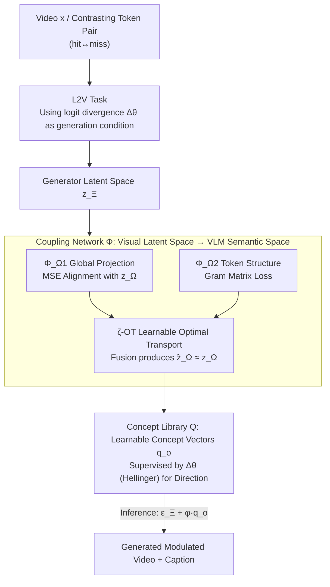

# TRANSPORTER: Transferring Visual Semantics from VLM Manifolds

**Conference**: CVPR 2026  
**Paper**: [CVF Open Access](https://openaccess.thecvf.com/content/CVPR2026/html/Stergiou_TRANSPORTER_Transferring_Visual_Semantics_from_VLM_Manifolds_CVPR_2026_paper.html)  
**Code**: [项目页](https://alexandrosstergiou.github.io/TRANSPORTER)  
**Area**: Model Interpretability / Video VLM / Generative Explanations  
**Keywords**: VLM Interpretability, logits-to-video, Optimal Transport, concept vectors, text-to-video

## TL;DR
This paper proposes a new interpretability task called logits-to-video (L2V) and designs the VLM-agnostic TRANSPORTER. By using optimal transport to couple the visual latent space of a text-to-video generator with the semantic embedding space of a VLM, and utilizing a set of learnable "concept vectors", it translates the logit divergence between two contrasting tokens in the VLM (e.g., happy $\leftrightarrow$ sad) into fine-grained attribute changes in the video. This directly and visually explains what the VLM is looking at using "generated videos".

## Background & Motivation
**Background**: Video understanding has evolved from detection and prediction to being unified by Vision-Language Models (VLMs) to answer various questions. VLMs encode videos into tokens, output captions using an LLM, and provide a logit probability distribution over the token vocabulary. However, explaining "why the model answered this way" remains a persistent challenge.

**Limitations of Prior Work**: Existing interpretability methods are almost entirely **text-based**—either prompting the model, applying linear probes on hidden embeddings, or decoding embeddings into text descriptions. These explanations are sensitive to input perturbations, restricted in length, and often **misrepresent the true internal processes of the model**. Another class of saliency-based attribution (saliency / gradient maps) only provides coarse regional heatmaps on videos, failing to specify "what visual attribute the model understands this action to be".

**Key Challenge**: The VLM represents answers as a probability distribution over tokens, whereas the explanation humans desire is **concrete and visible** visual content. Text explanations and saliency maps both involve a layer of abstraction, making it impossible to directly and causally map "the changes in a certain token's logit" to "what actually changed in the frame".

**Goal**: Is it possible to **directly generate videos** from the VLM's logit distribution? Given the logit difference of a VLM on a pair of contrasting tokens (e.g., young $\to$ old, swift $\to$ slow), the goal is to generate a video where only that specific attribute changes while the rest of the scene remains dynamically consistent, allowing users to "see" what semantic mapping the VLM has learned for those tokens.

**Key Insight**: This work leverages recent high-fidelity text-to-video (T2V) models, which can generate videos with rich visual details. If the generator's latent space can be **aligned/coupled** with the VLM's embedding space, the VLM's logit can be used as a generation condition, guiding the generated video to change along the semantic direction. This inspiration also draws from concept editing in T2I, where "the embedding difference of a prompt pair is treated as a concept direction".

**Core Idea**: The L2V (logits-to-video) task is proposed. It employs Optimal Transport (OT) to couple the "generator visual latent space $\leftrightarrow$ VLM semantic embedding space", and then learns a set of concept vectors to use the logit divergence $\Delta\vartheta$ between two VLM tokens as a control variable to modulate video generation.

## Method

### Overall Architecture
TRANSPORTER aims to solve the problem of turning VLM logit variations into a video. It is trained in two stages. In the **first stage**, a coupling network $\Phi$ is trained to map the embedding $z_\Xi$ in the generator's (Wan2.2) latent space $\mathbb{R}_\Xi$ to the VLM's embedding space $\mathbb{R}_\Omega$, producing $\tilde z_\Omega$ which approximates the VLM's ground-truth encoding $z_\Omega$. Consequently, the latent variables produced by the generator can be "understood" by the VLM to output logits. In the **second stage**, the generator and VLM are frozen, and a **concept library** $Q=\{q_o\}$ is trained. For each pair of semantic contrasting tokens (e.g., `baseball hit` vs `baseball miss`), a concept vector $q_o\in\mathbb{R}_\Xi$ is learned to encode the direction of these attributes in the generator's latent space. This direction is supervised by the VLM's actual logit divergence $\Delta\vartheta$ to ensure consistency between the "visual changes" and the "VLM's semantic changes". During **inference**, the user manually specifies $\varphi$ (the desired logit difference intensity) and feeds the modulated condition $\varepsilon^-_\Xi + \varphi q_o$ into the generator to decode a video reflecting the logit change. This can also be back-propagated to $\mathbb{R}_\Omega$ via $\Phi$ to generate the corresponding caption.

### Key Designs

**1. L2V Task: Redefining "Explaining VLMs" as "Conditional Video Generation Based on Logit Divergence"**

Traditionally, video VLM explanations have resided in text or saliency maps. The authors directly reframe the problem: given a VLM outputting logit $\vartheta=\text{logit}(\varepsilon_\Omega)$ for a caption $\varepsilon_\Omega$, the model should **generate a video** $x'$ corresponding to the token logit change $\Delta\vartheta$ from $\vartheta^-$ (e.g., happy) to $\vartheta^+$ (e.g., sad). This transforms invisible "probability distribution explanations" into seeable, interactive videos. It directly verifies whether the "semantics learned by the model" align with the "corresponding visual representations" and enables exploring the object-attribute associations learned by the model. The underlying generator is trained using Conditional Flow Matching (CFM), regressing the velocity field from a Gaussian prior $\omega\sim\mathcal N(0,I)$ to the target (latent, condition): $L_{CFM}=\mathbb E\,\lVert v(z'_{\Xi,t}\mid\varepsilon_\Xi)-G(z'_{\Xi,t},\varepsilon_\Xi,t)\rVert^2$. L2V introduces logit conditions into this framework. This task is the first major contribution of the paper—a high-fidelity diagnostic direction that was previously unexplored.

**2. Coupling Network $\Phi$: Transporting Generator Visual Latent Space to VLM Semantic Space via Optimal Transport**

The core difficulty is that although the generator's embedding $z_\Xi$ can be decoded back into a video by its own VAE decoder $D_\Xi$, "decoding then re-encoding with the VLM" ($z_{\Xi\to\Omega}=E_\Omega(D_\Xi(z_\Xi))$) introduces random perturbations from the VAE, causing the token dynamics to mismatch the deterministic encoding $z_\Omega$. Consequently, $\Phi$ utilizes three complementary sub-modules to transport $z_\Xi$ directly to $\tilde z_\Omega$ to approximate $z_\Omega$: ① $\Phi_{\Omega1}$ (24-layer MLP-Mixer) performs **global projection** to align target encodings with MSE: $L_{\Phi_{\Omega1}}=\lVert z_\Omega-\hat z_{\Omega1}\rVert^2$; ② $\Phi_{\Omega2}$ (12-layer Transformer) specifically handles the **local geometry among tokens**, matching token relations using a Gram matrix loss: $L_{\Phi_{\Omega2}}=\lVert H(z_\Omega)-H(\hat z_{\Omega2})\rVert^2$, where $H(\cdot)$ is the $\mathbb R^{|N|\times|N|}$ relation matrix of pairwise token inner products; ③ **learnable entropy-regularized optimal transport ($\zeta$-OT)** merges the global projection $\hat z_{\Omega1}$ and the local structure $\hat z_{\Omega2}$ into $\tilde z_\Omega$. $\zeta$-OT uses $P$ sets of learnable projection vectors to project tokens to scalars $a_{i,\zeta}=\langle\hat z_{\Omega1,i},p_{\Omega1,\zeta}\rangle$ and $b_{j,\zeta}=\langle\hat z_{\Omega2,j},p_{\Omega2,\zeta}\rangle$. With the transport cost $M_{i,j,\zeta}=\lVert a_{i,\zeta}-b_{j,\zeta}\rVert^2$, the transport plan $T_{i,j,\zeta}\propto\exp(-M_{i,j,\zeta}/\varsigma)$ is solved (using a partial sinkhorn-like iteration for closed-form approximation to avoid the high overhead of fully double-constrained OT), yielding $\tilde z_\Omega=\tilde T\hat z_{\Omega1}$. Overall, $\Phi$ is jointly optimized with $L_{\zeta\text{-}OT}=\lVert z_\Omega-\tilde z_\Omega\rVert^2+\lVert H(z_\Omega)-H(\tilde z_\Omega)\rVert^2$. This preserves both global semantics and local token structures, serving as the linchpin for letting the generated latents be correctly interpreted by the VLM.

**3. Concept Library Q: Supervised by VLM Logit Divergence, Translating Attribute Differences into Controllable Latent Directions**

With the coupling in place, logits can be computed, but the direction of adjustment remains missing. The authors learn a concept vector $q_o\in\mathbb R_\Xi$ for each contrasting token pair $\varepsilon^-,\varepsilon^+$, encoding the direction of this attribute within the generator's latent space. Training relies on dual supervision: On the **generator side**, for the same intermediate latent $z'_{\Xi,t}$, two velocity fields are predicted using two conditions. Their divergence $\Delta v=G(z'_{\Xi,t},\varepsilon^+_\Xi,t)-G(z'_{\Xi,t},\varepsilon^-_\Xi,t)$ corresponds to the attribute direction. Analogous to finding latent directions in diffusion models, the CFM loss is rewritten to align the "condition augmented with the concept vector" with the "velocity field augmented with $\varphi\Delta v$": $L_{q_o}=\mathbb E\,\lVert \text{sg}[G(z'_{\Xi,t},\varepsilon^-_\Xi,t)+\varphi\Delta v]-G(z'_{\Xi,t},\varepsilon^-_\Xi+\varphi q_o,t)\rVert^2$ (generator weights are frozen, and sg denotes stop-gradient). On the **VLM side**, the latents from both paths are mapped back to $\mathbb R_\Omega$ via $\Phi$ to retrieve the logits $\vartheta^-,\vartheta^+$. The logit divergence is computed using the **Hellinger distance**: $\Delta\vartheta=\tfrac{1}{\sqrt2}\lVert\sqrt{\vartheta^-}-\sqrt{\vartheta^+}\rVert\in[0,1]$, which is used as the control scale $\varphi=\Delta\vartheta$. Hellinger distance is chosen because of its strict $[0,1]$ bounds (which outperforms unbounded KL and slightly beats JS in ablation studies). This ties the concept vector's "visual direction" tightly to the VLM's "semantic divergence", ensuring that visual changes faithfully reflect token logit variations.

**4. Inference: Manual Divergence Level Settings for Fine-Grained, Interactive Video Modulation**

During inference, $\varphi$ can be manually adjusted by the user, corresponding to the desired logit distribution change $\Delta\vartheta$. The concept vector is used to modify the conditional path to $\varepsilon^-_\Xi+\varphi q_o$, and the generated latent $z'^{q_o}_{\Xi,t}$ is decoded into a video $x'^{q_o}=D(z'^{q_o}_{\Xi,t})$, while also map-backable to $\mathbb R_\Omega$ via $\Phi$ to generate corresponding captions. The paper demonstrates that this allows continuous interpolation (gradual pacing change from walk $\to$ run), composition of multiple attribute modulations (simultaneously changing count and thickness), time-step injection (large-scale differences visible in early steps, details in later steps), and partial-frame modulation (spray gradually morphing into a wipe motion) to explore how the VLM binds objects to actions and the temporal granularity of actions.

### Loss & Training
Two-stage training is employed. The generator (Wan2.2) and three VLMs (VideoLLaMA 3-7B / Gemma 3-12B / Phi 4 MM-5B) are frozen throughout. **Stage 1** trains the coupling network $\Phi$: AdamW, 100k steps, learning rate 1e-3, batch size 8, gradient accumulation every 8 steps, and 100 sets of projection vectors for $\zeta$-OT. Joint optimization of MSE + Gram + $\zeta$-OT is performed. **Stage 2** trains the concept library $Q$: 1k steps per vector, learning rate 1e-4, using $L_{q_o}$ supervision. $\Delta v$ and $\Delta\vartheta$ are averaged across multiple noise seeds to reduce variance. The coupling training data is sourced from semantics-rich, high-resolution, first-person videos in VATEX, LAVIB, and Ego4D.

## Key Experimental Results

### Main Results
The comparison baselines involve transferring feature visualization methods from image/video classification (Activation Maximization family) to video VLMs (maximizing target logit $\vartheta^+$ or $\vartheta^-+\Delta\vartheta$ with divergence). Among them, LEAPS is the only prior work conducting visual explanations directly on video models and serves as the main baseline. Metrics: FVD↓, LPIPS_v↓ (visual quality compared to real videos), CLIP_v↑, aesthetic↑, $\Delta$↑ (conditional alignment).

| VLM | Method | FVD↓ | LPIPS_v↓| CLIP_v↑ | aes↑ | Δ↑ |
|-----|------|------|----------|---------|------|-----|
| VideoLLaMA 3 | LEAPS (max $\vartheta^+$) | 1.85e3 | 4.37 | 16.74 | 2.56 | 2.28 |
| VideoLLaMA 3 | **TRANSPORTER** | **1.25e2** | **1.67** | **35.44** | **4.28** | **12.62** |
| Gemma 3 | Baseline | 2.18e3 | 4.55 | 17.41 | 2.67 | 1.82 |
| Gemma 3 | **TRANSPORTER** | **1.05e2** | **1.43** | **36.18** | **4.21** | **11.56** |
| Phi 4 MM | Baseline | 2.34e3 | 5.12 | 15.06 | 2.24 | 1.73 |
| Phi 4 MM | **TRANSPORTER** | **1.42e2** | **1.54** | **35.71** | **4.18** | **11.35** |

CLIP_v doubles from 16.74 to 35.44 on VideoLLaMA 3; FVD drops from ~2e3 to 1.05e2 (an order of magnitude improvement) on Gemma 3; conditional alignment divergence $\Delta$ increases from ~2 to 11~12 across the board. Additionally, a similarity table comparing generated and real video embeddings (cos↑/l1↓/l2↓/KL↓) indicates that, for example, on VideoLLaMA 3, cos increases from 6.45e-8 to 3.28e-2 and KL drops from 56.31 to 1.67, proving that the baseline fails entirely to approximate the real video distribution, while TRANSPORTER succeeds.

### Ablation Study
Ablations report semantic scores (cos / BLEU / CIDEr / METEOR / SPICE) between "target caption $\varepsilon^+$ and generated video caption $\varepsilon^{q_o}$", split into two groups for the coupling network and the concept library (the table below shows cos and BLEU@4 for VideoLLaMA 3):

| Configuration | cos↑ | B@4↑ | Description |
|------|------|------|------|
| Baseline [LEAPS] | 0.11 | 2.05 | Directly migrated AM baseline |
| decode-and-re-encode | 0.19 | 5.24 | Inference-only decode-re-encode, no coupling training |
| Φ_Ω1 only | 0.16 | 4.49 | Global projection only |
| Φ_Ω2 only | 0.21 | 7.75 | Token structure only |
| mean⟨Φ_Ω1,Ω2⟩ | 0.23 | 7.79 | Simple average of both |
| sGW OT (instead of ζ-OT) | 0.14 | 4.09 | Sliced Gromov-Wasserstein heuristic |
| ζ-OT, P=50/200/400 | 0.24/0.26/0.26 | 8.29/8.30/8.40 | More projection vectors lead to marginal gains but higher cost |
| Δθ using KL | 0.19 | 5.29 | Unbounded divergence, drops performance |
| Δθ using JS | 0.22 | 6.58 | Slightly worse than Hellinger |
| **TRANSPORTER (Hellinger)**| **0.26** | **8.34** | Full model |

### Key Findings
- **The coupling network is key**: Compared to the inference-only "decode-then-re-encode" approach (cos 0.19), the trained $\Phi$ elevates cos to 0.26. $\Phi_{\Omega2}$ (token structure) alone is significantly stronger than $\Phi_{\Omega1}$ (global projection), indicating that preserving pairwise token local geometry is vital for the VLM to "comprehend" latent variables.
- **$\zeta$-OT > Heuristic OT**: Replacing $\zeta$-OT with Sliced Gromov-Wasserstein significantly degrades caption quality (cos 0.26 $\to$ 0.14), showing that the learnable transport plan outperforms fixed heuristics. Increasing the number of projections $P$ from 100 to 400 offers only marginal benefits but incurs higher computational costs.
- **Divergence metrics should be bounded**: Hellinger (strictly bounded in $[0, 1]$) > JS > unbounded KL. Unbounded metrics impair control stability.
- **Qualitative insights**: Object-like attributes (whether juggling balls or clubs, whether sign reads Chicago or New York) persist throughout the scene, whereas action manifestations (gymnastics rotation) have a heavier impact only at specific moments—indicating that current VLMs learn **temporal sequence dynamics of actions at varying granularities**. Large-scale attribute differences manifest in early generation steps, while details gradually fade out in later steps.

## Highlights & Insights
- **Upgrading interpretability from "text/heatmaps" to "visible videos"**: L2V allows users to directly see "how the VLM interprets a token in terms of visual changes." Since it modifies only the target attribute while preserving the rest of the scene dynamics, this "controlled counterfactual video" is far more informative than saliency maps.
- **Using OT as a cross-modal space "translator" is elegant**: The generator's latent space and VLM's semantic space are naturally misaligned. Rather than forcing a shared space, the authors learn an optimal transport coupling, divided into global projection, token structure, and learnable OT, managing semantics and geometry separately. This approach can be transferred to any scenario where two heterogeneous embedding spaces need alignment.
- **Supervising generation direction with logit divergence**: Tying the "visual direction $\Delta v$" to the "VLM semantic divergence $\Delta\vartheta$" is core to ensuring explanation faithfulness—the output is not just a visually appealing video, but one that **faithfully reflects the inner logit variations of the model**.
- **VLM-Agnostic**: The method only runs frozen inference on the VLM. It works seamlessly across VideoLLaMA 3, Gemma 3, and Phi 4 MM, demonstrating strong potential as a general interpretability tool.

## Limitations & Future Work
- **Dependency on the underlying T2V generator quality**: The fidelity of the explanation is bounded by the generative capacity of Wan2.2; attributes the generator cannot produce cannot be visualized. Furthermore, the randomness of VAE decoding represents a primary source of noise that the coupling network struggles to eliminate.
- **Concept vectors require pairwise training**: Each pair of contrasting tokens demands individual learning of a $q_o$ (1k steps/vector), making covering large-scale attribute spaces costly and raising scalability concerns for open vocabularies/compositional attributes.
- **Difficulty in verifying "faithfulness" strictly**: Whether the generated videos truly reflect internal VLM causality rather than the generator's own priors relies largely on semantic alignment metrics and qualitative evidence, lacking independent ground-truth verification of "explanation faithfulness."
- **Evaluation relies on proxy metrics**: Measuring explanation quality through caption consistency / CLIP score serves as an indirect proxy; user studies are still needed to determine if humans can indeed better understand model decisions because of this.

## Related Work & Insights
- **vs Text Attribution / Linear Probes / Embedding Decoding**: These produce textual descriptions, which are sensitive to perturbations, limited in length, and prone to misrepresenting internal processes. TRANSPORTER delivers visual, controlled video explanations, yielding more concrete and interactive information.
- **vs Activation Maximization (AMv / GradViT / MACO / LEAPS)**: AM methods migrate classifier feature visualization to video, often producing only abstract shapes that fail to approximate the real video distribution (high KL, cos $\approx$ 0). This paper uses T2V + OT coupling to generate high-fidelity full scenes, outperforming baselines in FVD/LPIPS.
- **vs T2I Concept Editing (LoRA / prompt-pair embedding difference)**: This work borrows the concept of "using the embedding difference of a prompt pair as a concept direction" but shifts the objective from image editing to **video explanations supervised by VLM logit divergence**, extending it to the noisier, more complex video temporal domain.
- **vs Existing uses of OT in Vision-Language Alignment**: Traditionally, OT aligns visual features with text semantics or clusters activations. This paper utilizes learnable entropy OT to **couple high-level semantic embeddings with detailed visual representations** for video explanation, charting a new path.

## Rating
- Novelty: ⭐⭐⭐⭐⭐ Proposes L2V, a pioneering generative VLM interpretability task, and instantiates it via OT coupling + logit divergence supervision.
- Experimental Thoroughness: ⭐⭐⭐⭐ Tested across 3 VLMs with multiple quality/alignment metrics; comprehensive bilateral ablations on both the coupling network and concept library, though lacking independent verification of explanation faithfulness and user studies.
- Writing Quality: ⭐⭐⭐⭐ Clear task motivation and methodological pipeline; somewhat dense notation, with some formulas requiring cross-referencing with the original paper.
- Value: ⭐⭐⭐⭐ Introduces a "visible" paradigm for video VLM interpretability, representing a tool-like contribution that inspires cross-modal space alignment.

<!-- RELATED:START -->

## Related Papers

- [\[CVPR 2026\] Granulon: Awakening Pixel-Level Visual Encoders with Adaptive Multi-Granularity Semantics for MLLM](granulon_awakening_pixel-level_visual_encoders_with_adaptive_multi-granularity_s.md)
- [\[CVPR 2026\] CoV-Align: Efficient Fine-grained Cross-Modal Alignment with Cohesive Visual Semantics Priority](cov-align_efficient_fine-grained_cross-modal_alignment_with_cohesive_visual_sema.md)
- [\[CVPR 2026\] IAG: Input-aware Backdoor Attack on VLM-based Visual Grounding](iag_input-aware_backdoor_attack_on_vlm-based_visual_grounding.md)
- [\[ICLR 2026\] Modality Alignment across Trees on Heterogeneous Hyperbolic Manifolds](../../ICLR2026/multimodal_vlm/modality_alignment_across_trees_on_heterogeneous_hyperbolic_manifolds.md)
- [\[ACL 2026\] Revisit What You See: Revealing Visual Semantics in Vision Tokens to Guide LVLM Decoding](../../ACL2026/multimodal_vlm/revisit_what_you_see_revealing_visual_semantics_in_vision_tokens_to_guide_lvlm_d.md)

<!-- RELATED:END -->
