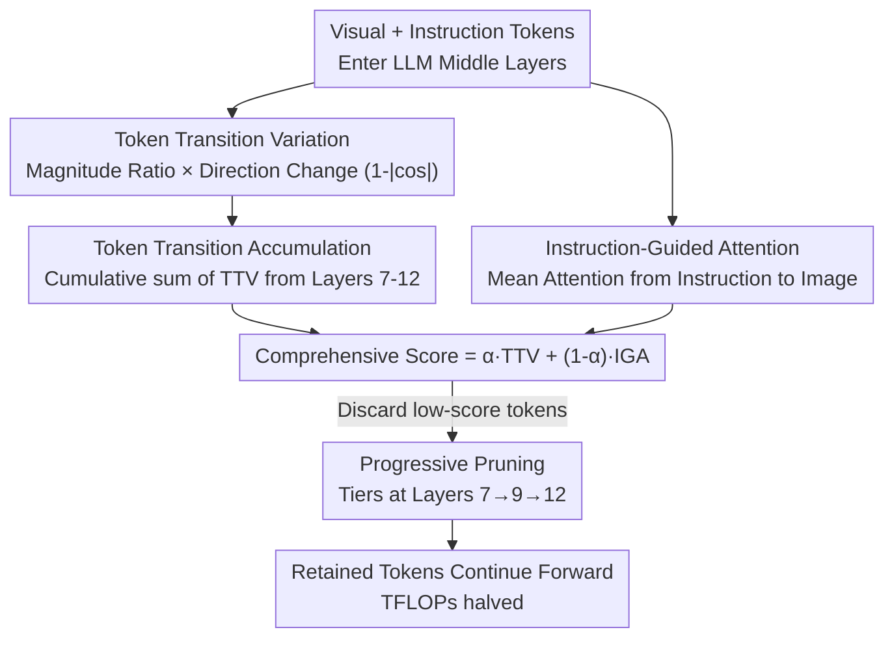

# TransPrune: Token Transition Pruning for Efficient Large Vision-Language Model

**Conference**: CVPR 2026  
**Paper**: [CVF Open Access](https://openaccess.thecvf.com/content/CVPR2026/html/Li_TransPrune_Token_Transition_Pruning_for_Efficient_Large_Vision_Language_Model_CVPR_2026_paper.html)  
**Code**: https://github.com/liaolea/TransPrune  
**Area**: Multimodal VLM / Model Compression  
**Keywords**: Visual token pruning, Large Vision-Language Model, token transition, inference acceleration, training-free

## TL;DR
TransPrune proposes using "the changes in token representations during internal propagation" (token transition) to determine the importance of visual tokens. By combining two complementary signals—TTV (Token Transition Variation), which assesses the magnitude and direction changes of tokens, and IGA (Instruction-Guided Attention), which measures image token attention relative to instructions—the method achieves training-free progressive pruning. It reduces inference TFLOPs by half on LLaVA-1.5/Next and Qwen2.5-VL with almost no performance degradation.

## Background & Motivation
**Background**: Large Vision-Language Models (LVLMs) encode images into hundreds or thousands of visual tokens for LLM processing, which accounts for the majority of inference computation. The most direct acceleration is token pruning—retaining only the semantically relevant and instruction-correlated tokens. Existing methods are categorized into projector-based (pruning before entering the LLM, e.g., VisionZip, DivPrune, CDPruner) and within-LLM (progressive pruning inside the LLM, e.g., FastV, PDrop, SparseVLM). Most rely on two criteria: attention scores or representation similarity.

**Limitations of Prior Work**: Attention-based criteria suffer from two main issues. First is **positional bias**: due to the triangular causal mask, tokens at the start or end of a sequence often receive artificially high attention scores despite being semantically sparse. Second, attention tends to **over-focus on visually salient but semantically irrelevant regions**. Similarity-based criteria merge highly similar tokens but are essentially task-agnostic, failing to identify tokens truly important for a specific query.

**Key Challenge**: Most methods evaluate token importance based on a **static instantaneous state** (attention values, similarity) at a given layer, ignoring a more fundamental signal—**how token representations dynamically evolve** as they pass through various modules. The authors observe that the "dynamic evolution" of an entity often reflects its state better than a static snapshot.

**Goal**: To identify a token importance criterion that is independent of attention, avoids positional bias, maintains instruction relevance, and is integrated into a training-free, plug-and-play pruning method.

**Key Insight**: By visualizing the magnitude change (ratio of L2 norms) and direction change (cosine similarity) of tokens before and after self-attention and FFN modules in LLaVA-1.5, the authors found that this "transition" correlates with semantic importance. This effect is **most significant in the middle layers (approx. layers 6–14)**, which fuse shallow global features and deep local features, reflecting the LLM's attention shift from global to local under instruction guidance.

**Core Idea**: Replace attention/similarity with token transition as the importance criterion. The primary signal, TTV, measures the magnitude and direction changes of the tokens themselves (inherently free from positional bias), supplemented by IGA for instruction relevance, and stabilized through a cumulative mechanism across middle layers for progressive pruning.

## Method

### Overall Architecture
TransPrune is a within-LLM, training-free pruner inserted into select middle layers of the LLM. It takes image-encoded visual tokens and instruction tokens as input and outputs a progressively reduced sequence. It operates at specific **pruning layers** (layers 7, 9, and 12 in the paper). For each visual token, two scores are calculated: TTV (accumulated across layers) and IGA (instruction attention). A weighted sum produces a comprehensive score, and tokens with low scores are discarded. This reduces computation costs for subsequent layers.

### Key Designs

**1. Token Transition Variation (TTV): Using internal token changes instead of attention to bypass positional bias**

TTV does not calculate inter-token dependencies, avoiding the positional bias of attention. If module $F$ (attention or FFN) transforms input $T_{in}$ into $T_{out}=F(T_{in})$, magnitude change is $m(F,T_{in})=\|T_{out}\|_2 / \|T_{in}\|_2$, and direction change is the cosine similarity $d(F,T_{in})= (T_{out}\cdot T_{in}) / (\|T_{out}\|_2\|T_{in}\|_2)$. The authors found that using $1-|d|$ (larger when orthogonal) works better. This is normalized via softmax and multiplied by magnitude to get the single-layer score:

$$\mathrm{TTV}(F, T_I) = \mathrm{Softmax}\big(1-|d(F, T_I)|\big)\cdot m(F, T_I).$$

The total TTV for layer $l$ sums contributions from Attention and FFN: $\mathrm{TTV}_l(T_I)=\mathrm{TTV}(\text{Attention}, T_I)+\mathrm{TTV}(\text{FFN}, T_I)$. Intuitively, tokens with large magnitude ratios and direction shifts undergo significant semantic rewriting and are thus more important.

**2. Token Transition Accumulation: Summing multi-layer transitions to stabilize signals**

TTV strength fluctuates across layers. The authors define an accumulation set $A$ and a pruning set $P$. At each pruning layer $p_i$, the TTV scores from the first accumulation layer up to the current layer are summed:

$$\mathrm{TTV}_{p_i}(T_I)=\sum_{l\in A,\, l\le p_i}\mathrm{TTV}_l(T_I).$$

This ensures pruning decisions are based on the "transition history" rather than a snapshot. Experiments show that accumulating in middle layers (7–12) is significantly better than in shallow layers (1–6) due to the presence of both global and local information.

**3. Instruction-Guided Attention (IGA): Restoring instruction relevance**

TTV is agnostic to user queries. IGA supplements this by taking the attention matrix $A$ from instruction token queries to image token keys and averaging across instruction tokens: $\mathrm{IGA}(T_I)=\frac{1}{L}\sum_{j=1}^{L}A_j$. Higher values indicate higher relevance to the current instruction. Since IGA only calculates "instruction $\to$ image" attention, it remains compatible with FlashAttention with minimal overhead.

**4. Scoring and Progressive Pruning: Complementary signals**

The comprehensive score is calculated as:

$$\mathrm{Score}_{p_i}(T_I)=\alpha\cdot \mathrm{TTV}_{p_i}(T_I)+(1-\alpha)\cdot \mathrm{IGA}_{p_{i+1}}(T_I),$$

using $\alpha=0.5$. While TTV is free of positional bias but lacks instruction awareness, IGA provides instruction awareness but carries positional bias. Their combination **partially offsets the positional bias** while ensuring multi-source semantic coverage.

### Loss & Training
Ours is training-free. TransPrune is plug-and-play during inference and does not modify model weights, making it compatible with LLaVA-1.5/Next, Qwen2.5-VL, and Video-LLaVA.

## Key Experimental Results

### Main Results
Compared to other within-LLM methods on LLaVA-1.5-7B, TransPrune achieves competitive performance with minimal TFLOPs:

| Method | TFLOPs | Acc.(%) | MME_P | SQA_I | POPE | MMBench |
|------|--------|---------|-------|-------|------|---------|
| LLaVA-1.5-7B (Upper Bound) | 3.82 (100%) | 100.0 | 1506 | 69.5 | 85.9 | 64.6 |
| FastV (ECCV24) | 2.01 (52.6%) | 97.8 (-2.2) | 1474 | 68.5 | 84.0 | 64.2 |
| PDrop (CVPR25) | 1.78 (46.6%) | 98.8 (-1.2) | 1500 | 69.4 | 84.8 | 64.9 |
| SparseVLM (ICML25) | 1.57 (41.1%) | 98.8 (-1.2) | 1484 | 67.7 | 85.7 | 64.7 |
| **TransPrune-High** | **1.56 (40.8%)** | **100.0 (-0.0)** | **1540** | **69.5** | 85.0 | **66.0** |
| TransPrune-Low | 1.19 (31.2%) | 98.4 (-1.6) | 1491 | 68.7 | 85.1 | 65.6 |

TransPrune-High matches the original model's accuracy with only ~41% computation. The trend holds for LLaVA-Next-7B and Qwen2.5-VL-7B. Measured latency and VRAM are also lower than previous methods.

### Ablation Study
| Config | MME_P | SQA_I | GQA | MMBench | Note |
|------|-------|-------|-----|---------|------|
| Only IGA | 1514 | 69.0 | 61.1 | 65.6 | Instruction only |
| IGA + Direction | 1521 | 69.1 | 61.2 | 65.4 | Incorporates orientation change |
| IGA + Magnitude | 1532 | 69.4 | 61.4 | 65.7 | Larger gain from magnitude |
| IGA + TTV (Full) | **1540** | **69.5** | 61.4 | **66.0** | Optimal combination |
| w/o Accumulation | 1530 | 69.2 | 61.4 | 65.7 | Importance of history |
| TTV Shallow (1–6) | 1515 | 69.4 | 61.3 | 65.6 | Sub-optimal layers |
| TTV Middle (7–12) | **1540** | 69.5 | 61.4 | **66.0** | Optimal layers |

### Key Findings
- **Magnitude is more critical than direction**: The gain from Magnitude is significantly larger than from Direction, though their combination is best.
- **Middle layers are essential**: Accumulating across layers 7–12 yields the best results, as these layers best reflect the transition of semantics.
- **TTV lacks instruction awareness alone**: TTV-only drops significantly on TextVQA, proving that IGA is necessary for query-heavy tasks.
- **Positional Bias Mitigation**: TTV focuses on semantically dense central areas, while IGA tends towards sequence ends; their combination provides a balanced view.
- **Compatibility**: TransPrune can be stacked with projector-based methods like VisionZip to further reduce TFLOPs to 11.5% with minimal loss.

## Highlights & Insights
- **New Dimensional Perspective**: Unlike previous methods looking at layer snapshots, TransPrune looks at "how much a token changed" (process vs. state).
- **Structural Bias Avoidance**: TTV avoids positional bias by design rather than through post-processing.
- **Efficiency + Compatibility**: The method is training-free and fully compatible with FlashAttention.

## Limitations & Future Work
- **Empirical Interpretation**: The rule that "magnitude and orthogonality imply importance" is primarily based on empirical observation rather than theoretical derivation.
- **Hyperparameter Dependency**: The selection of layers and $\alpha$ currently relies on heuristic tuning and might require re-searching for different architectures.
- **Efficiency Focus**: The primary gain is in inference efficiency; it does not push the performance upper bound of the original model.

## Related Work & Insights
- **Vs within-LLM Attention methods**: TransPrune provides a criterion that outperforms attention-based scores while requiring fewer TFLOPs and avoiding positional bias.
- **Vs Projector-based methods**: These operate before the LLM, whereas TransPrune utilizes internal LLM information. They are complementary.
- **Insight**: Transitioning from "static state" to "dynamic process" for importance assessment is a valuable direction for other efficiency research, such as KV cache compression or layer skipping.

## Rating
- Novelty: ⭐⭐⭐⭐⭐ 
- Experimental Thoroughness: ⭐⭐⭐⭐⭐ 
- Writing Quality: ⭐⭐⭐⭐ 
- Value: ⭐⭐⭐⭐ 

<!-- RELATED:START -->

## Related Papers

- [\[CVPR 2026\] VLM-Pruner: Buffering for Spatial Sparsity in an Efficient VLM Centrifugal Token Pruning Paradigm](vlm-pruner_buffering_for_spatial_sparsity_in_an_efficient_vlm_centrifugal_token_.md)
- [\[ACL 2026\] HiPrune: Hierarchical Attention for Efficient Token Pruning in Vision-Language Models](../../ACL2026/multimodal_vlm/hiprune_hierarchical_attention_for_efficient_token_pruning_in_vision-language_mo.md)
- [\[ICML 2026\] CLIP Tricks You: Training-free Token Pruning for Efficient Pixel Grounding in Large Vision-Language Models](../../ICML2026/multimodal_vlm/clip_tricks_you_training-free_token_pruning_for_efficient_pixel_grounding_in_lar.md)
- [\[CVPR 2026\] DocPrune: Efficient Document Question Answering via Background, Question, and Comprehension-aware Token Pruning](docpruneefficient_document_question_answering_via_background_question_and_compre.md)
- [\[CVPR 2026\] HAWK: Head Importance-Aware Visual Token Pruning in Multimodal Models](hawk_head_importance-aware_visual_token_pruning_in_multimodal_models.md)

<!-- RELATED:END -->
