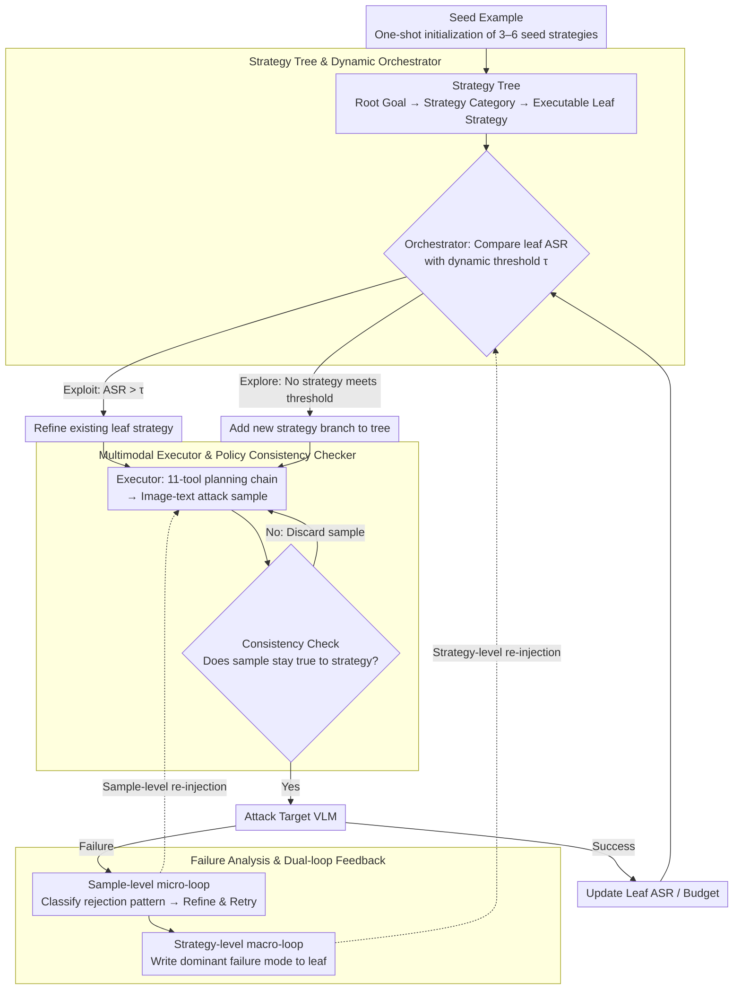

# TreeTeaming: Autonomous Red-Teaming of Vision-Language Models via Hierarchical Strategy Exploration

**Conference**: CVPR 2026  
**arXiv**: [2603.22882](https://arxiv.org/abs/2603.22882)  
**Code**: [https://github.com/ChunXiaostudy/TreeTeaming](https://github.com/ChunXiaostudy/TreeTeaming)  
**Area**: Multimodal VLM  
**Keywords**: Red-Teaming, Vision-Language Model Safety, Automated Attack, Strategy Tree, Jailbreak Attack

## TL;DR

TreeTeaming proposes an automated red-teaming framework based on a hierarchical strategy tree. Driven by an LLM-based Orchestrator, it dynamically explores and evolves attack strategies, achieving SOTA Attack Success Rates (ASR) across 12 mainstream VLMs (87.60% on GPT-4o) and identifying diverse new attack methods beyond known strategy sets.

## Background & Motivation

As Vision-Language Models (VLMs) advance, their safety concerns become increasingly prominent. Red-teaming is essential for discovering model vulnerabilities, but existing VLM red-teaming methods face fundamental limitations:

**Linear Exploration Paradigm of Prior Work**: Whether it is typographic manipulation in FigStep, image transformation in MML, or image-text rearrangement in SI-Attack, these methods rely on predefined, singular attack heuristics. Even TRUST-VLM, which introduces feedback mechanisms, can only optimize test cases within a preset strategy framework and fails to discover new attack strategies.

**Key Challenge**: Prior work focuses on making "known attacks more effective" rather than systematically "discovering unknown attacks." This resembles walking further on a single path without ever exploring other possible routes.

**Key Insight**: This paper transforms strategy exploration from a static testing process into a dynamic evolutionary process. The Core Idea is to construct a dynamically growing strategy tree, where an LLM autonomously decides whether to refine promising attack paths or open entirely new strategy branches.

## Method

### Overall Architecture

TreeTeaming aims to evolve red-teaming from "repeating the same move" to "growing new moves." Starting from a seed example, it gradually grows an attack strategy tree. Three modules cooperate in each iteration: the Orchestrator maintains a global view of the tree to decide whether to refine an existing promising attack path or branch out into a new strategy. The Multimodal Executor receives an abstract strategy, translates it into an actual image-text attack sample, and a Consistency Checker ensures the sample adheres to the strategy. Finally, the Failure Reason Analysis model decomposes rejected responses to provide feedback at both the sample and strategy levels. After an iteration, the leaf nodes are updated with new ASR and failure insights to guide the Orchestrator's next plan.

### Key Designs

**1. Strategy Tree & Dynamic Orchestrator: Managing "Exploration vs. Exploitation" via a Growing Tree**

Existing red-teaming methods struggle to discover new attacks as they follow fixed paths. TreeTeaming organizes explored strategies into a three-layer tree: root (overall goal), parent nodes (abstract strategy categories, e.g., "Cognitive Bias Exploitation"), and leaf nodes (executable specific strategies). The Orchestrator decides whether to deepen an existing path (Exploit) or branch out (Explore) using a dynamic threshold that decays linearly with the budget:

$$\tau_{dynamic} = \max\{\tau_{initial} \cdot (1 - N_{total}/N_{max}),\ \tau_{min}\}$$

Where $N_{total}$ is the used iterations and $N_{max}$ is the total budget. If a leaf node's ASR exceeds the threshold, it is exploited; otherwise, the system explores a new branch. This mechanism favors high-quality strategies early on and lowers the bar later to maximize the remaining budget.

**2. Multimodal Executor & Policy Consistency Checker: Grounding Strategies and Preventing Hallucination**

The Orchestrator outputs abstract descriptions like "induce via cognitive bias." The Executor uses an LLM controller with 11 predefined tools (Geometric Transformation, Color Filters, Image Synthesis, Generative Editing) to plan a tool-call chain. To prevent the system from overestimating a strategy due to "accidental" successes unrelated to the intended strategy, a Consistency Checker validates if the generated sample faithfully represents the target strategy.

**3. Failure Reason Analysis & Dual-loop Feedback: Learning from Failure**

TreeTeaming decomposes failures into two feedback loops. The sample-level **Micro-loop** analyzes specific rejection patterns (e.g., "Refusal" vs. "Evasion") to refine the current sample. The strategy-level **Macro-loop** aggregates failure logs to extract the "Dominant Failure Mode," writing it back to the leaf node so the Orchestrator knows why a specific path is blocked during future decision-making.

### Loss & Training

Ours is a pure inference-time framework and does not require model training. It relies entirely on the in-context learning capabilities of LLMs. The Orchestrator uses one-shot examples for strategy tree initialization. Each iteration executes a single operation (exploit or explore) to maintain clean performance attribution.

## Key Experimental Results

### Main Results

| Target VLM | TreeTeaming ASR(%) | Prev. SOTA ASR(%) | Gain |
|----------|-------------------|----------------|------|
| LLaVA-1.5 | 100.00 | 95.00 (Trust-VLM) | +5.00 |
| GPT-4o | 87.60 | 82.04 (Trust-VLM) | +5.56 |
| Claude-3.5 | 72.00 | 60.40 (MML) | +11.60 |
| Qwen2.5-VL-7B | 90.60 | 50.60 (MML) | +40.00 |
| Qwen3-VL-8B | 71.40 | 44.20 (MML) | +27.20 |
| DeepSeek-VL | 98.60 | 83.33 (Trust-VLM) | +15.27 |

Ours achieves SOTA ASR on 11 out of 12 VLMs.

### Ablation Study

| Configuration | Key Metric | Description |
|------|---------|------|
| Full TreeTeaming | 87.60% (GPT-4o) | Full model performance |
| w/o Consistency Check | ASR inflated but actual efficacy drops | Confirms the value of the checker |
| Strategy Diversity | Exceeds known open sets | Diversity of discovered strategies exceeds the union of known sets |
| Toxicity Metric | Avg. -23.09% | Generated attacks are stealthier |

### Key Findings

- The diversity of attack strategies discovered by TreeTeaming exceeds the union of all known public jailbreak strategies, indicating the discovery of entirely new attack paradigms.
- The average toxicity of attack samples decreased by 23.09%, suggesting that attacks are becoming more covert and harder to intercept via simple toxicity detection.
- Significant vulnerabilities were identified even in leading closed-source models (GPT-4o, Claude-3.5).

## Highlights & Insights

- **Paradigm Shift in Strategy Evolution**: Moving from "executing fixed strategies" to "discovering strategies themselves" is a breakthrough. The dynamic strategy tree growth mechanism is transferable to other systematic exploration tasks.
- **Engineering the Exploit-Explore Balance**: The combination of dynamic thresholds and budget constraints elegantly handles the classic decision problem in a hierarchical strategy space.
- **Dual-loop Feedback Architecture**: The design of specimen-level rapid iteration paired with strategy-level knowledge accumulation provides a roadmap for any agent-based system requiring multi-level optimization.

## Limitations & Future Work

- Dependency on the LLM's strategy generation capability; a weak Orchestrator LLM may fail to generate effective strategies.
- The 11 predefined tools limit the physical feasible space of attacks; expanding the toolset may reveal more vulnerabilities.
- Evaluation primarily focuses on ASR, with insufficient granularity in grading the semantic severity of attacks.

## Related Work & Insights

- **vs TRUST-VLM**: While TRUST-VLM automates test case generation within fixed strategy frameworks, TreeTeaming discovers strategies themselves at a higher dimension.
- **vs SI-Attack**: SI-Attack optimizes within a single image-text rearrangement paradigm, whereas TreeTeaming explores multiple attack paradigms.
- **vs Manual Methods (FigStep/MML/JOOD)**: These are handcrafted single-point strategies; TreeTeaming is an automated search engine for the strategy space.

## Rating

- Novelty: ⭐⭐⭐⭐⭐ Paradigm shift from static execution to dynamic discovery.
- Experimental Thoroughness: ⭐⭐⭐⭐ Covers 12 VLMs; ablation details are solid.
- Writing Quality: ⭐⭐⭐⭐ Clear framework and well-defined motivation.
- Value: ⭐⭐⭐⭐⭐ High significance for AI safety with highly transferable framework logic.

<!-- RELATED:START -->

## Related Papers

- [\[CVPR 2026\] Dynamic Logits Adjustment and Exploration for Test-Time Adaptation in Vision Language Models](dynamic_logits_adjustment_and_exploration_for_test-time_adaptation_in_vision_lan.md)
- [\[CVPR 2026\] HiSpatial: Taming Hierarchical 3D Spatial Understanding in Vision-Language Models](hispatial_taming_hierarchical_3d_spatial_understanding_in_vision-language_models.md)
- [\[CVPR 2026\] DuoGen: Towards Autonomous Interleaved Multimodal Generation](duogen_towards_autonomous_interleaved_multimodal_generation.md)
- [\[CVPR 2026\] HOG-Layout: Hierarchical 3D Scene Generation, Optimization and Editing via Vision-Language Models](hog_layout_hierarchical_3d_scene_generation_optimization_and_editing.md)
- [\[CVPR 2026\] Beyond Layer-Wise Merging: Chain-of-Merging for Vision-Language Models](beyond_layer-wise_merging_chain-of-merging_for_vision-language_models.md)

<!-- RELATED:END -->
